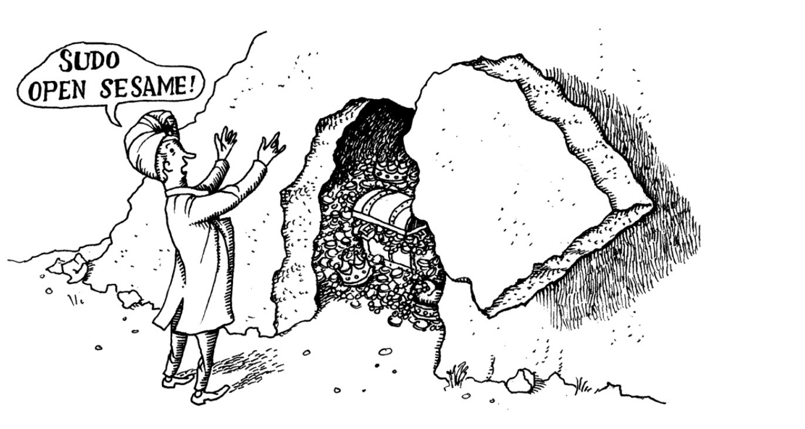

# Chapter 3: Access Control and Rootly Powers



## Standard UNIX Access Control

The standard UNIX access control model has remained largely unchanged for decades. With a few enhancements, it continues to be the default for general-purpose OS distributions. The scheme follows a few basic rules:

- Access control decisions depends on which user is attempting to perform an operation, or in some cases, on that user's membership in a UNIX group.
- Objects (e.g files and processes) have owners. Owners have broad (but not necessarily unrestricted) control over their objects.
- You own the objects you create.
- The special user account called "root" can act as the owner of any object.
- Only root can perform certain sensitive administrative operations.

## Filesystem access control

Every file has both an owner and a group, sometimes referred to as the "group owner."

Both the kernel and filesystem track owners and groups as numbers rather than text names. In the most basic case, user identification number (UIDs) are mapped to usernames in the /etc/passwd file, and GIDs are mapped to group names in the /etc/group file.


## The root account

The root account is the most powerful account on a UNIX system. It has the ability to bypass all access control checks and can perform any operation on the system. The root account is also known as the superuser account.

The UID of the root account is always 0. This is hard-coded into the kernel and is not configurable. The root account is the only account with a UID of 0.

Traditional UNIX allows the superuser (that is, any process for which the effective UID is 0) to perform any valid operation on any file or process. “Valid” is the operative word here; certain operations (such as executing a file on which the execute permission bit is not set) are forbidden even to the superuser.

Some examples of restricted operations include:

- Creating device files in /dev
- Setting the system clock
- Raising resource usage limits and process priorities
- Setting the system's hostname
- Configuring network interfaces
- Shutting down the system

Again superuser is not the root account, but any process with an effective UID of 0. This is an important distinction because it means that the superuser is not necessarily the root account. For example, a setuid root program is a program that runs with the effective UID of root, but it is not the root account. This is a subtle but important distinction.

An example of superuser powers is the ability of a process owned by root to change its UID and GID. The login program and its GUI equivalents are a case in point; the process that prompts you for your password when you log in to the system initially runs as root. If the password and username that you enter are legitimate, the login program changes its UID and GID to your UID and GID and starts up your shell or GUI environment. Once a root process has changed its ownerships to become a normal user process, it can’t recover its former privileged state.

## The setuid and setgid execution

The setuid and setgid bits are a special type of permission that can be set on executable files. When an executable file has the setuid bit set, the file will always be executed with the effective UID of the file's owner. When an executable file has the setgid bit set, the file will always be executed with the effective GID of the file's group owner.

Programs that run setuid, especially those that run setuid root, are a potential security risk. If a setuid root program has a security hole, an attacker can exploit the hole to gain root access to the system. For this reason, many UNIX systems are configured to ignore the setuid bit on programs that are run from file systems that are mounted with the noexec option.

## Management of the root account

### su: substitute user identity

A better way to become root is to use the su command. The su command allows you to become another user, including root. When you run su, you are prompted for the password of the user you want to become. If you enter the correct password, you become that user. If you run su without specifying a username, you become root.

**su** doesn't record the commands executed as root in the system logs. This makes it difficult to track who did what as root, but it does create a log netry that states who became root and when.

It's a good habits to the full pathname to su (e.g. **/bin/su** or **/usr/bin/su**) to avoid running a trojan horse version of su that an attacker might have installed in your PATH.

On most systems, you must be a member of the group *wheel* to use **su**.

We use **sudo** as a more secure alternative to **su**. **su** is best reserved for emergency use when **sudo** is not available.

### sudo: limited su

If the root account is used by several administrators, it can be difficult to track who did what as root. 

The most widely used solution to this problem is the sudo program. sudo allows you to run a command as another user, including root. The sudo program logs all commands that are run as root, so it is easy to track who did what as root.

**sudo** takes as its argument a command line to be executed as root (or as another restricted user). **sudo** consults the file **/ets/sudoers/**, which lists people who are allowed to use **sudo** and what commands they are allowed to run. If the proposed command is allowed, **sudo** asks for the user's password and then runs the command.

The **sudoers** file is edited with the **visudo** command, which checks the syntax of the file before saving it. The **visudo** command uses the **EDITOR** environment variable to determine which editor to use. If **EDITOR** is not set, **visudo** uses **vi**.

**sudo without password**

If you want to allow a user to run **sudo** without entering a password, you can use the **NOPASSWD** tag. For example, to allow the user **bob** to run **sudo** without entering a password, you can use the following line in the **sudoers** file:

```
bob ALL = NOPASSWD: ALL  # Don't try this at home!!
```

The most common cases are when performing remote configuration management with tools like **ansible** or **puppet**.

A better alternative to **NOPASSWD** in the context of remote configuration management is to use **ssh** keys to authenticate to the remote system. This way, the user doesn't need to enter a password to run **sudo**.

SSH key forwading can be used to authenticate to the remote system using **ssh** keys and then run **sudo** without entering a password.

The sudo program is maintained by Todd C. Miller and is available from [www.sudo.ws](https://www.sudo.ws/).

### Disabling the root account

Some administrators disable the root account entirely. This is done by setting the root account's password to an impossible value, such as a long string of random characters. This makes it impossible to log in as root, even if you know the root password.

## PAM: Pluggable Authentication Modules

PAM is a system that allows you to configure the authentication process on a UNIX system. PAM is a flexible system that allows you to configure the authentication process in a variety of ways. PAM is used by many UNIX programs, including the login program, the su program, and the sudo program.

As an example, you can use PAM to configure the login program to require two-factor authentication for certain users, or to require a password and a fingerprint scan for other users.

## Kerberos: network cryptographic authentication

Kerberos is a network authentication system that allows you to authenticate to a network service without sending your password over the network. Kerberos is widely used in large organizations, especially in academic and research institutions.

Whereas PAM is an authentication framework, Kerberos is a specific authentification method. At sites that use Kerberos, PAM is often configured to use Kerberos for authentication.

Kerberos use a trusted third party (a server) to perform authentification for an entire network. You don't authenticate yourself to the machine you are using, but provide your credentials to the Kerberos service. Kerberos then issues cryptographic credentials that you can present to other services as evidence of your identity.

The third party is called the Key Distribution Center (KDC). The KDC consists of two parts: the Authentication Server (AS) and the Ticket Granting Server (TGS). The AS authenticates users and issues tickets for the TGS. The TGS issues tickets for network services.


## Capabilities

Capabilities are a way to give a process some of the powers of the superuser without giving it all of the powers of the superuser. Capabilities are a more fine-grained way to control the powers of a process than the traditional UNIX access control model.

As an example, a process can be given the capability to bind to a network port without being given the capability to read or write files. This is useful for network services that need to bind to a low-numbered port (a port number less than 1024), which is a privileged operation.

## Linux namespaces

Linux namespaces are a way to create isolated environments on a Linux system. Each namespace has its own view of the system, including its own process tree, network interfaces, and filesystem. Namespaces are used by containers to create isolated environments for running applications.

As an example, a container can be given its own network namespace, so that it has its own network interfaces and IP addresses. This allows you to run multiple containers on the same system without them interfering with each other.

## Modern access control

In 2001, the National Security Agency (NSA) released a new access control model called SELinux (Security-Enhanced Linux). SELinux is a mandatory access control (MAC) system that is more fine-grained than the traditional UNIX access control model.

Instead of adopting SELinux or another, alternative system, the kernel maintainers developed the Linux Security Modules (LSM) framework, a kernel-level interface that allows access control systems to integrate themselves as loadable kernel modules.

## Mandatory Access Control (MAC)

Mandatory Access Control (MAC) is a type of access control that is more fine-grained than the traditional UNIX access control model which is discretionary access control (DAC). In a MAC system, access control decisions are made by a central authority, rather than by the owner of the object.

For example, in a MAC system, the central authority might decide that a process can read a file, but not write to it. In a DAC system, the owner of the file decides who can read and write to it.

## Role-Based Access Control (RBAC)

Role-Based Access Control (RBAC) is a type of access control that is more fine-grained than the traditional UNIX access control model. In a RBAC system, access control decisions are based on the roles that users have, rather than on the users themselves.

Roles are similar to groups in the traditional UNIX access control model, but they are more fine-grained. For example, in a RBAC system, a user might have the role of "administrator," which allows them to perform administrative tasks, and the role of "user," which allows them to perform normal tasks.

## SELinux: Security-Enhanced Linux

SELinux is one of the oldest Linux MAC implementations. It was developed by the National Security Agency (NSA) and is now maintained by the open source community.

SELinux can be used to enforce a wide variety of security policies, including role-based access control (RBAC), type enforcement (TE), and multi-level security (MLS). SELinux is a complex system that requires careful configuration to work properly.

## AppArmor

AppArmor is a MAC system that is similar to SELinux. It was developed by Novell, and is now maintained by the open source community. AppArmor is designed to be easier to use than SELinux, and is often used on desktop systems.

