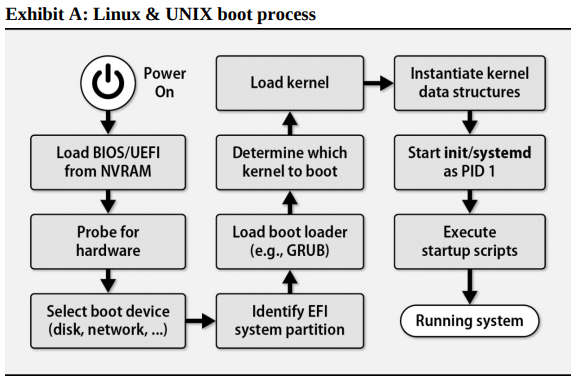
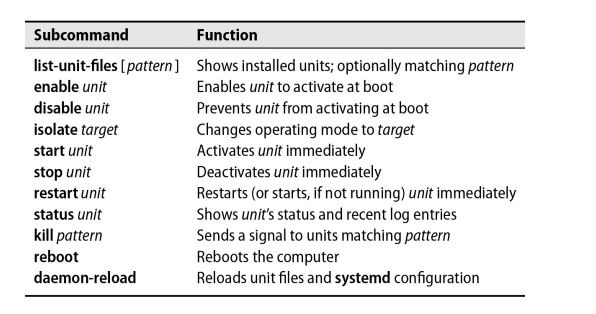

# Chapter 2: Booting and System Management Daemons

"Booting" is the standard term for "starting up a computer." It's a shortened form of the word "bootstrapping," which derives from the notion that the computer has to **"pull itself up by its own bootstraps."**

The boot process consits of a few broadly defined tasks:

- Finding, loading, and running bootstrapping code.
- Finding, loading, and running the operating system kernel.
- Running startup scripts and system daemons.
- Maintaining process hygiene and managing system state transitions.

## Boot process overview

Most Linux distributions now use a system manager daemon called **systemd** instead of the traditional UNIX **init**. **systemd** streamlines the boot process by adding dependency management; support for concurrent startup processes, and a comprehensive approach to logging, among other features.

During the bootstrapping, the kernel is loaded into memory and begins to execute. 



Before the system is fully booted, filesystems must be checked and mounted and system daemon started. These procedures are managed by a series of shell scripts (sometimes called **init scripts**) or unit files that are run in sequence by **init** or parsed by **systemd**.

## BIOS vs UEFI

The **Basic Input/Output System (BIOS)** and **Unified Extensible Firmware Interface (UEFI)** are two different firmware interfaces that are used to start up a computer.

In a nutshell:

- **BIOS :**
  - Uses MBR partitioning scheme.
  - 16-bit processor mode.
  - Limited to text-based interface.
  - Simple and less extensible.
  - Lacks advanced security features.

- **UEFI :**
  - Supports both MBR and GPT partitioning schemes.
  - 32-bit and 64-bit processor modes.
  - Graphical interface with mouse support.
  - Modular and extensible design.
  - Includes advanced security features like Secure Boot.

UEFI is the more modern and feature-rich firmware interface, offering improved compatibility, security, and extensibility compared to the older BIOS.


You can modify the boot order on a running system using the **efibootmgr** command. This command is used to modify the UEFI boot manager.

```bash
$ efibootmgr -v

BootCurrent: 0004
BootOrder: 0004,0000,0001,0002,0003
Boot0000* Windows Boot Manager	HD(1,GPT,3e0e3e3e-3e3e-3e3e-3e3e-3e3e3e3e3e3e,0x800,0x82000)/File(\EFI\MICROSOFT\BOOT\BOOTMGFW.EFI)WINDOWS.........x...B.C.D.O.B.J.E.C.T.=.{.9.d.e.a.8.6.2.c.-.5.c.d.d.-.4.e.7.0.-.a.c.c.1.-.f.3.2.b.3.4.4.d.
Boot0001* UEFI: Built-in EFI Shell	VenMedia(5023b95c-db26-429b-a648-bd47664c8012)..BO
Boot0002* UEFI: SanDisk Cruzer Glide 1.26, Partition 1	PciRoot(0x0)/Pci(0x14,0x0)/USB(1,0)/HD(1,MBR,0x0,0x800,0x2000)..BO
Boot0003* UEFI: SanDisk Cruzer Glide 1.26, Partition 2	PciRoot(0x0)/Pci(0x14,0x0)/USB(1,0)/HD(2,MBR,0x0,0x800,0x2000)..BO
Boot0004* ubuntu	HD(1,GPT,3e0e3e3e-3e3e-3e3e-3e3e-3e3e3e3e3e3e,0x800,0x82000)/File(\EFI\UBUNTU\SHIMX64.EFI)

$ efibootmgr -o 0000,0004 # Change the boot order to boot Windows first
```

On systems (typically those with **systemd**) that allow write access by default, **rm -rf /** can be enough to permanently destroy the system at the firmware level; in addition to removing files, **rm** also removes variables and other UEFI information accessible through **/sys**.

## GRUB

The **Grand Unified Bootloader (GRUB)** is a popular boot loader that is used to boot most Linux distributions. It is a flexible and powerful boot loader that can boot multiple operating systems, load Linux kernel modules, and provide a command-line interface for troubleshooting.

- Table of some grub commands:

| Command  | Description                                          |
| -------- | ---------------------------------------------------- |
| `boot`   | Boots the system from the specified kernel image.    |
| `help`   | Displays a list of available commands.               |
| `linux`  | Loads the specified Linux kernel.                    |
| `reboot` | Reboots the system.                                  |
| `search` | Searches devices by file, filesystem label, or UUID. |
| `usb`    | Tests the USB driver.                                |

## System management daemons

Once the kernel has been loaded and has completed its initlization process, it creates a complement of "spontaneous" processes in user space. They are called spontaneous processes because the kernel starts them autonomously--in the normal course of events, new processes are created only at the behest of existing processes.

Most of the spontaneous processes are really part of the kernel implementation. They don’t necessarily correspond to programs in the filesystem. They’re not configurable, and they don’t require administrative attention. You can recognize them in ps listings by their low process IDs (PIDs) and by the fact that they’re in square brackets (e.g., [kthreadd]).

The exception to this pattern is the system management daemon. It has process ID 1 and usually runs under the name **init**. The system gives init a couple of special privileges, but for the most part it’s just a user-level program like any other daemon.

To serve this goal, init maintains a notion of the mode in which the system should be operating. Some commonly defined modes:

- **Single-user mode** : The system is in a minimal state, with only the root filesystem mounted and only the most essential system daemons running. This mode is used for system maintenance and recovery.
- **Multi-user mode** : The system is fully operational, with all filesystems mounted and all system daemons running. This is the normal mode of operation.
- **Server mode** : Similar to multi-user mode, but with no GUI.

The **systemd** daemon is the most widely used system manager daemon in modern Linux distributions. It is a replacement for the traditional **init** daemon and provides a number of features that make it more powerful and flexible than **init**.

## systemd

Systemd is not a single daemon but a collection of programs, daemons, libraries, technologies, and kernel components.

**Units and unit files** : An entity that is managed by systemd is called a unit.
More specifically, a unit can be "a service, a socket, a device, a mount point, an automount point, a swap file or partition, a start-up target, a watched file system path, a timer controlled and supervised by systemd, a resource management slice or a group of externally created processes, or a wormhole into an alternate universe(haha!!)."

Within systemd, the behavior of each unit is defined and configured by a unit file. In the case of a service, the unit file specifies the locationof the executable file for the daemon, tells **systemd** how to start and stop the service, and identifies any other units that the service depends on.

Example of **rsync** service unit file:

```bash
[Unit]
Description=fast remote file copy program daemon
ConditionPathExists=/etc/rsyncd.conf

[Service]
ExecStart=/usr/bin/rsync --daemon --no-detach

[Install]
WantedBy=multi-user.target
```

Unit files can live in several different places. **/usr/lib/systemd/system** is the main place where packages deposit their unit files during installation; on some systems, the path is **/lib/systemd/system** instead. The contents of this directory are considered stock, so you shouldn’t modify them. Your local unit files and customizations can go in **/etc/systemd/system**.
There’s also a unit directory in **/run/systemd/system** that’s a scratch area for transient units.

Service unit have a **.service** extension, socket units have a **.socket** extension, and so on.

**systemctl** is the primary tool for managing systemd. It can be used to start, stop, enable, disable, and check the status of units. It can also be used to list units and their dependencies, and to show the logs of units.

systemctl is an all-purpose command for investigating the status of systemd and making changes to its configuration. As with Git and several other complex software suites, systemctl’s first argument is typically a subcommand that sets the general agenda, and subsequent arguments are specific to that particular subcommand. The subcommands could be top-level commands in their own right, but for consistency and clarity, they’re bundled into the systemctl omnibus.

**Examples:**

```bash
# show all loaded and active services, sockets, targets, mounts, and devices
$ systemctl list-units

# show all loaded and active services
$ systemctl list-units --type=service

# show all installed unit files
$ systemctl list-unit-files --type=socket

```



The unit file statuses are:

- **bad** : The unit file is bad or broken.
- **disabled** : The unit file is installed but not configured to start autonomously.
- **enabled** : The unit file is installed and configured to start autonomously.
- **masked** : Banished from the **systemd** world from a logical perspective.
- **static** : Depended upon by another unit; has no install requirements.
- **indirect** : Disabled, but has peers in Also clauses that may be enabled.
- **linked** : A symbolic link to another unit file.


Unit files can declare their relationships to other units in a variety of ways. The most common is to specify a **WantedBy** or **RequiredBy** directive in the **[Install]** section of the unit file. These directives specify the target units that the unit should be started or stopped with.

## Rebooting and shutting down

The **halt** command performs the essential duties required for shutting down the system. **halt** logs the shutdown, kill nonessential processes, flushes cached filesystem blocks to disk, and then halts the kernel.
On most systems, **halt -p** powers down the system as a final flourish.

**reboot**  is essentially identical to halt, but it causes the machine to reboot instead of halting.

The shutdown command is a layer over halt and reboot that provides for scheduled shutdowns and ominous warnings to logged-in users. It dates back to the days of time-sharing systems and is now largely obsolete. shutdown does nothing of technical value beyond halt or reboot, so feel free to ignore it if you don’t have multiuser systems