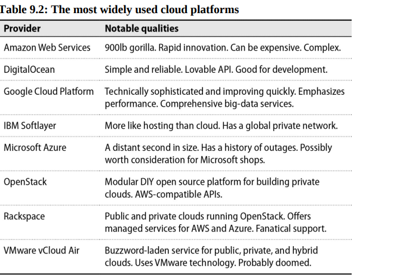

# Chapter 9: Cloud Computing

Cloud computing is the on-demand delivery of IT resources over the Internet with pay-as-you-go pricing. Instead of buying, owning, and maintaining physical data centers and servers, you can access technology services, such as computing power, storage, and databases, on an as-needed basis from a cloud provider like Amazon Web Services (AWS), Microsoft Azure, and Google Cloud.

## The cloud in context

Cloud providers create technically advanced infrastructure that most businesses cannot hope to match. The cost of running distributed computing services is much lower for a cloud provider than for a typical business with a small data center. 

Cloud systems can be programmatically requested and released. This means that you can create and destroy resources programmatically, which is a powerful feature for automation and scaling.

In the cloud, you are no longer restricted by slow procurement or provisioning processes, and nealy everything can be automated.

Still, a certain mental leap is required when you don't control your own hardware. One industry metaphor captures the sentiment neatly: *servers should be treated as cattle, not pets*. A pet server is lovingly cared for, and when it gets sick, you nurse it back to health. A cattle server is one of many, and when it gets sick, you replace it with another one.

Despite all its advantages, the cloud is not a panacea for quickly reducing costs or improving performance. Directly migrating an existing entreprise application from a data center to a cloud provides (a so-called **"lift and shift"**) is unlikely to be successful without careful planning.

## Cloud platform choices

### Public, private, and hybrid clouds

- **Public cloud**: A public cloud is a cloud service offered by a third-party provider, such as Amazon Web Services (AWS), Google Cloud, or Microsoft Azure. Public clouds are owned and operated by a third-party cloud service provider, which deliver their computing resources like servers and storage over the Internet. With a public cloud, all hardware, software, and other supporting infrastructure is owned and managed by the cloud provider. You access these services and manage your account using a web browser.
- **Private cloud**: A private cloud refers to cloud computing resources used exclusively by a single business or organization. A private cloud can be physically located on the company's on-site datacenter. Some companies also pay third-party service providers to host their private cloud. A private cloud is one in which the services and infrastructure are maintained on a private network.

OpenStack is the leading open source system used to create private clouds. It receives financial and engineering support from many of the world's largest companies, including IBM, Red Hat, and Rackspace.

- **Hybrid cloud**: A combination of public and private clouds is called a hybrid cloud. Hybrids can be useful when an enterprise is first migrating from local servers to a public cloud, for adding temporary capacity to handle peak loads, and for a variety of other organization-specific scenarios. Administrators beware: operating two distinct cloud presences in tandem increases complexity more than proportionally.

### Cloud service fundamentals

Cloud services are loosely grouped into three categories:

- **Infrastructure as a Service (IaaS)**, in which users request raw compute, memory, network, and storage resources. These are typically delivered in the form of virtual private servers, aka VPSs. Under IaaS, users are responsible for managing everything above the hardware: operating systems, networking, storage systems, and their own software.
- **Platform as a Service (PaaS)**, in which developers submit their custom applications packaged in a format specified by the vendor. The vendor then runs the code on the user’s behalf. In this model, users are responsible for their own code, while the vendor manages the OS and network.
- **Software as a Service (SaaS)**, the broadcasr category, in which the vendor hosts and manages software and users pay some form of subscription fee for access. Users maintain neither the operating system nor the application. Almost any hosted web application (think WordPress) falls into the SaaS category.

### Regions and availability zones

A "region" is a physical location in the world where a cloud provider has data centers. In most cases, regions are named after the territory of intended service even though the data centers themselves are more concentrated. For example, the "us-east-1" region of AWS is located in northern Virginia.

Some providers also have “availability zones” (or simply “zones”) which are collections of data centers within a region. ZOnes within a region are peered through high-bandwidth, low-latency, redundant circuits, so inter-zone communication is fast, though not necessarily cheap. Availability zones are designed to be isolated from each other, so that a failure in one zone does not affect the others.

Regions and zones are fundamental to building highly available network services. Depending on availability requirements, you can deploy in multiple zones and regions to minimize the impact of a failure within a datacenter or geographic area. 

Multiregion deployments are more complex because of the physical distance between regions and the associated higher latency. 

### Virtual Private Servers

The flagship service of the cloud is the virtual private server, a virtual machine that runs on the provider's hardware. VPS are sometimes called instances.

Instances are created from “images,” the saved state of an operating system that contains (at minimum) a root filesystem and a boot loader. An image might also include disk volumes for additional filesystems and other custom settings. 

### Networking

Cloud providers let you create virtual networks with custom topologies that isolate your systems from each other and from the internet.

You can make your servers accessible to the Internet by leasing publicly routable addresses from your provider (e.g. Elastic IPs on AWS)--all providers have a large pool of such addresses from which users can draw.
Alternatively, servers can be given only a private RFC1918 address within the address space you selected for your network, rendering them publicly inaccessible.

Systems without public addresses are not directly accessible from the Internet, even for administrative attention. You can access such hosts through a jump server or bastion host that is open to the Internet, or through a VPN that connects to your cloud network. For security, the smaller the external-facing footprint of your virtual empire, the better.

### Storage

The cloud vendors bill by the amount of data you store. They are highly motivated to give you as many ways as possible to ingest your data. 

Here are a few of the most important ways to store data in the cloud:

- **Object stores** contain collection of discrete objects (files, essentially) in a flat namespace. Object stores can accommodate a virtually unlimited amount of data with exceptionally high reliability but relatively slow performance. Examples include Amazon S3, Google Cloud Storage, and Azure Blob Storage.
- **Block storage** devices are virtualized hard disks that can be attached to instances. They are faster than object stores but are limited in size and are more expensive. Examples include Amazon EBS, Google Persistent Disk, and Azure Disk Storage.
- **Ephemeral storage** is local disk space on a VPS that is created from disk drives on the host server. Ephemeral storage is fast but is lost when the instance is terminated. It is useful for temporary files or caches. Examples include instance store on AWS and local SSDs on Google Cloud.

### Identity and authorization

AWS is exceptionally strong in this area. Their service, called Identity and Access Management (IAM), defines not only users and groups but also roles for systems. A server can be assigned policies, for example, to allow its software to start and stop other servers, store and retrieve data in an object store, or interact with queues—all with automatic key rotation. IAM also has an API for key management to help you store secrets safely.

Other cloud platforms have fewer authorization features. Unsurprisingly, Azure’s service is based on Microsoft’s Active Directory. It pairs well with sites that have an existing directory to integrate with. Google’s access control service, also called IAM, is relatively coarse-grained and incomplete in comparison with Amazon’s.

## Clouds: vps 

### Amazon Web Services

By default, EC2 instances in VPC subnets do not have public IP addresses attached, rendering them accessible only from other systems within the same VPC.

Firewalls in EC2 are known as "security groups." If you don't specify a security group, AWS will assume the "default" group, which allows no access. To connect to the instance, adjust the security group to permit SSH from your IP address.

### GCP

**gcloud**(the CLI) initializes the instance with a public and private IP address. You can use the public IP with SSH, but gcloud has a helpful wrapper to simplify SSH logins.