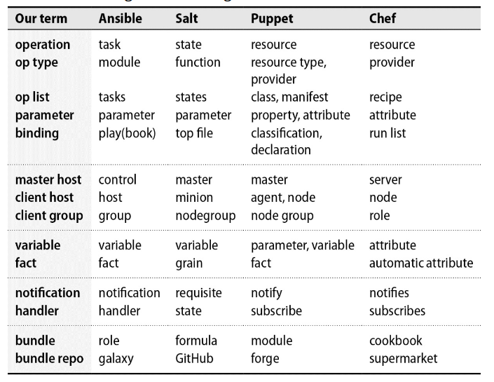
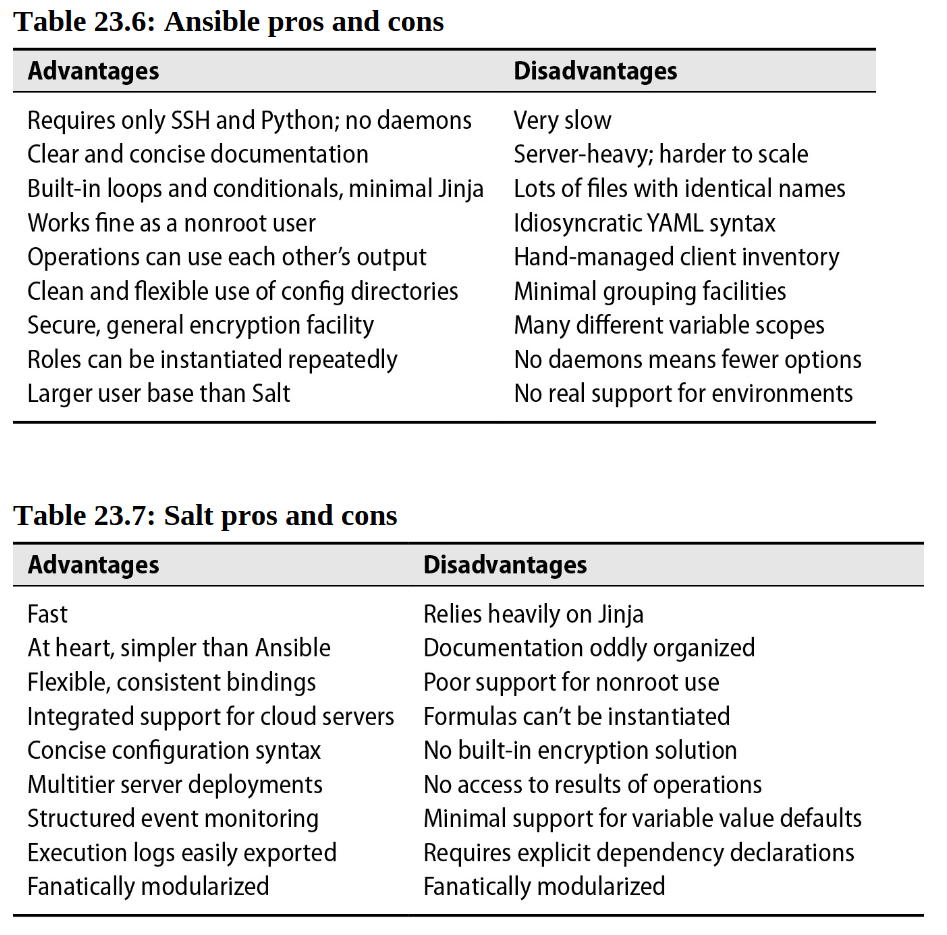

# Chapter 23: Configuration Management


A longstanding tenet of system administration is that changes should be structured, automated, and applied consistently among machines.

## Configuration management in a nutshell

The traditional sysadmin automation relies on home-grown scripts and ad hoc fixes, often leading to chaotic, irreproducible system configurations over time.

Conf management is a better approach. It captures desired state in the form of code. CHanges and updates can then be tracked over time in a VCS, which creates an audit trail and a point of reference.

Most configuration management "code" uses declarative, as opposed to procedural, idiom.
Rather than writing scripts that tell the system what changes to make, you describe the state you want to achieve.

## Danger of configuration management

Although all major CM systems use similar conceptual models, they describe these models with different lexicons. UNfortunately for marketing reasons, some CM systems use different terminology!

The result is a general lack of conformity and standardization among systems.

A certain level of operational maturity and rigor is necessary for a site to fully embrace configuration management. Once a host is under the control of a CM system, it must not be modified manually, or it immediately revert to the status of snowflake system.

Although some CM systems are easier to pick up than others, they are all notorious for having a steep leanring curve.

## Elements of configuration management

### Operations and parameters

Operations are the small-scale actions and checks used by a CM system to achieve a particular state.

Every CM systems can handle right some sample ops like:

- Create or remove a user account or set its attributes
- Copy files to or from the system being configured
- Synchonize directory contents
- Render a config template
- Add a new line in a config file
- Restart a service
- Add a cron job or systemd timer
- Run an arbitrary shell command
- Create a new cloud server instance
- Create or remove database account
- etc ...

The idea behind is just scripts, usually written in the implementation language of the CM system itself.

Just as UNIX commands accept arguments, most operations accept parameters. For example, a package management operation would accept parameters that specify the package name, version, and whether the package is to be installed or removed.

A well-behaved operation knows nothing about the host or hosts to which it might eventually be applied.

Despite operations run like any other command, they differ from typical UNIX commands in a few important ways:

- Most operations are designed to be applied repeatedly without causing problems (idempotent)
- Operations know when they change the system's acutal state.
- Operations know when the system state need to be changed.
- Operations report their results to the CM system.
- Operations strive to be cross-platform.

You also have the options of writing your own custom operations.

### Variables

Variables are named values that influence how configurations are applied to individual machines.

- Variables can typically be defined in many different places and contexts within the configuration base.
- Each definition has a scope in which it’s visible.
- Multiple scopes can be active in any given context.
- Because multiple scopes can define values for the same variable, some form of conflict resolution is necessary.

### Facts

In CM systems, facts are pieces of information collected from configuration clients (such as servers, devices, or other managed nodes) that describe their current state. These facts are critical for enabling CM systems to make informed decisions about how to manage and configure the client systems.

CM systems query each configuration client to collect descriptive information about its state. This process is often automated and happens during the initial connection or at regular intervals.

Examples of collected facts include:

- **IP address** of the primary network interface
- **Operating System (OS)** type and version
- **Hostname**
- **Hardware specifications**, such as CPU and memory
- Installed software packages

Once gathered (and it might takes time to!!!), these facts are made available as variables within the configuration management system.

For a CM tool like Ansible:

- Facts are gathered using the `setup` module, which collects details about the managed node.
- You can access these facts as variables, such as `ansible_default_ipv4.address` (for the primary IP address) or `ansible_os_family` (for the OS type).

To avoid repeatedly collecting facts on every configuration run, CM systems store these facts in a cache after they are gathered. You might explicitly invalidate cache in case of problem (`--flush-cache` in the `setup` module in Ansible)

### Change handlers

If you change a web server’s configuration file, you had better restart the web server. That’s the basic concept behind handlers, which are operations that run in response to some sort of event or situation rather than as part of a baseline configuration.

The handler isn’t told anything about the exact nature of the change, but because the association between operations and their handlers is fairly specific, additional information isn’t needed.

### Bindings

Bindings link specific sets of operations (like installing software, applying configurations, or restarting services) to:

- **Specific hosts:** Individual systems.
- **Groups of hosts:** Systems that share characteristics, such as being in the same role or geographic region.

[look-here-for-examples](./training/bindings-examples.yml)

### Bundles and bundle repositories

A bundle is a collection of operations that perform a specific function, such as installing, configuring, and running a web server. CM systems let you package bundles into a format that’s suitable for distribution or reuse. In most cases, a bundle is defined by a directory, and the name of the directory defines the name of the bundle.

### Environments

In configuration management, environments (e.g., development, test, production) are distinct contexts used to manage variations in configuration. They aren't just client groups but define differing configurations for similar roles.

### Client inventory and registration

The inventory of managed hosts can live in a flat file or in a proper relational database.

The exact mechanism through which configuration code is distributed, parsed, and executed varies among CM systems. Most systems actually gives you several options:

- A daemon runs continuously on each client. The daemon pulls its config code from a designated CM server (or server group)

- A central CM server pushes config data to each client. This process can be run on a regular schedule or manually by admin

- Each managed node runs a client that wakes up periodically, reads config data from a local clone of the config base, and applies the relevant config to itself. No cental config server.

Setting up a new client in configuration management can be streamlined with automatic bootstrapping. By installing the required client software, the client can authenticate with the configuration server, initiate setup, and start applying configurations.


## Popular CM systems compared

| **Feature**              | **Ansible**                                | **Puppet**                            | **Chef**                                | **SaltStack**                           |
| ------------------------ | ------------------------------------------ | ------------------------------------- | --------------------------------------- | --------------------------------------- |
| **Programming Language** | Python, YAML for playbooks                 | Ruby, Puppet DSL                      | Ruby, Chef DSL                          | Python, YAML, Jinja                     |
| **Architecture**         | Agentless, uses SSH                        | Master-agent, model-driven            | Master-agent with a logical workstation | Master-agent or agentless               |
| **Ease of Use**          | Easiest to learn, lightweight setup        | Moderate learning curve, powerful     | Complex but feature-rich                | Flexible but challenging setup          |
| **Execution Model**      | Push-based                                 | Pull-based                            | Pull-based                              | Push-based                              |
| **Primary Use Case**     | Simplified orchestration and configuration | Configuration and automation at scale | Infrastructure automation               | Event-driven automation                 |
| **Scalability**          | Excellent for small to large setups        | Ideal for large enterprises           | Suitable for large enterprises          | Excellent for large, distributed setups |
| **Community Support**    | Large, active community                    | Strong community and resources        | Smaller but active community            | Relatively smaller community            |
| **Market Share**         | Highest (~50% of the market)               | Second (~30% of the market)           | Moderate                                | Smaller                                 |
| **Unique Features**      | Agentless, simple syntax, idempotency      | Rich reporting, role-based access     | Testing and compliance tools            | Low-latency remote execution            |
| **Target Audience**      | Beginners to advanced users                | Large-scale enterprises, sysadmins    | Advanced DevOps professionals           | Advanced users managing complex systems |

### Terminology



### Architectural options

While Configuration Management systems could theoretically work without servers (each machine configuring itself), in practice everyone uses a central control point because it's much easier to manage and coordinate changes from one place rather than dealing with each machine individually.

Ansible uses no daemons at all (other than `sshd`). Configuration runs happen when an administrator (or `cron` job) on the server runs the `ansible-playbook` command. `ansible-playbook` executes the appropriate remote commands over SSH.

Salt, Puppet, and Chef include both master- and client-side daemons.

It's tempting to assume that CM systems with daemons must be more heavyweight and more complex than those without (i.e, Ansible). However, that isn't necessarily true!! In `Salt` and `Puppet`, the daemons are facilitators and accelerators. They're useful but optional, and they don't change the fundamental architecture of the system, although they do enable some advanced features.

Why would you want to mess around with a bunch of optional daemons?

- It's faster. Ansible works hard to overcome the performance limits imposed by SSH and by its lack of client-side caching, but it is still noticeably more sluggish than Salt.

- Some features can't exist without central coordination. For example, Salt lets clients notify the configuration master of events such as full disks.

- Only the master-side daemon is really a potential source of administrative complexity.

In terms of architecture, Chef is the outlier among configuration management systems in that its server daemon is a top tier

### Language options

Ansible and Salt are written in Python. Puppet and Chef are written in Ruby.

Both these systems use YAML as their primary configuration language.

To make YAML files more dynamically expressive, both Ansible and Salt augment them with a templating system, Jinja2, as a preprocessor. Jinja has its roots in Python, but it's not just a simple Python wrapper.

Both Puppet and Chef use Ruby-based, domain-specific languages as their primary configuration systems. Chef's version is a lot like a configuration management analog of Rails from the web development world.

By contrast, Puppet has put in quite a bit of work to be conceptually independent of Ruby and to use it only as an implementation layer. Although the language remains Ruby under the hood, the Puppet language has its own idiosyncratic structure that is more akin to a declarative system such as YAML than a programming language.

```text
service {
    "ssh":
        ensure => "running",
        enable => "true"
}
```

Puppet hasn’t done administrators any favors with this architecture. INstead of letting you leverage your existing knowledge of RUby, Puppet just defines its own insulated world.

### Dependency management options

Ansible executes operations in the order in which they are presented by the configuration. Chef works this way, too, in part.

By contrast, Puppet and Salt allow dependencies to be explicitly declared. For example, in Salt we could have this:

```YAML
www-user:
    user.present:
        - name: www
        - gid: www
        - createhome: false
        - require:
            - www-group

www-group:
    group.present:
        - name: www
```

### YAML

In the JSON world, brackets enclose lists and curly braces enclose hashes. A colon separates a hash key from its value. These delimiters can appear directly in YAML, but YAML also understands indentation to indicate structure, much like Python.

YAML is good for representing simple data structures, but it’s not a tool that scales well to arbitrary complexity. When cracks appear in the model, they have to be puttied over with a variety of ad hoc fixes.

```YAML
package: name={{ item }} state=present
```

is not the same as:

```YAML
package:
    name: {{ item }}
    state: present
```

you need to add quotes:

```YAML
package:
    name: "{{ item }}"
    state: present
```

## Introduction to Ansible


**Key Components:**

- **Control Node:** This is the machine where Ansible is installed and where you run your playbooks from. It can be your laptop, a dedicated server, or a virtual machine.
- **Managed Nodes:** These are the servers, network devices, or other systems that you manage with Ansible. Ansible doesn't require any special software to be installed on these nodes.
- **Inventory:** A file or database that lists the managed nodes that Ansible will interact with. It can include information like IP addresses, hostnames, and grouping of nodes.
- **Playbooks:** YAML files that define the tasks and configurations you want Ansible to apply to your managed nodes.
- **Modules:** Small units of code that perform specific tasks on managed nodes, such as installing packages, managing users, or configuring services.
- **Plugins:** Extend Ansible's functionality by providing additional features like logging, caching, and connections to other systems.
- **API:** Allows external systems to interact with Ansible and trigger automation tasks.

The default location of Ansible's master configuration file is `/etc/ansible/ansible.cfg`.

- Example of ansible code to setup `sudo`:

```YAML
- name: Install sudo package
  package: name=sudo state=present

- name: Install sudoers file
  template:
    dest: "{{ sudoers_path }}"
    src: sudoers.j2
    owner: root
    group: wheel
    mode: 0640

- name: Create sudo group
  group: name=sudo state=present

- name: Get current list of users
  shell: "cut -d: -f1 /etc/passwd"
  register: userlist

- name: Add administrators to the sudo group
  user: name={{ item }} groups=sudo append=true
  with_items: "{{ admins }}"
  when: "{{ item in userlist.stdout_lines }}"
```

Each account listed in the admins variable (`with_items: "{{ admins }}"`) is considered separately. During its turn, the account name is assigned to the variable item. (The name item is an Ansible convention; the configuration does not specify it.) For each account found within the output of the cut command (the when clause), the user clause is invoked.


### Task lists

Ansible calls operations “tasks,” and a collection of tasks in a separate file is called a task list. Every task has a name field that describes its function in English.

### Iteration

`with_items` is an iteration construct that repeats a task once for each element it’s supplied with.

```yaml
- name: Create personal groups for admins
  group: name={{ item.username }}
  with_items: "{{ admin }}"

- name: Create admin accounts
  user:
    name: "{{ item.username }}"
    comment: "{{ item.fullname }}"
    group: "{{ item.username }}"
    groups: wheel
  with_items: "{{ admins }}"
```

If you really need the effect of a single loop that executes multiple tasks in sequence:

```yaml
- include: sudo-substacks.yml
  with_items: "{{ admins }}"
```

### Template rendering

Ansible uses the Jinja2 template language both to add dynamic features to YAML files and to flesh out configuration file templates installed by the `template` module.

```jinja
sudoers_path: /etc/sudoers
admins:
  - { username: abdoufermat, fullname: Abdou Goat}
  - { username: evantheripper, fullname: Evan Young}
```

in task:

```yaml
- name: Install sudoers file
  template:
    dest: "{{ sudoers_path }}"
    src: templates/sudoers.j2
    owner: root
    group: wheel
    mode: 0600
```

### Bindings: plays and playbooks

Bindings are the mechanism through which tasks become associated with sets of client machines. Ansible’s binding object is called a play. Just as multiple tasks can be concatenated to form a task list, multiple plays in sequence form a `playbook`.

As in other systems, the basic elements of a binding are a set of hosts and a set of tasks.


### Roles

Ansible calls its bundles “roles,” and they are in fact nothing but a structured system of `include` operations and variable precedence rules. Each role is a subdirectory of a directory called roles that’s normally found at the top level of your configuration.

Role directories can have the following subdirectories:

| Subdir        | contents                                               |
| ------------- | ------------------------------------------------------ |
| **defaults**  | Default value for variables (overridable)              |
| **vars**      | Variables definitions (not overridable)                |
| **tasks**     | Task list                                              |
| **handlers**  | Ops that respond to notifications                      |
| **files**     | Data files                                             |
| **templates** | templates to be processed by jinja before installation |
| **meta**      | List of bundles to run in preparation of this bundle   |


Roles are invoked through playbooks and nowhere else. Ansible looks for a file called `main.yml` within each of the role's subdirectories.

```yaml
- name: Set up cow-clicker app throughout East region
  hosts: web-server-east
  roles:
    - cow-clicker
```

is equivalent to:

```yaml
- name: Set up cow-clicker app throughout East region
  hosts: web-server-east
  var_files:
    - roles/cow-clicker/defaults/main.yml
    - roles/cow-clicker/vars/main.yml
  tasks:
    - include: roles/cow-clicker/tasks/main.yml
  handlers:
    - include: roles/cow-clicker/handlers/main.yml
```

Ansible lets you pass a set of variable values to a particular instance of a role. In effect, this makes the role act as a sort of parameterized function.

```yaml
- name: Install rails app
  hosts: ulsah-server
  roles:
    - { role: rails_app, app_name: ulsah-reviews }
    - { role: rails_app, app_name: ulsah-com}
```

### Ansible access options

The system running Ansible (the control node) must store the credentials (keys or passwords) that allow it to SSH into client systems and elevate privileges using `sudo`. This means the control node essentially has the "master keys" to every client system it manages. If compromised, the attacker gains control over the entire managed environment.

Unlike daemon-based systems, Ansible operates agentlessly, only requiring SSH and sudo when needed. This reduces the attack surface, as no persistent agents or open ports are required on client systems.

For simplicity it's best if SSH access is funneled through a dedicated account such as `ansible` that has the same name on each client. 

- Ansible needs one credential (password or private key) to gain access to a remote system, and another to escalate privileges with sudo. Proper security hygiene suggests that these be separate credentials. A single compromised credential should not grant an intruder root access to a target machine.
- If both credentials are stored in the same place with the same form of protection (encryption, file permissions), they are effectively a single credential.
- Credentials can be reused on machines that are peers (e.g., web servers in a farm), but it should not be possible to use credentials from one server to access a more sensitive —or even substantially different—server.
- Ansible has transparent support for encrypted data through the `ansible-vault` command, but only if the data is contained in a `YAML` or `.ini` file.
- Administrators can remember only a few passwords.
- It’s unreasonable to demand more than one password for a given operation.

DON'T SETUP `ansible` ACCOUNTS WITH THE `NOPASSWD` OPTION IN THE `sudoers` FILE. At least require a forwarded SSH for `sudo` access in the PAM SSH agent module.

## Introduction to Salt

A basic Salt implementation consists of a Salt master managing one or more Salt minions.

**Salt Master**

A server running the salt-master service is a Salt master. The master provides a cohesive platform for orchestration and automation between managed systems.

**Salt Minion**

A Salt minion is any system or device managed by Salt. A minion can either run the salt-minion service or be agentless using salt-ssh or salt-proxy. A minion running the service may execute commands without a master in stand-alone mode.

[..look at here for more](https://docs.saltproject.io/salt/user-guide/en/latest/topics/overview.html)


Salt maintains a separation between configuration files that set variable values (the `pillar`) and configuration files that define operations (`states`).

Example of a `pillar` file:

```yaml
apache:
  user: apache
  group: apache
  docroot: /var/www/html
```

Example of a `state` file:

```yaml
apache:
  pkg.installed:
    - name: httpd
    - require:
      - pkg: apache2
  service.running:
    - name: httpd
    - enable: True
    - require:
      - pkg: apache2
  file.managed:
    - name: /etc/httpd/conf/httpd.conf
    - source: salt://apache/httpd.conf
    - user: root
    - group: root
    - mode: 644
    - require:
      - pkg: apache2
```

Salt uses a `top.sls` (`.sls` is just salt's version of `.yml`) file to define the relationship between the `pillar` and `state` files. 

```yaml
base:
  'web*':
    - apache
  
  'db*':
    - mysql
```

The `top.sls` file is a map of minion IDs to the states that should be applied to them. The `base` key is the default environment, and the `web*` and `db*` keys are minion IDs that match the `glob` patterns.

Salt uses the `salt` command to execute commands on minions. The `salt` command is followed by the target minion ID, the function to execute, and any arguments to the function.

```bash
salt 'web*' state.apply
```

### reactor

Salt's reactor system allows you to trigger actions in response to events on the Salt master. Reactors are defined in the `reactor` configuration file, which maps events to reactor SLS files.

```yaml
reactor:
  - 'salt/minion/*/start':
    - /srv/reactor/start_minion.sls
```

In this example, the reactor listens for the `salt/minion/*/start` event and triggers the `start_minion.sls` reactor file.


## Salt vs Ansible

Configuration Management:

- Salt: States (SLS files) with more powerful templating (Jinja)
- Ansible: Playbooks with roles and less complex templating
- Salt offers more flexibility in state organization

Scalability:

- Salt: Better suited for large infrastructures (10,000+ nodes)
- Ansible: Works well for small to medium deployments
- Salt's message bus architecture handles concurrent connections better


Salt can only be as secure as the root account on the master server.

Although the master daemon itself is simple to set up, the server on which it runs should receive your site’s most aggressive securement.  Ideally, the master should be a machine or virtual server dedicated to this task.



