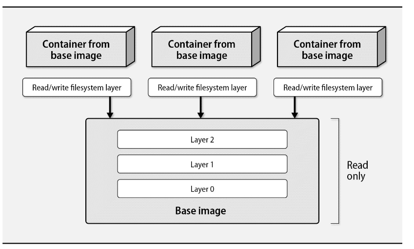

# Chapter 25: Containers


To illustrate the utility of containers, consider a typical web application developed in any modern language or framework. At a minimum, the following ingredients are needed to install and run the app:

- The code for the application and its correct configuration
- Libraries and other dependencies, potentially numbered in the dozens, each pinned to a specific version that is known to be compatible
- An interpreter (e.g., Python or Ruby) or run time (JRE) to execute the code, also version pinned
- Localizations such as user accounts, environment settings, and services provided by the operating system

A container image simplifies matters by packaging an application and its prerequisites into a standard, portable file. Any host with a compatible container runtime engine can create a container by using the image as a template.

Several viable alternative container engines are available. `rkt`, from CoreOS, is the most complete. It has a cleaner process model and a more secure default configuration. `systemd-nspawn` is a lightweight alternative that is part of the systemd suite.

## Background and core concepts

Containers are a fusion of numerous existing kernel features, filesystem tricks, and networking hacks. A container engine is the management software that pulls all together.

In essence, a container is an isolated group of processes that are restricted to a private root filesystem and process namespace. The contained processes share the kernel and other services of the host OS, but by default they cannot access file of system resources outside their container.
Applications that run within a container are not aware of their containerized state and do not need to be modified to run in a container.

### Kernel support

The container engine uses several kernel features that are essential for isolating processes. In particular, the following features are used:

- **Namespaces**: isolate containerized processes from the host system. The most common namespaces are:
  - **PID**: isolates the process ID number space
  - **NET**: isolates the network stack
  - **IPC**: isolates inter-process communication resources
  - **UTS**: isolates hostname and NIS domain name
  - **MNT**: isolates the filesystem mount points
  - **USER**: isolates user and group IDs
- **Cgroups**: limit and monitor resource usage, such as CPU, memory, disk I/O, and network bandwidth
- **Capabilities**: allow processes to perform privileged operations without granting full root access. For example, a process can be granted the CAP_NET_ADMIN capability to configure network interfaces without being root, or CAP_SYS_ADMIN to mount filesystems, etc.
- **Seccomp**: The secure computing mode restricts access to system calls. It allows more fine-grained control than capabilities, but is more complex to configure.

Development of these features was driven in part by the Linux Containers (LXC) project. The first releases of Docker were essentially a wrapper around LXC, but Docker has since replaced LXC with its own container runtime engine, `containerd`.

### Images

A container image is akin to a template for a container. Images rely on union filesystem mounts for performance and portability [see](https://lwn.net/Articles/396020/).
Container images are union filesystems that are organized to resemble the root filesystem of a typical Linux distribution.

To create a container, Docker points to the read-only union filesystem of an image and adds a read-write layer that the container can update. When containerized processes modify the filesystem, their changes are transparently saved within the read-write layer. The base remains unmodified. This is known as the `copy-on-write` principle.

**Docker images and the union filesystem**


### Networking

The default way to connect containers to the network is to use a network namespace and a bridge within the host. In this configuration, containers have private IP addresses that aren’t reachable from the outside world. The host acts as a poor man's IP router, forwarding packets between the containers and the outside world.

In some specific cases, containers can be connected to the host network, or even to a physical network interface.

## Docker: the open-source container engine

Because of version compatibility issues and the fear of resulting in vendor lock-in ecosystem, DOcker Inc. became a member of the Open Container Initiative (OCI). Docker founded the Moby project to develop a modular, open-source container engine.

### Basic architecture

`docker` is an executable command that handles all management tasks for the Docker system. `dockerd` is the persistent daemon process that implements container and image operations. docker can run on the same system as `dockerd` and can communicate with it through UNIX domain sockets, or it can contact `dockerd` from a remote host over TCP.


`dockerd` owns all the scaffolding needed to run containers. It creates the virtual network plumbing and maintains the data directory in which containers and images are stored (`/var/lib/docker` by default). It’s responsible for creating containers by invoking the appropriate system calls, setting up union filesystems, and executing processes.

Docker uses `dockerd` as its primary daemon to manage the entire container lifecycle. `dockerd` relies on `containerd`, a lower-level container runtime, to handle container execution and supervision. `containerd` uses a component called a `containerd-shim` that acts as a direct parent to a container process, isolating it from `containerd` and allowing for operations like "live restore" of `dockerd`. Finally, these shims utilize `runc`, the core runtime, to interact with the operating system and actually spawn and run the container processes according to the OCI specification.


### Installation

[look here](https://docs.docker.com/get-docker/)

### Client setup

If you're connecting to a local `dockerd` instance, you can use the default UNIX socket (`/var/run/docker.sock`). If you're connecting to a remote `dockerd`, you can use the `-H` flag to specify the host and port (`tcp://hostname:2375`). Usually port 2375 is used for unencrypted communication, and port 2376 is used for encrypted communication.

For example, to connect to a remote `dockerd` instance:

```bash
export DOCKER_HOST=tcp://10.0.0.10:2376
```

It's a good practice to use TLS to secure the communication and also validates the integrity of content and publisher of the image with the `DOCKER_CONTENT_TRUST` environment variable.

### Basic commands

- `docker run`: Create a new container from an image and start it
- `docker ps`: List running containers
- `docker build`: Create a new image from a Dockerfile
- `docker images`: List images
- `docker exec`: Run a command in a running container
- `docker stop`: Stop a running container
- `docker rm`: Remove a container
- `docker rmi`: Remove an image

Example: run a nginx container

```bash
docker run -d -p 80:80 --name my-nginx --hostname my-nginx nginx
```

### Volumes

A volume is an independent, writable directory within a container that’s maintained separately from the container’s union filesystem. If the container is deleted, the volume persists.

### Data volume containers

A data volume container is a container whose sole purpose is to provide volumes to other containers. It’s a way to share data between containers without using a network share or a bind mount.

Example: create a data volume container for nginx

```bash
docker create -v /mnt/data:/data --name nginx-data nginx
```

now you can use the volume in other containers

```bash
docker run -d -p 80:80 --volumes-from nginx-data --name webserver nginx
```

### Docker network

Docker provides a default bridge network that containers can use to communicate with each other. You can also create custom networks to isolate containers from each other.

In the default bridge network, containers can communicate with each other by their container name. You can also expose ports to the host or to the outside world.

In the `host` network mode, the container shares the host’s network stack and can bind to ports on the host. This is useful for performance-sensitive applications that require direct access to the host’s network interfaces.

`None` mode disables networking for the container. This is useful for running containers that don’t need network access.

**Namespaces and the bridge network**

A bridge is a Linux kernel feature that connects two networks segments. During installation, Docker quietly creates a new bridge network interface called `docker0` on the host. Docker chooses an IP address space for the far side of the bridge that it calculates as unlikely to collide with any networks reachable by the host. Each container is given a namespaced virtual network interface that has an IP address within the `docker0` subnet.

Network namespaces rely on virtual interfaces, strange constructs that are created in pairs, where one end is in the container and the other end is in the host. The virtual interface in the host is connected to the `docker0` bridge, and the virtual interface in the container is connected to the container’s network namespace.


**Network overlays**

Docker supports overlay networks, which allow containers to communicate across multiple hosts. Overlay networks use the VXLAN protocol to encapsulate packets and route them between hosts.

### Storage drivers

Docker supports several storage drivers that determine how container and image data is stored on disk. The default storage driver is `overlay2`, which uses the overlay filesystem to manage layers. Other storage drivers include `aufs`, `btrfs`, `devicemapper`, and `zfs`.


The VFS driver effectively disables the use of a union filesystem. Docker creates a complete copy of an image for each container, which can be slow and consume a lot of disk space.

Btrfs and ZFS are not true union filesystems, but they provide similar functionality. They are copy-on-write filesystems that can be used as storage drivers for Docker.

### Image building

Each layer of an image is identified by a cryptographic hash of its contents. The hash serves as a validation checksum, ensuring that the layer has not been tampered with.

Many of the official images are based on a distribution called `Alpine Linux`, which weighs in at a lean 5MB.

**Dockerfile**

A Dockerfile is a text file that contains a series of instructions for building an image. Each instruction creates a new layer in the image.

For example a Dockerfile for an nginx web server based on Debian:

```Dockerfile
FROM debian:jessie
MAINTAINER NGINX Docker Maintainers "docker-maint@nginx.com"
ENV NGINX_VERSION 1.9.9-1~jessie
RUN apt-get update \
    && apt-get install --no-install-recommends --no-install-suggests -y ca-certificates nginx=${NGINX_VERSION} gettext-base \
    && rm -rf /var/lib/apt/lists/*
RUN ln -sf /dev/stdout /var/log/nginx/access.log \
    && ln -sf /dev/stderr /var/log/nginx/error.log
COPY nginx.conf /etc/nginx/nginx.conf

EXPOSE 80 443
CMD ["nginx", "-g", "daemon off;"]
```

To build the image, run:

```bash
docker build -t my-nginx .
```

By default, NGINX sends log data to `/var/log/nginx/access.log`, but the convention for Docker containers is to write logs to stdout and stderr. The `ln` command creates symbolic links from the NGINX log files to the standard output and standard error streams.

### Registries

A registry is an index of Docker images that `dockerd` can pull from and push to through HTTP. The default registry is Docker Hub, but you can also use private registries or other public registries.

To push an image to a registry, you need to tag it with the registry’s URL. For example, to push an image to a private gitlab registry:

```bash
docker tag my-nginx registry.gitlab.com/mygroup/my-nginx
docker login registry.gitlab.com # enter your credentials
docker push registry.gitlab.com/mygroup/my-nginx
```

Docker saves your credentials in a configuration file in your home directory (`~/.docker/config.json`).

You can create your own registry [here](https://distribution.github.io/distribution/).

The registry implement two authentication methods: `token` and `htpasswd`. `htpasswd` is a simple HTTP basic authentication method.

## Containers in practice

The list below offers a few rules of thumb to help you adjust to life inside a container:

- When your application needs to run a scheduled job, don’t run cron in a container. Use the `cron` daemon from the host (or a `systemd` timer) to schedule a short-lived container that runs the job and then exits.

- Need to log in and check out what a process is doing? Don't run `sshd` in your container. Log in to the host via SSH and use `docker exec` to run commands in the container.

- If possible, set up your software to accept its configuration information from environment variables. You can then use `docker run -e` or `docker run --env-file` to pass configuration data to the container.

- Ignore the commonly dispensed advice to run a single process per container. It’s fine to run multiple processes in a container if they are tightly coupled and need to share resources. Just be aware that the container will exit if the main process exits.

- Stuck? Ask for help on the Docker IRC channel or the Docker forums. The Docker community is large and helpful.

### Logging

UNIX and Linux applications traditionally use syslog (now the `rsyslogd` daemon) to process log messages.

Containers do not run syslog. Instead they write log messages to stdout and stderr. The Docker daemon captures these messages and writes them to a configurable destination. By default, Docker writes log messages to a JSON file in `/var/lib/docker/containers`.

**Docker logging drivers**

| Driver      | Description                                                                |
| ----------- | -------------------------------------------------------------------------- |
| `json-file` | Write log messages to a JSON file in the daemon's data directory (default) |
| `syslog`    | Write log messages to a configurable syslog server                         |
| `journald`  | Write log messages to the systemd journal                                  |
| `gelf`      | Write log messages to a Graylog Extended Log Format (GELF) endpoint        |
| `fluentd`   | Write log messages to a Fluentd server                                     |
| `awslogs`   | Write log messages to Amazon CloudWatch Logs                               |
| `splunk`    | Write log messages to a Splunk server                                      |
| `gcplogs`   | Write log messages to Google Cloud Platform (GCP) Logs                     |
| `none`      | Do not collect log messages                                                |


You set the default logging driver for `dockerd` with the `--log-driver` option (ex: `--log-driver=syslog`). For log rotation, you can use the `--log-opt` option to specify the maximum log file size and the number of log files to keep (ex: `--log-opt max-size=10m --log-opt max-file=3`).

### Security

Container security rely on processes within containers being unable to access files, processes and other resources outside their sandbox. The code that underlies container isolation has been in the kernel since at least 2008; it's mature and stable. As with bare-metal or virtualized systems, insecure configurations are far more likely to be the cause of security breaches than kernel bugs.

**Restrict access to the Docker daemon**

Above all, protect the Docker daemon. Because `dockerd` necessarily run with elevated privileges, it's trivial for a user with access to the daemon to gain root access to the host. 


The above sequence show that any user in the `docker` group can mount the host filesystem into a container and then access it from the host. 

If you use the default UNIX domain socket for communication between the Docker client and daemon, add only trusted users to the `docker` group. Better yet, control access through `sudo`.

**Use TLS**

If you need to expose the Docker daemon to the network, use TLS to encrypt the connection. You can generate a certificate and key pair with the `dockerd --tls` option. The `docker` client can be configured to use the certificate and key with the `--tlsverify` option.

For example, to start the Docker daemon with TLS:

```bash
dockerd --tlsverify --tlscacert=ca.pem --tlscert=server-cert.pem --tlskey=server-key.pem
```

And to connect to the daemon with TLS:

```bash
docker --tlsverify --tlscacert=ca.pem --tlscert=client-cert.pem --tlskey=client-key.pem -H=hostname:2376 version
```

**Use a read-only root filesystem**

If your container doesn't need to write to the root filesystem, mount it as read-only. This prevents an attacker from modifying the container's filesystem. You can also use the `--read-only` option to make the container's root filesystem read-only.

**Limit capabilities**

By default, Docker containers run with a reduced set of capabilities (14 actually). You can further restrict the capabilities available to a container with the `--cap-drop` option. For example, to drop the `NET_RAW` capability:

```bash
docker run --cap-drop NET_RAW my-nginx
```

### Debugging and troubleshooting

- Use `docker logs` to view the logs of a container
- Use `docker exec` to run a command in a running container
- Use `docker inspect` to view detailed information about a container
- Use `docker events` to view real-time events from the Docker daemon

If something wrong with the docker daemon, a better place to search is the [github.com/moby/moby](https://github.com/moby/moby) repository, where you can find the source code and the issues.

## Container clustering and management

One of the great promises of containerization is the prospect of co-loacting many applications on the same host while avoiding interdepencies and conflicts, thereby making more efficient use of servers. This an an appealing vision, but the Docker engine is responsible only for individual containers, not for answering the broader question of how to run many containers on distributed hosts in a highly available and scalable way.

Configuration management tools like Ansible, Puppet, Salt, and Chef can ensure that hosts run a certain set of containers with declared configurations. They also support image building, registry interfaces, network and volume management, and other container-related tasks.

These tools are not designed to manage the lifecycle of containers, however. 

For network-wide container deployments, you need container orchestration software, also known as container scheduling or container management software. An entire symphony of open-source and commercial container orchestration tools are available.

To understand how these systems work, think of the servers on the network as a farm of compute capacity. Each node in the farm offers CPU, memory, disk, and network resources to the scheduler. When the scheduler receives a request to run a container (or set of containers), it places the container on a node that has sufficient spare resources to meet the container's needs. Because the scheduler knows where containers have been placed, it can also assist in routing network requests to the correct nodes within the cluster.

**Scheduler architecture**


Container management systems supply several helpful features:

- Scheduling algorithms select the best node in light of a job's requested resources and the utilization of the cluster. For example a job that requires a GPU might be scheduled on a node with a GPU.

- Formal APIs allow programs to submit jobs to the cluster, opening the door to integration with external tools. For example, a continuous integration system could submit a job to the cluster to build and test a new version of an application.

- Container placement can accomodate the needs of high-availability configurations. For example, a job might be scheduled on two nodes to ensure that it continues to run if one node fails.

- Health monitoring is built in. The scheduler can detect when a container has failed and restart it on another node.

- It's easy to add or remove capacity. If your compute farm doesn't have enough resources available to satisfy the demand, you can simply add more nodes to the cluster.

- The container management system can interface with a load balancer to route network traffic from external clients. This facility obviates the complex administrative process of manually configuring network access to containerized applications.

One of the most challenging tasks in a distributed container system is mappingservice names to containers. Remember that containers are ephemeral and may have dynamic ports assigned. How do you map a friendly, persistent service name to multiple containers especially when the nodes and ports change frequently? This problem is known as service discovery, and container management systems have various solutions.

It helps to be familiar with the underlying container execution engine before diving into orchestration tooling. All the container management systems we're aware of rely on Docker as the default container execution engine, although some can be configured to use other engines.

### Kubernetes

Kubernetes---sometimes shortened to `k8s`--- has emerged as a leader in the container management space. It was developed by Google and is now maintained by the Cloud Native Computing Foundation (CNCF). Kubernetes was released as open-source project in 2014 and has since become the de facto standard for container orchestration.

Kubernetes consists of a few separate services that integrate to form a cluster. THe basic building bloc include:

- The API server, for operator requests
- A scheduler, for placing containers on nodes
- A controller manager, for monitoring the cluster
- The kubelet, an agent that runs on each node
- cAdvisor, for monitoring container metrics
- A proxy, for routing incoming requests to the appropriate container

The first three services run on a set of masters for high availability. The kubelet and cAdvisor processes run on each node, handling requests from the controller manager and reporting statistics about the health of their tasks.

In kubernetes containers are deployed as a `pod`, which is a group of one or more containers. All containers in a pod are guaranteed to run on the same node. Pods are assigned a cluster-wide unique IP address, and they are labeled for identification and placement purposes.

Pods are not intended to be long-lived. If a node dies, the controller schedules a replacement pod on another node with different IP address. Therefore you  cannot use the address of a pod as a durable name.

Services are the solution to this problem. Services are a collection of related pods with an address that is guaranteed not to change. If a pod within a service dies or fails a health check, the service removes that pod from its rotation. You can also use the built-in DNS server to assign resolvable names to services.

Kubernetes has integrated support for service discovery, secret management, deployment, and pod autoscaling. It has pluggable networking options to enable container network overlays. It can support stateful applications by migrating volumes among nodes as needed. Its CLI tool, kubectl, is one of the most intuitive that we’ve ever worked with.


### Mesos and Marathon

Apache Mesos is a distributed systems kernel that abstracts CPU, memory, storage, and other compute resources. It can run containers, but it can also run other types of workloads, such as Hadoop jobs or Spark tasks. Mesos is designed to be a general-purpose cluster manager.

It quickly made its way to Twitter (now X), where it now runs on thousands of nodes. 

The major conceptual entities in Mesos are masters, agents, and frameworks. The master is a proxy between agents and frameworks. If a framework has a task to run, it chooses an offer and instructs the master to run the task.The master then instructs the agent to run the task.

Marathon is a Mesos framework that deploys and manages containers. It includes a handsome web interface for managing applications and a REST API for programmatic control. To run an application, you submit a JSON file to Marathon that describes the application's requirements and dependencies.

Support for multiple frameworks is a key feature of Mesos. Apache Spark, the big data processing tool, and Apache Cassandra, a NoSQL database, both offer Mesos frameworks, thus allowing you to use Mesos agents as nodes in a Spark or Cassandra cluster.

Chronos is another Mesos framework that schedules jobs. It's similar to Marathon, but it's designed for running scheduled jobs rather than long-running services. It's like `cron` on steroids.

Unlike k8s, Mesos does not come with built-in service discovery or load balancing. You need to use a separate tool, such as HAProxy, to route traffic to the correct containers.

A high-available Mesos cluster requires at least three masters. The masters use the ZooKeeper distributed coordination service to elect a leader. The leader is responsible for scheduling tasks and managing the cluster. If the leader dies, another master is elected to take its place.


### Docker Swarm

Docker Swarm is Docker's native clustering and orchestration tool. It's built into the Docker engine, so you don't need to install a separate tool to use it. Swarm is designed to be simple to use and easy to set up.

[see here](https://docs.docker.com/engine/swarm/)

### AWS ECS

Amazon Web Services (AWS) offers a container management service called the Elastic Container Service (ECS). ECS is a managed service that runs on top of EC2 instances. It's designed to be easy to use and integrates well with other AWS services.

ECS is built around the concept of a task, which is similar to a pod in Kubernetes. A task is a group of one or more containers that run together on the same instance. Tasks are defined in a JSON file called a task definition.

For management of applications o ECS we can use an open source tool such as Empire or Convox.