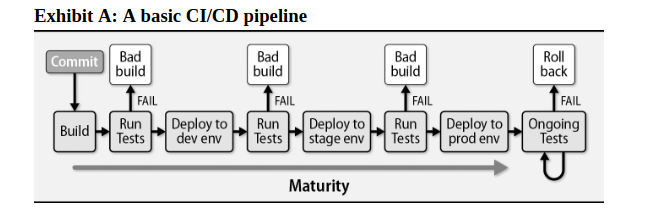
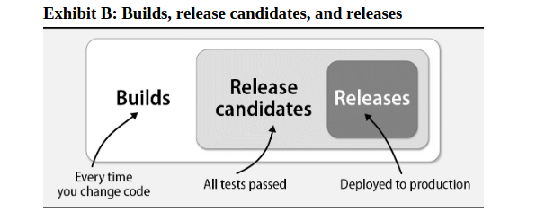
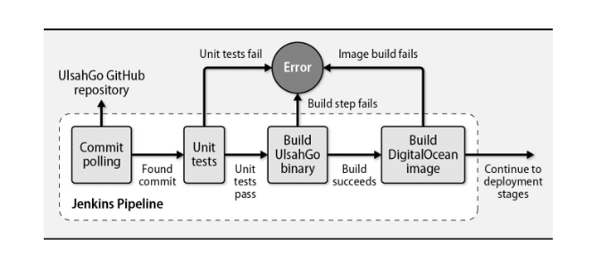
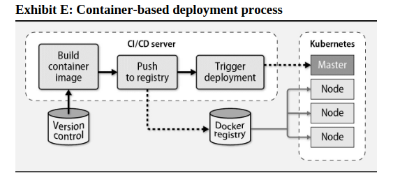

# Chapter 26: Continuous Integration and Delivery


Until the past decade or so, updating software was a hair-pulling, time-consuming exercise in frustration. Releases processes typically involved ad hoc, home-grown scripts that were invoked in enigmatic order and saddled with outdated and incomplete documentation.

Testing--if existed at all--was performed by a whole quality assurance team that was far removed from the development process and often became a major bottleneck to shipping code. The result was that software updates were infrequent, and when they did happen, they were often fraught with bugs and other issues.

Given this unsatisfactory state of affairs, some smart people were working on solutions.

At top of mind is Martin Fowler! He is a software developer, author, and international public speaker. He is the Chief Scientist at ThoughtWorks, and he has been a key figure in the development of Continuous Integration (CI) and Continuous Delivery (CD) practices.

Fowler describes continuous integration as “a software development practice where members of a team integrate their work frequently".

Continuous delivery is similar in concept but targets a separate goal: reliably deploying updated software to live systems.

In combination, continuous integration and continuous delivery (henceforth denoted CI/CD) encompass the tools and processes needed to facilitate frequent, incremental software and configuration updates.

Sysadmins are central to the design, implementation, and ongoing maintenance of CI/CD systems. Administrators install, configure, and operate the tools that make CI/CD function.

An effective CI/CD system is implemented not with a solitary tool but rather with a collection of software that works in unison to form a cohesive environment.

## CI/CD essentials

- **Continuous integration** is the process of collaborating on a shared code base, merging disparate code changes into a version control system, and automatically creating and testing builds.
- **Continuous delivery** is the process of automatically deploying builds to nonproduction environments after the continuous integration process completes.
- **Continuous deployment** closes the loop by deploying to live systems that serve real users without any operator intervention

### Principles and practices

Business agility is one of the key benefits of CI/CD. COntinuous deployment facilitates the release of well-tested features to prod in minutes or hours instead of weeks or months.
Because every change is built, tested, and deployed immediately, the delta between version is much smaller.

CI/CD stresses the release of more features, more often. This goal is achievable only when developers write and commit code in smalller chunks.

**Use revision control**

Revision control is the cornerstone of CI/CD. It allows developers to work on the same codebase without stepping on each other's toes. It also provides a history of changes, which is invaluable for troubleshooting and auditing.

We recommend Git as the revision control system of choice. Git is a distributed version control system that is widely used in the software industry.

**Build once, deploy often**

A CI/CD pipeline begins with a build. The output of the build (the "artifact") is used from that point forward for testing and deployment. The only way to confirm that a specific build is ready to go to production is to run all tests against that build. Deploy the artifact to at least one or two environments that match prod as closely as possible.

**Automate end-to-end**

Building, testing, and deploying code without manual intervention is the key to reliable and reproducible updates.

**Build every integration commit**

An integration merges changes made by multiple developers or teams of developers. The product is a composite code base that incorporates everyone's updates.

Integrations are performed through the source control system. The exact workflow varies.

The idea behind continuous integration is that commits to the revision control system's integration branch automatically result in a build.

**Share responsability**

When something goes wrong, the pipeline needs to be fixed. No new code can be pushed until the previous problem has been resolved.

**Build fast, fix fast**

CI/CD is designed to yield feedback as quickly as possible, ideally within minutes after pushing code to source control, "attention seeker"!

Slow build processes are counterproductive. Strive to eliminate redundant and time-consuming steps. ENsure that your build system has enough agents, and that the agents have sufficient system resources to build quickly.

**Audit and verify**

History of every software release should be recorded.

### environments

Most sites run at least three environments:

- Development, for integrating updates from multiple developers, testing infrastructure changes, and checking of obvious failures.
- Staging for manual and automated testing and for further vetting of changes and software updates.
- Production, for implementing service for real users. The prod env usually includes extensives measure to ensure high performance and strong security.


Environment parity is a subject of some complexity for administrators. The purpose of the nonproduction or “lower” environments is to prepare and scrutinize changes of all types before they are made in production. Substantive differences among environments can result in unforeseen incompatibilities that might ultimately cause degraded performance, downtime, or even the destruction of data.

For example, imagine that the development and staging environments have undergone an operating system upgrade, but production still runs the older OS version. It’s time for a software deployment. The new software is thoroughly tested in dev and stage, and it seems to work fine. However, an unexpected incompatibility becomes evident during the production rollout because the older version of a certain library is missing functionality used by the new code. This scenario is quite common, and it’s one reason why administrators must be vigilant about keeping environments in sync. The closer that lower environments match production, the higher your chances of maintaining high availability and delivering software successfully.

### Feature flags

A feature flag enables or disables an application feature depending on the value of a configuration setting. For example you can enable a feature in staging but not in production.

Feature flags are a powerful tool for managing risk in software development. They allow you to toggle features on and off at runtime, which can be useful for testing, debugging, and gradually rolling out new features to users.

## Pipelines

A CI/CD pipeline is a series of steps that code changes go through to be built, tested, and deployed to production. The pipeline is automated, meaning that each step is executed by a computer program rather than a human operator.

At the most basic level, a CI/CD pipeline

- Reliably builds and packages software
- Runs a series of automated tests to search for bugs and configuration and configuration errors
- Deploys code to one or more environments, culminating in production



### The build process

A build is a snapshot of the current status of a software project. It's the first step in the CI/CD pipeline, possibly after a code analysis stage that monitors code quality and searches for security vulnerabilities. Build can be triggered by a commit to the source code repository, a pull request, or a scheduled job.

Every pipeline run starts with a build, but not every build reaches production. Once a build passes testing, it becomes a "release candidate". If the release candidate is actually deployed to production, it becomes a "release". If you do continuous deployment, every release candidate is also a release.



The precise steps of the build process depend on the language and software. For a program in C, C++, or Go, the build process might involve compiling the source code into an executable binary (often initiated by a Makefile). For a program in Python, Ruby, or Node.js, the build process might involve installing dependencies and packaging the code into a distributable format. Some build processes are just configurations changes, like updating a database schema or changing a configuration file.

THe output of a build stage is a "build artifact".

**Common types of build artifacts include:**

| Type                   | Description                                                     |
| ---------------------- | --------------------------------------------------------------- |
| `.jar` or `.war` files | Java archives or web application archives                       |
| Static binary          | STatically compiled programs commonly C or Go                   |
| `.deb` or `.rpm` files | OS-native software packages for Debian or Red Hat-based systems |
| `pip`, `npm`, `gem`    | Packaged Python, Node.js, or Ruby apps                          |
| Container image        | Application that runs in a container                            |
| Machine image          | Virtual machine image that runs on a hypervisor                 |
| `.exe` or `.msi` files | Windows executables or installers                               |

This artifacts are generally saved in a repository like Artifactory, Nexus, Docker Hub, APT repository, S3 bucket, an NFS or SFTP server...

### Testing

Each stage in a CI/CD pipeline runs tests to catch buggy code and bad builds so that the code that makes it through to prod is free of defects.

If a build fails any test, the remaining stages of the pipeline are pointless. The build is considered "broken" and must be fixed before it can proceed.

Consider the following types of tests:

- *Staic code analysis*: Checks for code style, security vulnerabilities, and other issues that can be detected without running the code.
- *Unit tests*: Tests individual functions or classes in isolation. 
- *Integration tests*: Tests how different parts of the system work together.
- *Acceptance tests*: Tests the system as a whole, often using a web browser or other user interface.
- *Performance tests*: Tests how the system performs under load. These tests help identify bottlenecks and other performance issues.
- *Infrastructure tests*: Tests the infrastructure that the application runs on, such as the network, storage, and other resources. Serverspec ([serverspec.org](https://serverspec.org)) is a popular tool for writing infrastructure tests.

The tests depend on the type of software being developed. For example, a web application might have more acceptance tests than a command-line utility, while a library might have more unit tests than a web application.

### Deployment

The deployment stage of a CI/CD pipeline is the final step in the process. It takes the build artifact and installs it on a server or other target environment.

A deployment must understand how to retrieve the build artifact from the repository, how to install it on the target environment, and how to configure the environment to run the software.

The deployment process can be as simple as copying a file to a server or as complex as spinning up a new virtual machine, installing the software, and configuring it to run.

The following are common deployment strategies:

- *Run a basic shell script* taht invoke `ssh` to log in to each system, downloads and installs the build artifact, and restarts the application.
- *Use a configuration management tool* like Ansible, Puppet, or Chef to automate the deployment process, though this is not thei primary purpose.
- *Use a container orchestration tool* like Kubernetes, Docker Swarm, or Nomad to deploy a containerized application to a cluster of servers.
- A few open-source projects standardize and streamline the deployment process. Capistrano ([capistranorb.com](https://capistranorb.com)) is a Ruby based deployment that extends the Rake system (Ruby version of Makefile) to run commands on multiple servers in parallel.
- *Use a cloud provider's deployment service* like AWS CodeDeploy, Google Cloud Deployment Manager, or Azure Resource Manager to deploy applications to cloud infrastructure.

### Zero-downtime deployment techniques

Zero-downtime deployment is crucial for critical services like healthcare, government, and high-volume e-commerce, where outages are unacceptable.

Two common zero-downtime deployment techniques are:

- **Blue-green deployment**: This involves staging the new software on a standby system, testing it, and then switching traffic from the live system to the standby once it's confirmed to work. This method is effective when using a load balancer, as the standby systems can be seamlessly integrated into the traffic rotation while the old systems are phased out.

- **Rolling deployment**:  This approach updates systems incrementally, one at a time, by removing them from the load balancer, updating the software, and then reintroducing them. However, it can cause issues if the application cannot handle multiple versions running simultaneously.

Both strategies can incorporate a **canary release**, where a small portion of traffic is directed to the new version to test its stability. If issues arise, only a limited number of users are affected, and the release can be rolled back. Effective monitoring and telemetry are essential for detecting problems early in this process.

## Jenkins: the open-source automation server

Jenkins is an open-source automation server written in Java. It's by far the most popular CI/CD tool.

Quite easy to test in a docker container:

```bash
docker run -p 8080:8080 jenkins/jenkins:lts
```

Most Jenkins configurations are done through the web interface.

### Basic concepts

At its core, Jenkins is a coordination server that links a series of tools into a chain--or, to use CI/CD terminology, a pipeline. Jenkins is an organizer and facilitator; all actual work depends on outside services such as code source repositories, compilers, build tools, testing harnesses, and deployment systems.

A Jenkins job, or project is a collection of linked stages. You can link stages in a linear fashion, or you can create a more complex pipeline with branches, loops, and other control structures.

Every project should be connected to source code repository. Jenkins can monitor the repository for changes and automatically start a build when new code is pushed.

The "build context" is the current working directory on the Jenkins server where the build is executed. Source code is copied to the build context before the build starts.

Once the trigger is activated, Jenkins starts the build process. The build process is a series of steps that are executed in sequence. Each step is a shell command or a call to a Jenkins plugin.

The remaining steps depends on your goals. You can run tests, package the software, deploy it to a server, or do anything else that can be automated.

Sites that have many applications should have a separate Jenkins job for each application. The Jenkins system needs all the tools and dependencies required to build the software. For example, if you have configured both a Java and a C project, your Jenkins system must have both `Maven` and `make` installed.

### Distributed builds

Jenkins can run builds on multiple machines. This is useful when you have a large number of builds to run, or when you need to run builds on different operating systems.

Jenkins uses a master-slave architecture to distribute builds. The master is the central server that coordinates the build process. The slaves are worker machines that run the build steps.

### Pipeline as code

Jenkins version 2.0 introduced a major new feature, called the Pipeline, that afford the first class support for CI/CD pipelines. The Pipeline is defined in a Jenkinsfile, which is a text file that describes the steps of the pipeline.

Example of a Jenkinsfile:

```groovy
pipeline {
    agent any
    stages {
        stage('Build') {
            steps {
                echo 'Building...'
                sh 'make build'
            }
        }
        stage('Test') {
            steps {
                echo 'Testing...'
                sh 'make test'
            }
        }
        stage('Deploy') {
            steps {
                echo 'Deploying...'
                sh 'make deploy'
            }
        }
    }
}
```

The `agent any` directive tells Jenkins to prepare a workspace for the pipeline on any available agent. A workspace is a directory on the agent where the pipeline runs. 

## CI/CD in practice

As example, **UlsahGo**, a simple application, to demonstrate key concepts in software development and deployment. It includes:

1. **UlsahGo Web Application**: A basic, self-contained app with one feature.
2. **Unit Tests**: Tests for the application.
3. **Virtual Machine Image**: A DigitalOcean image containing the app.
4. **Environments**: 
   - A single-server development environment.
   - A load-balanced, multiserver staging environment (both created on demand).
5. **CI/CD Pipeline**: Automates the process using tools like Jenkins, GitHub, Packer, Terraform, and DigitalOcean.

The pipeline works as follows:
- Jenkins polls GitHub for new commits.
- Runs unit tests; if they pass, it builds the binary.
- Creates a deployment artifact (DigitalOcean image) if the build succeeds.
- Reports errors if any stage fails.



**a trivial web app**

The app is a simple web service with single feature. It returns, as JSON, the authors associated with a specified edition of the UNIX  & Linux System Administration Handbook. For example:

```bash
curl ulsahgo.admin.com/?edition=5

{
    "authors": [
        "Evi Nemeth",
        "Garth Snyder",
        "Trent R. Hein",
        "Ben Whaley",
        "Dan Mackin"
    ]
}
```

If the edition is not found, the app returns an error message.

```bash
curl ulsahgo.admin.com/?edition=100

{
    "error": "Edition not found"
}
```

For health checks, the app listens on the `/healthy` endpoint:

```bash
curl ulsahgo.admin.com/healthy

{
    "healthy": "true"
}
```

The app is written in Go.

### Unit tests

Given the one of the function in the app:

```go
func ordinal(n int) string {
    suffix := "th"
    switch n {
        case 1:
            suffix = "st"
        case 2:
            suffix = "nd"
        case 3:
            suffix = "rd"
    }
    return fmt.Sprintf("%d%s", n, suffix)
}
```

The unit test for this function:

```go
func TestOrdinal(t *testing.T) {
    ord := ordinal(1)
    exp := "1st"
    if ord != exp {
        t.Errorf("Expected %s, got %s", exp, ord)
    }

    ord = ordinal(10)
    exp = "10th"
    if ord != exp {
        t.Errorf("Expected %s, got %s", exp, ord)
    }
}
```

To run the tests:

```bash
go test

PASS
ok      github.com/bwhaley/ulsahgo  0.002s
```

[look here for more on Jenkins](https://www.jenkins.io/doc/book/pipeline/)

## Containers and CI/CD

Most software relies on outside dependencies such as third party libraries, a particular filesystem layout, the availability of certain environment variables, and other localizations. Conflicts among required dependencies often make it hard to run multiple applications on a single virtual machine.

To further complicate matters, building an application requires resources different from those running it. For example, the build process might require a compiler and a test suite, but these extras are not needed at run time.

Containers offer an elegant solution to these problems. (see [containers](https://github.com/abdoufermat5/unix-and-linux-sysadmin-notes))

You can use containers to simplify your CI/CD environment in several ways:
- By running the CI/CD system itself within a container
- By building applications inside containers
- By using container images as build artifacts for deployment

### COntainers as a build environment

The exact environment needed to build an application is project-specific and sometimes quite complex. Rather than installing all the necessary tools, build software, and dependencies directly on your CI/CD agent systems, you can build your software within containers and leave the CI/CD agents in a clean and generic state. The build process then becomes portable and independent of the specific CI/CD agent.

Consider a typical application that depends on a PostgreSQL database and a Redis key/value store. To build and test the application in a traditional setting, you’d need separate servers for each component: the application itself, the Redis daemon, and PostgreSQL. In a pinch, you might run all these components on one system, but you probably wouldn’t use that same server to build and test another service that had different dependencies.

Most current CI/CD tools include native support for containers. Jenkins has a Docker plug-in that integrates nicely with the pipeline.

### Containers images as build artifacts

The product of a build can be a container image deployable through a container orchestration system.

The basic workflow becomes:

1. Build your application inside a build-specific container.
2. Create a container image that includes the application and its dependencies.
3. Push the image to a registry.
4. Deploy that image to a container-ready execution environment.

