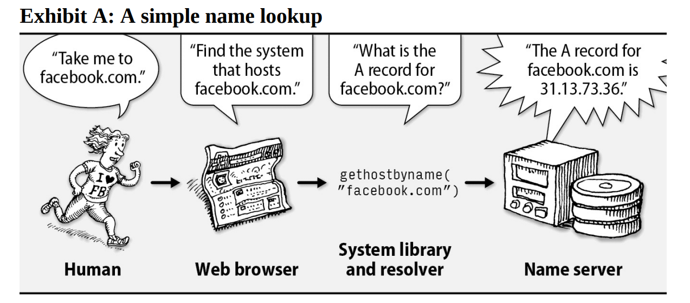
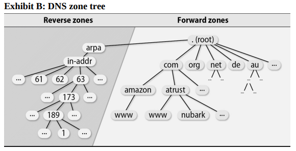
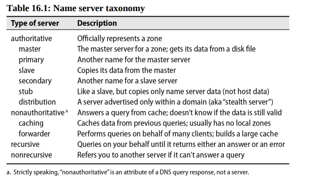

# Chapter 16: DNS - The Domain Name System


Users and user-level programs like to refer to resources by name (e.g., amazon.com), but low-level network software understands only IP addresses (e.g., 54.239.17.6). Mapping between names and addresses is the best known and arguably most important function of DNS, the Domain Name System. DNS includes other elements and features, but almost without exception they exist to support this primary objective.

## DNS Architecture

DNS is a distributed database.  Under this model, one site stores the data for computers it knows about, another site stores the data for its own set of computers, and the sites cooperate and share data when one site needs to look up the other’s data. From an administrative point of view, the DNS servers you have configured for your domain answer queries from the outside world about names in your domain; they also query other domains’ servers on behalf of your users.

### Queries and Responses

A DNS query consists of a name and a record type. The answer returned is a set of "resource records" (RRs) that are responsive to the query. *Responsive* doesn't necessarily mean *dispositive*; the answer may be a referral to another server, or a negative response indicating that the name doesn't exist.

The most common query type is the A record, which maps a name to an IP address. 



First, a human types the name of a desired site into a web browser. The browser then calls the DNS *resolver* library to look upthe corresponding address. The resolver library constructs a query for an A record and sends it to a name server, which returns the A record in its response. Finally, the browser can connect to the site using the IP address.

### DNS service providers

Years ago, every sysadmin had to set up and maintain a DNS server for their organization. Today, the landscape is different. If an organization maintains its own DNS servers, it is likely for internal use only. 

Microsoft's Active Directory system includes an integrated DNS server that meshes nicely with the other Microsoft-flavored services found in corporate environments. Howerver, AD is suitable only for internal use. It should never be exposed to the internet.

Every organization still needs an external-facing DNS server. Amazon Route 53, Cloudflare, GoDaddy, and many others offer DNS services. These services are inexpensive and reliable, and they can handle the load of even the busiest websites.

It's also possible to set up and maintain your own DNS server (internal or external). You have dozens of DNS implementations to choose from, but the most popular is BIND (Berkeley Internet Name Domain). BIND dominates the DNS server market with over 75% of the market share.

## DNS for lookus

### client resolver

**resolv.conf**
Each host on the network should be a DNS client. You configure it in the **/etc/resolv.conf** file. Here is an example:

```
search example.com api.example.com
nameserver ip-address                ; ns1
nameserver ip-address2               ; ns2
```

The `search` line list the domains to query if a hostname is not fully qualified. For example if a user issues the command `ssh abdoufermat` the resolver will try to resolve `abdoufermat.example.com` first, then `abdoufermat.api.example.com`. 

The name servers listed in `resolv.conf` must be configured to allow your host to submit queries. They must also be recursive; that is, they must answer queries to the best of their ability and not refer the client to another server.

DNS servers are contacted in order. As long as the first server continues to respond, the others are ignored. If the first server fails to respond, the client will try the second server, and so on. Each server is tried in turn, up to four times. The timeout interval increases with each attempt. The default timeout is 5 seconds, but it can be adjusted with the `timeout` option in `resolv.conf`.

**nsswitch.conf**
Both FreeBSD and Linux use the `nsswitch.conf` file to specify how hostname-to-IP address mappings should be performed and whether DNS should be tried first, last, or not at all. If no switch file is present, the default is to use DNS first, then files.

```
hosts: dns [!UNAVAIL=return] files
```

If name service is provided for you by an outside, you might be done after configuring `resolv.conf` and `nsswitch.conf`. 


## DNS Namespace


The DNS namespace is organized into a tree that contains both forward mappings and reverse mappings:

- **Forward mappings map hostnames to IP addresses (and other records),**
- **and reverse mappings map IP addresses to hostnames.**



Every complete hostname (e.g., nubark.atrust.com) is a node in the forward branch of the tree, and (in theory) every IP address is a node in the reverse branch.

To allow the same DNS system to manage both names (which have the most significant information on the right), and IP addresses (on left), the IP branch of the namespace is inverted by listing the octets of the IP address backwards. For example if host `nubark.atrust.com` has IP `63.173.189.1`, the corresponding node of the forward branch is `nubark.atrust.com.` and the node of the reverse branch is `1.189.173.53.in-addr.arpa.`. Both of these names end with a dot, just as the full pathnames of files always start with slash. That makes the **Fully Qualified Domain Names** or FQDNs.

Two types of TLDs exists: country code domains (ccTLDs) and generic domains (gTLDs). 

> **_NOTE:_** ICANN, the Internet Corporation for Assigned Names and Numbers, accredits various agencies to
> be part of its shared registry project for registering names in the gTLDs such
> as com, net, and org. To register for a ccTLD name, check the IANA (Internet Assigned Numbers
> Authority) web page [iana.org/cctld](iana.org/cctld) to find the registry in charge of a
> particular country’s registration.

### Registering a domain name

To obtain a second-level domain name (such as example.com), you must apply to a registrar for the appropriate TLD. To complete the registration forms, you must choose a name that is not already taken and identify a technical contact person, an administrative contact person, and at least two hosts that will be name servers for your domain. 

### Creating your own subdomains

If you have a registered domain name, you can create subdomains by adding records to your zone file. For example, if you have registered example.com, you can create subdomains such as sales.example.com, support.example.com, and so on.

## How DNS Works

Name servers around the world work together to answer queries. They distribute information maintained by whichever administrator is closest to the query target.

### Name servers

A name server performs several chores:

- It answers queries about your site’s hostnames and IP addresses.
- It asks about both local and remote hosts on behalf of your users.
- It caches the answers to queries so that it can answer faster next time.
- It communicates with other local name servers to keep DNS data synchronized.

Name servers deal with "zones", where a zone is essentially a domain minus its subdomains.



### Authoritative and caching-only servers

Master, slave, and caching-only servers are distinguished by two characteristics: where the data comes from, and whether the server is authoritative for the domain. Each zone typically has one master name server. The master server keeps the official copy of the zone’s data on disk. The system administrator changes the zone’s data by editing the master server’s data files.

A slave server gets its data from the master server through a “zone transfer” operation. 

A caching-only name server loads the addresses of the servers for the root domain from a startup file and accumulates the rest of its data by caching answers to the queries it resolves. A caching-only server is not authoritative for any domain (which means it doesn’t have the official copy of the data for any domain).

An authoritative answer from a name server is “guaranteed” to be accurate; a nonauthoritative answer might be out of date. However, a very high percentage of nonauthoritative answers are perfectly correct. Master and slave servers are authoritative for their own zones, but not for information they may have cached about other domains.*

### Recursive and nonrecursive servers

Name servers are either recursive or nonrecursive. If a nonrecursive server has the answer to a query cached from a previous transaction or is authoritative for the domain to which the query pertains, it provides an appropriate response. Otherwise, instead of returning a real answer, it returns a referral to the authoritative servers of another domain that are more likely to know the answer. A client of a nonrecursive server must be prepared to accept and act on referrals.

Authoritative-only servers (e.g., root servers and top-level domain servers) are all nonrecursive, but since they may process tens of thousands of queries per second we can excuse them for cutting corners. For example, a root server might return a referral to a top-level domain server, which in turn might return a referral to a second-level domain server, which might return a referral to a subdomain server, which might return the answer.

A recursive server returns only real answers and error messages. It follows referrals itself, relieving clients of this responsibility. In other respects, the basic procedure for resolving a query is essentially the same.

### Resource records

Each site maintains one or more pieces of the distributed database that makes up the world-wide DNS system. Each RR contains a name, a class, a type, and a value. The name is the domain name to which the RR pertains. The class is usually IN (Internet). The type specifies the kind of data in the value field. The value is the data itself.

For example:

In the forward file called `atrust.com`:

```text
nubark      IN      A     63.173.189.1
            IN      MX    10 mailserver.nubark.atrust.com.
```

In the reverse file called `63.173.189.rev`:

```text
1       IN      PTR   nubark.atrust.com.
```

