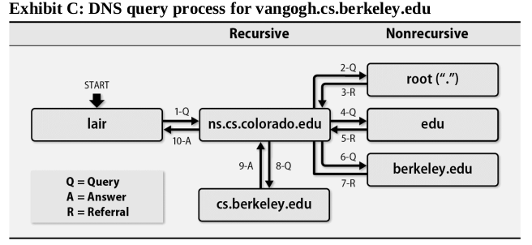
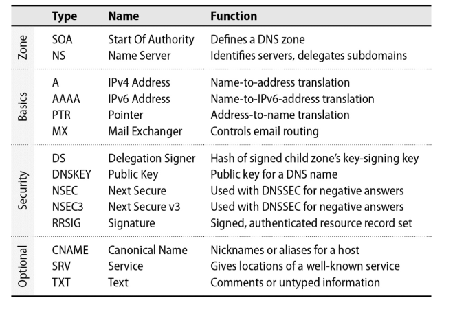

# Chapter 16: DNS - The Domain Name System


Users and user-level programs like to refer to resources by name (e.g., amazon.com), but low-level network software understands only IP addresses (e.g., 54.239.17.6). Mapping between names and addresses is the best known and arguably most important function of DNS, the Domain Name System. DNS includes other elements and features, but almost without exception they exist to support this primary objective.

## DNS Architecture

DNS is a distributed database.  Under this model, one site stores the data for computers it knows about, another site stores the data for its own set of computers, and the sites cooperate and share data when one site needs to look up the other’s data. From an administrative point of view, the DNS servers you have configured for your domain answer queries from the outside world about names in your domain; they also query other domains’ servers on behalf of your users.

### Queries and Responses

A DNS query consists of a name and a record type. The answer returned is a set of "resource records" (RRs) that are responsive to the query. *Responsive* doesn't necessarily mean *dispositive*; the answer may be a referral to another server, or a negative response indicating that the name doesn't exist.

The most common query type is the A record, which maps a name to an IP address. 


First, a human types the name of a desired site into a web browser. The browser then calls the DNS *resolver* library to look upthe corresponding address. The resolver library constructs a query for an A record and sends it to a name server, which returns the A record in its response. Finally, the browser can connect to the site using the IP address.

### DNS service providers

Years ago, every sysadmin had to set up and maintain a DNS server for their organization. Today, the landscape is different. If an organization maintains its own DNS servers, it is likely for internal use only. 

Microsoft's Active Directory system includes an integrated DNS server that meshes nicely with the other Microsoft-flavored services found in corporate environments. Howerver, AD is suitable only for internal use. It should never be exposed to the internet.

Every organization still needs an external-facing DNS server. Amazon Route 53, Cloudflare, GoDaddy, and many others offer DNS services. These services are inexpensive and reliable, and they can handle the load of even the busiest websites.

It's also possible to set up and maintain your own DNS server (internal or external). You have dozens of DNS implementations to choose from, but the most popular is BIND (Berkeley Internet Name Domain). BIND dominates the DNS server market with over 75% of the market share.

## DNS for lookus

### client resolver

**resolv.conf**
Each host on the network should be a DNS client. You configure it in the **/etc/resolv.conf** file. Here is an example:

```
search example.com api.example.com
nameserver ip-address                ; ns1
nameserver ip-address2               ; ns2
```

The `search` line list the domains to query if a hostname is not fully qualified. For example if a user issues the command `ssh abdoufermat` the resolver will try to resolve `abdoufermat.example.com` first, then `abdoufermat.api.example.com`. 

The name servers listed in `resolv.conf` must be configured to allow your host to submit queries. They must also be recursive; that is, they must answer queries to the best of their ability and not refer the client to another server.

DNS servers are contacted in order. As long as the first server continues to respond, the others are ignored. If the first server fails to respond, the client will try the second server, and so on. Each server is tried in turn, up to four times. The timeout interval increases with each attempt. The default timeout is 5 seconds, but it can be adjusted with the `timeout` option in `resolv.conf`.

**nsswitch.conf**
Both FreeBSD and Linux use the `nsswitch.conf` file to specify how hostname-to-IP address mappings should be performed and whether DNS should be tried first, last, or not at all. If no switch file is present, the default is to use DNS first, then files.

```
hosts: dns [!UNAVAIL=return] files
```

If name service is provided for you by an outside, you might be done after configuring `resolv.conf` and `nsswitch.conf`. 


## DNS Namespace


The DNS namespace is organized into a tree that contains both forward mappings and reverse mappings:

- **Forward mappings map hostnames to IP addresses (and other records),**
- **and reverse mappings map IP addresses to hostnames.**


Every complete hostname (e.g., nubark.atrust.com) is a node in the forward branch of the tree, and (in theory) every IP address is a node in the reverse branch.

To allow the same DNS system to manage both names (which have the most significant information on the right), and IP addresses (on left), the IP branch of the namespace is inverted by listing the octets of the IP address backwards. For example if host `nubark.atrust.com` has IP `63.173.189.1`, the corresponding node of the forward branch is `nubark.atrust.com.` and the node of the reverse branch is `1.189.173.53.in-addr.arpa.`. Both of these names end with a dot, just as the full pathnames of files always start with slash. That makes the **Fully Qualified Domain Names** or FQDNs.

Two types of TLDs exists: country code domains (ccTLDs) and generic domains (gTLDs). 

<div style="font-family: Arial, sans-serif; background-color: #98F5F9; border: 1px solid #ddd; border-radius: 5px; padding: 15px; margin: 20px 0; box-shadow: 0 2px 4px rgba(0,0,0,0.1);">
    <p style="color: #555;">
        <strong>ICANN</strong> (Internet Corporation for Assigned Names and Numbers) accredits various agencies to be part of its shared registry project for registering names in the <strong>gTLDs</strong> (generic Top-Level Domains) such as <code>.com</code>, <code>.net</code>, and <code>.org</code>.
    </p>
    <p style="color: #555;">
        To register for a <strong>ccTLD</strong> (country code Top-Level Domain) name, check the <strong>IANA</strong> (Internet Assigned Numbers Authority) web page:
    </p>
    <p style="text-align: center;">
        <a href="https://iana.org/cctld" style="color: #1a73e8; text-decoration: none; font-weight: bold;">iana.org/cctld</a>
    </p>
    <p style="color: #555;">
        This page will help you find the registry in charge of a particular country’s domain name registration.
    </p>
</div>


### Registering a domain name

To obtain a second-level domain name (such as example.com), you must apply to a registrar for the appropriate TLD. To complete the registration forms, you must choose a name that is not already taken and identify a technical contact person, an administrative contact person, and at least two hosts that will be name servers for your domain. 

### Creating your own subdomains

If you have a registered domain name, you can create subdomains by adding records to your zone file. For example, if you have registered example.com, you can create subdomains such as sales.example.com, support.example.com, and so on.

## How DNS Works

Name servers around the world work together to answer queries. They distribute information maintained by whichever administrator is closest to the query target.

### Name servers

A name server performs several chores:

- It answers queries about your site’s hostnames and IP addresses.
- It asks about both local and remote hosts on behalf of your users.
- It caches the answers to queries so that it can answer faster next time.
- It communicates with other local name servers to keep DNS data synchronized.

Name servers deal with "zones", where a zone is essentially a domain minus its subdomains.


### Authoritative and caching-only servers

Master, slave, and caching-only servers are distinguished by two characteristics: where the data comes from, and whether the server is authoritative for the domain. Each zone typically has one master name server. The master server keeps the official copy of the zone’s data on disk. The system administrator changes the zone’s data by editing the master server’s data files.

A slave server gets its data from the master server through a “zone transfer” operation. 

A caching-only name server loads the addresses of the servers for the root domain from a startup file and accumulates the rest of its data by caching answers to the queries it resolves. A caching-only server is not authoritative for any domain (which means it doesn’t have the official copy of the data for any domain).

An authoritative answer from a name server is “guaranteed” to be accurate; a nonauthoritative answer might be out of date. However, a very high percentage of nonauthoritative answers are perfectly correct. Master and slave servers are authoritative for their own zones, but not for information they may have cached about other domains.*

### Recursive and nonrecursive servers

Name servers are either recursive or nonrecursive. If a nonrecursive server has the answer to a query cached from a previous transaction or is authoritative for the domain to which the query pertains, it provides an appropriate response. Otherwise, instead of returning a real answer, it returns a referral to the authoritative servers of another domain that are more likely to know the answer. A client of a nonrecursive server must be prepared to accept and act on referrals.

Authoritative-only servers (e.g., root servers and top-level domain servers) are all nonrecursive, but since they may process tens of thousands of queries per second we can excuse them for cutting corners. For example, a root server might return a referral to a top-level domain server, which in turn might return a referral to a second-level domain server, which might return a referral to a subdomain server, which might return the answer.

A recursive server returns only real answers and error messages. It follows referrals itself, relieving clients of this responsibility. In other respects, the basic procedure for resolving a query is essentially the same.

### Resource records

Each site maintains one or more pieces of the distributed database that makes up the world-wide DNS system. Each RR contains a name, a class, a type, and a value. The name is the domain name to which the RR pertains. The class is usually IN (Internet). The type specifies the kind of data in the value field. The value is the data itself.

For example:

In the forward file called `atrust.com`:

```text
nubark      IN      A     63.173.189.1
            IN      MX    10 mailserver.nubark.atrust.com.
```

In the reverse file called `63.173.189.rev`:

```text
1       IN      PTR   nubark.atrust.com.
```

<div style="font-family: Arial, sans-serif; background-color: #98F5F9; border: 1px solid #ddd; border-radius: 5px; padding: 15px; margin: 20px 0; box-shadow: 0 2px 4px rgba(0,0,0,0.1);">
Resource records are the <span><a href="https://en.wikipedia.org/wiki/Lingua_franca" style="color: #1a73e8; text-decoration: none; font-weight: bold;">lingua franca</a></span> of DNS and are independent of the configuration files that control the operation of any given DNS server implementation. They are also the pieces of data that flow around the DNS system and become cached at various locations.
</div>

### Delegation

All name servers read the identities of the root servers from a local config file or have them built into the code. The root servers know the name servers for com, net, edu, fi, de, and other top-level domains. Farther down the chain, edu knows about colorado.edu, berkeley.edu, and so on. Each domain can delegate authority for its subdomains to other name servers.

Example:



We want to lookup the address for the machine *vangogh.cs.berkeley.edu* from the machine *lair.cs.colorado.edu*. The resolver on *lair* sends a query to the local name server (*ns.cs.colorado.edu*). The local name server sends a query to the root server for the *edu* domain. The root server returns a referral to the *edu* name server. The *edu* name server returns a referral to the *berkeley.edu* name server. The *berkeley.edu* name server returns a referral to the *cs.berkeley.edu* name server. The *cs.berkeley.edu* name server returns the address for *vangogh.cs.berkeley.edu*. The local name server caches the answer and returns it to the resolver on *lair*.

The local name server is a recursive server. It follows referrals until it gets an answer. 

### Caching and efficiency

Caching increases the efficiency of lookups: a cached answer is almost free and is usually correct because hostname-to-address mappings change infrequently. An answer is saved for a period of time called the “time to live” (TTL), which is specified by the owner of the data record in question.

The longer the TTL, the less network traffic is generated by DNS lookups. However, the longer the TTL, the longer it takes for changes to propagate through the DNS system.

If you have a specific service that is load-balanced across multiple servers, you can set a low TTL for the service’s DNS record. This way, if one of the servers goes down, you can quickly update the DNS record to point to the remaining servers.

DNS servers can also cache negative responses. If a server receives a query for a nonexistent domain, it caches the negative response for a period of time. This prevents the server from repeatedly querying the authoritative server for the nonexistent domain.

### Multiple answers and round-robin DNS load balancing

A DNS server can return multiple answers to a query. For example, if a domain has multiple mail servers, the DNS server can return all of their IP addresses. The client can then try each address in turn until it finds a server that is available.

Round-robin DNS load balancing is a simple way to distribute the load across multiple servers. For example, if a domain has multiple web servers, the DNS server can return all of their IP addresses in a different order each time it receives a query. The client can then try each address in turn, distributing the load across the servers.

Large sites uses load-balancing software (such as HAProxy)

### Debugging tools

Five command-line tools that query the DNS database are distributed with BIND: `dig`, `nslookup`, `host`, `drill`, and `delv`. 

By default, `dig` and `drill` query the DNS server listed in `/etc/resolv.conf`. 

Example:

```bash
$ dig nubark.atrust.com
```

The `+trace` option tells `dig` to follow referrals from the root servers down to the authoritative servers.
    
```bash
$ dig +trace nubark.atrust.com
```

## The DNS Database

A zone’s DNS database is a set of text files maintained by the system administrator on the zone’s master name server. They contain two types of entries: parser commands and resource records. But only resource records are really important.

### Parser commands

Parser commands are directives to the DNS server software. They are not part of the DNS database itself. They are used to control the behavior of the server and to include other files.

Three parser commands ($ORIGIN, $TTL, and $INCLUDE) are standard for all DNS implementations, and a fourth ($GENERATE) is specific to BIND.

- `$ORIGIN` sets the default domain name for the zone. If a name in a resource record is not fully qualified, the server appends the origin to it. The origin is set to the zone’s name by default.
- `$TTL` sets the default time-to-live for the zone. If a TTL is not specified in a resource record, the server uses the default TTL. The default TTL is 86400 seconds (24 hours).
- `$INCLUDE` includes another file in the zone file. This is useful for breaking up a large zone file into smaller, more manageable pieces.

### Resource records

Resource records are the heart of the DNS database. They contain the data that the DNS server uses to answer queries. Each resource record has five fields: name, class, type, TTL, and data.

- The name is the domain name to which the resource record pertains.
- The class is usually IN (Internet).
- The type specifies the kind of data in the data field. The most common types are A (address), MX (mail exchange), CNAME (canonical name), and NS (name server).
- The TTL is the time-to-live for the resource record. It specifies how long the record can be cached by other DNS servers. The default TTL is set by the $TTL directive in the zone file.
- The data is the actual data for the resource record. The format of the data field depends on the type of the resource record.



### The SOA record

An SOA (Start of Authority) record marks the beginning of a zone, a group of resource records located at the same place within the DNS namespace. The data for a DNS domain usually includes at least two zones: one for translating hostnames to IP addresses, called the forward zone, and others that map IP addresses back to hostnames, called reverse zones.

Each zone has exactly one SOA record. The SOA record includes the name of the zone, the primary name server for the zone, a technical contact, and various timeout values. Comments are introduced by a semicolon. Here’s an example:

```text
; SOA record for the zone atrust.com
atrust.com.  IN  SOA  ns1.atrust.com.  hostmaster.atrust.com. (
    2022010101 ; serial number
    86400      ; refresh
    7200       ; retry
    3600000    ; expire
    172800     ; minimum
)
```

The SOA record has five fields:

- The name of the zone. The name of the zone is the same as the name of the SOA record. This value can be changed with the $ORIGIN directive.
- The class of the zone. The class of the zone is usually IN (Internet).
- The type of the SOA record. The type of the SOA record is always SOA.
- The primary name server for the zone. The primary name server is the server that has the official copy of the zone data.
- The technical contact for the zone. The technical contact is the person responsible for maintaining the zone data.

The parentheses enclose the SOA record’s data fields. The data fields are:

**The serial number:** The serial number is used by slave servers to determine when to get fresh data. It can be any 32-bit integer and should be incremented every time the data file for the zone is changed
If by accident you set a really large value on the master and that value is transferred to the slaves, then correcting the value on the master will not help. The slaves request new data only if the master’s serial number is larger than theirs.

You can fix in two ways:

- Arithmetic Fix: Add a large value (2^31) to the inflated serial number, let slaves update, then set the desired serial number. This approach uses sequence space properties (detailed in "DNS and BIND" book and RFC1982).
- Manual Fix: Change the serial number on the master, stop the slave servers, delete their backup data files, restart the slaves to force them to reload from the master. This method is complex if slaves are geographically distributed and managed by different sysadmins.

The next four fields are timeouts in seconds, that control how long data can be cached at various points in the world-wide DNS database.

The minimum field is the minimum TTL for the zone. It specifies how long a negative response can be cached by other DNS servers. The default minimum TTL is 86400 seconds (24 hours).

The expire field specifies how long a slave server can go without contacting the master server before it stops answering queries for the zone. The default expire value is 3600000 seconds (1000 hours).

The retry field specifies how long a slave server should wait before retrying a failed zone transfer. The default retry value is 7200 seconds (2 hours).

The refresh field specifies how often a slave server should check with the master server for updates to the zone. The default refresh value is 86400 seconds (24 hours).

### The NS record

