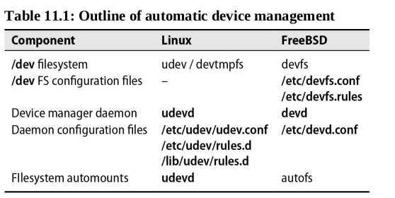
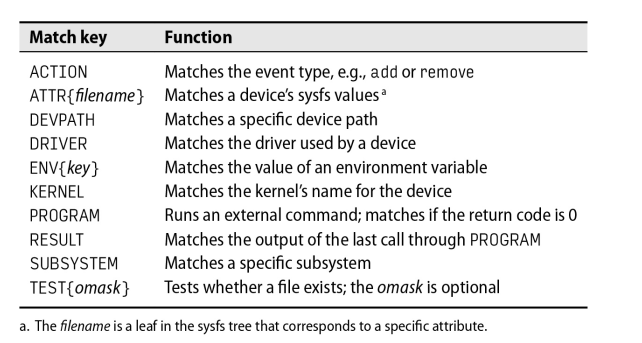

# Chapter 11: Drivers and the Kernel


The kernel is the central government of a UNIX or Linux system. It’s responsible for enforcing rules, sharing resources, and providing the core services that user processes rely on.

The kernel hides the details of the system's hardware underneath an abstract, high-level interface. It's akin to an API for application programmers: a well-defined interface that provides useful facilities for interacting with the system. This interface provides five basic features:

- Management and abstraction of hardware devices
- Processes and threads (and ways to communicate among them)
- Management of memory (virtual memory and memory-space protection)
- I/O facilities (filesystems, network interfaces, serial interfaces, etc.)
- Housekeeping functions (startup, shutdown, timers, multitasking, etc.)

Only device drivers are aware of the specific capabilities and communication protocols of the system’s hardware. User programs and the rest of the kernel are largely independent of that knowledge.

For example, a filesystem on disk is very different from a network filesystem, but the kernel's VFS layer makes them look the same to user processes and to other parts of the kernel.

---

## Kernel version numbering

### Linux kernel versions

You can check with `uname -r` to see what kernel a given system is running.
Linux kernels are named according to the rules of so-called semantic versioning, that is, they include three components: a major version, a minor version, and a patch level. At present, there is no predictable relationship between a version number and its intended status as a stable or development kernel; kernels are blessed as stable when the developers decide that they’re stable.

## Devices and their drivers

A device driver is an abstraction layer that manages the system’s interaction with a particular type of hardware so that the restof the kernel doesn't need to know its specifics. The driver translates between the hardware commands understood by the device and a stylized programming interface defined(and used by the kernel).

### Device files and device numbers

In most cases, device drivers are part of the kernel; they are not user processes. However, a driver can be accessed both from within the kernel and from user space, usually through "device files" that live in **/dev** directory.

Most non-network devices have one or more corresponding files in /dev. Complex servers may support hundreds of devices. By virtue of being device files, the files in /dev each have a major and minor device number associated with them. The kernel uses these numbers to map device-file references to the corresponding driver.

The major device number identifies the driver with which the file is associated (in other words, the type of device). The minor device number usually identifies which particular instance of a given device type is to be addressed. The minor device number is sometimes called the unit number.

```bash
$ ls -l /dev/sda
brw-rw---- 1 root disk 8, 0 2024-04-05 14:50 /dev/sda
```

This example shows the first SCSI/SATA/SAS disk on a Linux system. It has a major device number of 8 and a minor device number of 0. The major device number 8 is associated with the SCSI disk driver, and the minor device number 0 is the first disk on the system.

There are actually two types of device files: block and character. A block device is read or written one block (a group of bytes, usually a multiple of 512) at a time; a character device can be read or written one byte at a time. The character "b" or "c" in the first column of the ls -l output indicates whether a device file is a block or character device.

It is sometimes convenient to implement an abstraction as a device driver even it controls no actual device. Such phantom devices are called pseudo-devices. For example, a user who logs in over the network is assigned a pseudo-TTY (PTY) that looks, feels, ad smells like a serial port from the perspective of higher-level software. Some pseudo-devices are used for debugging, such as `/dev/null`, which discards all data written to it, and `/dev/zero`, which returns an infinite number of zero bytes when read, or `/dev/urandom`, which returns an infinite number of random bytes when read.

When a program performs an operation on a device file, the kernel intercepts the reference, looks up the appropriate function name in a table, and transfers control to the appropriate part of the driver.

### Manual creation of device files

The `mknod` command can be used to create device files manually. The syntax is:

```bash
$ mknod /dev/mydevice type major minor
```

where type is either `b` for block or `c` for character, and major and minor are the major and minor device numbers, respectively.

### Modern device file management

The `udevd` daemon is responsible for managing device files in modern Linux systems. It creates device files dynamically as devices are discovered or added to the system. The `udev` daemon reads its configuration from the `/etc/udev` directory and from the `/lib/udev` directory. The configuration files in `/etc/udev` override those in `/lib/udev`.



### Linux device management

**Sysfs:** a window into the souls of devices

Sysfs was added to the Linux kernel at version 2.6. It is a virtual, in-memory filesystem implemented by the kernel to provide detailed and well-organized information about the system’s available devices, their configurations, and their state. Sysfs device information is accessible both from within the kernel and from user space.

Sysfs is mounted at `/sys` and is organized as a hierarchy of directories and files. Each directory represents a device or a device class, and each file contains a piece of information about the device or class. The information in sysfs is read-only and is updated by the kernel as devices are discovered, added, or removed.

- Subdirectories of `/sys` :

| Directory     | Description                                                        |
| ------------- | ------------------------------------------------------------------ |
| /sys/block    | Information about block devices such as hard disks                 |
| /sys/bus      | Buses known to the kernel: PCI-E, SCSI, USB, etc.                  |
| /sys/class    | A tree organized by functional types of devices                    |
| /sys/dev      | Device information split between character and block devices       |
| /sys/devices  | An ancestrally correct representation of all discovered devices    |
| /sys/firmware | Interfaces to platform-specific subsystems such as ACPI            |
| /sys/fs       | A directory for some, but not all, filesystems known to the kernel |
| /sys/kernel   | Kernel internals such as cache and virtual memory status           |
| /sys/module   | Dynamic modules loaded by the kernel                               |
| /sys/power    | A few details about the system’s power state                       |


**udevadm:** the udev administration tool

The `udevadm` command queries device information, triggers events, controls the **udevd** daemon, and monitors udev and kernel events. 

`udevadm` expects one of six commands as its first argument:

- `info` : Display information about a device
For example, `udevadm info -a -p /sys/class/net/eth0` displays information about the network interface eth0.

- `trigger` : Trigger the kernel to process a device event
For example, `udevadm trigger --subsystem-match=block` triggers the kernel to process block device events.

- `settle` : Wait for all pending udev events to be processed
For example, `udevadm settle` waits for all pending udev events to be processed.

- `control` : starts and stops the udev daemon or forces it to reload its rules files
For example, `udevadm control --reload` forces the udev daemon to reload its rules files.

- `monitor` : Monitor udev events as they occur
For example, `udevadm monitor` displays udev events as they occur.

- `test` : Test a single device or a single event
For example, `udevadm test /sys/class/net/eth0` tests the network interface eth0.

All paths in udevadm output (such as `/devices/pci0000:00/…`) are relative to `/sys`, even though they may appear to be absolute pathnames.

udevd match keys:



The assignment clauses specify actions udevd should take to handle any matching events. Their format is similar to that for match clauses.

THe most important assignment key is `NAME`, which indicates how `udevd` should name a new device.

Here's an example configuration for a USB flash drive. Suppose we want to make the drive's device name persist across insertions and we want the drive to be mouted and unmounted automatically.
    
```bash
$ lsusb
Bus 002 Device 001: ID 1d6b:0003 Linux Foundation 3.0 root hub
Bus 001 Device 003: ID 0408:a061 Quanta Computer, Inc. HD User Facing
Bus 001 Device 004: ID 8087:0026 Intel Corp. AX201 Bluetooth
Bus 001 Device 007: ID 18f8:0f97 [Maxxter] Optical Gaming Mouse [Xtrem]
Bus 001 Device 001: ID 1d6b:0002 Linux Foundation 2.0 root hub
Bus 004 Device 001: ID 1d6b:0003 Linux Foundation 3.0 root hub
Bus 003 Device 001: ID 1d6b:0002 Linux Foundation 2.0 root hub
```

## Linux Kernel configuration

3 methods to configure a Linux kernel:

- Modifying tunalble(dynamic) kernel configuration parameters
- Building a kernel from scratch (by compiling the kernel source code)
- Loading new drivers and modules into a running kernel

### Tunable Linux kernel parameters

The Linux kernel has many tunable parameters that can be set at runtime. These parameters are stored in the `/proc/sys` directory. The `sysctl` command is used to read and modify these parameters.

For example, to display the value of the kernel parameter `vm.swappiness`, use the following command:

```bash
$ sysctl vm.swappiness # (same as /proc/sys/vm/swappiness)
vm.swappiness = 60
```

### Building a kernel from scratch

The Linux kernel is a monolithic kernel, which means that it is a single, large program that contains all the essential components of the operating system. The kernel is built from source code, which is available from the kernel.org website.

The kernel source code is organized into directories, each of which contains the source code for a different part of the kernel. The source code is written in the C programming language and is compiled into a binary executable that can be loaded into memory and executed by the computer.

**Configuring kernel options:**

The kernel source code contains a file called `.config` at the root of the source tree. This file contains the configuration options that are used to build the kernel. The configuration options are stored in a format that is similar to the output of the `make menuconfig` command.

You can use the decoding guide in `kernel_src_dir/Documentation/Configure.help` to find out what the various options mean.

It's usually inadvisable to edit the `.config` file directly. Instead, use one of the following methods to configure the kernel:

- `make menuconfig` : A text-based menu-driven configuration tool
- `make xconfig` : A graphical configuration tool if you are running KDE
- `make gconfig` : A graphical configuration tool if you are running GNOME
- `make oldconfig` : Update an existing `.config` file with new options

**Building the kernel binary:**

Here's an outline of the entire process to get a finished kernel:

1. Change directory to the kernel source directory (e.g., `cd /usr/src/linux-5.10.25`)
2. Run `make xconfig`, `make gconfig`, or `make menuconfig` to configure the kernel
3. Run `make clean`. (optional)
4. Run `make`
5. Run `make modules_install`
6. Run `make install`

### Adding a linux device driver

On Linux systems, device drivers are typically distributed in one of three forms:

- A patch against a specific kernel version
- A loadable kernel module
- An installation script or package that installs the driver

## Loadable Kernel Modules (LKM)

A loadable kernel module (LKM) is a piece of code that can be loaded into the Linux kernel at runtime. LKMs are used to add new functionality to the kernel without having to recompile the entire kernel. LKMs are typically used to add support for new hardware devices or to add new features to the kernel.

Under Linux, you can inspect the currently loaded kernel modules with the `lsmod` command:

```bash
$ lsmod
Module                  Size  Used by
nls_utf8               16384  1
isofs                  49152  1
uas                    24576  0
usb_storage            77824  1 uas
```

As an example of manually loading a kernel module, here’s how we would insert a module that implements sound output to usb devices:

```bash
$ sudo modprobe snd-usb-audio
```

`modprobe` is a semi-automatic wrapper around a more primitive command, `insmod`. `modprobe` understands dependencies, options, and installation and removal procedures.

## Booting

Here's a brief overview of the boot process on a Linux system:

1. The BIOS or UEFI firmware initializes the hardware and loads the boot loader from the boot device (usually a hard disk).
2. The boot loader loads the kernel image into memory and starts the kernel.
3. The kernel initializes the hardware, mounts the root filesystem, and starts the init process.
4. The init process starts other system processes and services.
5. The system is now fully booted and ready for use.

The boot loader is responsible for loading the kernel image into memory and starting the kernel. The most common boot loaders on Linux systems are GRUB and LILO.

## Booting alternate kernels in the cloud

Cloud instances boot differently from traditional hardware. Most cloud providers sidestep GRUB and use either a modified open source boot loader or some kind of scheme that avoids the use of a boot loader altogether. On AWS, the base AMI(amazon machine image) uses a boot loader called PV-GRUB, which is a patched version of GRUB that lets you specify the kernel in the **menu.lst** file.

## Kernel errors

Linux has four varieties of kernel failure: soft lockups, hard lockups, kernel panics, and oopses.

- **Soft lockups** are caused by a kernel process that has been running for too long without yielding the CPU to other processes. Soft lockups are not fatal and can be recovered from. During a soft lockup, the kernel is the only thing running, but it is still servicing interrupts such as those from network interfaces and keyboards.
- **Hard lockups** is the same as a soft lockup, but with the additional complication that most processor interrupts go unserviced. 

A soft or hard lockup is almost always the result of a hardware failure, the most common culprit being bad memory.

- **oops**: The Linux “oops” system is a generalization of the traditional UNIX “panic after any anomaly” approach to kernel integrity. 
- **Panics**: A kernel panic is a fatal error that occurs when the kernel detects an unrecoverable error. When a kernel panic occurs, the kernel halts the system and displays a message that describes the error. The system must be rebooted to recover from a kernel panic.

