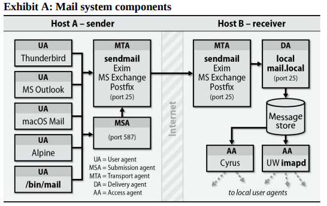
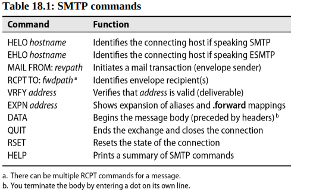
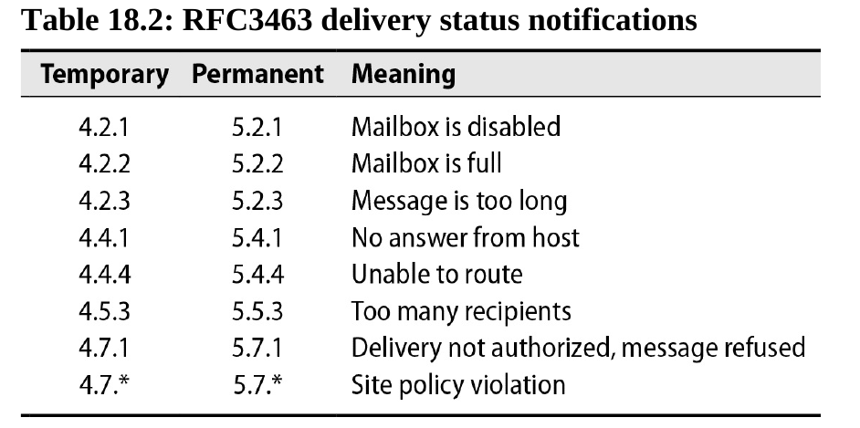
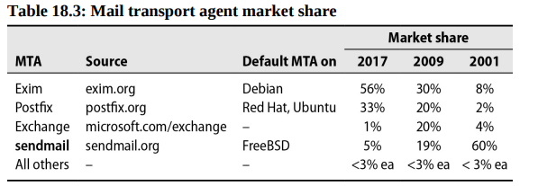
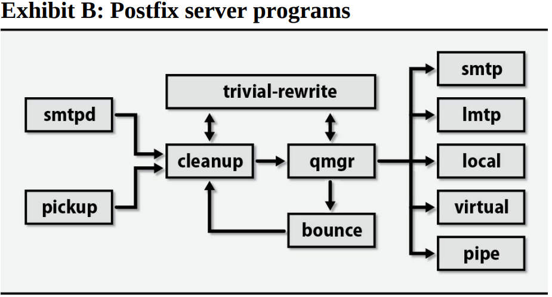

# Chapter 18: Electronic Mail


## Mail system architecture

A mail system consists of several distinct components:

- **User Agents (UA)**: The user agent is the interface between the user and the mail system. It allows the user to read, compose, and send mails.
- **Mail submission agent (MSA)**: Accepts outgoing mail from UAs, grooms it, and submits it to the mail transfer agent (MTA).
- **Mail transfer agent (MTA)**: The MTA routes messages among mail servers.
- **Delivery agent (DA)**: The delivery agent delivers incoming mail to the recipient's mailbox.
- **Access agent (AA)**: The optional access agent connects the user agent to the mailbox.



### Mail User Agents 

A mail user agent (MUA) is a program that allows users to read, compose, and send email messages. Email messages originally consisted only of text, but a standard known as Multipurpose Internet Mail Extensions (MIME) now encodes text formats and attachments (inluding viruses) into email.

`/bin/mail` was the original user agent, and it remains the “good ol’ standby” for reading text email messages at a shell prompt. 

One of the elegant features illustrated in image above is that a user agent doesn’t necessarily need to be running on the same system—or even on the same platform—as the rest of your mail system. Users can reach their email from a Windows laptop or smartphone through access agent protocols such as IMAP and POP.

### Submission Agent

MSAs, a late addition to the email pantheon, were invented to offload some of the computational tasks of MTAs. MSAs make it easy for mail hub servers to distinguish incoming from outbound email (when making decisions about allowing relaying, for example) and give UAs the opportunity to uniform and simple conf for outbound mail.

An MSA sits between the user agent and the transport agent and takes over several functions that were formerly a part of the MTA's job. An MSA implements secure (encrypted and authenticated) communication with user agents and often does minor header rewriting and cleanup on incoming messages. In many cases, the MSA is really just the MTA listening on a different port (port 597 ranther than 25 of MTAs) with a different configuration applied.

Since your MSA uses your MTA to relay messages, the MSA and MTA must use SMTP-AUTH to authenticate each other. Otherwise, you create a so-called open relay that spammers can exploit and that other sites will blacklist you for.

### Transport Agents

A transport agent must accept mail from a user agent or submission agent, understand the recipient's addresses, and somehow get the mail to the correct host for delivery.

An MTA’s list of chores, as both a mail sender and receiver, includes

- Receiving email messages from remote mail servers
- Understanding the recipients’ addresses
- Rewriting addresses to a form understood by the delivery agent
- Forwarding the message to the next responsible mail server or passing it to a local delivery agent to be saved to a user’s mailbox

### Local Delivery Agents

A delivery agent, sometimes called a local delivery agent (LDA), accepts mail from a transport agent and delivers it to the recipient’s mailbox.

### Message stores

A message store is the final resting place of an email message once it has completed its journey across the Internet and been delivered to recipients.

Mail has traditionally been stored in either `mbox` format or `Maildir` format. The former stores all mail in a single file, typically /var/mail/username, with individual messages separated by a special From line. Maildir format stores each message in a separate file. A file for each message is more convenient but creates directories with many, many small files; some filesystems may not be amused.

### Access Agents

Two protocols access message stores and download email messages to a local device (workstation, laptop, smartphone, etc.): Internet Message Access Protocol version 4 (IMAP4) and Post Office Protocol version 3 (POP3).

IMAP is significantly better than POP. It delivers your mail one message at a time rather than all at once.

## Anatomy of a mail message

A mail message has three distinct parts:

- Envelope
- Headers
- Body of the message

The envelope determines where the message will be delivered or, if the message can’t be delivered, to whom it should be returned. The envelope is invisible to users and is not part of the message itself; it’s used internally by the MTA.

Headers are a collection of property/value pairs (RFC 5322 updated by RFC 6854) that records all kinds of information about the message, such as the date and time it was sent, the transport agents through which it passed on its journey, and who it is to and from.

The body of the message is the content to be sent. It usually consists of plain text, although that text often represents a mail-safe encoding for various types of binary or rich-text content.

Example of a mail message:


To decode this beast, start reading the Received lines, but start from the bottom (sender side).
This message went from David Schweikert’s home machine in the schweikert.ch domain to his mail server (mail.schweikert.ch), where it was scanned for viruses. It was then forwarded to the recipient evi@atrust.com. However, the receiving host mail-relay.atrust.com sent it on to sailingevi@gmail.com, where it entered Evi’s mailbox.

Midway through the headers, you see an SPF (Sender Policy Framework) validation failure, an indication that the message has been flagged as spam. This failure happened because Google checked the IP address of mail-relay.atrust.com and compared it with the SPF record at schweikert.ch. The two didn’t match. This is an inherent weakness of relying on SPF to identify forgeries, they don’t work for mail that has been relayed.

## SMTP Protocol

The Simple Mail Transport Protocol (SMTP) and its extended version, ESMTP, have been standardized in the RFCs 5321 and 7504. SMTP and ESMTP are used for most message hand-offs among the various components of a mail system:

- UA-to-MSA or -MTA: message is injected into the mail system
- MSA-to-MTA: delivery journey begins
- MTA- or MSA-to-antivirus or -antispam: message is scanned
- MTA-to-MTA: message is relayed to the recipient’s mail server
- MTA-to-DA: message is delivered to the recipient’s mailbox

As name suggests, SMTP is a simple protocol. An MTA connects to your mail server and says, “Here’s a message; please deliver it to user@domain.com.” Your MTA then says, “OK, I’ll do that”.



### EHLO

ESMTP speackers use `EHLO` instead of `HELO` to announce themselves. The server responds with a list of ESMTP extensions it supports. If the peers return an error to the `EHLO` command, the client falls back to using `HELO`.

A typical SMTP conversation to deliver an email message goes as follows: HELO or EHLO, MAIL FROM, RCPT TO, DATA, and QUIT.

### SMTP error codes

Also specified in the RFCs that define SMTP are a set of temporary and permanent error codes. These were originally three-digit codes (e.g., 550). The first digit indicates the general category of the error: 2xx means success, 4xx means temporary failure, and 5xx means permanent failure.

The 3-digit error codes did not scale well, so we defined an expanded error code format known as a Delivery Status Notification (DSN). DNSs have the format `X.Y.Z`, instead of `XYZ`, and each of the individual can be multidiigit number. The X must still be 2, 4, or 5, the Y digit specifies a topic, and the Z digit provides more detail. The new system uses the second number to distinguish host errors from mailbox errors.



### SMTP Authentication

The protocol supports several different authentication mechanisms. The exchange is as follows:

1. The client says EHLO, announcing that it speaks ESMTP.
2. The server responds and advertises its authentication mechanisms.
3. The client says AUTH and names a specific mechanism that it wants to use, optionally including its authentication data.
4. The server accepts the data sent with AUTH or starts a challenge and response sequence with the client.
5. The server either accepts or denies the authentication attempt.

## SPAM AND MALWARE

Spam is the jargon word for junk mail, also known as unsolicited commercial email or UCE. It is one of the most universally hated aspects of the Internet. Once upon a time, system administrators spent many hours each week hand-tuning block lists and adjusting decision weights in home-grown spam filtering tools. Unfortunately, spammers have become so crafty and commercialized that these measures are no longer an effective use of system administrators’ time.

### Forgeries

Forging email is trivial; many user agents let you fill in the sender’s address with anything you want. The practice of targeting users with forged email is commonly called “phishing.” Phishing is a form of social engineering in which the attacker tries to trick the recipient into revealing sensitive information, such as passwords or credit card numbers.

### SPF and Sender ID

Sender Policy Framework (SPF) and Sender ID are two methods for validating the authenticity of the sender’s address in an email message. SPF is a DNS-based system that allows domain owners to publish a list of IP addresses that are authorized to send email on behalf of their domain. Sender ID is a Microsoft-developed system that is quite similar to SPF.

### DKIM

DomainKeys Identified Mail (DKIM) is a system that allows a domain owner to sign email messages with a private key. The recipient can then verify the signature by looking up the public key in the domain’s DNS records. DKIM is a more secure system than SPF or Sender ID because it cryptographically signs the message.

## Message privacy and encryption

By default, all mail is sent unencrypted. Educate your users that they should never send sensitive data through email unless they make use of an external encryption package or your organization has provided a centralized encryption solution for email. Even with encryption, electronic communication can never be guaranteed to be 100% secure.

Historically, the most common external encryption packages have been Pretty Good Privacy (PGP), its open-source cousin GNU Privacy Guard (GPG), and S/MIME. PGP and GPG are both based on public-key cryptography, which uses a pair of keys: a public key that can be shared with anyone and a private key that is kept secret. S/MIME is based on the same principles but is more tightly integrated with email clients.

Most organizations that handle sensitive data in email (especially ones that communicate with the public, such as health care institutions) opt for a centralized service that uses proprietary technology to encrypt messages.

At least in the email realm, data loss prevention (DLP) is a kissing cousin to centralized encryption. DLP systems scan outgoing email for sensitive data and either block the message or encrypt it before it leaves the organization.

## Aliases

Aliases can define mailing lists, forward mail among machines, or allow users to be referred to by different names. Aliases are defined in the /etc/aliases file, which is read by the newaliases command. The aliases file is a simple text file that maps one address to another.

The format of an entry in the aliases file is as follows:

```
local-name: recipient1, recipient2, recipient3,...
```

where local-name is the original address to be matched against incoming messages and the recipient list contains either recipient addresses or the names of other aliases.

From mail’s point of view, the aliases file supersedes /etc/passwd, so the entry

```
abdou: abdou@saclay.edu
```

would prevent the local user abdou from ever receiving any mail.

The aliases file should always contain an alias named “postmaster” that forwards mail to whoever maintains the mail system. An alias for automatic messages from the MTA must also be present; it’s usually called Mailer-Daemon and is often aliased to postmaster.

Sadly, the mail system is so commonly abused these days that some sites configure their standard contact addresses to throw mail away instead of forwarding it to a human user. Entries such as

```
mailer-daemon:  postmaster
postmaster:     "/dev/null"
```

are common. This is not recommended, instead use:

```
mailer-daemon:  "/dev/null"
postmaster:     root
```

### Getting aliases from file

The `:include:` directive allows you to include aliases from another file. This is useful for keeping the aliases file manageable and for sharing aliases among multiple machines. The syntax is as follows:

```
local-name: :include:/path/to/file
```

### Mailing to files

The aliases file can also be used to deliver mail to a file. This is useful for creating mailing lists that are not handled by a mailing list manager. For example:

```
cron-status: /usr/local/admin/cron-status-messages
```

It’s useful to be able to send mail to files, but this feature arouses the interest of the security police and is therefore restricted.

### Mailing to programs

An alias can also route mail to the standard input of a program. This behavior is specified with a line such as

```
autolog: "|/usr/local/bin/autologger"
```

It’s even easier to create security holes with this feature than with mailing to a file, so it’s also restricted.

### Building the hashed alias database

SInce entries in the aliases file are unordered, the MTA must read the entire file to find an alias. To speed up the process, the MTA builds a hashed database of the aliases file. The newaliases command reads the aliases file and creates a database file that is read by the MTA.

## Email configuration

The heart of an email system is its MTA, or mail transport agent. sendmail is the original UNIX MTA, written by Eric Allman while he was a graduate student. It has been the most widely used MTA for decades. Postfix is a more modern MTA that was designed to be more secure and easier to configure than sendmail. Exim is another MTA that is popular in some circles.



If you are implementing a mail system from scratch and have no site politics or biases to deal with, you may find it hard to choose an MTA. sendmail is largely out of vogue, with the possible exception of pure FreeBSD sites. Exim is powerful and highly configurable but suffers in complexity. Postfix is simpler, faster, and was designed with security as a primary goal. If your site or your sysadmins have a history with a particular MTA, it’s probably not worth switching unless you need features that are not available from your old MTA.

## Postfix

Postfix is a modern MTA that was designed to be more secure and easier to configure than sendmail. It is the default MTA on many Linux distributions, including Ubuntu and CentOS. Postfix is a drop-in replacement for sendmail and can be configured to work with most sendmail-compatible tools.

Postfix speaks ESMTP. Virtual domains and spam filtering are both supported. For address rewriting, Postfix relies on table lookups from flat files, Berkeley DB, DBM, LDAP, NetInfo, or SQL databases.

### Postfix architecture

Postfix comprises several small, cooperating programs that send network messages, receive messages, deliver email locally, etc. Communication among them is performed through local domain sockets or FIFOs. This architecture is quite different from that of sendmail and Exim, wherein a single large program does most of the work.

The master program starts and monitors all Postfix processes. Its configuration file, **master.cf** lists the subsidiary programs along with information about how they should be started. The default values in that file cover most needs; in general, no tweaking is needed.



- **smtpd**: The SMTP server daemon listens for incoming connections from other MTAs and from MUAs. It is the program that receives email from the outside world.
- **pickup**: The pickup daemon reads mail from the local filesystem and passes it to the cleanup daemon.
- **cleanup**: The cleanup daemon rewrites headers and performs other cleanup tasks on incoming mail.
- **trivial-rewrite**: The trivial-rewrite daemon rewrites addresses in email messages such as appending the domain name to addresses that are not fully qualified.
- **qmgr**: manages five queues that contain mail waiting to be delivered:
- - `incoming` mail from the network
- - `active` mail that is being delivered
- - `deferred` mail that could not be delivered immediately
- - `hold` mail that has been placed on hold by an administrator
- - `corrupt` mail that is damaged and cannot be delivered
- **smtp**: The SMTP client daemon sends mail to other MTAs.
- **lmtp**: The LMTP client daemon delivers mail to local mailboxes.
- **local**: The local delivery agent delivers mail to local mailboxes. It resolves addresses in the aliases table and follows instructions found in recipient's .forward files.
- **virtual**: The virtual delivery agent delivers mail to virtual mailboxes; that is, mailboxes that are not related to a local UNIX account but that still represent valid email destinations.
- **pipe**: The pipe delivery agent delivers mail to a program. 

### Security

Postfix implements security at several levels. Most of the Postfix server programs can run in a chrooted environment. They are separate programs with no parent/child relationship. None of them are setuid. The mail drop directory is group-writable by the postdrop group, to which the postdrop program is setgid.

### Postfix commands and documentation

- postalias – builds, modifies, and queries alias tables
- postcat – prints the contents of queue files
- postconf – displays and edits the main configuration file, main.cf
- postfix – starts and stops the mail system (must be run as root)
- postmap – builds, modifies, or queries lookup tables
- postsuper – manages mail queues
- sendmail, mailq, newaliases – are sendmail-compatible replacements

### Configuration

The **main.cf** file is Postfix's principal configuration file. The postconf(5) man page describes every parameter you can set in the main.cf file.

**Basic settings**: The simplest possible Postfix configuration is an empty file. Surprisingly, this is a perfectly reasonable setup. It results in a mail server that delivers email locally within the same domain as the local hostname and that sends any messages directed to nonlocal addresses directly to the appropriate remote servers.

**Null client**: that is, a system that doesn’t deliver email locally but rather forwards outbound mail to a designated central server. To implement this configuration, you define several parameters, starting with mydomain, which defines the domain part of the hostname, and myorigin, which is the mail domain appended to unqualified email addresses. If these two parameters are the same, you can write something like this:

```
mydomain = cs.colorado.edu
myorigin = $mydomain
mydestination =
relayhost = [mail.cs.colorado.edu]
```

The last thing to do is to comment out the **smtpd** line in the master.cf file. This tells Postfix not to listen for incoming mail.

*Lookup tables*: Many aspects of Postfix’s behavior are shaped through the use of lookup tables, which can map keys to values or implement simple lists. For example, the default setting for the alias_maps table is

```
alias_maps = dbm:/etc/mail/aliases
```

Data sources are specified with the notation `type:path`. Multiple values can be separated by commas, spaces, or both.

Text files are compiled to their binary formats with the postmap command for normal tables and the postalias command for alias tables. 

*Local delivery* The local program delivers mail to local recipients. It also handles local aliasing. For example, if mydestination is set to cs.colorado.edu and email arrives for the recipient evi@cs.colorado.edu, local first consults the alias_maps tables and then substitutes any matching entries recursively. By default, local writes to standard mbox-format files under /var/mail.

### Virtual domains

To host a mail domain on your Postfix mail server, you have three choices:

- List the domain in mydestination. Delivery is performed as described above: aliases are expanded and mail is delivered to the corresponding accounts.
- List the domain in the virtual_alias_domains parameter. 
- List the domain in the virtual_mailbox_domains parameter. 

### Access control

Mail servers should relay mail for third parties only on behalf of trusted clients. If a mail server forwards mail from unknown clients to other servers, it is a so-called open relay, which is bad. Fortunately, Postfix doesn’t act as an open relay by default.

Access control for SMTP transactions is configured in Postfix through “access restriction lists.” The most important parameter is `smtpd_recipient_restrictions`. That’s because access control is most easily performed when the recipient address is known and can be identified as being local or not. 
