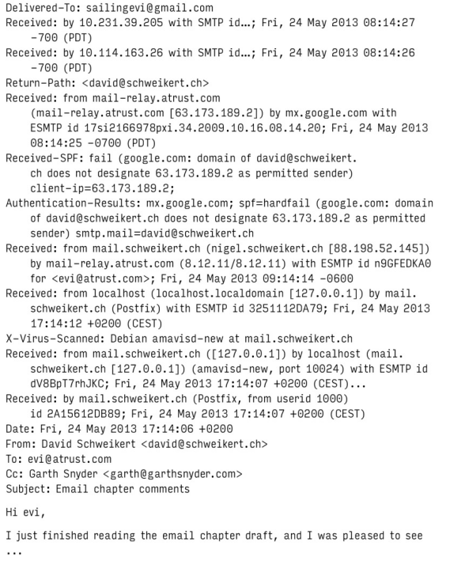

# Chapter 18: Electronic Mail

## Mail system architecture

A mail system consists of several distinct components:

- **User Agents (UA)**: The user agent is the interface between the user and the mail system. It allows the user to read, compose, and send mails.
- **Mail submission agent (MSA)**: Accepts outgoing mail from MUAs, grooms it, and submits it to the mail transfer agent (MTA).
- **Mail transfer agent (MTA)**: The MTA routes messages among mail servers.
- **Delivery agent (DA)**: The delivery agent delivers incoming mail to the recipient's mailbox.
- **Access agent (AA)**: The optional access agent connects the user agent to the mailbox.

### Mail User Agents 

A mail user agent (MUA) is a program that allows users to read, compose, and send email messages. Email messages originally consisted only of text, but a standard known as Multipurpose Internet Mail Extensions (MIME) now encodes text formats and attachments (inluding viruses) into email.

`/bin/mail` was the original user agent, and it remains the “good ol’ standby” for reading text email messages at a shell prompt. 

One of the elegant features illustrated in image above is that a user agent doesn’t necessarily need to be running on the same system—or even on the same platform—as the rest of your mail system. Users can reach their email from a Windows laptop or smartphone through access agent protocols such as IMAP and POP.

### Submission Agent

MSAs, a late addition to the email pantheon, were invented to offload some of the computational tasks of MTAs. MSAs make it easy for mail hub servers to distinguish incoming from outbound email (when making decisions about allowing relaying, for example) and give UAs the opportunity to uniform and simple conf for outbound mail.

An MSA sits between the user agent and the transport agent and takes over several functions that were formerly a part of the MTA's job. An MSA implements secure (encrypted and authenticated) communication with user agents and often does minor header rewriting and cleanup on incoming messages. In many cases, the MSA is really just the MTA listening on a different port (port 597 ranther than 25 of MTAs) with a different configuration applied.

Since your MSA uses your MTA to relay messages, the MSA and MTA must use SMTP-AUTH to authenticate each other. Otherwise, you create a so-called open relay that spammers can exploit and that other sites will blacklist you for.

### Transport Agents

A transport agent must accept mail from a user agent or submission agent, understand the recipient's addresses, and somehow get the mail to the correct host for delivery.

An MTA’s list of chores, as both a mail sender and receiver, includes

- Receiving email messages from remote mail servers
- Understanding the recipients’ addresses
- Rewriting addresses to a form understood by the delivery agent
- Forwarding the message to the next responsible mail server or passing it to a local delivery agent to be saved to a user’s mailbox

### Local Delivery Agents

A delivery agent, sometimes called a local delivery agent (LDA), accepts mail from a transport agent and delivers it to the recipient’s mailbox.

### Message stores

A message store is the final resting place of an email message once it has completed its journey across the Internet and been delivered to recipients.

Mail has traditionally been stored in either `mbox` format or `Maildir` format. The former stores all mail in a single file, typically /var/mail/username, with individual messages separated by a special From line. Maildir format stores each message in a separate file. A file for each message is more convenient but creates directories with many, many small files; some filesystems may not be amused.

### Access Agents

Two protocols access message stores and download email messages to a local device (workstation, laptop, smartphone, etc.): Internet Message Access Protocol version 4 (IMAP4) and Post Office Protocol version 3 (POP3).

IMAP is significantly better than POP. It delivers your mail one message at a time rather than all at once.

## Anatomy of a mail message

A mail message has three distinct parts:

- Envelope
- Headers
- Body of the message

The envelope determines where the message will be delivered or, if the message can’t be delivered, to whom it should be returned. The envelope is invisible to users and is not part of the message itself; it’s used internally by the MTA.

Headers are a collection of property/value pairs (RFC 5322 updated by RFC 6854) that records all kinds of information about the message, such as the date and time it was sent, the transport agents through which it passed on its journey, and who it is to and from.

The body of the message is the content to be sent. It usually consists of plain text, although that text often represents a mail-safe encoding for various types of binary or rich-text content.

Example of a mail message:

To decode this beast, start reading the Received lines, but start from the bottom (sender side).
This message went from David Schweikert’s home machine in the schweikert.ch domain to his mail server (mail.schweikert.ch), where it was scanned for viruses. It was then forwarded to the recipient evi@atrust.com. However, the receiving host mail-relay.atrust.com sent it on to sailingevi@gmail.com, where it entered Evi’s mailbox.

Midway through the headers, you see an SPF (Sender Policy Framework) validation failure, an indication that the message has been flagged as spam. This failure happened because Google checked the IP address of mail-relay.atrust.com and compared it with the SPF record at schweikert.ch. The two didn’t match. This is an inherent weakness of relying on SPF to identify forgeries, they don’t work for mail that has been relayed.

## SMTP Protocol

The Simple Mail Transport Protocol (SMTP) and its extended version, ESMTP, have been standardized in the RFCs 5321 and 7504. SMTP and ESMTP are used for most message hand-offs among the various components of a mail system:

- UA-to-MSA or -MTA: message is injected into the mail system
- MSA-to-MTA: delivery journey begins
- MTA- or MSA-to-antivirus or -antispam: message is scanned
- MTA-to-MTA: message is relayed to the recipient’s mail server
- MTA-to-DA: message is delivered to the recipient’s mailbox

As name suggests, SMTP is a simple protocol. An MTA connects to your mail server and says, “Here’s a message; please deliver it to user@domain.com.” Your MTA then says, “OK, I’ll do that”.

### EHLO

ESMTP speackers use `EHLO` instead of `HELO` to announce themselves. The server responds with a list of ESMTP extensions it supports. If the peers return an error to the `EHLO` command, the client falls back to using `HELO`.

A typical SMTP conversation to deliver an email message goes as follows: HELO or EHLO, MAIL FROM, RCPT TO, DATA, and QUIT.

### SMTP error codes

Also specified in the RFCs that define SMTP are a set of temporary and permanent error codes. These were originally three-digit codes (e.g., 550). The first digit indicates the general category of the error: 2xx means success, 4xx means temporary failure, and 5xx means permanent failure.

The 3-digit error codes did not scale well, so we defined an expanded error code format known as a Delivery Status Notification (DSN). DNSs have the format `X.Y.Z`, instead of `XYZ`, and each of the individual can be multidiigit number. The X must still be 2, 4, or 5, the Y digit specifies a topic, and the Z digit provides more detail. The new system uses the second number to distinguish host errors from mailbox errors.

