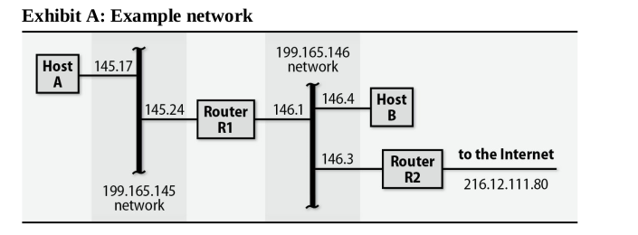
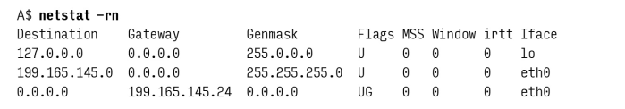
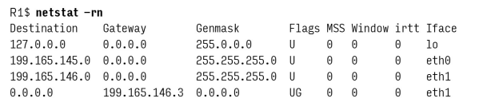
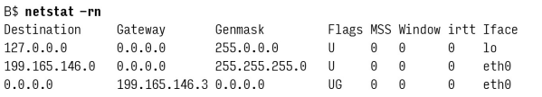

# Chapter 15: IP Routing

We're going deeper into routing and how IP packets are forwarded clearly.

There's a difference between the process of forwarding packets and the management of the routing table that drives this process.

## Packet Forwarding

Router R1 connects two networks, and router R2 connects one of these nets to the outside world. A look at the routing tables for these hosts and routers lets us examine some specific packet forwarding scenarios. First, host A’s routing table:

Host A has the simplest routing configuration of the four machines. The first two routes describe the machine's own network interfaces in standard routing terms. These entries exist so that forwarding to directly connected networks need not be handled as a special case. eth0 is host A’s Ethernet interface, and lo is the loopback interface, a virtual interface emulated in software. Entries such as these are normally added automatically when a network interface is configured. 

The default route on host A forwards all packets not addressed to the loopback address or to the **199.165.145** network to the router R1, whose address on this network is **199.165.145.24**. *Gateways must be only one hop away.*

Sending a packet to **199.165.146.4** (host B) will be forwarded to R1. The packet will be sent to the MAC address of R1's interface on the **199.165.145** network. R1 after checking its routing table will forward the packet to host B since R1 has a direct connection to the **199.165.146** network.

Here is the routing table for R1:

In theory, you can configure host B with initial knowledge of only one gateway and rely on help from ICMP redirects to eliminate extra hops. For example, here is one possible initial configuration for host B:

If B sends a packet to host A (199.165.145.17), no route matches and the packet is forwarded to R2 for delivery. R2 (which, being a router, presumably has complete knowledge of the network) will forward the packet to R1, which will deliver it to host A. Since R1 and B are on the same network, R2 will send an ICMP redirect to B, informing it that it can reach host A directly. B will then update its routing table to reflect this new information.

`199.165.145.1 199.165.146.1 255.255.255.255 UGHD 0 0 0 eth0`

But from a security standpoint, it is better to ignore ICMP redirects and leave the routing table as is. 

## Routing daemons and routing protocols

Instead of having to explicitly tell every computer on every network how to reach every other computer and network, it would be nice if the computers could just cooperate and figure it all out. This is the job of routing protocols and the daemons that implement them.

### Distance Vector Routing

The simplest routing protocol is distance vector routing. In this scheme, each router periodically sends its routing table to its neighbors. Each router then updates its own routing table based on the information it receives. The information sent between routers is a list of destinations and the number of hops to reach each one. The routers do not know the topology of the network, only the number of hops to reach each destination. Over time, the routers converge on a consistent view of the network.

Here's a list of some common distance vector routing protocols:

- RIP (Routing Information Protocol): RIP is a simple protocol that uses hop count as its metric. RIP is limited to 15 hops, which makes it unsuitable for large networks. RIP is a distance vector protocol.
- EIGRP (Enhanced Interior Gateway Routing Protocol): EIGRP is a Cisco proprietary protocol that uses a combination of hop count and bandwidth as its metric.
- BGP (Border Gateway Protocol): BGP is used to route traffic between different autonomous systems (ASes). BGP transmits the entire routing table once and then only sends updates when the routing table changes. 

### Link State Routing

Link state routing is a more sophisticated routing protocol. In this scheme, each router sends a list of its neighbors to all other routers. Each router then constructs a map of the network and calculates the shortest path to each destination. The routers then use this map to forward packets. Link state routing is more complex than distance vector routing, but it is more efficient and more scalable. 

The primary advantage that link state routing has over distance vector is the ability to converge on an operational routing solution after a catastrophe occurs. The trade-off is that link state routing requires more memory and CPU resources to operate.

Each link state includes information about:

- The router itself: Identifying which router is reporting the information.
- The connected neighbors: Identifying the routers directly connected to this router.
- The cost of each link: This could be based on factors like bandwidth, delay, or other metrics that determine how "good" or "bad" a connection is.

Here's a list of some common link state routing protocols:

- OSPF (Open Shortest Path First **RFC2328**): OSPF is a link state protocol that uses the Dijkstra algorithm to calculate the shortest path to each destination.
- IS-IS (Intermediate System to Intermediate System): IS-IS is a link state protocol that is similar to OSPF. IS-IS is used primarily in service provider networks.

---

**AS (Autonomous System)**: A collection of IP networks and routers under the control of a single organization that presents a common routing policy to the internet.

---

## Cisco IOS

Cisco routers use a proprietary operating system called Cisco IOS. The IOS command-line interface is similar to a Unix shell, with a set of commands that allow you to configure the router and monitor its operation. Here are some common commands:

- `show ip route`: Displays the routing table.
- `ssh mycompany.router.com`: Connects to a remote router using SSH.
- `configure terminal`: Enters configuration mode.

