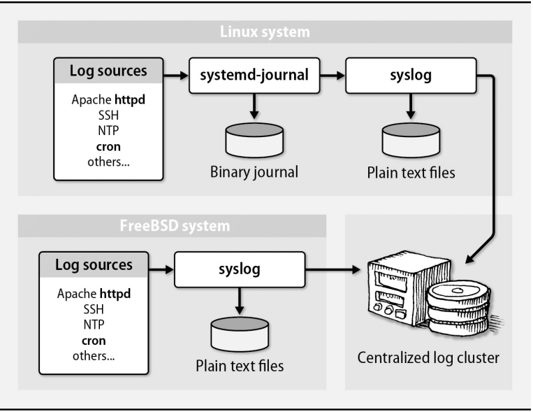
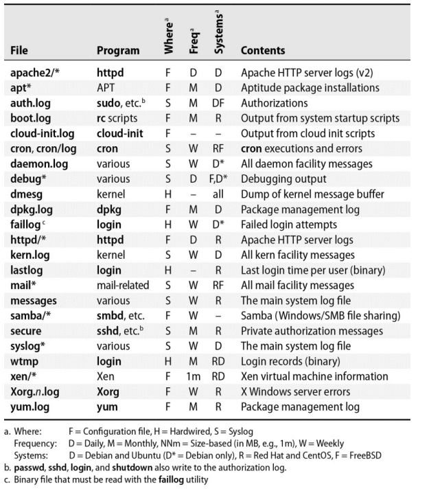
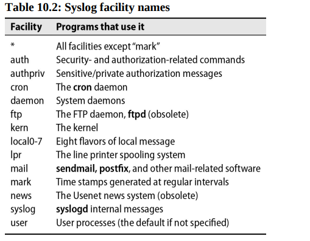
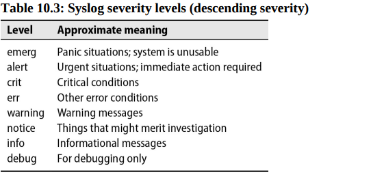
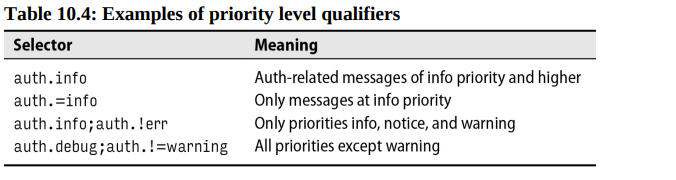
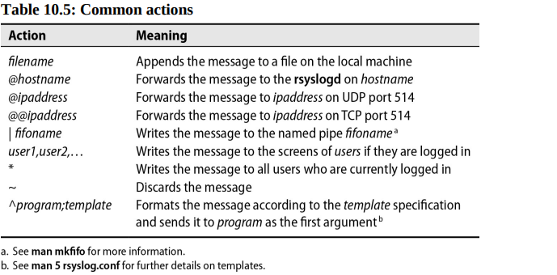
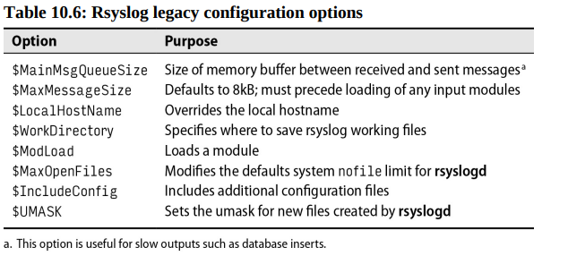
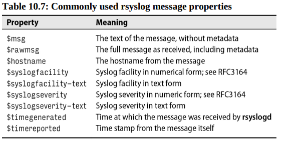

# Chapter 10: Logging


System daemons, the kernel, and custom applications all emit operational data that is logged and eventually ends up on your finite-sized disks. This data has a limited useful life and may need to be summarized, filtered, searched, analyzed, compressed, and archived before it is eventually discarded. Access and audit logs may need to be managed closely according to regulatory requirements.

The task of log management can be divided into a few major subtasks:

- Collecting logs from various sources
- Providing a structured interface for querying, analyzing, filtering, and monitoring messages
- Managing the retention and rotation of logs.

UNIX has historically managed logs through an integrated but somewhat rudimentary system, known as **syslog**. Syslog sorts messages and saves them to files or forwards them to another hosts. Unfortunately, syslog tackles only the first of the logging chores listed above, and its stock configuration differs widely among OSes.

Linux's **systemd** journal represents an attempt to bring sanity to the logging chaos. The journal is a binary log that is indexed and structured for fast access. It can be queried with a rich set of tools and can be configured to forward logs to a remote host. The journal also supports log rotation and compression.

**Logging architecture for a site with centralized logging**


The importance of having a well-defined, site-wide logging strategy has grown along with the adoption of formal IT standards such as PCI DSS, COBIT, and ISO 27001, as well as with the maturing of regulations for individual industries.

## Log locations



Log files are generally owned by root, althought conventions for the ownership and mode of log files vary. In some cases, a less 

Log files can grow quickly, especially the ones for busy services such as web, database, and DNS servers. An out-of-control log file can fill up the disk and bring the system to its knees. For this reason, it’s often helpful to define /var/log as a separate disk partition or filesystem. (Note that this advice is just as relevant to cloud-based instances and private virtual machines as it is to physical servers.)

### Files not to manage.

Most logs are text files to which lines are written as interesting events occur. 

**wtmp** (sometimes **wtmpx**) contains a record of user's logins and logouts as well as entries for system reboots and shutdowns. However, the **wtmp**  file is maintained in a binary format. The **last** command is used to read the **wtmp** file and display the login history of users (ex: `last reboot`).

**lastlog** contains information similar to that in **wtmp**, but it records only the time of last login for each user. lastlog doesn't need to be rotated because of its size stays constant unless new users log in.

Finally, some applications (notably, databases) create binary transaction logs. Don’t attempt to manage these files. Don’t attempt to view them, either, or you’ll be treated to a broken terminal window.

### How to view logs in the systemd journal

For Linux distributions running systemd, the quickest and easiest way to view logs is to use the **journalctl** command, which prints messages from the systemd journal.

For example the following output shows journal logs from the SSH daemon:

```bash
$ journalctl -u sshd

-- Logs begin at Thu 2024-03-21 14:00:00 UTC, end at Thu 2024-03-26 14:30:00 UTC. --
Mar 26 14:00:00 server1 systemd[1]: Starting OpenSSH server daemon...
Mar 26 15:00:00 server1 sshd[1234]: Server listening on
...
```

Use the `-f` option to follow the logs in real time (like `tail -f` command):

```bash
$ journalctl -f -u sshd
```

The `-u` option specifies the unit name, which is the name of the service unit file without the `.service` extension. The unit name for the SSH daemon is `sshd.service`.

## The systemd journal

In accordance with its mission to replace all other Linux subsystems, systemd includes a logging daemon called **systemd-journald**. It duplicates most of syslog's functions but can also run peacefully in tandem with syslog. 

Unlike syslog, which typically saves log messages to plain text files, the systemd journal stores messages in a binary format. All message attributes are indexed automatically, which makes the log easier and faster to search.

The journal collects and indexes messages from several sources:

- The **/dev/log** socket, to harvest messages from software that submits messages to syslog conventions.
- The device file **/dev/kmsg**, to collect messages from the Linux kernel.
- The UNIX socket **/run/systemd/journal/stdout**, to service software that writes log messages to standard output
- The UNIX socket **/run/systemd/journal/socket**, to aservice software that submits messages through the **systemd** journal API
- Audit messages from the kernel's **auditd** daemon.

### Configuring the systemd journal

The default journal configuration file is **/etc/systemd/journal.conf**; however, this file is not intended to be edited directly. Instead, you should create a drop-in configuration file in the **/etc/systemd/journald.conf.d** directory. The drop-in file should have a **.conf** extension and contain only the settings you want to change.

The default **journald.conf** includes a commented-out version of every possible option, along with each option’s default value, so you can see at a glance which options are available. They include the maximum size of journal, the retention period for messages, and various rate-limiting settings.

The `Storage` option controls whether to save the journal to disk. The possible values are somewhat confusing:

- `volatile` stores the journal in memory.
- `persistent` saves the journal in **/var/log/journal**, creating the directory if it doesn't already exist.
- `auto` saves the journal in **/var/log/journal** but does not create the directory. This is the default value for most Linux distributions
- `none` discards all log data.

### Adding more filtering options for journalctl

The `journalctl` command has many options for filtering messages. For example, you can filter messages by time, by priority, by unit, by message content, and by the user who submitted the message.

The `--disk-usage` option shows how much disk space the journal is using:

```bash
$ journalctl --disk-usage
Archived and active journals take up 320.0M in the file system.
```

The `--list-boots` option shows a sequential list of system boots with numerical identifiers. The most recent boot is always 0. The dates at the end of the line show the time stamps of the first and last messages generated during that boot.

```bash
$ journalctl --list-boots | tail -5
 -4 10797e174df7473f816f30bd2eeb4a57 Mon 2024-03-18 14:40:30 CET—Mon 2024-03-18 14:49:42 CET
 -3 237e3a7ee5ed4d9b89358e24fd4d6a8e Mon 2024-03-18 14:50:19 CET—Thu 2024-03-21 03:08:06 CET
 -2 93dcd912589c43d0bd74dbc49af29212 Thu 2024-03-21 09:00:35 CET—Fri 2024-03-22 05:58:45 CET
 -1 2d1351379e34448d9a10a38e07cbf574 Fri 2024-03-22 08:45:08 CET—Sat 2024-03-23 06:51:09 CET
  0 36b300ace41f401ebe0459a51d804681 Sat 2024-03-23 22:07:17 CET—Tue 2024-03-26 15:35:35 CET
```

You can use the -b option to restrict the log display to a particular boot session.
    
```bash
$ journalctl -b -1
```

To show all the messages from yesterday at midnight until now:

```bash
$ journalctl --since=yesterday --until=now
```

To show the most recent 100 journal entries from a specific binary:

```bash
$ journalctl -n 100 /usr/bin/sshd
```

### Coexistence with syslog

Unfortunately, the journal is missing many of the features that are available in syslog. **rsyslog**(the most popular syslog daemon) can receive messages from a variety of input plug-ins and forward them to a diverse set of outputs according to filters and rules, none of which is possible when the **systemd** journal is used.

The systemd universe does include a remote logging service called **systemd-journal-remote**, is a command to receive serialized journal events and store them to journal files. However, this service is not widely used.

The mechanics of the interaction between the systemd journal and syslog are somewhat convoluted. To begin with, systemd-journald takes over responsibility for collecting log messages from **/dev/log**, the logging socket that was historically controlled by syslog. (More specifically, the journal links **/dev/log** to **/run/systemd/journal/dev-log**.) For **syslog** to get in on the logging action, it must now access the message stream through systemd. 

## Syslog

Syslog, originally written by Eric Allman, is a comprehensive logging system and IETF-standard logging protocol. RFC5424 is the latest version of the syslog specification, but the previous version, RFC3164, may better reflect the real-world installed base.

On Linux systems, the original syslog daemon (syslogd) has been replaced with a newer implementation called rsyslogd (**rsyslog**). Rsyslog is an open-source project that extends the capabilities of the original syslog but maintains backward API compatibility.

### Rsyslog architecture

By default, rsyslog is configured in **/etc/rsyslog.conf**. 

The **rsyslogd** process typically starts at boot and runs continuously. Programs that are syslog aware can send messages to the syslog daemon by writing to the **/dev/log**, a UNIX domain socket. In a stock configuration for systems without **systemd**, **rsyslogd** reads messages from this socket directly, consults its configuration file for guidance on how to route them, and dispatches each message to an appropriate destination.

If you modify /etc/rsyslog.conf or any of its included files, you must restart the rsyslogd daemon to make the changes take effect. (A TERM signal [`kill -TERM $(pidof rsylogd)`] makes the daemon exit. A HUP signal causes rsyslogd to close all open log files, which is useful for rotating (renaming and restarting) logs.)

### Rsyslog configuration

The rsyslog configuration file is divided into two sections: global directives and rules. The global directives section contains settings that apply to the entire configuration file. The rules section contains the rules that rsyslog uses to route messages.

Rsyslog understands three configuration syntaxes:

- Lines that use the format of the original syslog configuration file. This format is now known as **sysklogd** format, after the kernel logging daemon sysklogd.
- Legacy rsyslog directives, which always begin with a $ sign. The syntax comes from an ancient version of rsyslog.
- RainerScript, named for Rainer Gerhards, the lead author of rsyslog. This is a scripting syntax that supports expressions and functions.

**Modules**

Rsyslog modules extend the capabilities of the core processing engine. All inputs (sources) and outputs (destinations) are configured through modules, and modules can even parse and mutate messages. Although most modules were written by Rainer Gerhards, some were contributed by third parties. If you’re a C programmer, you can write your own.

Module names follow a predictable prefix pattern. Those beginning with `im` are input modules, those beginning with `om` are output modules, those beginning with `mm` are message modification modules, and so on.

- `imuxsock` reads messages from the **/dev/log** socket.
- `imjournal` integrates with the systemd journal.
- `imfile` converts a plain text file to syslog message format
- `imtcp` and `imudp` listen for messages on a TCP or UDP port.
- `omfwd` forwards messages to a remote syslog server over TCP or UDP. This is the module you’re looking for if your site needs centralized logging.
- `omkafka` is a producer implementation for the Apache Kafka data streaming engine.
- `omelasticsearch` sends messages to an Elasticsearch cluster.

**sysklogd** syntax

The **sysklogd** syntax is the original syntax used by the syslog daemon. It is still supported by rsyslog for backward compatibility. The syntax is simple and easy to understand, but it lacks the power and flexibility of RainerScript.

The basic format is:

```bash
selector action
```

For example, the following line sends all messages to the console:

```bash
*.* /dev/console
```

Selectors identify the source program (“facility”) that is sending a log message and the message’s priority level (“severity”) with the syntax `facility.priority`. 

The asterisk (*) is a wildcard that matches all facilities and priorities. 




Levels indicate the minimum importance that a message must have to be logged. For example, a message from SSH at level warning match the selector auth.warning as well as the selectors auth.info, auth.notice, auth.debug, *.warning, *.info, *.notice, and *.debug. If the configuration directs auth.info messages to a particular file, auth.warning messages will go there also.



The action field tells what to do with each message.



Here are a few configuration examples that use the traditional syntax:
```bash
# Kernel messages to kern.log
kern.*                            -/var/log/kern.log

# Cron messages to cron.log
cron.*                            /var/log/cron.log

# Auth messages to auth.log
auth,authpriv.*                   /var/log/auth.log

# All other messages to syslog
*.*;auth,authpriv,cron,kern.none -/var/log/syslog
```

You can preface a filename action with a dash to indicate that the filesystem should not be **sync**ed after each log entry is written. This is useful for log files that are written to frequently, such as the kernel log.

**Legacy directives**:

Although rsyslog calls these “legacy” options, they remain in widespread use, and you will find them in the majority of rsyslog configurations. Legacy directives can configure all aspects of rsyslog, including global daemon options, modules, filtering, and rules.

For example, the options below enable logging over UDP and TCP on the standard syslog port (514). They also permit keep-alive packets to be sent to clients to keep TCP connections open; this option reduces the cost of reconstructing connections that have timed out.

```bash
$ModLoad imudp
$UDPServerRun 514
$ModLoad imtcp
$InputTCPServerRun 514
$InputTCPServerKeepAlive on
```

To put these options into effect, you could add the lines to a new file to be included in the main configuration such as **/etc/rsyslog.d/10-udp-tcp.conf**. Then restart the rsyslogd daemon.



**RainerScript**:

RainerScript is a powerful scripting language that allows you to create complex rules for processing log messages. RainerScript is more flexible than the legacy syntax, and it is the preferred syntax for new configurations.

Most legacy directives have identically named RainerScript counterparts.

For example, the following RainerScript is equivalent to the one above:

```bash
module(load="imudp")
input(type="imudp" port="514")
module(load="imtcp", keepAlive="on")
input(type="imtcp" port="514")
```

Most of the benefits of RainerScript relate to its filtering capabilities. For example, the following lines route authentication-related messages to **/var/log/auth.log**:

```bash
if $syslogfacility-text == 'auth' then {
  action(type="omfile" file="/var/log/auth.log")
}
```



A given filter can include multiple filters and multiple actions. The following fragment targets kernel messages of critical severity. It logs the messages to a file and sends email to alert an administrator:

```bash
module(load="ommail")

if $syslogfacility-text == 'crit' and $syslogseverity-text == 'kern' then {
  action(type="omfile" file="/var/log/kernel-critical.log")
  action(type="ommail" 
        server="smtp.admin.com"
        port="25"
        mailfrom="rsyslog@admin.com"
        mailto="abdou@admin.com"
        subject.text="Critical kernel message"
        action.execOnlyOnceEveryInterval="3600"
    )
}
```
Here, we’ve specified that we don’t want more than one email message generated per hour (3,600 seconds).

### Config file examples

- Complete config that writes log messages to files:

The following can serve as a generic RainerScript **rsyslog.conf** for any Linux system.

```bash title="Basic rsyslog configuration"
module(load="imuxsock") # provides support for local system logging
module(load="imklog")   # provides support for kernel logging
module(load="immark", interval="3600") # writes a mark message every hour

# set global rsyslog parameters
global(
  workDirectory="/var/spool/rsyslog" # where rsyslog stores working files
  maxMessageSize="8192"              # maximum message size
)

# The ouptput module does not need to be explicity loaded, but we can do it to override the default settings

module(
  load="builtin:omfile" 
  # Use traditional timestamp format
  template="RSYSLOG_TraditionalFileFormat"

  # Default permissions for log files
  FileOwner="root"
  FileGroup="adm"
  dirOwner="root

$IncludeConfig /etc/rsyslog.d/*.conf
)

dirCreateMode="0755"
fileCreateMode="0640"
dirGroup="adm"

```

- Network logging client

This logging client forwards system logs and the Apache access and error logs to a remote server over TCP.

```bash
*.*                   @@logs.admin.com

# imfile module reads Apache logs from the filesystem
# inotify mode watches for changes in the log files (it's more efficient than polling)
module(load="imfile" mode="inotify")

# import the Apache logs
input(
    type="imfile" 
    File="/var/log/apache2/access.log" 
    Tag="apache-access", 
    Severity="info"
    )
input(
    type="imfile"
    File="/var/log/apache2/error.log"
    Tag="apache-error"
    Severity="info"
    )

# Send the Apache logs to the remote central server

if $programname contains 'apache' then {
  action(
    type="omfwd" 
    target="logs.admin.com"
    port="514"
    protocol="tcp"
  )
}
```

Apache **httpd** does not write messages to syslog by default, so the access and error logs are read from the filesystem with the **imfile** module. The **Tag** and **Severity** directives are used to set the message’s facility and priority level.

Instead of TCP, we could have used RELP(Reliable Event Logging Protocol), a nonstandard protocol that provides reliable delivery of log messages. 

- Central logging host

The configuration of the corresponding central log server is straightforward: listen for incoming logs on TCP port 514, filter by log type, and write to files in the site-wide logging directory.

```bash
# Load the imtcp module to listen for incoming logs and 
# do not accept more than 500 simultaneous clients
module(load="imtcp", MaxSessions="500")
input(type="imtcp" port="514")

# Write logs to files in the site-wide logging directory
if $programname == 'apache-access' then {
  action(type="omfile" file="/var/log/site/access.log")
} else if $programname == 'apache-error' then {
  action(type="omfile" file="/var/log/site/error.log")
} else {
  action(type="omfile" file="/var/log/site/syslog.log")
}
```

### Syslog message security

Rsyslog can send and receive log messages over TLS, a layer of encryption and authentication that runs on top of TCP.

The following example enables the `gtls` driver for a log server. The `gtls` driver requires a CA certificate, a public certificate, and the server’s private key. The imtcp module then enables the `gtls` stream driver.

(The `gtls` driver is a network stream driver that implements a TLS-protected transport via the **GnuTLS** library)

```bash

global(
  defaultNetstreamDriver="gtls"
  defaultNetstreamDriverCAFile="/etc/ssl/certs/admin.com.pem"
  defaultNetstreamDriverCertFile="/etc/ssl/certs/server.com.pem"
  defaultNetstreamDriverKeyFile="/etc/ssl/private/server.com.pem"
)

module(
  load="imtcp"
  streamDriver.name="gtls"
  streamDriver.mode="1"
  streamDriver.AuthMode="x509/name"
)

input(
  type="imtcp"
  port="6514"
)
```

For the client side it's same basically:

```bash
global(
  defaultNetstreamDriver="gtls"
  defaultNetstreamDriverCAFile="/etc/ssl/certs/admin.com.pem"
  defaultNetstreamDriverCertFile="/etc/ssl/certs/client.com.pem"
  defaultNetstreamDriverKeyFile="/etc/ssl/private/client.com.pem"
)

*.*        action(
              type="omfwd"
              Protocol="tcp"
              Target="logs.admin.com"
              Port="6514"
              StreamDriverMode="1"
              StreamDriver="gtls"
              StreamDriverAuthMode="x509/name"
            )

```

## Management and rotation of log files

Erik Troan's **logrotate** utility is the standard tool for managing log files on Linux systems (and on FreeBSD via installation). Logrotate is a simple program that reads configuration files and performs log rotation according to the directives in the files.

### Logrotate: cross platform log management

Logrotate config consists of a series of stanzas, each of which describes how to manage a particular log file. The stanzas are written in a simple, human-readable syntax.

Options that appear outside the context of a log file specification (such as `errors`, `rotate`, and `weekly` etc..) apply to all subsequent specifications.

```bash
# Global options
errors errors@book.admin.com
rotate 5
weekly

# Log file specification
/var/log/messages {
  postrotate
    /bin/kill -HUP `cat /var/run/syslogd.pid`
  endscript
}

/var/log/samba*.log{
  notifempty
  copytruncate
  sharedscripts
  postrotate
    /bin/kill -HUP `cat /var/lock/samba/*.pid`
  endscript
}

```

This conf will rotates **/var/log/messages** every week. It keeps five versions of the file and notifies rsyslog each time the file is reset. Samba log files are also rotated weekly, but instead of being moved aside and restarted, they are copied and then truncated. The Samba daemons are sent HUP signals only after all log files have been rotated.

[REMIND:] HUP signal is sent to a daemon to tell it to reread its configuration file.

**Logrotate options:**

[logrotate-options](./data/logrotate-options.png)

## Management of logs at scale

It's one thing to manage logs on a single server, but it's quite another to manage logs on hundreds or thousands of servers. Fortunately, there are several tools that can help.

### ELK stack

The **ELK stack** is a popular open-source log management solution that combines three tools:

- **Elasticsearch**: A distributed search engine, written in Java, that indexes and searches log data.
- **Logstash**: A log processing pipeline that collects, parses, and enriches log data.
- **Kibana**: A web interface that visualizes log data.

### Graylog

Graylog is the spunky underdog to ELK’s pack leader. It resembles the ELK stack in several ways: it keeps data in Elasticsearch, and it can accept log messages either directly or through Logstash, just as in the ELK stack.

### Logging as a service

Splunk is the most mature and trusted; both hosted and on-premises versions are available. Some of the largest corporate networks rely on Splunk, not only as a log manager but also as a business analytics system. But if you choose Splunk, be prepared to pay dearly for the privilege.
