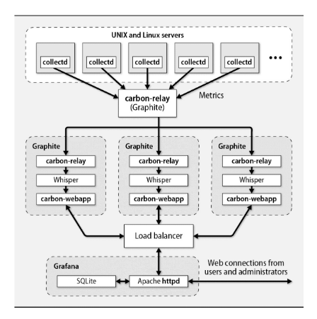
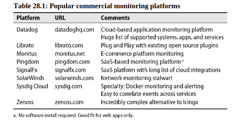
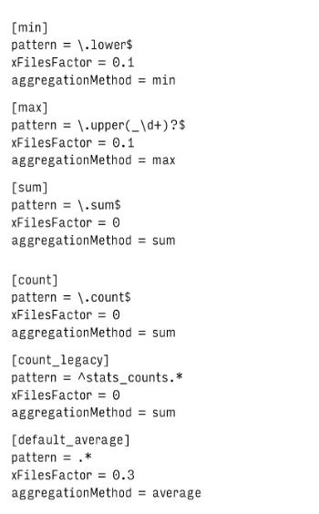
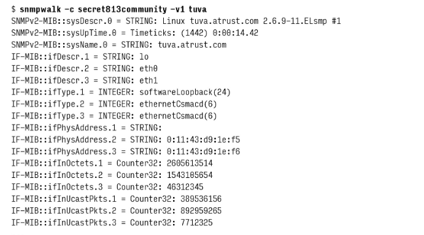

# Chapter 28: Monitoring


Professional sysadmins adopt monitoring as their religion. Every system is added to the monitoring system platform before it goes live. A monitoring-first philosophy (along with its associated tools) makes you a sysadmin superhero.

## Overview of monitoring

The goals of monitoring are to ensure that the IT infrastructure as a whole operates as expected and to compile, in an accessible and easily digested form, data that are useful for management and planning.

Real world monitoring systems vary in every possible dimension, but they all share this same basic structure:

- Raw data is harvested (collected) from systems and devices of interest.
- The monitoring platform reviews the data and determines what actions are appropriate.
- The raw data and any actions decided on by the monitoring system flow through to back ends that take appropriate action.

### Instrumentation

Monitoring systems can collect diverse data types including performance metrics, availability stats, capacity measures, state changes, logs, and business KPIs.

Only collect data that has clear, actionable purposes.

### Data types

Monitoring data falls into three types: real-time metrics (current system state numbers), events (log entries and notifications), and historic trends (aggregated time-series data for analysis).


### Intake and processing

First-generation monitoring systems (like Nagios and Icinga) focused on real-time problem detection and response. The industry later recognized that monitoring fundamentally deals with time-series data - tracking how values change over time. However, the sheer volume of monitoring data makes traditional databases impractical for storage, requiring specialized approaches.

The modern approach is to organize monitoring around a data store that's specialized for handling time-series data. All data is stored for an initial period, but as the data ages, the store applies increasingly high levels of summarization to limit storage requirements. For example, the store might keep an hour's worth of data at one-second resolution, a week's worth of data at one- minute resolution, and a year's worth of data at one-hour resolution.

### Notifications

Once you have a monitoring framework in place, put careful thought into what to do with the monitoring results. The first priority is usually to notify administrators and developers about a problem that needs attention.

## The monitoring culture

When you embark on a monitoring journey, embrace the following tenets:

* **Universal Coverage**
  * Monitor everything users depend on
  * Track all available system metrics
  * Include high-availability components and backups

* **Organizational Integration**
  * Make monitoring a required part of all technical roles' work
  * Share monitoring data widely through accessible dashboards
  * Distribute alert response across all technical teams

* **Best Practices**
  * Fix root causes rather than suppressing alerts
  * Tune alerts to eliminate false positives
  * Use monitoring to improve quality of life by reducing uncertainty
  * Treat monitoring as essential infrastructure, not an optional extra

## Monitoring platforms

The good news is that there are a variety of choices. The not-as-good news is that no single, perfect platform exists. When selecting from among them consider the follwing issues:

- **Data-gathering flexibility**. Will you need to read data from an SQL database? From DNS records? From an HTTP connection?
- **User interface quality**. Many systems offer customizable GUIs or web interfaces. Will you need different user interfaces for different groups within your org?
- **Cost**. are you healthy enough?
- **Automated discovery**. Many systems offer to “discover” your network. Through a combination of broadcast pings, SNMP requests, ARP table lookups, and DNS queries, they identify all your local hosts and devices.
- **Reporting features**. Many products can send alert email, integrate with ChatOps, send text messages, and automatically generate tickets for popular trouble-tracking systems. 

### Open source real-time platforms

Nagios, Icinga, and Sensu Core, these systems have their proponents, but as first-generation monitoring tools, they're gradually osing favor to time-series systems.

Both systems (nagios, icinga) include scores of scripts for monitoring services of all shapes and sizes, along with extensive SNMP monitoring capabilities. Perhaps their greatest strength is their modular and heavily customizable configuration system, which allows you to write custom scripts to monitor any conceivable metric.

### Open source time-series platforms

Detecting and responding to current problems is just one aspect of monitoring. It's often equally important to know how values are changing over time and how they relate to other values. Four popular time-series platforms aim to scratch this itch: Graphite, Prometheus, InfluxDB, and Munin.

**Graphite**

Graphite pioneered modern time-series monitoring with three key innovations:
* Introduced sub-second monitoring (moving beyond per-minute data collection)
* Created an accessible time-series database with simple query language
* Provided powerful data aggregation and summarization capabilities

While Graphite's web visualization has been largely replaced by Grafana, its core components (Carbon and Whisper) remain important for large-scale monitoring systems capable of handling hundreds of thousands of metrics.



**Prometheus** 

Amazing but does not allow for clustering, however, which is a big cons!

**InfluxDB**

InfluxDB is an extraordinarily developer-friendly time-series monitoring platform that supports a broad array of programming languages. Much like Graphite, InfluxDB is really just a time-series database engine. You'll need to complete the package with external components such as Grafana to form a complete monitoring system that includes features like alerting.

### Commercial platforms

Hundreds of companies sell monitoring software, and new competitors enter the market every week. 



 ## Data collections

 You must now make sure that the data and events you're interested in monitoring make their way into the central monitoring platform. 

 ### StatsD: generic data submission protocol

StatsD was written by engineers at Etsy as a way to track anything and everything within their own environment.  It's a UDP-based front-end proxy that dumps any data you throw at it into a monitoring platform for consumption, calculation, and display. StatsD's superpower is its ability to ingest and perform calculations on arbitrary statistics.

StatsD is incredibly modular and can feed the incoming data to a variety of back ends and clients. Let's look at a simple example that uses Graphite as the back end.

To ensure that Graphite and StatsD communicate correctly, you must modify Carbon, Graphite's storage component. Edit `/etc/carbon/storage-schemas.conf` and add a stanza similar to the following:

```text
[stats]
pattern = ^stats.*
retentions = 10s:12h,1min:7d,10min:1y
```

<div style="padding: 15px; border: 1px solid transparent; border-color: transparent; margin-bottom: 20px; border-radius: 4px; color:rgb(5, 44, 63); background-color:rgb(102, 226, 220); border-color:rgb(15, 46, 71);">
This configuration tells Carbon to keep 12 hours of data at 10-second intervals. Carbon summarizes expiring data at 1-minute intervals and keeps that summary information for an additional 7 days. Similarly, data at 10-minute granularity is maintained for a full year.
</div>

The exact definition of what it means to “summarize” time-series data varies according to the type of data. If you're counting network errors, for example, you probably want to summarize by adding up values. If you're looking at metrics that represent load or utilization, you probably want an average.

These policies are specified in the file `/etc/carbon/storage-aggregation.conf`. Here a default reasonable configuration:



Note that every configuration block has a regular expression pattern that attempts to match the names of data series. Blocks are read in order, and the first matching block becomes the controlling specification for each data series. For example, a series named sample.count would match the pattern for the [count] block. The values would be rolled up by adding up data points (`aggregationMethod = sum`).

The `xFilesFactor` setting determines the minimum number of samples needed to meaningfully downsample your metric.

## Network monitoring

The basic unit of network monitoring is the network ping, also known as an ICMP Echo Request packet.

The concept is simple: you send an echo request packet to another host on the network, and that host’s IP implementation returns a packet to you in response. If you receive a response to your probe, you know that all the network gateways and devices that lie between you and the target host are operational. You also know that the target host is powered on and that its kernel is up and running.

Network gateways aren’t required to answer ping packets, so pings might be dropped by a busy gateway. Even a properly functioning network loses a packet now and then.

## System Monitoring

Since the kernel controls a system’s CPU, memory, I/O, and devices, most of the interesting system-level state information you might want to monitor lives somewhere inside the kernel.

A particular value can often be obtained in more than one way. In the case of load averages, for example, you can read the values directly from `/proc/loadavg` on Linux systems or with `sysctl -n vm.loadavg` on FreeBSD. Load averages are also included in the output of the uptime, w, sar, and top commands (though top would be a poor choice for noninteractive use).

### Commands for systems monitoring

Here some commands that yield commonly monitored parameters:

| Command | Description |
| ------- | ----------- |
| `df` | Show disk space usage |
| `du` | Directory sizes |
| `free` | Free, used, and swap (virtual) memory |
| `iostat` | Disk performance and throughput |
| `mpstat` | Per-processor utilization on multi-processor systems |
| `lsof` | List open files and network connections |
| `netstat` | Network connection tracking |
| `vmstat` | Process, CPU, and memory statistics |
| `w` | List of logged-in users and their activity |
| `uptime` | System uptime and load average |
| `top` | Display a list of running processes |
| `sysctl` | Access to system configuration data |
| `sar` | System Activity Report |

The Swiss Army knife of command-line data extraction is `sar` (for System Activity Report). 

The example below requests reports every two seconds for a period of one minute (i.e., 30 reports). The DEV argument is a literal keyword, not a placeholder for a device or interface name.

```bash
sar -n DEV 2 30

20:03:09        IFACE   rxpck/s   txpck/s    rxkB/s    txkB/s   rxcmp/s   txcmp/s  rxmcst/s   %ifutil
20:03:11           lo     16.00     16.00      1.63      1.63      0.00      0.00      0.00      0.00
20:03:11    wlp0s20f3      0.00      1.00      0.00      0.25      0.00      0.00      0.00      0.00
20:03:11      docker0      0.00      0.00      0.00      0.00      0.00      0.00      0.00      0.00
20:03:11    br-ab0b0f5aff6c      0.00      0.00      0.00      0.00      0.00      0.00      0.00      0.00
20:03:11    enx144fd7c8a174      0.00      0.00      0.00      0.00      0.00      0.00      0.00      0.00

```

### collectd

collectd is a flexible, cross-platform data collection framework. It can collect data from a wide range of sources, including Unix systems, network devices, and even browser plugins.

An example configuration file can be found at `collectd.conf`.

```text
## /etc/collectd/collectd.conf

Hostname client1.admin.com
FQDNLookup false
Interval 30
LoadPlugin syslog
<Plugin syslog>
  LogLevel info
</Plugin>

LoadPlugin disk
LoadPlugin cpu
LoadPlugin load
LoadPlugin memory
LoadPlugin network
LoadPlugin processes
LoadPlugin rrdtool

<Plugin rrdtool>
  DataDir "/var/lib/collectd/rrd"
</Plugin>

```

This basic configuration collects a variety of interesting system statistics every 30 seconds and writes RRDtool-compatible data files in `/var/lib/collectd/rrd`.

### sysdig and dtrace: execution tracers

sysdig = all_good_parts(strace, tcpdump, netstat, htop, iftop, lsof etc).


- It is fast, stable and easy-to-use with comprehensively well documented.
- Comes with native support for container technologies, including Docker, LXC.
- It is scriptable in Lua; offers chisels (lightweight Lua scripts) for processing captured system events.
- Supports useful filtering of output.
- Supports system and application tracing.
- It can be integrated with Ansible, Puppet and Logstash.
- Enable sample advanced log analysis.
- It also offers Linux server attack (forensics) analysis features for ethical hackers and lot’s more.

## Application monitoring

Application monitoring is the practice of monitoring the performance and health of application components, such as servers, databases, and web services, to ensure they remain responsive and performant.

### Log monitoring

In its most basic form, log monitoring involves grepping through log files to find interesting data you’d like to monitor, pulling out that data, and processing it into a form that’s usable for analysis, display, and alerting. Since log messages consist of free-form text, implementation of this pipeline can range in complexity from trivial to challenging.

## Security monitoring

This area of operational practice is sometimes known as security operations or SecOps.

Dozens of open source and commercial tools and services can be enlisted to help monitor an environment’s security. Third parties, sometimes called managed security service providers (`MSSPs`), render outsourced services. Despite all these options, security breaches remain common and often go undetected for months or years.

It always sounds attractive to outsource security operations; then it becomes someone else’s problem to make sure your environment is secure. But think of it this way: would you be comfortable paying someone to watch your cash-filled wallet sit on a table with 10,000 other wallets in a busy train station? If so, an `MSSP` might be a good fit for you!


 
You must implement a comprehensive security program that includes standards for user behavior, data storage, and incident response procedure.

Two core security functions should be integrated with your automated, continuous monitoring strategy: system integrity verification and intrusion detection.

### System integrity verification

System integrity verification (often called file integrity monitoring or FIM) is the validation of the current state of a system against a known, correct, and consistent baseline.

Most often, this validation compares the content of the system files (kernel, executable commands, config files, etc.) with a cryptographically sound checksum such as SHA-512 (which is a 512-bit hash value of the family of SHA-2 algorithms). If the checksum value of the file in the running system does not match the known correct value, it is considered to be a sign of intrusion.

The most commonly deployed FIM platforms are Tripwire and OSSEC; 

Here an example script using `mtree` (native to FreeBSD) to implement system integrity verification:

```bash
#!/bin/bash

if [$# -eq 0]; then # check if any arguments are passed
  echo "mtree-check.sh [-bv]"
  echo "-b = create baseline"
  echo "-v = verify the system against the baseline"
  exit 
fi

## seed

KEY = 1932845394042

## baseline directory
DIR = /usr/local/lib/mtree-check

create_baseline() {
  rm -rf $DIR/mtree_*
  cd $DIR
  mtree -c -K sha512 -s $KEY -p /sbin > mtree_sbin  # create the baseline for /sbin
}

validate() {
  cd $DIR
  mtree -s $KEY -p /sbin < mtree_sbin | \   # compare the system against the baseline
     mail -s "`hostname` mtree integrity check" abdou@admin.com
}

case $1 in
  -b) create_baseline ;;
  -v) validate ;;
  *) echo "unknown option" ;;
esac

```

### Intrusion detection monitoring

There's two types of intrusions detection systems (IDS): the host-based (HIDS) and network-based (NIDS). 

The two most popular open source HIDS platforms are OSSEC (Open Source SECurity) and AIDE (the Advanced Intrusion Detection Environment).

## SNMP: Simple Network Management Protocol

SNMP (Simple Network Management Protocol) is a widely-used protocol for network management. It allows network administrators to manage network devices, such as routers, switches, servers, and more, by monitoring their performance, detecting network faults, and configuring remote devices.

Despite its name, SNMP is actually quite complex. It defines a hierarchical namespace of management data and methods for reading and writing that data on each network device. SNMP also defines a way for managed servers and devices (“agents”) to send event notification messages (“traps”) to management stations.

The protocol itself is simple; most of SNMP's complexity lies above the protocol layer in the conventions for constructing the namespace and in the unecessary baroque vocabulary that surrounds SNMP like a protective shell.

We suggest that you approach SNMP as a low-level data collection protocol for use with special-purpose devices that don’t support anything else. Get data out of the SNMP world as quickly as possible and turn it over to a general-purpose monitoring platform for storage and processing. SNMP can be an interesting neighborhood to visit, but you wouldn’t want to live there!

### SNMP organization

SNMP data is arranged in a standardized hierarchy. The naming hierarchy is made up of "Management Information Bases" (MIBs), structured text files that describe the data accessible through SNMP.

MIBs contain descriptions of specific data variables, which are referred to with names known as object identifiers, or OIDs. An OID is just a fancy way of naming a specific managed piece of information. 

<div style="padding: 15px; border: 1px solid transparent; border-color: transparent; margin-bottom: 20px; border-radius: 4px; color:rgb(5, 44, 63); background-color:rgb(102, 226, 220); border-color:rgb(15, 46, 71);">
SNMP is a framework of how an SNMP tool can ask questions, how those questions should be structured, and how the responses should be structured.

A MIB is a library of questions & response formats. 

An OID is essentially a specific question that aligns to the framework, and references MIBs that are assumed to be present in both the SNMP tool, and the target product. 

If you buy a new device, like a NAS appliance for example, maybe your SNMP tool already knows how to ask it "ethernet" questions about it's network interfaces, but has no idea how to ask it about IOps or Power Supply status.

So, you compile the MIBs that are offered by product support for the NAS, and now your SNMP-tool understand a new array of questions to ask, and better understands the responses it is receiving. 

By <a style="color: #1a73e8; text-decoration: none; font-weight: bold;" href="https://www.reddit.com/r/sysadmin/comments/tqayz9/comment/i2g2pwn/?utm_source=share&utm_medium=web3x&utm_name=web3xcss&utm_term=1&utm_content=share_button">VA_Network_Nerd</a>
</div>

All current SNMP-capable devices support the structure for MIB-II defined in RFC1213. But each vendor can and does extend that MIB further to add more data and metrics.

OIDs exist within a hierarchical namespace where the nodes are numbered rather than named. However, for ease of reference, nodes also have conventional text names. The separator for pathname components is a dot. For example, the OID that refers to the uptime of a device is `1.3.6.1.2.1.1.3`.


### How SNMP works

SNMP basically works like a client-server communication where network management systems (clients) send out a request and the managed devices (servers) return a response.

The most common four request operations are `Get`, `GetNext`, `Set`, and `Trap`. 

For example if you want to monitor the system `uptime` (this is your monitoring object) of your computer, you will need the OID:
```bash
1.3.6.1.2.1.25.1.1.0
```

A trap is an unsolicited, asynchronous notification from server (agent) to client (manager) that reports the occurrence of an interesting event or condition. Several standard traps are defined, including “I’ve just come up” notifications, reports of failure or recovery of a network link, and announcements of various routing and authentication problems. The mechanism by which the destinations of trap messages are specified depends on the implementation of the agent.

Since SNMP messages can potentially modify configuration information, some security mechanism is needed. The simplest version of SNMP security uses the concept of an SNMP “community string,” which is really just a horribly obfuscated way of saying “password.” There’s usually one community string for read-only access and another that allows writing.

These days it makes a lot more sense to set up the SNMPv3 management framework, which allows for more security including authorization and access control for individual users.


### Net-SNMP

Net-SNMP is an open-source suite of applications used for implementing the Simple Network Management Protocol (SNMP) on Linux, Unix, and other platforms. It provides both agent and client functionalities that help administrators monitor and manage networked devices.

**Command-line tools in the Net-SNMP package**

| **Command**       | **Description**                                                                                                     |
| ----------------- | ------------------------------------------------------------------------------------------------------------------- |
| **snmpget**       | Retrieves the value of a specific SNMP object (OID) from a target device using an SNMP GET request.                 |
| **snmpgetnext**   | Retrieves the value of the next SNMP object following a given OID, often used to iterate through a table.           |
| **snmpwalk**      | Iteratively retrieves an entire subtree of SNMP objects by automatically sending successive GETNEXT requests.       |
| **snmpset**       | Sets or modifies the value of an SNMP object on a target device using an SNMP SET request.                          |
| **snmpbulkget**   | Retrieves multiple SNMP objects in one request using the GETBULK method (for SNMP v2c and later).                   |
| **snmpbulkwalk**  | Efficiently retrieves a subtree of SNMP objects via GETBULK requests, reducing the number of packets exchanged.     |
| **snmptranslate** | Converts between numerical OIDs and their textual (MIB) names, aiding in easier identification and troubleshooting. |
| **snmptrap**      | Sends SNMP trap or inform messages to an SNMP manager to notify of events or errors.                                |
| **snmpd**         | The SNMP agent daemon that listens for SNMP queries and provides corresponding responses from a host.               |
| **snmptrapd**     | A daemon that listens for and logs incoming SNMP trap and inform messages from remote devices.                      |
| **mib2c**         | Generates C-code templates from MIB definitions, allowing customization or extension of SNMP agents.                |
| **tkmib**         | Provides an interactive graphical MIB browser (using Perl/Tk) to help users explore and query MIB structures.       |
| **snmptest**      | Sends SNMP requests for testing SNMP configuration and troubleshooting connectivity or permission issues.           |
| **snmpusm**       | Manages SNMPv3 User-based Security Model (USM) user entries on a device.                                            |
| **snmpvacm**      | Manages SNMPv3 View-based Access Control Model (VACM) configuration entries for controlling access.                 |
| **snmpdf**        | Retrieves and displays disk usage information from a device using SNMP, similar in style to the Unix “df” command.  |
For example, here’s a truncated sample snmpwalk of the host tuva, a Linux system. The community string is “secret813community,” and -v1 specifies simple authentication.



## Tips and tricks for monitoring

- Avoid monitoring burn-out. Ensure that sysadmins who receive notifications outside of regular work hours get regular breaks. This goal is best achieved with a rotation system in which teams of two or more individuals are on call for a day or a week, then the next team takes over. Failure to heed this advice results in crabby sysadmins who hate their jobs.
- Define what circumstances really require 24 × 7 attention, and make sure this information is clearly communicated to your monitoring team, your on-call teams, and the customers or business units you support. The mere fact that you’re monitoring something doesn’t mean that administrators should be mustered at 3:30 a.m. when the value goes out of bounds. Many issues should be addressed during normal business hours.
- Eliminate monitoring noise. If false positives or notifications for noncritical services are being generated, make time to stop and fix them. Otherwise, like the boy who cried wolf, all notifications will eventually fail to receive the necessary attention. 
- Create run books for everything. Any common restart, reset, or corrective procedure should be documented in a form that allows a responder who is not intimately familiar with the system in question to take appropriate action. The costs of not having such documentation are that problems will not be fixed quickly, mistakes will be made, and additional staff will be rousted to handle emergencies. Wikis are great for maintaining this type of documentation.
- Monitor the monitoring platform. This one will seem obvious once you’ve missed a critical outage because the monitoring platform was also down. Learn from our mistakes and make sure something is watching your watchful eyes. 
- Miss an outage because of something that wasn’t monitored? Make sure it gets added so you catch the problem next time.
- Finally, and perhaps most importantly: no server or service goes into production without first being added to the monitoring system. No exceptions.