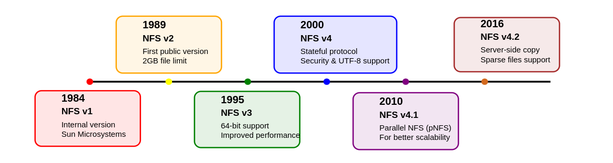
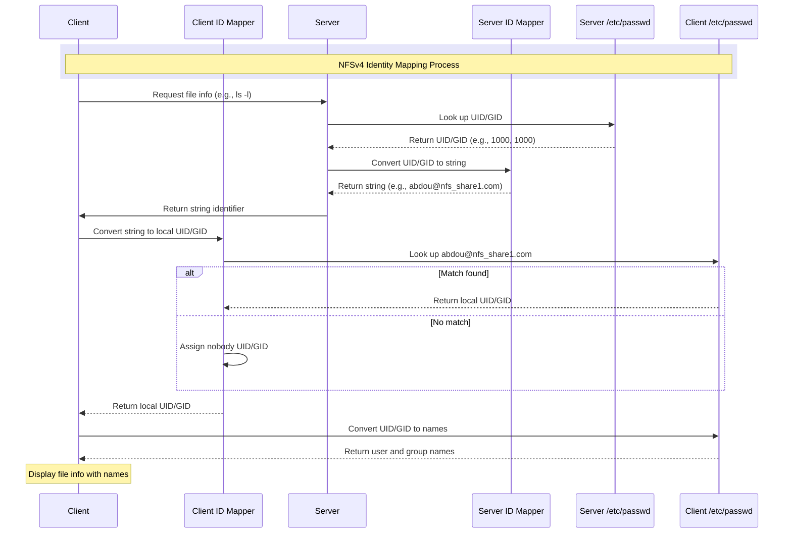
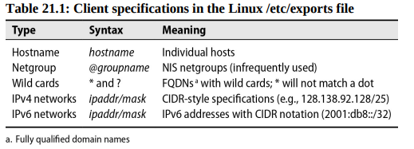

# Chapter 21: The Network File System


The Network File System protocol, commonly known as NFS, lets you share filesystems among computers. It is a client-server system that allows users to access files across a network and treat them as if they were local files. 

## Network File services

The goal of a network file service is to grant shared access to files and directories that are stored with the same system calls they use for local files; that files are stored elsewhere on the network should be transparent to applications. If more than one network client or application attempts to modify a file simultaneously, the file sharing service must resolve any conflicts that arise.

### The competition

File sharing protocols include NFS, primarily used in UNIX/Linux environments, and SMB, which is built into Windows and macOS but can also be used on UNIX/Linux systems with Samba. While NFS offers better integration in UNIX/Linux-dominant networks, SMB is often the more compatible choice for hybrid networks with various operating systems. Both NFS and SMB have evolved significantly over decades to address security, performance, and reliability issues, making them robust choices for modern file sharing needs.

Storage area network (SAN) systems are another option for high-performance storage management on a network. SAN servers need not understand filesystems because they serve only disk blocks, not files, unlike NFS and SMB servers. For SAN to manage concurrent access by multiple clients, the clients must use a cluster filesystem or a distributed lock manager.

For big data projects, several open source distriubted filesystems are available, such as Hadoop Distributed File System (HDFS), GlusterFS, and Ceph. These systems are designed to store and manage large datasets across a distributed network of computers.

### Issues of state

The state of a file is the information that the operating system maintains about the file, such as its size, permissions, and modification time. When a file is opened, the operating system creates a file descriptor that contains the file's state. The file descriptor is used to read and write the file, and it is closed when the file is no longer needed. A server that records the state of a file is said to be stateful, while a server that does not record the state of a file is stateless.

A stateful server keep track of the state of each file that is open, which allows it to manage file locks and detect conflicts between clients. A stateless server does not keep track of the state of files, which simplifies the server's design but requires clients to manage file locks and conflicts. So the concurrency control is more complex in a stateless server than in a stateful server.

### Performance

The performance of a network file service is affected by the network's bandwidth, latency, and reliability. WANs have lower bandwidth and higher latency than LANs, which can slow down file access. To improve performance, network file services use caching, read-ahead, and write-behind techniques to reduce the number of network requests and the amount of data transferred over the network.

(from [cs-cornell](https://www.cs.cornell.edu/courses/cs415/1999fa/slides-fs/text40.htm))

- Read ahead: read more blocks than the application asked for, hoping the others will be used too.
- Write-behind: delay writes, try to group them for improved disk performance (fewer seeks)

### Security

Nowadays a centralized authentication system is used to manage user accounts and passwords, such as LDAP, Active Directory, or Kerberos. These systems allow users to log in once and access multiple services without re-entering their credentials. They also provide a single point of administration for managing user accounts and passwords.

## The NFS approach

NFS is a network protocol, so in theory it could be implemented in user space just like most other network protocols. 

While NFS offers good performance and is popular for LAN file sharing, it has some limitations in areas like high availability, recovery from server failures, and security complexity. Despite these challenges, modern NFS implementations and supporting technologies offer various strategies for achieving high availability, including warm standby servers, clustering, load balancing, and replication.

### NFS versions and history



The Elastic File System service from AWS, which became generally available in mid-2016, adds NFSv4.1 filesystems for use by EC2 instances.

### Remote procedure calls

When Sun developed the first versions of NFS in the 1980s, they realized that many of the network-related problems that needed solving for NFS would apply to other network-based services, too. They developed a more general framework for remote procedure calls known as RPC or SunRPC, and built NFS on top of that. This work opened the door for applications of all kinds to run procedures on remote systems as if they were being run locally.

Operations that read and write files, mount filesystems, access file metadata, and check file permissions are all implemented as RPCs.

### Transport protocols

NFS v2 originally used UDP because that was what performed best on the LANs (1980s), then TCP or UDP in v3 and TPC only on v4+. The move to TCP is due to the lack of congestion control algorithms (when the network is overloaded with data traffic, leading to packet loss, delays...).

### State

A client must explicitly mount an NFS filesystem before using it. Since NFS v2 and 3 are stateless, the server does not keep track of which client have mounted each filesystem. NFS v4 is stateful and that's it!!

### Filesystem exports

NFS servers maintain a list of directories (called “exports” or “shares”) that they make available to clients over the network. By definition, all servers export at least one directory. Clients can then mount these exports and add them to their `fstab` files.

In stateless NFS (v2, v3) each export is treated as an independent entity that is exported separately. In the v4, server exports a single hierarchical pseudo-filesystem that incorporates all its exported directories (kind of skeletonized version of server's own filesystem without the not exported files/directories).

Given the following list of directories (to be exported in bold):

**/www/domain1**
**/www/domain2**
*/www/domain3*
**/var/logs/httpd**
*/var/pool*

In NFS v2 and v3, the server would have to export each directory separately(client must execute 3 different mount requests). In NFS v4, the server would export a single pseudo-filesystem that incorporates all the directories (clients can just mount the pseudo-root to have access).

The above listing would look like this in  v4:

```bash
/
|-- var
|   |-- logs
|   |   |-- httpd
|   |-- pool
|-- www
|   |-- domain1
|   |-- domain2
```

### File locking

By design early versions of NFS servers are stateless: they have no idea which machines are using any given file. However, to implement locking, state information is needed.

- we can combine `lockd` and `statd` but it's unreliable for many reasons.
- In NFS v4, this lockd end statd have been removed by folding locking.

### Security

Originally, NFS was designed for use on trusted networks, so it did not include any security features. Most servers support multiple 'flavors' of security. The most common are:

- AUTH_SYS: the client's UID and GID are sent to the server, which uses them to authenticate the client.
- AUTH_NONE: no authentication is performed.
- RPCSEC_GSS: uses the Generic Security Services API to provide secure authentication and data integrity.

Most sites use AUTH_SYS which depends on UNIX user and group IDs. In this scheme, the client simply sends the local UID/GID of the user. The server compares the values to those from its own **/etc/passwd** file (or NIS, LDAP, etc.). If the UIDs match, the server assumes the client is who it says it is. Users that have root access on the client can easily impersonate other users.

The AUTH_SYS system in NFS provides only superficial security, as any malicious or compromised client can easily bypass it by sending false user credentials, which the server trusts without verification.

To prevent such problems, most sites can use a more robust security mechanism such as Kerberos in combination with the RPCSEC_GSS layer.

### Identity mapping


When a V4 client performs operations that return identities, such as listing the owners of a set of files with `ls -l` (the underlying operation is a series of **stat** calls), the server's identity mapping daemon uses its local **passwd** file to convert the UID/GID of each file object to a string, such as `abdou@nfs_share1.com`. The client's identitfy mapper then reverses the process, converting `abdou@nfs_share1.com` into local UID and GID values. If no matches, `nobody` and `nogroup` is assigned as placeholder.

At this point, the remote filesystem call (stat) has completed and returned UID and GID values to its caller (the **ls**). SInce its called with the **-l** option, it needs to display text names instead of numbers. So **ls** in turn retranslates the IDs back to textual names using the **getpwuid** and **getgrgid** library routines. These routines once again consult the **passwd** or its network db equivalent. WOW!!!




How do you know which operations are identity mapped and which are not? It’s simple: whenever a UID or GID appears in the filesystem API (as with stat or chown), it is mapped. Whenever the user’s own UIDs or GIDs are used implicitly for access control, they are routed through the designated authentication system.

For this reason, enforcing consistent passwd files or relying on LDAP is essential for users of AUTH_SYS “security.”

### Root access and nobody account

Root squashing in NFS prevents root on a client from having full privileges on NFS-mounted filesystems by mapping root (UID 0) to a lower-privileged pseudo-user like "nobody." While this restricts root's access to certain files, it doesn't fully protect user files, as root can still switch to any UID on the client.

## Server-side NFS

On NFSv3 there are one process for mounting and another process for accessing files: **mountd** and **nfsd** (in fact rpc.mountd and rpc.nfsd as they rely on rpc).
NFSv4 does not use mountd at all!

NFS uses a single access-control database that tells which filesystems should be exported and which clients cant mount them (a copy is kept in *xtab* file).

SInce is a fool idea to maintain binary file by hand, we use /etc/exports to define things and *xtab* will rely on that file to reconstruct.

### Linux exports

Say we have the following:

`/home *.users.admin.com(rw) 172.17.0.0/24(ro)`

This lets **/home** be mounted by all machines in the users.admin.com domain, and read-only by all machines on the 172.17.0.0/24 class C network. If a user in the users.admin.com resides on the 172.17.0.0/24 network,
that client will be granted read-only access. The least privileged rule wins.

> [!IMPORTANT]
> Filesystems listed in the exports file without a specific set of hosts are usually mountable by all machines. That’s a **sizable security hole**.
> The same sizable security hole can be created accidentally by a misplaced space. For example, the line
> `/homr/critical-data    *.users.admin.com(rw)` 
> permits any host read/write access except for *.users.admin.com, which has read-only permission, the default. OOOOOPPPSSSSSSSSSSSSSSSSSSSSSSSSSSSSSSS!
> 



Common exports options:

| Option           | Description                                                                         |
| ---------------- | ----------------------------------------------------------------------------------- |
| ro               | Exports read-only                                                                   |
| rw               | Exports for reading and writing (default)                                           |
| rw=list          | read-mostly, the list enumerates the hosts allowed to mount for writing             |
| root_squash      | Maps "squashes" UID 0 and GID 0 (on client) to anonuid and anongid (on nfs server). |
| no_root_squash   | Allows normal access by root (Dangerous)                                            |
| all_squash       | ALL users (root and regular) are mapped to anonymous user                           |
| anonuid/anongid  | specifies the uid/gid mapped to anonymous user                                      |
| noaccess         | blocks access this dir and subdirs                                                  |
| wdelay/no_wdelay | delay/or not writes                                                                 |
| async            | Makes server reply to write request before actual disk write                        |
| nohide/hide      | reveals/or hide filesystems mounted within exported subtree                         |
| subtree_check    | verifies that each requested file is within an exported subtree                     |
| no_subtree_check | verfies only that file requests refer to an exported filesystem                     |

### nfsd: serve files

NFS operations are handled by the nfsd daemon, which runs on the server side and processes client requests after validating them against /etc/exports; it's embedded in the kernel and managed through system services (like systemctl) rather than a configuration file.

The number of NFS server threads (nfsd) is crucial for performance - too few or too many can hurt performance, and the optimal number depends on your hardware; monitor system load and NFS statistics (using `nfsstat`) to find the sweet spot for your setup.

## Client-side NFS

Before an NFS filesystem can be mounted, it must be properly exported. You can verify that by running a `showmount`:

```bash
showmount -e monk
Export list for monk:
/home/ben harp.atrust.com
```

The directory /home/ben on the server monk has been exported to the client system `harp.atrust.com`. To troublecheck make sure you've run `exportfs -a` on the server after defining the /etc/exports file then `systemctl restart nfs-kernel-server` or `service nfsd restart` and `service mountd reload` on FreeBSD.

To actually mount the filesystem in NFSv2 and NFSv3 you can run the following command:

```bash
sudo mount -o rw,hard,intr,bg server:/home/ben /mnt/ben
```

Under NFSv4 it would be:

```bash
sudo mount -o rw,hard,intr,bg server:/ /mnt/ben
```

Here some option flags you can have with the `mount` command:

| Flag   | Description                                                                     |
| ------ | ------------------------------------------------------------------------------- |
| rw     | Mounts the filesystem read/write                                                |
| ro     | read-only                                                                       |
| bg     | If mount fails keep trying in background and continue with other mount requests |
| hard   | if server goes down block ops until server ready again                          |
| soft   | Make ops fails instead of blocking them                                         |
| intr   | allow users to interrupt blocked ops                                            |
| nointr | disable interrupts                                                              |

Using the `intr` (interruptible) option on an NFS mount allows users to interrupt or stop operations that would otherwise hang when the server goes down. This way, processes trying to access files on an unavailable server can be manually terminated, reducing the impact on the system.

Jeff Forys :

> [!IMPORTANT]
> Most mounts should use hard, intr, and bg, because these options best preserve NFS’s original design goals. soft is an abomination, an ugly Satanic hack! If the user wants to interrupt, cool. Otherwise, wait for the server and all will eventually be well again with no data lost.

Just like local filesystem you can unmount NFS using the `umount` command. If the NFS filesystem is busy (files open or something else) use the `umount -f` to force the unmount ops (TRUST ME BRUHHHH!). Well you can type `fuser` or `lsof` to see who is blocking.

### Boot time mount

To mount at boot time you can edit the `/etc/fstab` file:

```bash
# filesystem        mountpoint      fstype      flags                           dump    fsck
dsi_sv:/home        /nfs/home       nfs         rw,bg,intr,hard,nosuid,nodev    0       0
```

Then run `mount -a -t nfs` for changes to take effect immediately without rebooting system.

## nfsstat: Dump NFS statistics

Type `nfsstat -c` to display client side statistics and `-s` for server side statistics.

## Dedicated NFS file servers

They are:

- Optimized for high-performance NFS file service
- Scalable to support large storage (terabytes) and numerous users
- Enhanced reliability with simplified software, redundant hardware, and disk mirroring
- Compatible with both UNIX and Windows clients
- Often include integrated HTTPS, FTP, and SFTP servers
- Superior backup and checkpoint features compared to standard UNIX systems

We all love NFS servers made by NetApp, EMC, AWS...

In AWS, the EFS service is a scalable NFSv4.1 server-as-a-service that exports filesystems to EC2 instances. Each filesystem can support multiple GiB/s throughput, depending upon the size of the filesystem.

## Automatic mounting

It's hard to maintain `/etc/fstab` on large networks with hundreds of machines. An automounter, a type of daemon that mounts filesystems when they are referenced and unmounts them when they are no longer being used. 

As described by Edward Tomasz Napierała, author of the FreeBSD automounter, this magic requires the cooperation of several related pieces of software:
- `autofs`, a kernel-resident filesystem driver that watches a filesystem for mount requests, pauses the calling program, and invokes the automounter to mount the target filesystem before returning control to the caller
- `automountd` and `autounmountd`, which read the administrative configuration and actually mount or unmount filesystems
- `automount`, an administrative utility

Automounters are like sneaky butlers: they create fake directories (virtual filesystems), and when you try to enter one, they silently open the real one behind the scenes.

The automount implementations understand 3 kinds of configuration files: direct maps, indirect maps and master maps. the 2 first contain information about the filesystems to be automounted. A master map lists the direct and indirect maps that `automount` should pay attention to. Only one master map can be active at once. The default is at `/etc/auto_master` on FreeBSD and `/etc/auto.master` on Linux.

We can also rely on NIS database or LDAP directory for the direct mapping.

### Indirect maps

Indirect maps automount several filesystems under a common directory. However, the path of the directory is specified in the master map, not in the indirect map itself.

For example:

```bash
users   harp:/harp/users
devel   -soft harp:/harp/devel
info    -ro harp:/harp/info
```
This example
(perhaps stored in `/etc/auto.harp`) tells automount that it can mount the directories `/harp/users`, `/harp/devel`, and `/harp/info` from the server `harp`, with `info` being mounted **read-only** and `devel` being mounted **soft**.

### Direct maps

Direct maps list filesystems that do not share a common prefix, such as **/usr/src** and **/cs/tools**.

For example:

```bash
/usr/src    harp:/usr/src
/cs/tools   -ro monk:/cs/tools
```

### Master maps

A master map lists the direct and indirect maps that automount should pay attention to. For each indirect map, it also specifies the root directory to be used by the mounts defined in the map.

```bash
# Directory Map
/harp       /etc/auto.harp  -proto=tcp
/-          /etc/auto.direct
```

### Executable maps

If a map file is executable, it’s assumed to be a script or program that dynamically generates automounting information. Instead of reading the map as a text file, the automounter executes it with an argument (the “key”) that indicates which subdirectory a user has attempted to access. The script prints an appropriate map entry; if the specified key is not valid, the script can simply exit without printing anything.

Some systems come with a handy /etc/auto.net executable map that takes a hostname as a key and mounts all exported filesystems on that host.

### Automount visibility

When you list the contents of an automounted filesystem’s parent directory, the directory appears empty no matter how many filesystems have been automounted there. You cannot browse the automounts in a GUI filesystem browser.

### Replicated filesystems

In some cases, a read-only filesystem such as /usr/share might be identical on several different servers. Automount can handle multiple server sources for identical read-only filesystems (like /usr/share).

This feature should only be used for read-only filesystems since automount cannot synchronize writes across multiple servers.

An auto.direct file that defines /usr/man and /cs/tools as replicated filesystems might look like this:

```bash
/usr/man    -ro harp:/usr/share/man monk(1):/usr/man
/cs/tools   -ro leopard,monk:/cs/tools
```
