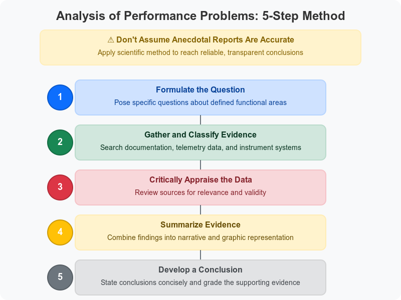
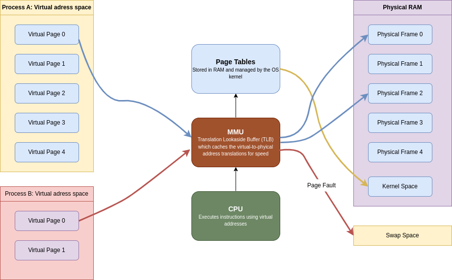
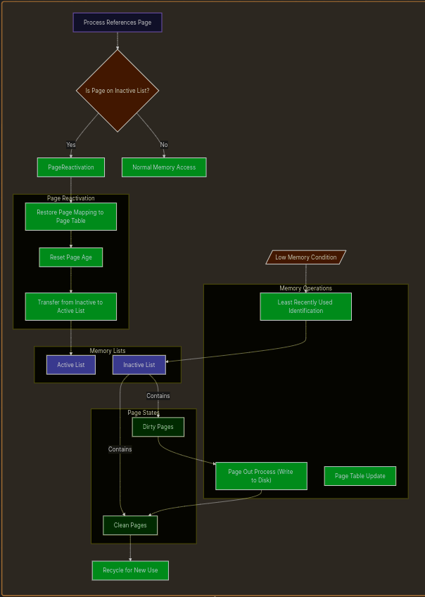

# Chapter 29: Performance Analysis

Performance analysis and tuning are often treated as a form of system administration witchcraft. They're not! (hopefully!!!), but they do qualify as both science and art. The "science" part involves making careful quantitatives measurements and applying the scientific method. The "art" part relates to the need to balance resources in a practical, level-headed way, since optimizing for one app or user can result in other app or users suffering.

Folks often assert that today’s performance problems are somehow wildly different from those of previous decades. That claim is inaccurate. It’s true that systems have become more complex, but the baseline determinants of performance and the high-level abstractions for measuring and managing it remain the same as always. Unfortunately, improvements in system performance correlate strongly with the community’s ability to create new applications that suck up all available resources.

An added complexity of recent years is the many layers of abstraction that often sit between your servers and the physical infrastructure of the cloud. It’s often impossible to know exactly what hardware is providing storage or CPU cycles to your server.

The magic and the challenge of the cloud are two aspects of the same form. Despite popular belief, you do not get to ignore performance considerations just because your servers are virtual. In fact, the billing models used by cloud providers create an even more direct link between operational efficiency and server costs. Knowing how to measure and evaluate performance has become more important than ever.

## Performance tuning philosophy

Users and administrators alike often think that if they only knew the right “magic,” their systems would be twice as fast. But that’s rarely true.

One common fantasy involves tweaking the kernel variables that control the paging system and the buffer pools.
Though you should avoid unnecessary kernel variable modifications. Modern kernels are designed to automatically balance performance across different scenarios, making manual tweaking often counterproductive.

Performance issues often stem from applications, not the operating system.

Given the complexity of modern applications, some problems can only be resolved through collaboration among application developers, system administrators, server engineers, DBAs, storage administrators, and network architects.


Be skeptical of online advice about system performance. Many arguments seem convincing but lack proper testing. Popular support means little—claims like “I increased my buffer cache, and it feels faster!” are often unreliable.

Key Rules :

- Review historical data; compare with past performance to identify issues.
- Use trend analysis tools (see [Chapter 28: Monitoring](../monitoring/readme.md)) for performance assessment.
- Compare tuning results against previous baselines.
- Avoid overloading systems; once resources max out, performance degrades.
- Use lightweight monitoring tools (e.g., `sar`, `vmstat`) to minimize system impact.
- Change one thing at a time, document it, and analyze the results.
- Always have a rollback plan in case a fix backfires.

## Ways to improve performance

- Ensure that the system has enough memory.
- Use faster storage. SSDs are a good choice.
- Use load balancers to distribute the load.
- Fix code bottlenecks, better job scheduling.
- Maximize I/O throughput by using RAID.
- Monitor network traffic.

Adding memory, converting to SSDs, and balancing traffic across multiple servers can often make a huge difference in performance.

## Factors affecting performance

This four factors are the most important in determining system performance:

- CPU utilization
- Memory
- Storage I/O
- Network I/O

If resources are still left after active processes have taken what they want, the system’s performance is about as good as it can be.

If there are not enough resources to go around, processes must take turns. A process that does not have immediate access to the resources it needs has to wait around doing nothing. The amount of time spent waiting is one of the basic measures of performance degradation.

Historically, CPU utilization was one of the easiest resources to measure because a constant amount of processing power was always available.

Today’s dynamic, virtualized environments can shift CPU allocation on the fly—so if a process uses over 90% of its allocated CPU, it’s fully CPU bound. While faster CPUs help in compute-heavy cases, for everyday tasks other resources are more critical.

Disk bandwidth is a common performance bottleneck. Because traditional hard disks are mechanical systems, it takes many milliseconds to locate a disk block, fetch its contents, and wake up the process that’s waiting for it. Delays of this magnitude overshadow every other source of performance degradation. Each disk access causes a stall worth millions of CPU instructions. Solid state drives (SSDs) are one tool you can use to address this problem.

When memory is scarce, data moves to disk, making memory use as costly as disk access. To maintain performance, ensure sufficient physical memory. If you’re running out of memory, you can add more or use swap space. But swapping is slow, so it’s better to add more memory.

Network I/O is the most difficult resource to measure. Network performance is affected by many factors, including the network interface card (NIC), the network switch, the network cable, and the network protocol. Network performance is also affected by the number of packets sent and received, the size of the packets, and the number of connections.

## Stolen CPU cycles

The promise of the cloud (and of virtualization more generally) is that your server always has the resources it needs. But that’s not always true.

There are two ways by which CPU cycles can be stolen from your VM:

- Hypervisor-level CPU Quotas: Each virtual machine is allocated a specific amount of CPU power. If you need more, you can either increase resources at the hypervisor level or upgrade to a larger cloud instance.
- Physical Hardware Limitations: Even when individual VMs are within their quotas, overall physical hardware may be oversubscribed. In cloud environments, restarting the instance can help by reassigning to different hardware. In private data centers, resolving this might require upgrading the virtualization infrastructure with additional resources. VMwares DRS (Distributed Resource Scheduler) is a tool that can help with this.

Although CPU stealing can happen to any operating system running on a virtualized platform, Linux gives you some visibility into this phenomenon with the st metric (“stolen”) in `top`, `vmstat`, and `mpstat`.

## Analysis of performance problems



Here an exemple created by claude AI to better understand the 5 steps of performance analysis:

1. **Formulate the question**:

"Why has our company website's load time increased from under 2 seconds to over 8 seconds during the past month, particularly during business hours (9am-5pm)? We're considering either upgrading our web server hardware or optimizing the database queries."

2. **Gather and classify evidence**:

**Documentation review**: Checked server specifications, recent change logs, and application updates
**Knowledge base search**: Reviewed similar cases in our internal knowledge base and Stack Overflow
**System telemetry**:

- Collected server CPU, memory, and disk I/O metrics over two weeks
- Captured network traffic patterns
- Ran database query performance logs
- Implemented browser-side page load timing for different components
- Reviewed web server access logs grouped by time of day

3. **Critically appraise the Data**:

- CPU usage shows spikes to 95% during business hours, correlating with slow load times
- Memory usage remains stable at 60-70% regardless of load
- Database query execution plans show no significant performance degradation
- Access logs reveal a 300% increase in traffic from internal IP addresses during business hours
- Browser timing shows most delay occurs before any content begins loading (server processing time)
- Recent code deployment (3 weeks ago) added new image processing for product thumbnails that runs on each page load
- No hardware changes during the period in question

4. **Summarize the Evidence**:

**Narrative summary**: The significant increase in load times appears during business hours and strongly correlates with CPU usage spikes. Memory and disk I/O remain within normal parameters. Database performance is consistent, but server processing time has increased dramatically. This timing coincides with a recent code deployment that added CPU-intensive image processing for product thumbnails that runs on every page load rather than being cached.
**Graphical representation**: (Imagine a chart showing the correlation between page load times, CPU usage, and time of day, with a clear pattern emerging during business hours)

5. **Develop a Conclusion**:

**Conclusion**: The website slowdown is primarily caused by inefficient image processing code deployed three weeks ago, which performs redundant processing on every page load rather than caching results. The evidence strength is high (Grade A) based on:

1. Clear correlation between CPU usage and page load time
2. Timing that matches the code deployment
3. Identification of specific inefficient code patterns
4. Elimination of other potential causes through systematic investigation

**Recommendation**: Modify the image processing code to cache results rather than reprocessing images on each page load. This should resolve the performance issue without requiring hardware upgrades.
This example shows how the 5-step method leads to a clear understanding of the root cause and a targeted solution, rather than pursuing the initially considered hardware upgrade that would likely have been costly and ineffective.

## System performance checkup

### Taking stock of your equipment

On Linux OS, the `/proc` filesystem is the place to find an overview of the hardware your OS thinks you have.

**Sources of hardware information on Linux**

| File              | Contents                          |
| ----------------- | --------------------------------- |
| `/proc/cpuinfo`   | Information about the CPU(s)      |
| `/proc/meminfo`   | Memory size and usage             |
| `/proc/diskstats` | Disk devices and usage statistics |

When you cat the content of `/proc/cpuinfo`, you get this kind of output:

```bash
$ cat /proc/cpuinfo
processor       : 0
vendor_id       : GenuineIntel
cpu family      : 6
model           : 15
model name      : Intel(R) Xeon(R) CPU E5-2670 0 @ 2.60GHz
stepping        : 11
cpu MHz         : 2599.998
cache size      : 20480 KB
physical id     : 0
cpu cores       : 2
siblings        : 2
```

The file contains one entry for each CPU core. The `processor` field is the core number, and the `model name` field gives the CPU model.

Another command to run for information on both FreeBSD and Linux is `dmicdecode`. It dumps the system's DMI (Desktop Management Interface) data.

**Type values for dmidecode -t**

| Value | Description                  |
| ----- | ---------------------------- |
| 1     | System information           |
| 2     | Baseboard (or motherboard)   |
| 3     | Chassis information          |
| 4     | Processor information        |
| 7     | Cache information            |
| 8     | Port connection information  |
| 9     | System slot information      |
| 11    | OEM strings                  |
| 12    | System configuration options |
| 13    | BIOS language information    |
| 16    | Physical memory array        |
| 17    | Memory device                |
| 19    | Memory array mapped address  |
| 32    | System boot information      |
| 38    | IPMI device information      |

Ex : `dmidecode -t 4` will give you information about the processor.

### Gathering performance data

Most performance analysis tools tell you what’s going on at a particular point. But to understand performance, you need to know what’s been happening over time. That’s where monitoring tools come in.

### Analyzing CPU usage

You will probably want to gather three kinds of CPU data: overall utilization, load averages, and per-process CPU consumption. Overall utilization can help systems on which the CPU's speed is itself the bottleneck. Load averages profile overall system performance. Per-process CPU consumption can help you identify which processes are hogging the CPU.

You can obtain summary information with the vmstat command. 


The `cs` column shows context switches per interval (that is, the number of times that the kernel changed which process was running). The number of interrupts per interval (usually from hardware devices), `in`, represents the number of times the CPU was interrupted to handle hardware requests. An extremely high `cs` or `in` values typically indicate a misbehaving or misconfigured hardware device.

Long-term averages of the CPU statistics let you determine whether there is fundamentally enough CPU power to go around. If the CPU usually spends part of its time in the idle state, there are cycles to spare. Upgrading the CPU won’t help to improve overall throughput.

On a workstation with only one user, the CPU generally spends a lot of time idle. Then when you render a web page or compile a program, the CPU usage spikes in a short period. In this situation, information about long-term average CPU usage is not meaningful. 

The second CPU statistic that’s useful for characterizing the burden on your system is the "load average," which represents the average number of runnable processes. It gives  you a good idea of how many pieces the CPU pie is being divided into.

```bash
$ uptime
11:03:04 up 3 days,  1:40,  1 user,  load average: 3.55, 2.73, 2.04
```

The numbers 3.55 (1 minute), 2.73 (5 minutes), and 2.04 (15 minutes) indicate that, on average, between 2 and 3.5 processes were demanding CPU time during those intervals.

In general, the higher the load average, the more important the system’s aggregate performance becomes.

### Understanding how the system manages memory

The kernel manage memory in units called pages. The size of a page is determined by the hardware, but it’s usually 4 KiB. It allocates virtual pages to processes as they request memory. Each virtual page is mapped to real storage, either to RAM or to “backing store” on disk. The kernel uses a page table to keep track of these mappings between virtual and real pages of memory.



The kernel can effectively allocate as much memory as processes ask for by augmenting real RAM with swap space. Since process expect their virtual pages to map to real memory, the kernel may have to constantly shuffle pages between RAM and disk. This is called swapping RAM and swap as different pages are accessed. This is known as `paging`. `Swapping` is the process of moving entire process's pages to disk.

The kernel tries to manage the system's memory so pages that have been recently accessed are kept in RAM, while pages that haven’t been accessed in a while are moved to disk. This is known as an LRU (Least Recently Used) system.

When memory is low, the kernel tries to guess which pages on the inactive list were least krecently used. If those pages have been modified by a process, they are considered “dirty” and kmust be paged out to disk before the memory can be reused. Pages that have been laundered in kthis fashion (or that were never dirty to begin with) are “clean” and can be recycled for use elsewhere.

When a process refers to a page on the inactive list, the kernel return the page's memory mapping to the page table, resets the page's age, and transfers the page from the inactive list to the active list. Pages that have been written to disk must be paged in before they can be reactivated if the page in memory has been remapped (e.g., by a different process).



A `soft fault` occurs when a process references an in-memory inactive page. The kernel can simply reactivate the page and return the page's memory mapping to the page table. A `hard fault` occurs when a process references a page that has been paged out to disk. The kernel must read the page back into memory from disk before it can be reactivated. In a nutshell: a hard fault requires a disk I/O operation, while a soft fault does not.

The `/proc/sys/vm/swappiness` is a kernel parameter in Linux that controls the kernel's tendency to move processes from physical memory to swap space:

* A value of 0 means the kernel strongly prefers to keep processes in RAM and will instead drop cached files from memory when space is needed.
* A value of 100 means the kernel is more willing to move process memory to swap in order to keep the file cache in RAM. Basically shutting down least used processes!

If the kernel is unable to reclaim pages, Linux uses an “out-of-memory killer” to handle this condition.

### Analyzing memory usage

Two numbers summarize the memory activity: the total amount of active virtual memory and the current paging rate. The first number tells you the total demand for memory, and the second suggests the proportion of that memory that is actively use.

You can get the first metric from `swapon -s` command:

```bash
swapon -s
Filename                                Type            Size            Used            Priority
/dev/dm-2                               partition       999420          999368          -2
```

In Linux paging stats can be obtained through the `vmstat` command:

```bash
vmstat 5 5

procs -----------memory---------- ---swap-- -----io---- -system-- -------cpu-------
 r  b   swpd   free   buff  cache   si   so    bi    bo   in   cs us sy id wa st gu
 2  0 999368 707740 1105376 4061692    3   10  1294   704 5408    7  9  3 87  0  0  0
 0  0 999368 685376 1105376 4060880    0    0     0     0 1871 4198  2  1 97  0  0  0
 0  0 999368 695168 1105412 4060944    0    0     0   635 1960 4174  2  1 97  0  0  0
 1  0 999368 557008 1105428 4060952    0    0     1    80 2667 4000  7  1 92  0  0  0
 0  0 999368 604584 1105436 4061036    0    0     0   185 2226 4072  3  1 96  0  0  0
```
Paging statistics are condensed to two columns, si and so, which represent pages swapped in and out respectively.

Use the `si` and `so` fields to evaluate the system’s swapping behavior. A page-in (`si`) represents a page being recovered from the swap area. A page-out (`so`) represents data being written to the swap area after being forcibly ejected by the kernel.

### Analyzing disk I/O

You can monitor disk performance with the iostat command.

```
iostat -h
Linux 6.11.0-19-generic (abdoufermat)    23/03/2025      _x86_64_        (12 CPU)

avg-cpu:  %user   %nice %system %iowait  %steal   %idle
           9.4%    0.0%    2.9%    0.3%    0.0%   87.4%

      tps    kB_read/s    kB_wrtn/s    kB_dscd/s    kB_read    kB_wrtn    kB_dscd Device
    76.93         1.3M       703.4k         0.0k     512.5G     278.5G       0.0k dm-0
    69.33         1.3M       692.7k         0.0k     511.0G     274.2G       0.0k dm-1
     3.59         3.7k        10.7k         0.0k       1.5G       4.2G       0.0k dm-2
    54.45         1.3M       704.8k         0.0k     512.5G     279.0G       0.0k nvme0n1
```

Each hard disk has the columns `tps`, `kB_read/s`, `kB_wrtn/s`, `kB_read`, and `kB_wrtn`, indicating transfers per second, kilobytes read per second, kilobytes written per second, total kilobytes read, and total kilobytes written.

The cost of seeking is the most important factor affecting mechanical disk drive performance. 
To a first approximation, the rotational speed of the disk and the speed of the bus to which the disk is connected have relatively little impact. 

Modern mechanical disks can transfer hundreds of megabytes of data per second if they are read from contiguous sectors, but they can only perform about 100 to 300 seeks per second. SSD disks have a significant advantage over their mechanical predecessors because their performance is not tied to platter rotation or head movement.

It’s especially important to split the paging (swap) area among several disks if possible (to reduce the `seeking` time with parallelization), since paging tends to slow down the entire system. 

For example, if an application is writing its log to the same device used for database logs, a disk bottleneck may result.

### fio: testing storage subsystem performance

fio ([github.com/axboe/fio](github.com/axboe/fio)) is available for both Linux and FreeBSD. Use it to test the performance of the storage subsystem. It’s particularly helpful in large environments where shared storage resources (such as a Storage Area Network) are deployed.

### Choosing a linux I/O scheduler

Linux systems use an I/O scheduling algorithm to mediate among processes competing to perform disk I/O. The I/O scheduler massages the order and timing of disk requests to achieve the best possible overall I/O performance for a given application or situation.

Three different scheduling algorithms are available in current Linux kernels:

- Completely Fair Queuing: This is the default algorithm and is usually the best choice for mechanical hard disks on general-purpose servers. It tries to evenly distribute access to I/O bandwidth. (If nothing else, the algorithm surely deserves an award for marketing: who could ever say no to a completely fair scheduler?) 
- Deadline: This algorithm tries to minimize the latency for each request. It reorders requests to increase performance. 
- NOOP: This algorithm implements a simple FIFO queue. It assumes that I/O requests have already been optimized or reordered by the driver, or that they will be optimized or reordered by the device (as might be done by an intelligent controller). This option may be the best choice in some SAN environments and is the best choice for SSD drives (because SSD drives don’t have variable retrieval latencies).

set "elevator=algorithm" in GRUB config file, `grub.conf` to make the scheduling algorithm persist across reboots.

## Server got reaaaaaallllly SLOWWWWW!


When a system becomes sluggish, the likely culprit is a resource-hungry process consuming excessive CPU, memory, disk, or network resources. To diagnose:

1. Use `ps auxww` or `top` to identify CPU-intensive processes (look for ones using >50% CPU or multiple processes using >10%).
2. Check the system load with `uptime` and idle CPU time with `vmstat` or `top`.
3. Monitor paging and disk activity with `vmstat` - excessive page-outs indicate memory contention, while high disk I/O without paging suggests a process monopolizing disk operations.
4. Link disk activity to processes by examining which active processes are using CPU time.

For resolving issues:
- Often it's best to take no action, as some legitimate operations simply require substantial resources.
- For CPU-bound processes, you can use `renice` to lower their priority.
- For disk-intensive processes, Linux offers `ionice` (particularly `ionice -c 3 -p pid`) to restrict I/O privileges.
- For memory-hungry processes, use `ulimit` to set memory usage limits.

If no single process appears responsible, investigate:
- Network overloading, which can cause brief but dramatic performance issues
- Server-related delays from remote services like NFS, Kerberos, or DNS

