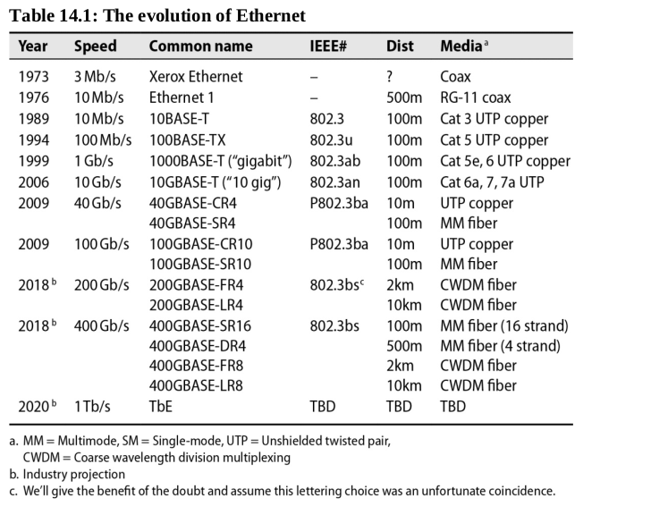

# Chapter 14: Physical Networking

[NOT GONNA SPEND A LOT OF TIME ON THIS]

Physical networking refers to the hardware that connects computers and transmits data. This includes cables, routers, switches, and other devices. While virtual networks are becoming more common, familiarity with traditional networking is still important.

## Ethernet

Having captured over 95% of the world-wide local area network (LAN) market, Ethernet can be found just about everywhere in its many forms. It started as **Bob Metcalfe’s Ph.D. thesis at MIT** but is now described in a variety of IEEE standards.

Ethernet is the most common physical networking technology. It uses twisted-pair cables to connect devices. Ethernet cables are typically terminated with an RJ-45 connector. Ethernet is used in local area networks (LANs) and wide area networks (WANs).

## Wireless

Wireless networking is becoming more common as technology improves. Wireless networks use radio waves to transmit data. Wireless networks are often used in homes and businesses. They are also used in public places like coffee shops and airports.

## SDN: Software Defined Networking

Software-defined networking (SDN) is a new approach to networking that uses software to control network traffic. SDN allows network administrators to manage network traffic more efficiently. SDN is becoming more common as technology improves.