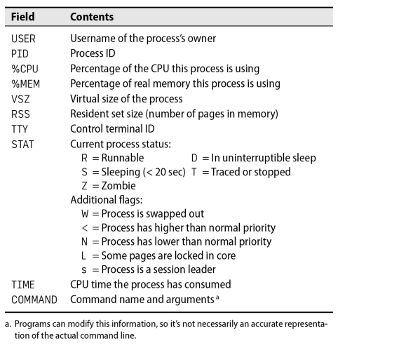
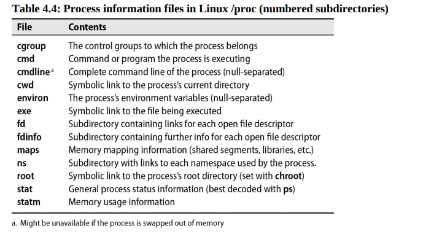

# Chapter 4: Process Control


## Components of a Process

A process consists of an address space and a set of data structures within the kernel. The address space is a set of memory pages that the kernel has marked for the process's use. (Pages are the units in which memory is managed. They are usually 4KiB or 8KiB in size.) These pages are used to hold the process's code, data, and stack. The data structures within the kernel keep track of the state of the process, its priority, its scheduling parameters, and so on.

Think of a process as a container for a set of resources that the kernel manages on behalf of the running program. These resources include the memory pages that hold the program's code and data, the file descriptors that refer to open files, and the various attributes that describe the state of the process.

The kernel's internal data structures record various pieces of information about each process:

- The process's address space map
- The current status of the process (running, sleeping, and so on)
- The process's priority
- Information about the resources the process has used (CPU, memory, and so on)
- Information about the files and network ports the process has opened
- The process's signal mask (the set of signals that are currently blocked)
- The owner of the process (the user ID of the user who started the process)

A "thread" is an execution context within a process. A process can have multiple threads, all of which share the same address space and other resources. Threads are used to achieve parallelism within a process. Threads are also known as lightweight processes because they are much cheaper to create and destroy than processes.

As an example to understand the concept of process and thread, consider a web server. The web server listens for incoming connections and then creates a new thread to handle each incoming request. Each thread handles one request at a time, but the web server as a whole can handle many requests simultaneously because it has many threads. Here, the web server is a process, and each thread is a separate execution context within the process.

### The PID: process ID number

Each process is identified by a unique process ID number, or PID. The PID is an integer that the kernel assigns to each process when the process is created. The PID is used to refer to the process in various system calls, for example, to send a signal to the process.

The concept of process "namespaces" allows different processes to have the same PID. Namespaces are used to create containers, which are isolated environments that have their own view of the system. Containers are used to run multiple instances of an application on the same system, each in its own isolated environment.

### The PPID: parent process ID number

Each process is also associated with a parent process, which is the process that created it. The parent process ID number, or PPID, is the PID of the process's parent. The PPID is used to refer to the parent process in various system calls, for example, to send a signal to the parent process.

### The UID and EUID: user ID and effective user ID

The user ID, or UID, is the user ID of the user who started the process. The effective user ID, or EUID, is the user ID that the process uses to determine what resources the process can access. The EUID is used to control access to files, network ports, and other resources.


## Lifecycle of a Process

To create a new process, a process copies itself with the **fork** system call. **fork** creates a copy of the original process, and that copy is largely identical to the parent. The new process has a distinct **PID** and has its own accounting information. (Technically, Linux system use **clone**, a superset of **fork** that handles threads and includes additional features. **fork** remains in the kernel for backward compatibility but calls **clone** internally.)

When the system boots, the kernel autonomously creates and installs several processes. The most notable of these is **init** or **systemd**, which is always process number 1. This process executes the system's startup scripts, althought the exact manner in which this is done differs slightly between UNIX and Linux. All processes other than the ones the kernel creates are descendants of this primordial process.

### Signals

Signals are a way to send notifications to a process. They are used to notify a process that a particular event has occurred. 

About thirty different kinds are defined, and they’re used in a variety of ways:

- They can be sent among processes as a means of communication.
- They can be sent by the terminal driver to kill, interrupt, or suspend processes when keys such as <Control-C> and <Control-Z> are pressed.
- They can be sent by an administrator (with kill) to achieve various ends.
- They can be sent by the kernel when a process commits an infraction such as division by zero.
- They can be sent by the kernel to notify a process of an “interesting” condition such as the death of a child process or the availability of data on an I/O channel.


The signals KILL, INT, TERM, HUP, and QUIT all sound as if they mean approximately the same thing, but their uses are actually quite different.

- **KILL** is unblockable and terminates a process at the kernel level. A process can never actually receive or handle this signal.
- **INT** is sent by the terminal driver when the user types <Control-C>. It’s a request to terminate the current operation. Simple program should quit (if they catch the signal) or simply allow themselves to be killed, which is the default if the signal is not caught. Programs that have interactive command lines (such as shells) should stop what they're doing, clean up, and wait for user input again.
- **TERM** is a request to terminate execution completely. It's expected that the receiving process will clean up its state and exit.
- **HUP** is sent to a process when the controlling terminal is closed. Originally used to indicate a "hang up" of a phone connection, it is now often used to instruct a daemon process to terminate and restart, often to take into account new configurations. The exact behavior depends on the specific process receiving the HUP signal.
- **QUIT** is similar to TERM, except that it defaults to producing a core dump if not caught. A few programs cannibalize this signal and interpret it to mean something else.

### kill: send signals

As its name implies, the **kill** command is most often used to terminate a process. **kill** can send any signal, but by default it sends a TERM. **kill** can be used by normal users on their own processes or by root on any process. The syntax is:

```bash
kill [-signal] pid
```

where *signal* is the number or symbolic name of the signal to be sent and *pid* is the process identication number of the target process.

A **kill** without a signal number does not guarantee that the process will die, because the TERM signal can be caught, blocked, or ignored. The command **kill -9 pid** is guaranteed to kill the process because the KILL signal cannot be caught, blocked, or ignored.

**killall** kills processes by name rather than by process ID. It is not available on all systems.
Example:

```bash
killall firefox
```

The **pkill** command is similar to **killall** but provides more options.

Example:

```bash
pkill -u abdoufermat # kill all processes owned by user abdoufermat
```

## PS: Monitoring Processes

The **ps** command is the system administrator’s main tool for monitoring processes. Although versions of **ps** differ in their arguments and display, they all deliver essentially the same information.

**ps** can show the PID, UID, priority, and control terminal of processes. It also informs you how much memory a process is using, how much CPU time it has consumed, and what its current status is (running, stopped, sleeping, and so on).

You can obtain a useful overview of the system by running **ps aux**. The **a** option tells **ps** to show the processes of all users, and the **u** option tells it to provide detailed information about each process. The **x** option tells **ps** to show processes that are not associated with a terminal.

```bash
$ ps aux | head -8
USER       PID %CPU %MEM    VSZ   RSS TTY      STAT START   TIME COMMAND
root         1  0.0  0.0  22556  2584 ?        Ss   2019   0:02 /sbin/init
root         2  0.0  0.0      0     0 ?        S    2019   0:00 [kthreadd]
root         3  0.0  0.0      0     0 ?        I<   2019   0:00 [rcu_gp]
root         4  0.0  0.0      0     0 ?        I<   2019   0:00 [rcu_par_gp]
root         6  0.0  0.0      0     0 ?        I<   2019   0:00 [kworker/0:0H-kblockd]
root         8  0.0  0.0      0     0 ?        I<   2019   0:00 [mm_percpu_wq]
root         9  0.0  0.0      0     0 ?        S    2019   0:00 [ksoftirqd/0]
```



ANother useful set of arguments is **lax**, which gives more technical informations about the processes. **lax** is slightly faster than **aux** because it doesn't need to resolve user and group names.

```bash
$ ps lax | head -8
F   UID   PID  PPID PRI  NI    VSZ   RSS WCHAN  STAT TTY        TIME COMMAND
4     0     1     0  20   0  22556  2584 -      Ss   ?          0:02 /sbin/init
1     0     2     0  20   0      0     0 -      S    ?          0:00 [kthreadd]
1     0     3     2  20   0      0     0 -      I<   ?          0:00 [rcu_gp]
1     0     4     2  20   0      0     0 -      I<   ?          0:00 [rcu_par_gp]
1     0     6     2  20   0      0     0 -      I<   ?          0:00 [kworker/0:0H-kblockd]
1     0     8     2  20   0      0     0 -      I<   ?          0:00 [mm_percpu_wq]
1     0     9     2  20   0      0     0 -      S    ?          0:00 [ksoftirqd/0]
```

To look for a specific process, you can use **grep** to filter the output of **ps**.

```bash
$ ps aux | grep -v grep | grep firefox
```

We can determine the PID of a process by using **pgrep**.

```bash
$ pgrep firefox
```

or **pidof**.

```bash
$ pidof /usr/bin/firefox
```

## Interactive monitoring with top

The **top** command provides a dynamic real-time view of a running system. It can display system summary information as well as a list of processes or threads currently being managed by the Linux kernel. The types of system summary information shown and the types, order, and size of information displayed for processes are all user configurable and that configuration can be made persistent across restarts.

By default, the display update every 1-2 seconds, depending on the system.

There's also a **htop** command, which is an interactive process viewer for Unix systems. It is a text-mode application (for console or X terminals) and requires ncurses. It is similar to top, but allows you to scroll vertically and horizontally, so you can see all the processes running on the system, along with their full command lines. **htop** also has a better user interface and more options for operations.

## Nice and renice: changing process priority

The **niceness** is a numeric hint to the kernel about how the process should be treated in relation to other processes contending for the CPU.

A high niceness means a low priority for your process: you are going to be nice. A low or negative value means high priority: you are not very nice!

The range of allowable niceness values varies among systems. In Linux the range is -20 to +19, and in FreeBSD it's -20 to +20.

A low priority process is one that is not very important. It will get less CPU time than a high priority process. A high priority process is one that is important and should be given more CPU time than a low priority process.

For example, if you are running a CPU-intensive job that you want to run in the background, you can start it with a high niceness value. This will allow other processes to run without being slowed down by your job.

The **nice** command is used to start a process with a given niceness value. The syntax is:

```bash
nice -n nice_val [command]

# Example
nice -n 10 sh infinite.sh &
```

The **renice** command is used to change the niceness value of a running process. The syntax is:

```bash
renice -n nice_val -p pid

# Example
renice -n 10 -p 1234
```

**The priority value** is the process’s actual priority which is used by the Linux kernel to schedule a task.
In Linux system priorities are 0 to 139 in which 0 to 99 for real-time and 100 to 139 for users.

The relation between nice value and priority is as follows:

> priority_value = 20 + nice_value

The default nice value is 0. The lower the nice value, the higher the priority of the process.

## The /proc filesystem

The Linux versions of **ps** and **top** read their process status information from the **/proc** directory, a pseudo-filesystem in which the kernel exposes a variety of interesting information about the system's state.

Despite the name, **/proc** contains other information than just processes (stats generated by the system, etc).

Processes are represented by directories in **/proc**, and each process has a directory named after its PID. The **/proc** directory contains a variety of files that provide information about the process, such as the command line, environment variables, file descriptors, and so on.



## Strace and truss

To figure out what a process is doing, you can use **strace** on Linux or **truss** on FreeBSD. These commands trace system calls and signals. They can be used to debug a program or to understand what a program is doing.

For example, the following log was produced by strace run against an active copy of top (which was running as PID 5810):

```bash
$ strace -p 5810

gettimeofday({1197646605,  123456}, {300, 0}) = 0
open("/proc", O_RDONLY|O_NONBLOCK|O_LARGEFILE|O_DIRECTORY) = 7
fstat64(7, {st_mode=S_IFDIR|0555, st_size=0, ...}) = 0
fcntl64(7, F_SETFD, FD_CLOEXEC)          = 0
getdents64(7, /* 3 entries */, 32768)   = 72
getdents64(7, /* 0 entries */, 32768)   = 0
stat64("/proc/1", {st_mode=S_IFDIR|0555, st_size=0, ...}) = 0
open("/proc/1/stat", O_RDONLY)           = 8
read(8, "1 (init) S 0 1 1 0 -1 4202752"..., 1023) = 168
close(8)                                = 0

[...]
```

**top** starts by checking the current time. It then opens and stats the **/proc** directory, and reads the **/proc/1/stat** file to get information about the **init** process.

## Runaway processes

Occasionally a process will stop responding to the system and run wild. These processes ignore their scheduling priority and insist on taking up 100% of the CPU. Because other processes can only get limited access to the CPU, the machine begins to run very slowly. This is called a runaway process.

The **kill** command can be used to terminate a runaway process. If the process is not responding to a TERM signal, you can use the KILL signal to terminate it.

```bash
kill -9 pid

or

kill -KILL pid
```

We can investigate the cause of the runaway process by using **strace** or **truss**. Runaway processes that produce output can fill up an entire filesystem. 

You can run a **df -h** to check the filesystem usage. If the filesystem is full, you can use the **du** command to find the largest files and directories.


You can also use the **lsof** command to find out which files are open by the runaway process.

```bash
lsof -p pid
```

## Periodic processes

### cron: schedule command

The cron (crond on RedHat: yeah weirddos!!) daemon is the traditional tool for running commands on a predtermined schedule. It starts when the system boots and runs as long as the system is up.

**cron** reads configuration files containing lists of command lines and times at which they are to be invoked. The command lines are executed by **sh**, so almost anything you can do by hand from the shell can also be done with **cron**.

A cron configuration file is called a “crontab,” short for “cron table.” Crontabs for individual users are stored under **/var/spool/cron** (Linux) or **/var/cron/tabs** (FreeBSD).

### format of crontab

A crontab file has five fields for specifying day, date and time followed by the command to be run at that interval.

```bash
*     *     *     *     *  command to be executed
-     -     -     -     -
|     |     |     |     |
|     |     |     |     +----- day of week (0 - 6) (Sunday=0)
|     |     |     +------- month (1 - 12)
|     |     +--------- day of month (1 - 31)
|     +----------- hour (0 - 23)
+------------- min (0 - 59)
```

Some examples:

```bash
# Run a command at 2:30am every day
30 2 * * * command

# Run a command at 10:30pm on the 1st of every month
30 22 1 * * command

# Run a Python script every 1st of the month at 2:30am
30 2 1 * * /usr/bin/python3 /path/to/script.py
```

The following  schedule: 0,30 * 13 * 5 means that the command will be executed at 0 and 30 minutes past the 13th hour on Friday. If you want to run a command every 30 minutes, you can use the following schedule: */30 * * * *. 

**crontab management**

The **crontab** command is used to create, modify, and delete crontabs. The **-e** option is used to edit the crontab file, the **-l** option is used to list the crontab file, and the **-r** option is used to remove the crontab file.

### Systemd timer

A systemd timer is a unit configuration file whose name ends in **.timer**. systemd timers can be used as an alternative to cron jobs. They are more flexible and more powerful than cron jobs.

A timer unit is activated by a corresponding service unit. The service unit is triggered by the timer unit at the time specified in the timer unit. The timer unit can also be activated by the system boot or by an event.

The **systemctl** command is used to manage systemd units. The **list-timers** option is used to list the active timers.

```bash
$ systemctl list-timers

NEXT                         LEFT          LAST                         PASSED       UNIT                         ACTIVATES
Fri 2021-10-15 00:00:00 UTC  1h 1min left Thu 2021-10-14 00:00:00 UTC  22h ago      logrotate.timer              logrotate.service

1 timers listed.
```

In the example above, the **logrotate.timer** unit is scheduled to activate the **logrotate.service** unit at midnight every day.

Here's what the **logrotate.timer** unit looks like:

```bash
$ cat /usr/lib/systemd/system/logrotate.timer

[Unit]
Description=Daily rotation of log files
Documentation=man:logrotate(8) man:logrotate.conf(5)

[Timer]
OnCalendar=daily
AccuracySec=1h
Persistent=true

[Install]
WantedBy=timers.target

```

The **OnCalendar** option is used to specify when the timer should activate the service. The **AccuracySec** option is used to specify the accuracy of the timer. The **Persistent** option is used to specify whether the timer should catch up on missed runs.


### Common use for scheduled tasks

**Sending mail**

You can automatically email the output of a daily report or the results of a command execution using **cron** or **systemd** timers.

For example:
    
```bash
30 4 25 * * /usr/bin/mail -s "Monthly report"
    abdou@admin.com%Receive the monthly report for the month of July!%%Sincerely,%cron%
```

**Cleaning up a filesystem**

You can use **cron** or **systemd** timers to run a script that cleans up a filesystem. For example, you can use a script to purge the contents of trash directory every day at midnight.

```bash
0 0 * * * /usr/bin/find /home/abdou/.local/share/Trash/files -mtime +30 -exec /bin/rm -f {} \;
```

**Rotating a log file**

To rotate a log file means to divide it into segments by size or by date, keeping several older versions of the log available at all times. Since log rotation is a recurrent and regularly occurring event, it’s an ideal task to be scheduled.

**Running batch jobs**

Some long-running calculations are best run as batch jobs. For example, messages can accumulate in a queue or database. You can use a cron job to process all the queued messages at onces as an ETL (Extract, Transform, Load) to another location, such as a data warehouse.

**Backing up and mirroring**

You can use a scheduled task to automatically back up a directory to a remote system.
Mirrors are byte-for-byte copies of a filesystem or directories that are hosted on another system. They can be used as a form of backup or as a way to distribute files across multiple systems. 
You can use a periodic execution of **rsync** to keep the mirror up to date.