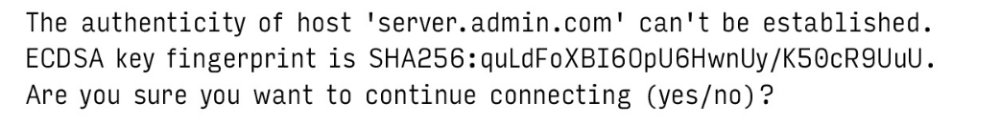
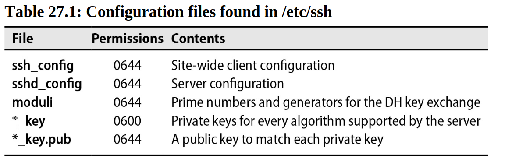
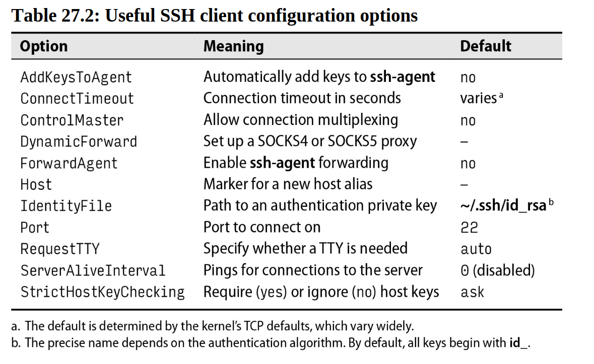
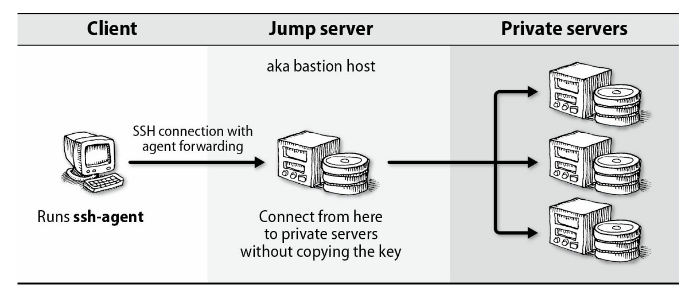
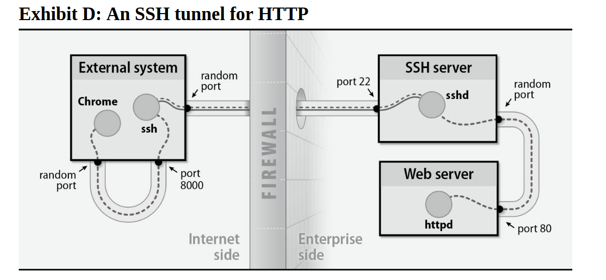

# Chapter 27: Security


Computer security is in a sorry state. In contrast to the progress seen in virtually every other area of computing, security flaws have become increasingly dire and the consequences of inadequate security more severe.

Here a reminder of some security events:

- The sophisticated Stuxnet worm, discovered in 2010, attacked Iran's nuclear program by damaging centrifuges at a uranium enrichment plant.
- n 2013, Edward Snowden exposed the massive NSA surveillance machine, revealing that some major Internet companies were complicit in allowing the government to spy on US citizens.
- Around 2013, a new type of attack known as ransomware came to prominence.
- In 2015, the U.S. Office of Personnel Management was breached.
- In 2016, Russian state-sponsored hackers allegedly mounted a campaign to influence the outcome of the U.S. presidential election.
- In 2017, a ransomware attack of unprecedented scale took over Windows systems in more than 150 countries. THe attack used an exploit developed by the NSA.

Part of the challenge is that security problems are not purely technical. You cannot solve them by buying a particular product or service from a third party. Achieving an acceptable level of security requires patience, vigilance, knowledge, and persistence—not just from you and other sysadmins, but from your entire user and management communities.

Strike balance between security and usability.

The more security measures you introduce, the more constrained you and your users will be.

Is UNIX secure? Of course not. UNIX and Linux are not secure, nor is any other operating system that communicates on a network. If you must have absolute, total, unbreachable security, then you need a measurable air gap between your computer and any other device. Sometimes even an air gap isn't enough. In a 2014 paper, Genkin, Shamir, and Tromer described a technique to extract RSA encryption keys from laptops by analyzing the high-pitched frequencies they emit when decrypting a file.


Some people argue that you also need to enclose your computer in a special room that blocks electromagnetic radiation (look up “Faraday cage”). How fun is that?

## Elements of security

The field of information security is quite broad, but it is often best described by the “CIA triad”:

- Confidentiality
- Integrity
- Availability

Confidentiality concerns the privacy of data. Access to information should be limited to those who are authorized to have it. Authentication, access control, and encryption are a few of the subcomponents of confidentiality.

Integrity relates to the authenticity of information. Data integrity technology ensures that information is valid and has not been altered in unauthorized ways. It also addresses the trustworthiness of information sources. When a secure web site presents a signed TLS certificate, it is proving to the user not only that the information it is sending is encrypted but also that a trusted certificate authority (such as VeriSign or Equifax) has verified the identity of the source. Technologies such as PGP also offer some assurance of data integrity.

Availability expresses the idea that information must be accessible to authorized users when they need it. Otherwise, the data has no value. Outages not caused by intruders (e.g., those caused by administrative errors or power outages) also fall into the category of availability problems. Unfortunately, availability is often ignored until something goes wrong.

## How security is compromised

### Social engineering

The term “phishing” describes attempts to collect information from users or to coax them to into doing something foolish, such as installing a malware.
Phishing begins with deceptive emails, instant messages, text messages, or social media contacts.

Social engineering is a powerful hacking technique and is one of the most difficult threats to neutralize.


### Software vulnerabilities

Buffer overflows are an example of a programming error with complex security implications. Developers often allocate a predetermined amount of temporary memory space, called a buffer, to store a particular piece of information. Buffer overflows are a subcategory of a larger class of software security bugs known as input validation vulnerabilities.

What can you as an administrator do to prevent this type of attack? It depends, but one obvious approach is to reduce the privileges that your applications run with to minimize the impact of security bugs. A process running as unprivileged user can do less damage than one that runs as root.


### DDoS

A DDoS attack aims to interrupt a service or adversely impact its performance, making the service unavailable to users. To conduct an attack, attackers plant malicious code on unprotected devices outside the victim's network. This code lets attackers remotely command these intermediary systems, forming a "botnet".

In recent years, botnets have been assembled from Internet-connected devices such as IP cameras, printers, and even baby monitors. In the fall of 2016, the Mirai botnet targeted security researcher and blogger Brian Krebs, slamming his site with 620Gb/s of traffic from tens of thousands of source IP addresses. 


### Network, system, or application configuration errors

Software can be configured securely or not-so-securely. Software is developed to be useful instead of annoying, hence not-so-securely is too often the default. Hackers frequently gain access by exploiting features that would be considered helpful and convenient in less treacherous circumstances: accounts without passwords, firewalls with overly relaxed rules, and unprotected databases, to name a few.

A typical example of a host configuration vulnerability is the standard practice of allowing Linux systems to boot without requiring a boot loader password.

However, it's also a perfect example of the need to balance security against usability. Requiring a password means that if the system goes down, the admin would have to be physically present to get the machine running again.

## Basic Security measures

At the highest level, you can improve your site's security by keeping in mind a few rules of thumb:

- Apply the principle of least privilege by allocating only the minimum privileges needed.
- Layer security measures to achieve defense in depth. For example, don't rely solely on your external firewall for network protection
- Minimize the attack surface. The fewer interfaces, exposed systems, unnecessary services, and unused or underused systems, the lower the potenntial vulnerabilities and security weaknesses.

### Software updates

Keeping systems updated with the latest patches is an administrator's highest-value security chore.

A reasonable approach to patching should include the following elements:

1. **Regular Patch Schedule**: Implement and follow a consistent patch schedule, typically monthly, while accommodating urgent critical patches. Consider user impact when planning.  
2. **Change Plan**: Document patch impacts, testing steps, and rollback procedures. Share the plan with all stakeholders.  
3. **Patch Relevance**: Stay informed about relevant patches by subscribing to vendor-specific and general security updates (e.g., Bugtraq).  
4. **System Inventory**: Maintain an accurate inventory of all applications and OS in use, supported by reporting tools for full coverage.

### unnecessary services

Stock systems come with lots of services running by default. Disable (and possibly remove) those that are unnecessary, especially if they are network daemon.

### Backups

Regular, tested system backups are an essential part of any site security plan. They fall into the "availability" bucket of the CIA triad.

### Viruses and worms

UNIX and Linux have been mostly immune from viruses. Only a handful exist (most of which are academic in nature), and none have wreaked the kind of costly havoc that has become commonplace in the Windows world.

The exact reason for the lack of malicious software is unclear. Some claim that UNIX simply has less market share than its desktop competitors and is therefore not an interesting target for virus authors. Others insist that UNIX's access-controlled environment limits the damage from self-propagating worms and viruses.

### Rootkits

The craftiest hackers try to cover their tracks and avoid detection. They often use “root kits” to help them remain undetected. Sony is notorious for having included root-kit-like capabilities in the copy protection software included on millions of music CDs.

Root kits are programs and patches that hide important system information such as process, disk, or network activity. They come in many flavors and vary in sophistication from simple application replacements (such as hacked versions of ls and ps) to kernel modules that are nearly impossible to detect.

### Packet filtering

If you're connecting a system to a network that has Internet access, you must install a packet filtering router or a firewall. In addition to firewalling systems at the Internet gateway, you can double up with host-based one such as `ipfw` for FreeBSD and `iptables` for Linux.

If your systems are in the cloud, you can use security groups rather than physical firewalls. When designing security group rules, be as granular as possible. Consider adding outbound rules as well, to limit an attacker's ability to make outbound connections from your hosts.

### Passwords and MFA

1. **Password Rules**:
   - Every account must have a password.
   - Passwords should be complex and hard to guess to prevent compromise.

2. **Multifactor Authentication (MFA)**:
   - MFA enhances security by requiring two forms of verification:
     - Something you know (e.g., a password).
     - Something you have (e.g., a phone or physical device).
   - MFA is strongly recommended for all internet-facing portals, especially those with administrative access (e.g., VPNs, SSH, web application interfaces).

3. **MFA as a Minimum Requirement**:
   - MFA is now considered the **absolute minimum** for securing administrative interfaces.
   - Single-factor (password-only) authentication is increasingly seen as insufficient for any user authentication.

4. **Availability of MFA Services**:
   - Cloud-based MFA services like **Google Authenticator** and **Duo** make it easy to implement MFA.

### Application penetration testing

Security is only as strong as the weakest link in the chain. If you have a secure network and system infrastructure, but an application running on that infrastructure allows access to sensitive data without a password (for example), you have won the battle but lost the war.

Fortunately, the Open Web Application Security Project (OWASP) publishes information about common application vulnerabilities and methods for probing applications for these issues. 

## Passwords and user accounts

From a narrowly technical perspective, the most secure password of a given length consists of a random sequence of letters, punctuation, and digits. Years of propaganda and picky web site password forms have convinced most people that this is the sort of password they ought to be using. But of course, they never do, unless they use a password vault to remember passwords on their behalf. Random passwords are simply impractical to commit to memory at the lengths needed to withstand brute-force attacks (12 characters or longer).

Because password security increases exponentially with length, your best bet is to use a very long password (a “passphrase”) that is unlikely to appear elsewhere but is easy to remember. You can throw in a misspelling or modified character for extra credit, but the general idea is to let the length do the heavy lifting for you.

### Password changes

Change root and administrator passwords
- At least every six months
- Every time someone who had access to them leaves your site
- Whenever you wonder whether security might have been compromised

### Password vaults and password escrow

A password vault is a piece of software (or a combination of software and hardware) that stores passwords for your organization in a more secure fashion than “Would you like Windows to remember this password for you?”

Several developments have made a password vault almost a necessity:

- The proliferation of passwords needed not just to log in to computers, but also to access web pages, configure routers and firewalls, and administer remote services
- The increasing need for strong passwords as computers get so fast that weak passwords are easily broken
- Regulations that require access to certain data to be traceable to a single person—no shared logins such as root

Many password vault implementations are available. Free ones for individuals (e.g Keepass) store passwords locally, give all-or-nothing access to the password databse. Appliances suitable for huge enterprises (e.g., CyberArk) can cost tens of thousands of dollars.

One useful feature to look for in a password management system is a “break the glass” option, so named in honor of the hotel fire alarm stations that tell you to break the glass and pull the big red ever in the event of an emergency. In this case, “breaking the glass” means obtaining a password that you wouldn't normally have access to, with loud alarms being forwarded to other admins.

### Password aging

Most systems that have shadow passwords also let you compel users to change their passwords periodically, a facility known as password aging. 

On Linux systems, the `chage` program controls password aging.

The following command sets the minimum number of days between password changes to 2, sets the maximum number to 90, sets the expiration date to July 31, 2017, and warns the user for 14 days that the expiration date is approaching:

```bash
sudo chage -m 2 -M 90 -E 2025-02-23 -W 14 abdou
```

### Group logins and shared logins

Any login that is used by more than one person is bad news. Group logins (e.g., “guest” or “demo”) are sure terrain for hackers to homestead and are prohibited in many contexts by federal regulations such as HIPAA.

### Rootly enterprises

The only distinguishing feature of the root login is its UID of zero. Since there can be more than one entry in the `/etc/passwd` file that uses this UID, there can be more than one way to log in as root.

A common way for a hacker to install a back door after having obtained a root shell is to edit new root logins into `/etc/passwd`. Programs such as `who` and `w` refer to the name stored in `utmp` rather than UID that owns the shell, so they cannot expose hackers that appear to be innocent users but are really logged in as UID 0.

## Security power tools

### Network port scanner

Nmap's main function is to check a set of target hosts to see which TCP and UDP ports have servers listening on them. Running Nmap is a great way to find out what a system looks like to someone on the outside who is trying to break in. Nmap is sort of remote `netstat -tulnp`.

It works by sending specially crafted packets to target hosts and analyzing the responses to identify active devices, open ports, services, and their associated protocols. Nmap supports various scan techniques like TCP SYN, UDP, and OS fingerprinting.

```bash
λ sudo nmap -v -sV -O 192.168.1.12
[sudo] password for abdou:
Starting Nmap 7.80 ( https://nmap.org ) at 2025-01-22 01:30 CET
NSE: Loaded 45 scripts for scanning.
Initiating ARP Ping Scan at 01:30
Scanning 192.168.1.12 [1 port]
Completed ARP Ping Scan at 01:30, 0.35s elapsed (1 total hosts)
Initiating Parallel DNS resolution of 1 host. at 01:30
Completed Parallel DNS resolution of 1 host. at 01:30, 0.01s elapsed
Initiating SYN Stealth Scan at 01:30
Scanning 192.168.1.12 [1000 ports]
Discovered open port 80/tcp on 192.168.1.12
Discovered open port 2049/tcp on 192.168.1.12
SYN Stealth Scan Timing: About 45.07% done; ETC: 01:31 (0:00:38 remaining)
Completed SYN Stealth Scan at 01:31, 66.24s elapsed (1000 total ports)
Initiating Service scan at 01:31
Scanning 2 services on 192.168.1.12
Completed Service scan at 01:31, 6.36s elapsed (2 services on 1 host)
Initiating OS detection (try #1) against 192.168.1.12
Retrying OS detection (try #2) against 192.168.1.12
NSE: Script scanning 192.168.1.12.
Initiating NSE at 01:32
Completed NSE at 01:32, 0.72s elapsed
Initiating NSE at 01:32
Completed NSE at 01:32, 0.04s elapsed
Nmap scan report for 192.168.1.12
Host is up (0.36s latency).
Not shown: 997 filtered ports
PORT     STATE  SERVICE VERSION
80/tcp   open   http    nginx 1.18.0 (Ubuntu)
443/tcp  closed https
2049/tcp open   nfs     3-4 (RPC #100003)
MAC Address: D8:F8:83:B1:CB:B4 (Intel Corporate)
Aggressive OS guesses: Linux 2.6.32 - 3.13 (95%), Linux 2.6.22 - 2.6.36 (93%), Linux 3.10 - 4.11 (93%), Linux 2.6.39 (93%), Linux 3.10 (93%), Linux 2.6.32 (92%), Linux 3.2 - 4.9 (92%), Linux 2.6.32 - 3.10 (92%), Linux 2.6.18 (91%), Linux 3.16 - 4.6 (91%)
No exact OS matches for host (test conditions non-ideal).
Uptime guess: 64.124 days (since Mon Nov 18 22:34:16 2024)
Network Distance: 1 hop
TCP Sequence Prediction: Difficulty=260 (Good luck!)
IP ID Sequence Generation: All zeros
Service Info: OS: Linux; CPE: cpe:/o:linux:linux_kernel

Read data files from: /usr/bin/../share/nmap
OS and Service detection performed. Please report any incorrect results at https://nmap.org/submit/ .
Nmap done: 1 IP address (1 host up) scanned in 93.42 seconds
           Raw packets sent: 3086 (139.220KB) | Rcvd: 66 (3.468KB)
```

### Nessus: next-generation network scanner

Nessus, originally released by Renaud Deraison in 1998, is a powerful and useful software vulnerability scanner. At this point, it uses more than 31,000 plug-ins to check for both local and remote security flaws.

It is the most widely accepted and complete vulnerability scanner available.

Nessus prides itself on being the security scanner that takes nothing for granted. Instead of assuming that all web servers run on port 80, for instance, it scans for web servers running on any port and checks them for vulnerabilities. Instead of relying on the version numbers reported by the service it has connected to, Nessus can attempt to exploit known vulnerabilities to see if the service is susceptible.

### Metasploit

Metasploit is controlled by the U.S.-based security company Rapid7, but its GitHub project has hundreds of contributors. Metasploit includes a database of hundreds of ready-made exploits for known software vulnerabilities.

Metasploit has the following basic workflow:

1. Scan remote systems to discover information about them.
2. Select and execute exploits according to the information found.
3. If a target is penetrated, use included tools to pivot from the compromised system to other hosts on the remote network.
4. Run reports to document the results.
5. Clean up and revert all changes to the remote system.

### Lynis

Lynis is an open-source security auditing tool designed for Unix-based systems such as Linux, macOS, and BSD. It performs in-depth system scans to assess security configurations, compliance, and vulnerabilities, providing detailed recommendations to improve overall security posture. 

### Bro (now Zeek): the programmable network intrusion detection system

Bro inspects all traffic flowing into and out of a network. It can operate in passive mode, in which it generates alerts for suspicious activity, or in active mode, in which it injects traffic to disrupt malicious activity. Both modes likely require modification of your site's network configuration.

More on [zeek.org](www.zeek.org)

Example: Suspicious Domain Detection: Using Zeek's scripting capabilities, you can write a script to flag connections to known malicious domains:

```zeek
event http_request(c: connection, method: string, host: string, uri: string) {
    local suspicious_domains = set("malicious.com", "badguy.org");
    if (host in suspicious_domains) {
        print fmt("ALERT: Suspicious domain accessed: %s by %s", host, c$id$orig_h);
    }
}
```

This script triggers an alert whenever a client connects to one of the listed malicious domains.

### Snort: the popular network intrusion detection system

Snort (snort.org) is an open source network intrusion prevention and detection system originally written by Marty Roesch and now maintained by Cisco. t has become the de facto standard for home-grown NIDS deployments and is also the basis of many commercial and “managed services” NIDS implementations.

**How Snort works:**

- **Traffic Inspection:** Snort examines packets as they traverse the network, dissecting their headers and payloads.
- **Pattern Matching:** Traffic is compared against a database of predefined signatures and rules for known attack patterns.
- **Alerts:** If a match is found, Snort generates an alert, which can be logged, sent to a monitoring system, or used to trigger a defensive action (like dropping the traffic).

Snort captures raw packets off the network wire and compares them with a set of rules, aka signatures. When Snort detects an event that's been defined as interesting, it can alert a system administrator or contact a network device to block the undesired traffic, among other actions.

### OSSEC: host-based intrusion detection

OSSEC serves up the following:
- Root kit detection
- Filesystem integrity checks
- Log file analysis
- Time-based alerting
- Active responses

The Open Source Host-based Intrusion Detection System (OSSEC) supports multiple features and its implementation consists of Agents that collect and send event logs to a Manager that analyzes and tests them against specific rules. In the Manager, if certain events match a specific rule, predefined actions are triggered in the Agents such as to block or unblock a particular IP addresses.


## Cryptography primer

Cryptography applies mathematics to the problem of securing communications. A cryptographic algorithm, called a cipher, is the set of mathematical steps taken to secure a message. 

Encryption is the process of using a cipher to convert plain text messages to unreadable ciphertext. Decryption is the reverse of that process. Cryptographic messages (ciphertext) exhibit several advantageous properties:

- **Confidentiality:** messages are impossible to read for everyone except the intended recipients.
- **Integrity:** it is impossible to modify the contents without detection.
- **Non-repudiation:** the authenticity of the message can be validated.

### Symmetric key cryptography

It's simple: Alice and Bob share a secret key that they use to encrypt and decrypt messages. They must find a way to exchange the shared secret privately. Once they both know the key, they can reuse it as long as they wish. Mallory can only inspect (or interfere with) messages if she also has the key.

Symmetric keys are relatively efficient in terms of CPU usage and the size of the encrypted payloads. As a result, symmetric cryptography is often used in applications where efficient encryption and decryption are necessary.

AES, the Advanced Encryption Standard from the United States National Institute of Standards and Technology (NIST), is perhaps the most widely used symmetric key algorithm.

### Public key cryptography

A limitation of symmetric keys is the need to securely exchange the secret key in advance.  The invention of public key cryptography, which addresses this problem, was therefore an extraordinary breakthrough when it occurred in the 1970s

The scheme works as follows. Alice generates a pair of keys. The private key remains a secret, but the public key can be widely known. Bob similarly generates a key pair and publishes his public key. When Alice wants to send Bob a message, she encrypts it with Bob's public key. Bob, who holds the private key, is the only one who can decrypt the message.

The performance characteristics of asymmetric ciphers generally render them impractical for encrypting large quantities of data. They are often paired with symmetric ciphers to realize the benefits of both: public keys establish a session and share a symmetric key, and the symmetric key encrypts the ongoing conversation.

### Public key infrastructure

Organizing a trustworthy and reliable way to record and distribute public keys is a messy business. If Alice wants to send Bob a private message, she must trust that public key she has for Bob is in fact his and not Mallory's. Validating the authenticity of public key at internet scale is a formidable challenge.

One solution, adopted by PGP, is a so-called web of trust. It boils down to a network of entities who trust each other to varying degrees. 

By following indirect chains of trust outside your personal network, you can estabilish that a public key is trustworthy with a reasonable degree of confidence. Unfortunately, the general public's interest in attending key-signing parties and cultivating a network of cryptofriends has been, shall we say, less than enthusiastic, as evidenced by PGP's continuing obscurity.

The Public Key Infrastructure, used to implement TLS on the web, addresses this problem by trusting a third party known as a Certificate Authority (CA) to vouch for public keys. Alice and Bob may not know each other, but they both trust the CA and know the CA's public key. The CA signs certificates for ALice and Bob's  public keys with it's own private key. Alice and Bob can then check the CA's endorsements to be sure the keys are legitimate.

The certificates of major CAs such as GeoTrust and VeriSign are bundled with operating system distributions. When a client begins an encrypted session, it will see that the peer's certificate has been signed by an authority already listed in the client's local trust store.

Certificate authorities charge a fee for signing services, the price of which is set according to the reputation of the CA, market conditions, and various features of the certificate.

The CA is implicitly trusted in this system. Initially, there were only a few trusted CAs, but many more have been added over time. Modern desktop and mobile operating systems trust hundreds of certificate authorities by default. Use `trust list` to list all the CA trusted by your host machine.

In 2016, Let's Encrypt was launched as a free service (sponsored by organizations such as the Electronic Frontier Foundation, the Mozilla Foundation, Cisco Systems, Stanford Law School, and the Linux Foundation) that issues certificates through an automated system.

It's also easy to act as your own certificate authority. You can create a CA with OpenSSL, import the CA's certificate to the trust store throughout your site, and then issue certificates against that authority.

### TLS

Transport Layer Security (TLS) uses public key cryptography and PKI to secure messages between nodes on a network. 

TLS runs as a separate layer that wraps TCP connections. That's why you can secure any layer 4 protocol! (SMTP, FTP etc).

Once a client and server have established a TLS connection, the contents of the exchange, including the URL and all headers, are protected by encryption. Only the host and port can be determined by an attacker since those details are visible through the encapsulating TCP connection.

Although the typical use case is one-way TLS encryption, in which the client validates the server, it is possible and increasingly common to use two-way TLS, sometimes known as mutual authentication.

- In standard TLS, only the server presents a certificate, and the client does not need to authenticate itself.

- In mutual TLS (2-way TLS or mTLS), both the client and server present certificates, and both parties authenticate each other.


### Cryptographic hash function

A hash function accepts input data of any length and generates a small, fixed-length value that is somehow derived from that data. The output value is variously referred to as a hash value, hash, summary, digest, checksum, or fingerprint.

Because hashes have a fixed length, only a finite number of possible output values exist. For example, an 8-bit has has only $2⁸$ (256) possible outputs. Therefore collisions can occur.

In this context, “cryptographic” means “real good.” These hash functions are designed to have pretty much every desirable property you could want from a hash function:

- Entanglement: every bit of the hash value depends on every bit of the input data. On average, changing one bit of input should cause 50% of the hash bits to change.
- Pseudo-randomness: hash values should be indistinguishable from random data.
- Nonreversibility: given a hash, it should be computationnally infeasible to discover another input that generate the same hash value.

Use `sha256sum file_name` command to get hash value of a file.

Many cryptographic hash algorithms exist, but the only ones recommended for general use at this point are the SHA-2 and SHA-3 (Secure Hash Algorithm) families.

Each of these algorithms exists in a range of variants with different hash value length (the longer the hash value, the less collision we have). For example, SHA3-512 is the SHA-3 algorithm configured to generate a 512-bit hash value. A SHA algorithm without version number, e.g., SHA256, always refers to a member of SHA-2 family.

Another common cryptographic hash algorithm, MD5, remains widely supported by cryptographic software. However, it's known to be vulnerable to engineered collisions, in which multiple inputs yield the same hash value.

Open source software projects often publish hashes of the files they release to the community. 

The OpenSSH project, for example, distributes PGP signatures (which rely on cryptographic hash functions)of its tarballs for verification. To verify the authenticity and the  integrity of a download, you calculate the hash value of the file you actually downloaded and compare it to the published hash value.

HMAC stands for Hash-based Message Authentication Code.  It's a specific type of message authentication code (MAC) that involves a cryptographic hash function and a secret cryptographic key. In simpler terms, it's a way to verify both the data integrity and the authenticity of a message.

### Random number generation

Cryptographic systems need a source of random numbers from which to generate keys. 

The gold standard for randomness is data from physically random processes such as radioactive decay and RF noise from the galactic core. Traditional “pseudo-random” number generators use methods similar to those of hash functions to generate sequences of random-looking data. However, the process is deterministic.

Fortunately, kernel developers have put considerable effort into recording subtle variations in system behavior and using these as sources of randomness. Sources include everything from the timing of packets seen on a network to the timing of hardware interrupts to the vagaries of communication with hardware devices such as disk drives.

All these sources feed forward into a secondary pseudo-random number generator that ensures the output stream of random data will have reasonable statistical properties. That data stream is then made available through a device driver. In Linux and FreeBSD, it's presented as `/dev/random` and `/dev/urandom`.

Two main things to know about random numbers:

- Nothing that runs in user space can compete with the quality of the kernel's random number generator. Never allow cryptographic software to generate its own random data; always make sure it uses random data from `/dev/random` or `/dev/urandom`. Most software does this by default.
- The choice of `/dev/random` vs. `/dev/urandom` is a matter of dispute, and unfortunately, the arguments are too subtle and mathematical to summarize here. The short version is that `/dev/random` on Linux is not guaranteed to generate data at all if the kernel feels that the system has not been accumulating enough entropy. Either get educated and pick one side or the other, or just use `/dev/urandom` and don't worry your pretty little head about this issue. Most experts seem to recommend the latter approach. FreeBSD users are excused from battle, as `/dev/random` and `/dev/urandom` on the BSD kernel are identical.


### Cryptographic software selection

There is good reason to be highly suspicious of all security software, and the packages that provide cryptographic services most of all. Trust open source more than closed projects. Projects such as OpenSSL have a history of serious vulnerabilities, but those problems are disclosed, mitigated, and released in a transparent, open forum. The project history and source code are examined by thousands of people.

Never rely on home-grown cryptography of any sort. It is difficult enough just to use libraries correctly! Bespoke cryptosystems are doomed to vulnerability.

### The openssl command

`openssl` is an administrator's TLS multitool. You can use it to generate public/private key pairs, encrypt and decrypt files, examine the cryptographic properties of remote systems, create certificate authorities, convert among file formats, and myriad other cryptographic operations.

**Preparing keys and certificates**

One of the most common administrative functions of openssl is to prepare certificates for signing by a CA. 

Start by creating a 2048-bit private key:

```bash
openssl genrsa -out admin.com.key 2048
```

Use the private key to create a certificate signing request.

```bash
openssl req -new -sha256 -key admin.com.key -out admin.com.csr
```

Submit the contents of `admin.com.csr` to the CA. The CA will perform a validation process to confirm that you are associated with the domain for which you're obtaining a certificate (usually by sending email to an address within that domain), and will subsequently return a signed certificate. You can then use `admin.com.key` and the CA-signed certificate in your web server configuration.

Most of these fields are fairly arbitrary, but the Common Name is important. It must match the name of the subdomain you want to serve. If, for instance, you want to serve TLS for `www.admin.com`, make that your Common Name.

To check certificates:
```bash
openssl x509 -noout -text -in google.com.pem
```
You can use the `openssl s_client -connect website_url:443` to debug tls details.

### PGP: Pretty Good Privacy

Phil Zimmermann's PGP package provides a tool chest of bread-and-butter cryptographic utilities focused primarily on email security. It can encrypt data, generate signatures, and verify the origin of files and messages.

PGP's file formats and protocols are being standardized by the IETF under the name OpenPGP, and multiple implementations of the proposed standard exist. The GNU project provides an excellent, free, and widely used implementation known as GnuPG at gnupg.org.

### Kerberos: a unified approach to network security

The Kerberos system, designed at MIT, attempts to address some of the issues of network security in a consistent and extensible way. erberos is an authentication system, a facility that "guarantees" that users and services are in fact who they claim to be.

Kerberos uses symmetric and asymmetric cryptography to construct nested sets of credentials called "tickets".

Tickets are passed around the network to certify your identity and to give you access to network services. Each Kerberos site must maintain at least one physically secure machine (called the authentication server) on which to run the Kerberos daemon. This daemon issues tickets to users or services that present credentials (such as passwords) when they request authentication.


## SSH, the Secure SHell

SSH is a client/server protocol that uses cryptography for authentication, confidentiality, and integrity of communications between two hosts.

### OpenSSH essentials

OpenSSH was developed by the OpenBSD project in 1999 and has since been maintained by that organization. The software suite consists of several commands:

- **ssh**, the client
- **sshd**, the server daemon
- **ssh-keygen**, or generating public/private key pairs
- **ssh-add** and **ssh-agent**, tools for managing authentication keys
- **ssh-keyscan**, for retrieving public keys from servers
- **sftp-server**, the server process for file transfer over SFTP
- **sftp** and **scp**, file transfer client utilities

In the most common and basic usage, a client establishes a connection to the server, authenticates itself, and subsequently opens a shell to execute commands. uthentication methods are negotiated according to mutual support and the preferences of the client and server. Many users can log in simultaneously. A pseudo-terminal is allocated for each, connecting their input and output to the remote system.

ssh attempts a TCP connection on port 22, the standard SSH port assigned by IANA. When the connection is established, the server sends its public key for verification. If the server isn't already known and trusted, ssh prompts the user to confirm the server by presenting a hash of the server's public key called the key fingerprint:



Once the host key has been accepted, the server lists the authentication methods it supports. OpenSSH implements all the methods described by the SSH RFCs, including simple UNIX password authentication, trusted hosts, public keys, GSSAPI for integration with Kerberos, and a flexible challenge/response scheme to support PAM and one-time passwords.

`ssh` and `sshd` can be tuned for varying needs and security types. Configuration is found in the `/etc/ssh` directory.



OpenSSH uses `~/.ssh` for storing public and private keys, for per-user client configuration overrides, and for a few other purposes. This directory is ignored unless its permission is set to 0700.

### The ssh client

Basic syntax:

```bash
ssh [options] [username@]host [command]
```

For example:

```bash
ssh server.admin.com "df -h /var/log"
```

`ssh` reads configuration settings from the site-wide file `/etc/ssh/ssh_config` and processes additional options and overrides on a per-user basis from `~/.ssh/config`.



Client options that are not available as direct arguments to ssh can still be set on the command line with the -o flag. For example, you could disable host checks for a server:

```bash
ssh -o StrictHostKeyChecking=no server.admin.com
```

### Public key auth

OpenSSH (and the SSH protocol generally) can use public key cryptography to authenticate users to remote systems. As a user, you start by creating a public/private key pair. You give the public key to the server administrator, who adds it to the server in the file `~/.ssh/authorized_keys`. You can the log in to the remote server with the matching private key.

```bash
ssh -i ~/.ssh/id_ecdsa abdou@server.admin.com
```

Use `ssh-keygen` to generate a key pair.

### The ssh-agent

> *When you try to connect, the server uses the public key to challenge your computer. Your computer uses your private key to prove its identity, verifying that you are indeed authorized to connect.*

The ssh-agent daemon caches decrypted private keys. You load your private keys into the agent, and ssh then automatically offers those keys when it connects to new servers, simplifying the process of connecting.

Use the `ssh-add` command to load a new key. If the key requires a passphrase, you'll be prompted to enter it.

You can have many keys active at once. Remove a key with `ssh-add -d path`, or purge all loaded keys with `ssh-add -D`.

Oddly, to remove the private key from the agent, the public key must be in the same directory and have the same filename but with a `.pub` extension. If the public key is not available, you might receive a confusing error message that the key does not exist.

You can easily fix this problem by extracting the public key with ssh-keygen and saving it to the expected filename.

```bash
key = ~/.ssh/id_rsa
ssh-keygen -yf $key > $key.pub
```

ssh-agent is even more useful when you leverage its key forwarding feature, which makes the loaded keys available to remote hosts while you are logged in to them through ssh. You can use this feature to jump from one server to another without copying your private key to remote systems.



To enable agent forwarding, either add `ForwardAgent yes` to your ~/.ssh.config file or use `ssh -A`.

### Host aliases in ~/.ssh/config

To simplify your life, the ~/.ssh/config file lets you set up aliases and overrides for individual hosts.

### Connection multiplexing

SSH connection multiplexing, in a nutshell, allows you to share a single TCP connection for multiple SSH sessions to the same server.

Turn on multiplexing with the `ControlMaster`, `ControlPath`, and `ControlPersist` options in a `Host` alias:

```bash
Host devserver
  HostName devserver.example.com
  User myuser
  ControlMaster auto
  ControlPath ~/.ssh/sockets/%r@%h-%p
  ControlPersist 600 # keep open for 10 minutes

Host *
  ControlMaster auto
  ControlPath ~/.ssh/sockets/%r@%h-%p
  ControlPersist 600

```

Open your first SSH connection to the server:

```
ssh devserver
```

This connection will establish the master connection. You might be prompted to create the ~/.ssh/sockets directory if it doesn't exist.

In a new terminal window, open another SSH connection:

```
ssh devserver
```

This connection will be much faster because it will use the existing master connection. You can open as many additional SSH sessions as you need, and they will all reuse the same master connection.

### Port forwarding

Another useful ancillary feature of SSH is its ability to tunnel TCP connections securely through an encrypted channel, thereby allowing connectivity to insecure or firewalled services at remote sites.



In this scenario, a remote user—let's call her Alice—wants to establish an HTTP connection to a web server on an enterprise network. Access to that host or to port 80 is blocked by the firewall, but having SSH access, Alice can route the connection through the SSH server. To set this up, Alice logs in to the remote SSH server with ssh. On the ssh command line, she specifies an arbitrary (but specific; in this case, 8000) local port that ssh should forward through the secure tunnel to the remote web server's port 80.

```bash
ssh -L 8000:webserver:80 server.admin.com
```

To access the web server, Alice can now connect to port 8000 on her own machine. The local ssh receives the connection and tunnels Alice's traffic over the existing SSH connection to the remote sshd. In turn, sshd forwards the connection to the web server on port 80.

### sshd: the OpenSSH server

The OpenSSH server daemon, `sshd`, listens on port 22 (by default) for connections from clients.

`sshd` runs as root. It forks an unprivileged child process for each connected client with the same permissions as the connecting user. If you make changes to the `sshd_config` file, you can force `sshd` to reload by sending a HUP signal to the parent process.

### File transfers

OpenSSH has two utilities for transferring files: `scp` and `sftp`. On the server side, `sshd` runs a separate process called `sftp-server` to handle file transfers. There is no relationship between SFTP and the old insecure File Transfer Protocol (FTP).

You can use `scp` to transfer files between your host and a remote or between two remote hosts.

`sftp` is an interactive experience similar to traditional FTP client. There's tons of grapgical SFTP interfaces for most desktop OS.

## Firewalls

The basic tool of network security is the firewall, a device or piece of software that prevents unwanted packets from accessing networks and systems. 

### Packet filtering firewalls 

A packet-filtering firewall limits the types of traffic that can pass through your internet gateway (or through an internal gateway that separates domains within your organization) according to information in the packet header. It's much like driving your car through a customs checkpoint at an international border crossing. 

You specify which destination addresses, port numbers, and protocol types are acceptable, and the gateway simply discards packets that don't meet the profile.

Packet-filtering software is included in Linux systems in the form of `iptables` (and its easier to use `ufw`) and on FreeBSD as `ipfw`.

Although these tools are capable of sophisticated filtering and bring a welcome extra dose of security, it is generally discouraged to use UNIX and Linux systems as network routers and, most especially, as enterprise firewall routers. The complexity of general-purpose OS makes them inherently less secure and less reliable than task specific devices.

Dedicated firewall appliances such as those made by Check Point, Fortinet, Palo Alto, or Cisco are better option for site-wide network protection.

### Filtering of services

Most well-known services are associated with a network port in the `/etc/services` file. The daemons responsible for these services bind to the appropriate ports and wait for connections from remote sites.

Service-specific filtering is predicated on the assumption that the client (the machine that initiates the TCP or UDP conversation) uses a non-priviledged port to contact a priviledged port on the server.

For example, if you wanted to allow only inbound HTTP connections to a machine with the address 192.108.21.20, you would  install a filter that allowed TCP packets destined for port 80 at that address and the permitted outbound TCP packets from that address to anywhere.

The exact way that such a filter is installed depends on the kind of router or filtering system you are using.

Modern security-conscious sites use a two-stage filtering scheme. One filter is a gateway to the Internet, and a second filter lies between the outer gateway and the rest of the local network. The idea is to terminate all inbound Internet connections on systems that lies between these two filters. If these systems are administratively separate from the rest of the network, they can handle a variety of services for the Internet with reduced risk. The partially secured network is usually called the demilitarized zone or DMZ.

The most secure way to use a packet filter is to start with a configuration that allows no inbound connections. You can then liberalize the filter bit by bit as you discover useful things that don't work and, hopefully, move any Internet-accessible services onto systems in the DMZ.

### Stateful inspection firewalls

*The theory behind stateful inspection firewalls is that if you could carefully listen to and understand all the conversations (in all languages) that were taking place in a crowded airport, you could make sure that someone wasn't planning to bomb a plane later that day.*

A stateful inspection firewall, also known as a dynamic packet filtering firewall, is a type of firewall that keeps track of the state of network connections (like TCP streams, UDP datagrams) traversing it. It does more than just look at individual packets; it remembers past packets and understands the context of the network traffic. This allows it to make more intelligent and accurate security decisions compared to simpler firewalls.

### Firewall's safe?

DO NOT RELY ON FIREWALL ONLY!

Every host within your organization should be individually patched, hardened, and monitored with tools such as Bro (Zeek), Snort, Nmap, Nessus, OSSEC, and Wazuh!

BUT KEEP IN MIND that at the end of the day, it's the system administrator's vigilance that makes a network secure, not a fancy piece of firewall hardware.

AND ALSO:


## Virtual Private Networks

In its simplest form, a VPN is a connection that makes a remote network appear as if it were directly connected, even if it is physically thousands of miles and many router hops away. For increased security, the connection is not only authenticated in some way (usually with a “shared secret” such as a passphrase), but the end-to-end traffic is also encrypted. Such an arrangement is usually referred to as a “secure tunnel.”

If you're without a budget and looking for a quick fix, SSH can do secure tunneling for you.

### IPsec tunnels

IPsec (Internet Protocol Security) was originally developed for IPv6, but it has also been widely implemented for IPv4. IPsec is a suite of protocols that provide authentication and encryption for IP network traffic. Almost all serious VPN vendors ship a product that has at least an IPsec compatibility mode.

IPsec uses strong cryptography to implement both authentication and encryption services. Authentication ensures that packets are from the right sender and have not been altered in transit, and encryption prevents the unauthorized examination of packet contents.

In tunnel mode, IPsec encrypts the transport layer header, which includes the source and destination port numbers. Unfortunately, this scheme conflicts with most firewalls (because they need to know real source and destination ports/ips or event protocols to apply rules correctly). For this reason, most modern implementations default to transport mode, in which only the payloads of packets (the data being transported) are encrypted.

IPsec has two main modes of operation:

- Tunnel Mode: The entire original IP packet (both header and payload) is encapsulated within a new IP packet.  The new IP header contains the addresses of the IPsec gateways at each end of the tunnel.  The original IP header (with the actual source and destination of the communication) is now inside the encrypted payload of the new packet.

- Transport Mode: Only the payload of the original IP packet is encrypted. The original IP header remains intact.  IPsec headers are added to the original packet to provide security services.

Despite the firewall challenges, tunnel mode is essential in certain situations:

* **VPNs**: Tunnel mode is the foundation of most VPNs. It creates a secure tunnel between two networks (e.g., a remote worker's computer and a corporate network). The original IP packets are encapsulated, allowing them to traverse the public internet securely. The firewall at the corporate network only needs to allow traffic from the remote worker's public IP address to the VPN gateway.

* **Network-to-Network Security**: When securing communication between entire networks, tunnel mode is the standard approach.

## Certifications and Standards

### certifications


### STandards


You can find the awesome *NIST 800 series* [here](https://csrc.nist.gov/publications/sp)

## Sources of sec infos

BROWSE, READ AND SUBSCRIBE TO MAILING LIST!

## When your site has been attacked

Well you're fucked up!!


The key to handling an attack is simple: `don’t fucking panic`. It’s very likely that by the time you discover an intrusion, most of the damage has already been done. In fact, it has probably been going on for weeks or months. The chance that you’ve discovered a break-in that just happened an hour ago is slim to none.

Just act casual, like everything's fine.  Maybe do a backup, you know, just a totally normal, everyday thing you always do... **unless you don't**, in which case, whoops, YOU ARE REALLY FUCKED UP BRUUUUHHH.  But basically, keep calm and pretend you didn't see anything. They'll never know... MAYBE.

