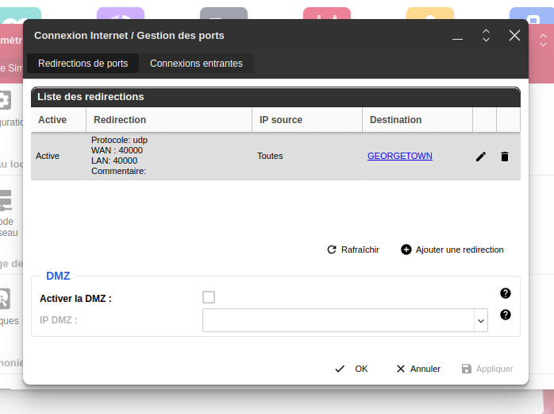
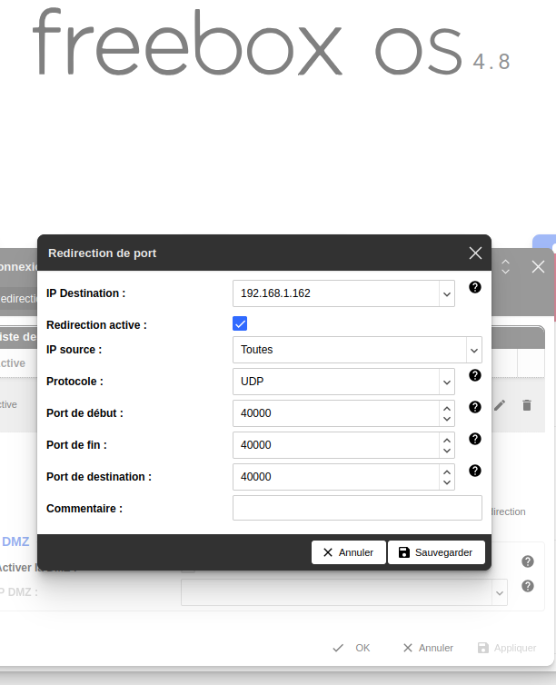

# VPN Test Environment with Docker Compose

This project sets up a VPN test environment using Docker Compose, allowing two remote clients to securely access an internal Ubuntu server and a simple web server on a simulated enterprise LAN.

## Project Structure

```
vpn-test/
├── docker-compose.yml
├── openvpn-data/
│   └── conf/
├── webserver/
│   └── html/
│       └── index.html
└── ubuntu-server/
└── client1.ovpn
└── client2.ovpn
```

*   **`docker-compose.yml`:** Defines the services (OpenVPN server, web server, Ubuntu server) and their configurations.
*   **`openvpn-data/conf/`:** Stores OpenVPN server configuration files, certificates, and keys.
*   **`webserver/html/`:** Contains the `index.html` file served by the internal web server.
*   **`ubuntu-server/`:** (Optional) You can place scripts or configuration files for the Ubuntu server here.
*   **`client1.ovpn`**: OpenVPN configuration file for client 1.
*   **`client2.ovpn`**: OpenVPN configuration file for client 2.

## Prerequisites

*   Docker Engine and Docker Compose installed on your server machine.
*   Basic understanding of networking concepts (IP addresses, subnets, ports).
*   At least one another machine for testing.

## Setup Steps

### 1. Project Directory

*   Create a directory for this project:

    ```bash
    mkdir vpn-test
    cd vpn-test
    ```

*   Create subdirectories:

    ```bash
    mkdir -p openvpn-data/conf webserver/html ubuntu-server
    ```

### 2. Docker Compose File

*   Create a file named `docker-compose.yml` with the following content:

```yaml
services:
  openvpn:
    image: kylemanna/openvpn:latest
    container_name: openvpn-server
    cap_add:
      - NET_ADMIN
    volumes:
      - ./openvpn-data/conf:/etc/openvpn
    ports:
      - "40000:1194/udp" # Expose a non-standard port (>= 32768 for my Freebox)
    networks:
      - vpn_network
    restart: always

  webserver:
    image: nginx:latest
    container_name: internal-webserver
    volumes:
      - ./webserver/html:/usr/share/nginx/html:ro
    networks:
      - vpn_network
    restart: always

  ubuntu-server:
    image: ubuntu:latest
    container_name: internal-ubuntu
    command: tail -f /dev/null # Keep it running
    networks:
      - vpn_network
    restart: always

networks:
  vpn_network:
    driver: bridge
    ipam:
      config:
        - subnet: 172.20.0.0/16 
```

### 3. Web Server Content

*   Create a simple `index.html` file in `./webserver/html`:

```html
<!DOCTYPE html>
<html>
<head>
    <title>Internal Webserver</title>
</head>
<body>
    <h1>Hello from Big local company Webserver!</h1>
</body>
</html>
```

### 4. Generate OpenVPN Configuration

*   **Initialize OpenVPN and Generate Server Config:**

    ```bash
    docker-compose run --rm openvpn ovpn_genconfig -u udp://YOUR_PUBLIC_IP:40000 -n 8.8.8.8 -n 8.8.4.4
    ```

    *   **Replace `YOUR_PUBLIC_IP` with the actual public IP address of your server.** (use `curl ifconfig.me` to get the public IP or check on google)
    *   **Adjust the port (40000 here) if you chose a different one.**
    *   **-n option allows you to set DNS, here we use google's one, but you can use the one you prefer**

*   **Initialize the PKI (Public Key Infrastructure):**

    ```bash
    docker-compose run --rm openvpn ovpn_initpki
    ```

    *   You'll be prompted to set a passphrase for the CA (Certificate Authority). Choose a strong one and remember it.

*   **Generate Client Certificates:**

    ```bash
    docker-compose run --rm openvpn easyrsa build-client-full client1 nopass
    docker-compose run --rm openvpn easyrsa build-client-full client2 nopass
    ...
    ```

*   **Retrieve Client Configuration Files:**

    ```bash
    docker-compose run --rm openvpn ovpn_getclient client1 > client1.ovpn
    docker-compose run --rm openvpn ovpn_getclient client2 > client2.ovpn
    ...
    ```

    *   This will create `client1.ovpn` and `client2.ovpn` in your project directory.

The `.ovpn` file contains all the necessary parameters to connect to the server such as:

- Server's address (IP or hostname) and port.
- Protocol (UDP or TCP).
- Certificates and keys.
- Cipher and authentication settings.
- Other options like compression, persistence, etc.

### 5. Configure Router (Port Forwarding)

*   If your server is behind a router (like Freebox), you need to configure port forwarding:
    *   Log in to your router's administration interface (e.g., `192.168.1.254` for Freebox).
    *   Find the "Port Forwarding" or "Redirection de Ports" settings.
    *   Create a rule to forward UDP port 40000 (or the port you chose) from the internet to the internal IP address of your server machine on port 40000.





### 6. Configure Firewall (Server)

*   If you have a firewall enabled on your server (e.g., `ufw`), allow incoming traffic on the OpenVPN port:

    ```bash
    sudo ufw allow 40000/udp
    ```

### 7. Start the Environment

*   Start the Docker Compose services:

    ```bash
    docker-compose up -d
    ```

### 8. Client Setup (Ubuntu Example for Client 1, my other Ubuntu laptop)

*   **Install OpenVPN:**

    ```bash
    sudo apt update
    sudo apt install openvpn
    ```

*   **Transfer `client1.ovpn`:**
    *   Transfer the `client1.ovpn` file to your Ubuntu client machine (using `scp`, a USB drive, or other methods). I've used gmail mhahaha!!!

*   **Connect (Command Line):**

    ```bash
    sudo openvpn --config client1.ovpn
    ```

    *   Keep the terminal open while connected.

*   **Connect (Network Manager - Optional):** 
    *   Import `client1.ovpn` into Network Manager.
    *   Connect through the Network Manager interface.

### 9. Testing the Connection

*   **Verify IP and Interface:**
    *   On the client, use `ip addr show` to check for a `tun0` or `tap0` interface with an IP in the 172.20.0.0/16 subnet.

*   **Ping Tests:**
    *   Ping the web server: `ping 172.20.0.3`
    *   Ping the Ubuntu server: `ping 172.20.0.4`

*   **Access Web Server:**
    *   Open a browser on the client and go to `http://172.20.0.3`.

*   **SSH to Ubuntu Server (Optional):**
    *   `ssh username@172.20.0.4` (replace with the correct username and IP).

Look at [openvpn in detail.pdf](./OPENVPN%20in%20details.pdf) file to learn more about the core key exchange and tls.

## Troubleshooting

*   **TLS Key Negotiation Failed:**
    *   Verify your server's public IP address in `client1.ovpn`.
    *   Check firewall rules on the server and router.
    *   Ensure port forwarding is configured correctly.
    *   Double-check for typos in commands.

*   **`netcat` Test:**
    *   On the server, inside the `openvpn` container: `nc -u -l -p 5555`
    *   On the client: `nc -u YOUR_SERVER_PUBLIC_IP 1194`
    *   Type messages to see if they are received on the other end. This tests basic UDP connectivity.

*   **Cipher Issue (Warning):**
    *   Add `data-ciphers-fallback BF-CBC` to both `server.conf` and `client1.ovpn` if needed (less likely to be the cause of major problems).

*   **Other Issues:**
    *   Examine OpenVPN server logs: `docker-compose logs openvpn`
    *   Check client-side logs.
    *   Consult OpenVPN documentation and forums.

## Security Considerations (for Production)

*   **Stronger Authentication:** Use certificate-based authentication with strong ciphers.
*   **Firewall:** Implement a robust firewall on your server.
*   **Intrusion Detection:** Set up an IDS to monitor for suspicious activity.
*   **Regular Updates:** Keep all software up to date.
*   **Principle of Least Privilege:** Grant users only the necessary access.

## Disclaimer

This guide is for educational and testing purposes. It provides a basic setup and may not cover all security aspects required for a production environment. Adapt and enhance the configuration based on your specific security needs and best practices.
