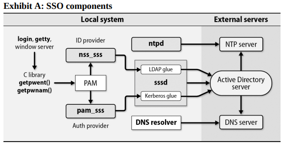
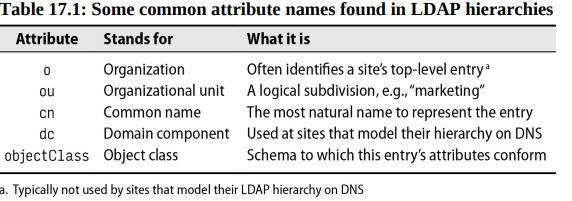

# Chapter 17: Single Sign-On


Both users and system administrators would like account information to magically propagate to all an environment’s computers so that a user can log in to any system with the same credentials. The common term for this feature is “single sign-on” (SSO), and the need for it is universal.

SSO involves two core security concepts: identity and authentication. A user identity is the abstract representation of an individual who needs access to a system or an application. It typically includes attributes such as a username, password, user ID, and email address. Authentication is the act of proving that an individual is the legitimate owner of an identity.

## Core SSO elements

Four core elements are essential for SSO:

1. A central directory store that contains user identity and authorization information. The most common solutions are directory services based on the Lightweight Directory Access Protocol (LDAP). In environments that mix Windows and Unix systems, the central directory store is often Microsoft Active Directory which includes a customized, nonstandard version of LDAP.
2. A tool for managing user information in the directory. For native LDAP implementations, phpLDAPadmin or Apache Directory Studio are popular choices. For Active Directory, the Microsoft Management Console (MMC) is the standard tool.
3. A mechanism for authenticating user identities. You can authenticate users directly against an LDAP store, but it's also common to use the Kerberos ticket-based authentication system. In windows AD uses a customized version of Kerberos.
Authentication on modern UNIX and Linux systems goes through the Pluggable Authentication Module system, aka PAM. You can use the System Security Services Daemon (sssd) to aggregate access to user identity and authentication services, then point PAM at sssd. [Check this link for more info about PAM](https://www.redhat.com/sysadmin/pluggable-authentication-modules-pam)
4. Centralized-identity-and-authentication-aware versions of the C library routines that look up attributes.

THe following example uses Active Directory as the directory server. Note that both time synchronization (NTP) and hostname mapping (DNS) are critical for env that uses kerberos because authentication tickets are time stamped and have a limited validity period.



## LDAP

A directory service is just a database, but one that makes a few assumptions. Any kind of data that matches the assumptions is a candidate for inclusion in the directory.

The basic assumptions are as follows:

- Data onjects are relatively small.
- The database will be widely replicated and cached.
- The information is attribute-based.
- Data are read often but written infrequently.
- Searching is a common operation.

Ironically, LDAP is anything but lightweight. It was originally a gateway protocol that allowed TCP/IP clients to talk to an older directory service called X.500 (obsolete now). 

Microsoft’s Active Directory is the most common instantiation of LDAP, and many sites use it for both Windows and Unix systems. For environments that are Unix-only, OpenLDAP is a popular choice.

### Uses for LDAP

The most common use of LDAP is to act as a central repository for login names, passwords, and account attributes. However, LDAP can be used in many other ways:

- It can store additional information about users, such as email addresses, phone numbers, and addresses.
- Most mail systems --- including **sendmail**, **Exim**, **Postfix** --- can draw a large part of their routing information from LDAP.
- LDAP makes it easy for apps to authenticate users without having to store passwords in the app’s database.
- LDAP is well supported by common scripting languages such as Perl and Python

### Structure of LDAP data

LDAP data are property lists known as "entries". Each entry consists of a set of named attributes along with those attribute's values.

As an example, here’s a typical (but simplified) /etc/passwd line expressed as an LDAP entry:

```text
dn: uid=jdoe,ou=users,dc=abacus,dc=net
objectClass: top
objectClass: person
objectClass: organizationalPerson
objectClass: inetOrgPerson
objectClass: posixAccount
objectClass: shadowAccount
uid: jdoe
cn: John Doe
userPassword: {crypt}$1$dflnkzndcsbez&33565Vdvd5p0
loginShell: /bin/bash
uidNumber: 1001
gidNumber: 1001
homeDirectory: /home/jdoe
```

This notation is a simple example of LDIF (LDAP Data Interchange Format). Entries are organized into a hierarchy through the use of "distinguished names" that form a sort of search path. As in DNS, the "most significant bit" goes on the right. In the example above, the DNS name `abacus.net` has structured the top levels of the LDAP hierarchy. It has been broken down into 2 domain components (`dc`'s), `abacus` and `net`.

LDAP entries are typically schematized through the use of an objectClass attribute. Object classes specify the attributes that an entry can contain, some of which may be required for validity. The schemata also assign a data type to each attribute. Object classes nest and combine in the traditional OO fashion.



