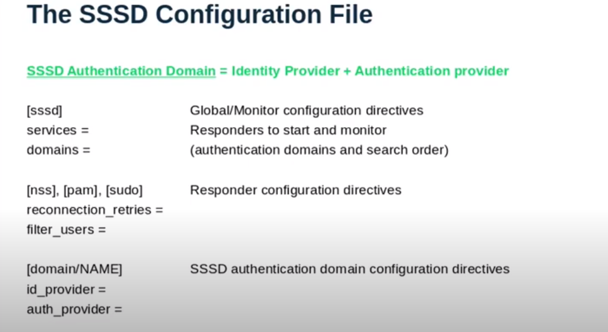
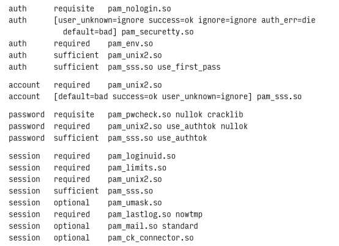

# Chapter 17: Single Sign-On


Both users and system administrators would like account information to magically propagate to all an environment’s computers so that a user can log in to any system with the same credentials. The common term for this feature is “single sign-on” (SSO), and the need for it is universal.

SSO involves two core security concepts: identity and authentication. A user identity is the abstract representation of an individual who needs access to a system or an application. It typically includes attributes such as a username, password, user ID, and email address. Authentication is the act of proving that an individual is the legitimate owner of an identity.

## Core SSO elements

Four core elements are essential for SSO:

1. A central directory store that contains user identity and authorization information. The most common solutions are directory services based on the Lightweight Directory Access Protocol (LDAP). In environments that mix Windows and Unix systems, the central directory store is often Microsoft Active Directory which includes a customized, nonstandard version of LDAP.
2. A tool for managing user information in the directory. For native LDAP implementations, phpLDAPadmin or Apache Directory Studio are popular choices. For Active Directory, the Microsoft Management Console (MMC) is the standard tool.
3. A mechanism for authenticating user identities. You can authenticate users directly against an LDAP store, but it's also common to use the Kerberos ticket-based authentication system. In windows AD uses a customized version of Kerberos.
Authentication on modern UNIX and Linux systems goes through the Pluggable Authentication Module system, aka PAM. You can use the System Security Services Daemon (sssd) to aggregate access to user identity and authentication services, then point PAM at sssd. [Check this link for more info about PAM](https://www.redhat.com/sysadmin/pluggable-authentication-modules-pam)
4. Centralized-identity-and-authentication-aware versions of the C library routines that look up attributes.

THe following example uses Active Directory as the directory server. Note that both time synchronization (NTP) and hostname mapping (DNS) are critical for env that uses kerberos because authentication tickets are time stamped and have a limited validity period.


## LDAP

A directory service is just a database, but one that makes a few assumptions. Any kind of data that matches the assumptions is a candidate for inclusion in the directory.

The basic assumptions are as follows:

- Data onjects are relatively small.
- The database will be widely replicated and cached.
- The information is attribute-based.
- Data are read often but written infrequently.
- Searching is a common operation.

Ironically, LDAP is anything but lightweight. It was originally a gateway protocol that allowed TCP/IP clients to talk to an older directory service called X.500 (obsolete now).

Microsoft’s Active Directory is the most common instantiation of LDAP, and many sites use it for both Windows and Unix systems. For environments that are Unix-only, OpenLDAP is a popular choice.

### Uses for LDAP

The most common use of LDAP is to act as a central repository for login names, passwords, and account attributes. However, LDAP can be used in many other ways:

- It can store additional information about users, such as email addresses, phone numbers, and addresses.
- Most mail systems --- including **sendmail**, **Exim**, **Postfix** --- can draw a large part of their routing information from LDAP.
- LDAP makes it easy for apps to authenticate users without having to store passwords in the app’s database.
- LDAP is well supported by common scripting languages such as Perl and Python

### Structure of LDAP data

LDAP data are property lists known as "entries". Each entry consists of a set of named attributes along with those attribute's values.

As an example, here’s a typical (but simplified) /etc/passwd line expressed as an LDAP entry:

```text
dn: uid=jdoe,ou=users,dc=abacus,dc=net
objectClass: top
objectClass: person
objectClass: organizationalPerson
objectClass: inetOrgPerson
objectClass: posixAccount
objectClass: shadowAccount
uid: jdoe
cn: John Doe
userPassword: {crypt}$1$dflnkzndcsbez&33565Vdvd5p0
loginShell: /bin/bash
uidNumber: 1001
gidNumber: 1001
homeDirectory: /home/jdoe
```

This notation is a simple example of LDIF (LDAP Data Interchange Format). Entries are organized into a hierarchy through the use of "distinguished names" that form a sort of search path. As in DNS, the "most significant bit" goes on the right. In the example above, the DNS name `abacus.net` has structured the top levels of the LDAP hierarchy. It has been broken down into 2 domain components (`dc`'s), `abacus` and `net`.

LDAP entries are typically schematized through the use of an objectClass attribute. Object classes specify the attributes that an entry can contain, some of which may be required for validity. The schemata also assign a data type to each attribute. Object classes nest and combine in the traditional OO fashion.


### OpenLDAP

In the OpenLDAP distribution, slapd is the standard LDAP server daemon. In an environment with multiple servers, `slurpd` runs on the master server and replicates changes to the slave servers. 

The setup is straightforward:

Create an `/etc/openldap/slapd.conf` file that contains the server’s configuration.

```bash
database bdb
suffix "dc=abacus,dc=net"
rootdn "cn=admin,dc=abacus,dc=net"
rootpw {crypt}xjsifuFDGRs
directory /var/lib/ldap
```

The database format defaults to Berkeley DB. The suffix is the top of the LDAP hierarchy similar to DNS root domain. The rootdn is the distinguished name of the root user. The rootpw is the root user’s password. The directory is where the database files are stored.

## Using directory services for login

Once you have a directory service set up, complete the following configuration chores so your system can enter SSO paradise:

- If you are planning to use AD with Kerberos, configure Kerberos and join the system to the AD domain.
- Configure sssd to communicate with the appropriate identity and authentication services(AD, LDAP, or Kerberos).
- Configure the name service switch, `/etc/nsswitch.conf`, to use sssd for user and group information.
- Configure PAM to use sssd for authentication.

SOme use the traditional `getpwent` family of library routines to look up user information, whereas others use the `nsswitch` mechanism to determine which library to use. The `nsswitch` mechanism is a simple configuration file, `/etc/nsswitch.conf`, that tells the system which library to use for each type of information.

### Kerberos

Kerberos is a ticket-based authentication system that uses symmetric key cryptography. The debut of `realmd` has made the task of joining a Linux system to an Active Directory domain much easier. `realmd` act as a configuration tool for sssd and Kerberos.

Before joining an AD domain, make sure the following are in place:

- `realmd` is installed on the Linux system.
- `sssd` is installed.
- `ntpd` is installed and running.
- You know the correct name of the AD domain.
- You have the credentials of a user who has permission to join the domain.

For example, to join the `abacus.net` domain, and the authorized user is `admin_user`, run the following command:

```bash
sudo realm join abacus.net -U admin_user

# then verify with
realm list
```

### SSSD: System Security Services Daemon

The UNIX and Linux road to SSO nirvana has been a rough one. Years ago, it was common to set up independent authentification system for every service or app. This
approach often resulted in a morass of separate configurations and undocumented dependencies that were impossible to manage over time. Users’ passwords would work with one application but not another, causing frustration for everyone.

Microsoft formerly published extensions (originally called “Services for UNIX,” then “Windows Security and Directory Services for UNIX,” and finally, “Identity Management for UNIX” in Windows Server 2012) that facilitated the housing of UNIX users and groups within Active Directory. Putting the authority for managing these attributes in a non-UNIX system was an unnatural fit, however. To the relief of many, Microsoft discontinued this feature as of Windows Server 2016.

These issues needed some kind of comprehensive solution, and that’s just what we got with `sssd`. sssd is a one-stop shop for user identity wrangling, authentication, and account mapping. It can also cache credentials off-line, which is useful for mobile devices. sssd supports authentication both through native LDAP and through Kerberos.

Here's an example of `sssd` configuration file:

```bash
[sssd]
services = nss, pam
domains = LDAP

[domain/LDAP]
id_provider = ldap
auth_provider = ldap
ldap_uri = ldap://ldap.abacus.net
ldap_user_search_base = dc=abacus,dc=net
tls_reqcert = demand
ldap_tls_cacert = /etc/ssl/certs/ca-certificates.crt
```

For obvious security reasons, sssd does not allow authentication over an unencrypted channel, so the use of LDAPS/TLS is required. Setting the tls_reqcert attribute to demand in the example above forces sssd to validate the server certificate as an additional check. sssd drops the connection if the certificate is found to be deficient.

There's three concepts in `sssd`:

- **The Monitor**: This is the main daemon that controls the other daemons. It reads the configuration file and starts the other daemons.
- **The Providers**: These are modules with specific auth backend awareness. They are responsible for the actual authentication and identity lookups.
- **Responders**: They interact with Linux and implement features.



### PAM

The PAM system relieves programmers of the chore of implementing direct connections to authentication systems and gives sysadmins flexible, modular control over the system's authentication methods.

In the distant past, commands like `login` included hardwired authentication code that prompted the user for a password and checked it against the encrypted password in `/etc/shadow` (or `/etc/passwd` in the old days). It was impossible to change the authentication method without recompiling the program and administrators had little or no control over details such as whether the system should accept “password” as a valid password.. PAM was created to solve this problem.

PAM puts the system’s authentication routines into a shared library that login and other programs can call. By separating authentication functions into a discrete subsystem, PAM makes it easy to integrate new advances in authentication and encryption. For instance, MFA (multi-factor authentication) can be added to a system without changing the login program.

PAM is configured through a series of files in the `/etc/pam.d` directory. Each file corresponds to a specific service or application. The files contain a series of lines that define the authentication steps that PAM should take when the service is invoked.

The general format of a line in a PAM configuration file is:

```text
module-type control-flag module-path [ arguments ]
```

The order of the modules in the file is important (prompting for a password before checking it, for example).

The `module-type` is the type of module being called. The most common types are: `auth`, `account`, `password`, and `session`. `auth` modules identify the user and grant group membership. Modules that do `account` chores enforce restrictions such as limiting logins to particular time of day, limiting the number of simultaneous users, or limiting the ports on which logins can occur. (For example, you would use an `account`-type module to restrict root logins to the console.) `session` chores includes tasks that are done before, or after a user is granted access; for example mouting a user's home directory. Finally `password` modules change a user's passwor or passphrase.

The `control-flag` specifies how the modules in the stack should interact to produce an ultimate result for the stack. The most common control flags are `include`, `required`, `requisite`, `sufficient`, and `optional`. The `include` flag is used to include the configuration of another service. The `required` flag means that the module must succeed for the stack to succeed. The `requisite` flag means that the module must succeed, but if it fails, the stack fails immediately. The `sufficient` flag means that if the module succeeds, the stack succeeds immediately (HAHAHA! LIES). The `optional` flag means that the module is not required for the stack to succeed.

Example of `/etc/pam.d/login`:



The auth stack includes several modules. On the first line, the pam_nologin module checks for the existence of a `/etc/nologin` file. If the file exists, the module aborts the login immediately unless the user is root. The pam_securetty module ensures that root can only log on terminals listed in `/etc/securetty`. `pam_env` sets up the user’s environment variables. The pam_unix module checks the user’s password against the encrypted password in `/etc/shadow`. If the user doesn’t have a local UNIX account, `pam_sss` attempts to authenticate the user against the sssd service.

## LDAP alternatives

- **NIS**: The Network Information Service (NIS) is a simple directory service that predates LDAP. It is still in use in some environments (FreeBSD, for example). 
- **rsync**: The `rsync` command can be used to synchronize files between systems. It is not a directory service, but it can be used to keep files in sync. Here's an example of how to use `rsync` to keep the `/etc/passwd` and `/etc/shadow` files in sync between two systems:

```bash
rsync -gopt -e ssh /etc/passwd /etc/shadow abdoufermat:/etc
```

The -gopt options preserve the permissions, ownerships, and modification times of the file.
