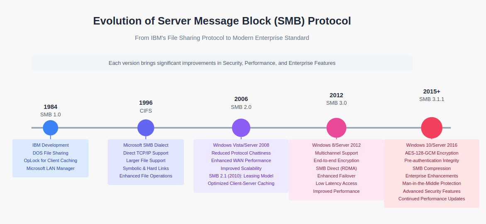
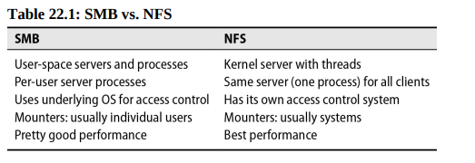

# Chapter 22: SMB - Server Message Block


NFS covers the most popular system for sharing files among UNIX and Linux systems. However, UNIX systems also need  to share files with Windows systems. This is where SMB comes in.


Although it’s common within the industry to refer to SMB fileshares as CIFS, the truth is that CIFS was deprecated long ago; only SMB lives on.

## SAMBA: SMB server for Linux

Samba is the server side implementation of SMB on UNIX and Linux systems. The real beauty of Samba is that you install only one package on the server side; no special software is required on the Windows side.

In the Windows world, a filesystem or directory made available over the network is known as a "share" (niggeuhh wheeeutt??)

Samba can also implement a variety of other cross-platform services other than file sharing:

- Authentication & authorization
- Network printing
- Name resolution
- Service announcement (file server and printer discovery)

Most of Samba’s functionality is implemented by two daemons, `smbd` and `nmbd`. `smbd` implements file and print services as well as authentication and authorization. `nmbd` is responsible for the other major SMB components: name resolution and service announcement.

Unlike NFS, which requires kernel-level support, Samba requires no drivers or kernel modifications and runs entirely as a user process. It binds to the sockets used for SMB requests and waits for a client request access to a resource.Once a request has been authenticated, `smbd` forks an instance of itself that runs as the user who is making the requests. As a result, all normal file access permissions (including group permissions) are obeyed. The only special functionality that `smbd` adds on top of this is a file locking service that gives Windows systems the locking semantics to which they are accustomed.

ALmost all OSs support SMB.



## Installing and configuring Samba

Most Linux distributions include Samba by default.

You configure Samba by editing the `/etc/samba/smb.conf` file (`/usr/local/etc/smb4.conf` on FreeBSD). The file specifies the directories to share, their access rights, and Samba’s general operational parameters (type `testparm -v` to see all config options)

The most common use of Samba is to share files with Windows clients. Access to these shares must be authenticated through a user account by one of two options.

### File-sharing with local authentication

The simplest way to authenticate users who want to access Samba shares is by creating a local account for them on the UNIX or Linux server.

As example in `smb.conf` file:
```bash
[global]
workgroup = ulsah
security = user # this tells Samba to use local accounts for authentication
netbios name = freebsd-book
```

Samba has its own command, `smbpasswd`, for setting up Windows-style password hashes.

```bash
$ sudo smbpasswd -a abdou
New SMB password: <password>
Retype new SMB password: <password>
```

### File-sharing with Active Directory authentication

It's better to have a centralized authentication system like Active Directory (AD) to manage user accounts. With `sssd` it's now easier to integrate Samba with AD on UNIX/Linux.

```bash
[global]
workgroup = ulsah
realm = ulsah.example.com
security = ads
dedicated keytab file = FILE:/samba/samba.keytab
kerberos method = dedicated keytab
```

The dedicated keytab file and kerberos method parameters enable Samba to work properly with Active Directory’s Kerberos implementation. Each share that you expose needs its own stanza in the configuration file (`abdoushare` in the example above)

### Configuring shares

We can configure through `/etc/samba/smb.conf` which directories should be shared.

Example:

```bash
[abdoushare]
path = /home/asadiakhou/youtube_downloads
browseable = yes
read only = no 
create mask = 0777  # all rights
directory mask = 0777 # everything
public = yes # everyone
guest ok = yes
```

Here, SMB clients see a mountable share named `\\sambaserver\abdoushare`.

We can use the `homes` stanza to convert users home directories into distinct smb shares.

```bash
[homes]
comment = Home Directories
browsable = no
valid_user = %S
read_only = no
```

The %S expand to the username associated with each share, restricting access to the owner of the home directory.

Samba uses its magic [homes] section as a last resort. If a particular user’s home directory has ancexplicitly defined share in the configuration file, the parameters set there override the values set through [homes].


We can share projects with samba, allowing only members of the group to mount the share.

```text
[eng]
comment = Group SHare for engineering
valid_user = @eng
path = /home/eng
; Disable ACLs (too complicated to handle)
nt acl support = no

create mask = 0660
directory 