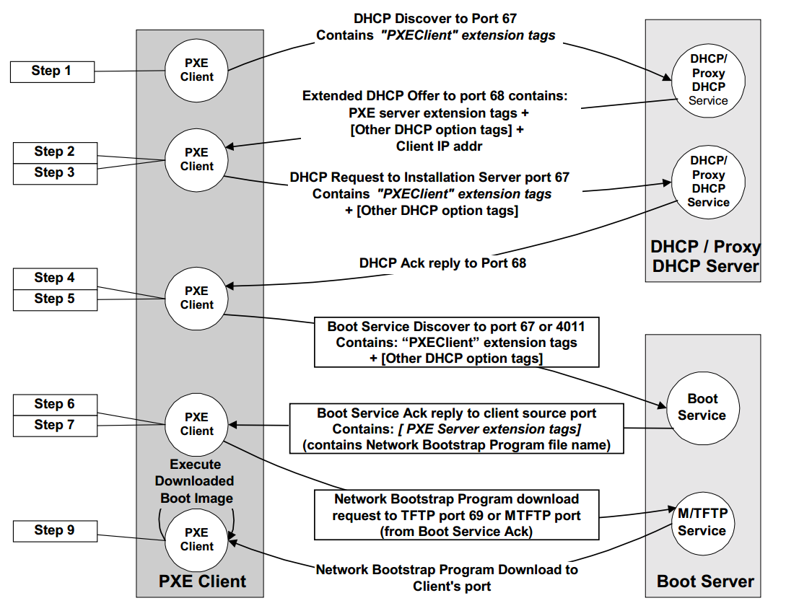

# Chapter 6: Software Installation and Management

## Operating System Installation

Linux distributions and FreeBSD have straightforward procedures for basic installation. For physical machines, you can boot from a CD, DVD, or USB drive. For virtual machines, you can boot from an ISO file. Installing the base OS from local media is fairly trivial thanks to the GUI apps that shepherd you through the process.

### Installation from the network

If you have to install OS on more than one computer, you'll quickly reach the limits of the local media approach. It's time consuming, error prone, and boring to repeat the same steps over and over. The solution is to install the OS from a network server. This is a common practice in data centers and cloud environments.

The most common methods use DHCP and TFTP to boot the system sans physical media. They then retrieves the OS installation files from a network server with HTTP, FTP, or NFS. The installation files can be on the same server or on a different one.

We can set up a completely hands-free installations through PXE, the Preboot eXecution Environment. This scheme is a standard from Intel that lets systems boot from network interface. 

PXE acts like a miniature OS that sits in a ROM on the network card. It exposes its network capabilities through a standardized API for the system BIOS to use. This cooperation makes it possible for a single boot loader to netboot any PXE-enabled PC without having to supply special drivers for each network card.

## Linux Package Management Systems

Two package formats are in common use on Linux systems. Red Hat, CentOS, SUSE, Amazon Linux, and several other distributions use **RPM**. Debian and Ubuntu use the separate but equally popular **.deb** format. The two formats are functionally similar. 

Both the RPM and .deb packaging systems now function as dual-layer soup-to-nuts configuration management tools. At the lowest level are the tools that install, uninstall, and query packages: **rpm** for **RPM** and **dpkg** for **.deb.**

On top of these commands are systems that know how to find and download packages from the Internet, analyze interpackage dependencies, and upgrade all the packages on a system. **yum**, the Yellowdog Updater, Modified, works with the **RPM** system. **APT**, the Advanced Package Tool, originated in the **.deb** universe but works well with both **.deb** and **RPM** packages.

## High-Level Package Management

The high-level package management tools are the ones you'll use most often. They are the ones that let you install, remove, and upgrade packages. They also let you search for packages and list the packages installed on your system.

### Package repositories

Linux distributors maintain software repositories that work hand-in-hand with their chosen package management systems. The default configuration for the package management system usually points to one or more well-known web or FTP servers that are under the distributor’s control.

- A *release* is a self-consistent snapshot of the package universe. 
- A *component* is a subset of the software within a release.
- An *architecture* represents a class of hardware. The expectation is that machines within an architecture class are similar enough that they can run the same binaries. Architectures are instances of releases, for example, the i386 architecture of the Fedora 20 release.

### APT: Advanced Package Tool

APT is a set of tools for managing Debian packages. It's the most widely used package management system for Debian-based systems. APT is a collection of tools that work together to provide a complete package management system. The tools are:

- **apt-get**: The command-line tool for handling packages. It performs package management tasks such as installation, removal, and upgrade.
- **apt-cache**: A tool for searching and querying the APT package cache.
- **apt-file**: A tool for searching for files within packages.
- **apt-show-versions**: A tool for showing versions of packages.
- **aptitude**: A high-level interface to the package management system. It can be used to perform most of the tasks that **apt-get** can do, and many more.
- **apt-mirror**: This tool allows you to mirror a package repository.

The first rule of using APT on ubuntu systems is to ignore the existence of **dselect**, which act as a frontend for the Debian package system.

### yum: Yellowdog Updater, Modified

**yum** is a package manager for RPM-compatible Linux systems. It is a high-level tool for managing packages. Yum performs dependency resolution when installing, updating, and removing packages. It can manage packages from installed repositories, and it can also perform command-line operations on individual packages.

## Software localization and configuration 

Adapting systems to your local (or cloud) environment is one of the prime battlegrounds of system administration. Addressing localization issues in a structured and reproducible way helps avoid the creation of snowflake systems that are impossible to recover after a major incident.

