# Chapter 20: Storage


Data storage systems are looking more and more like a giant set of Lego blocks that you can assemble in an infinite variety of configurations. You can build anything from a lightning-fast storage space for a mission critical database to a vast, archival vault that stores three copies of all data and can be rewound to any point in the past.

Mechanical hard drives remain a popular storage medium when capacity is the most important consideration, but solid state drives (SSDs) are preferred when performance-sensitive applications. Caching systems, both software and hardware, help combine the best features these storage types.

Running on top of real and virtual hardware are a variety of software components that mediate between the raw storage devices and the filesystem hierarchy seen by users. These components include device drivers, partitioning conventions, RAID implementations, logical volume managers, systems for virtualizing disks over a network, and the filesystem implementations themselves.

## Just want to add a disk

You want to install a hard disk and make it accessible through the filesystem. Step one is to attach the drive. In cloud environments you just need to setup the desired size and click "next". In the case of physical hardware, drives that communicate through a USB port can simply be powered on and plugged in. SATA and SAS drives need to be mounted in a bay, enclosure, or cradle. Then you have to reboot the system to make sure the OS is in a config that's reasonably reproducible at boot time.

### Linux recipe

First, run `lsblk` (for list block devices) to list the system's disk and identify the new drive or `lsblk -o +MODEL,SERIAL` to get more details. Once you know which device file refers to the new disk (assume it's **/dev/sdb**), install a partition on the disk. Several commands and utilities can do this, including `fdisk`, `parted`, `gparted`, `cfdisk`, and `sfdisk`. Here's an example using `fdisk`:

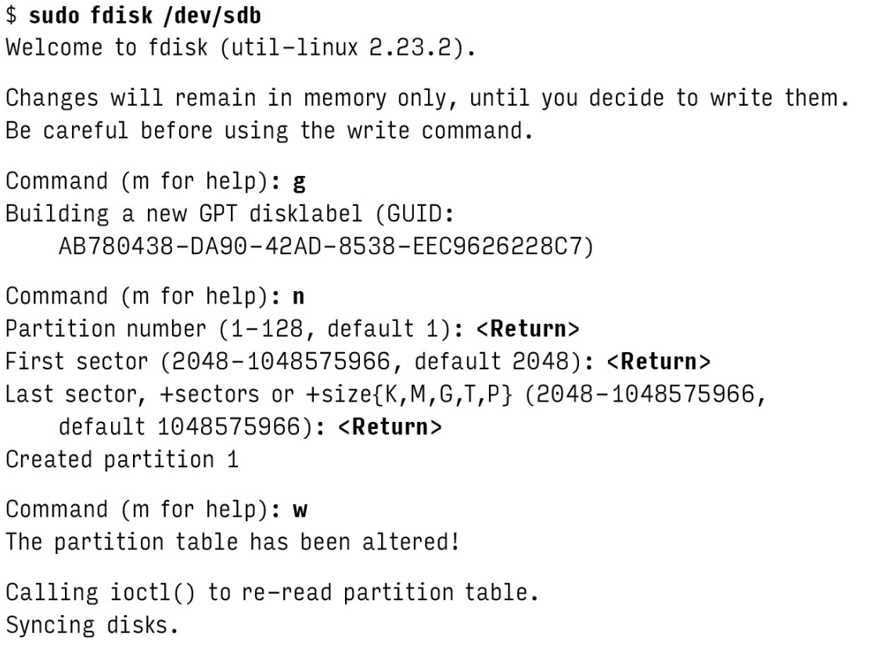

The device file for the newly created partition is the same as the device file for the disk as a whole, but with a number appended. For example, if the disk is **/dev/sdb**, the first partition will be **/dev/sdb1**. You can now format the partition with a filesystem. The `mkfs` command is used to create a filesystem on a partition. For example, to create an ext4 filesystem on **/dev/sdb1**, run:

```bash
sudo mkfs -t ext4 -L fermatfs /dev/sdb1
...
...
```

Next, create a mount point and mount the newly created filesystem.

```
sudo mkdir /fermatfs
sudo mount LABEL=fermatfs /fermatfs
```

To have the filesystem automatically mounted at boot time, edit the **/etc/fstab** file and duplicate one of the existing entries.

## Storage hardware

Even in today’s post-Internet world, computer data can be stored in only a few basic ways: hard disks, flash memory, magnetic tapes, and optical media. THe last two technologies have significant limitations that disqualify them from use as a system's primary filesystem.

After 40 years of traditional magnetic disk technology, performance-minded system builders finally received a practical alternative in the form of solid state disks (SSDs). These flash-memory-based devices offer a different set of tradeoffs from those of a standard disk, and they will be influencing the architectures of databases, filesystems, and operating systems for years to come.

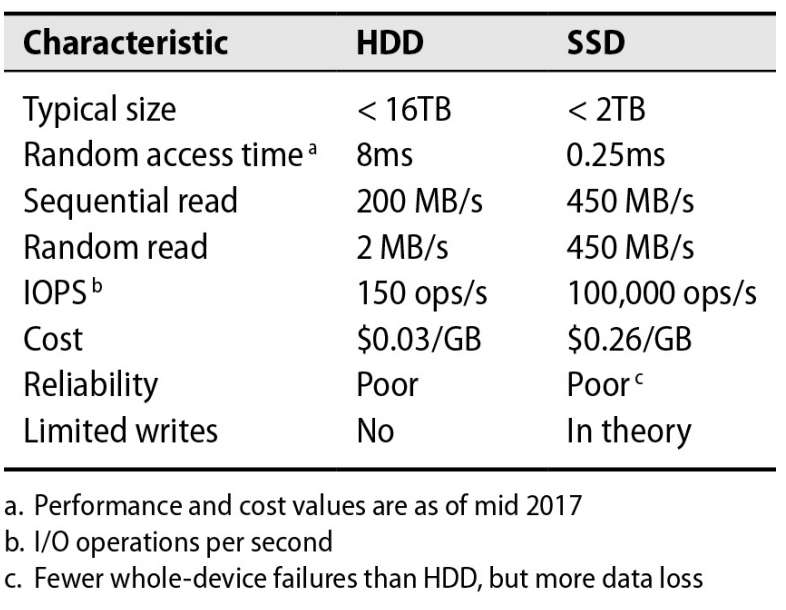

### Hard disks

A typical hard drive contains several rotating platters coated with magnetic film. They are read and written by tiny skating heads mounted on a metal arm that swings back and forth to position them. The heads float close to the surface of the platters but don’t actually touch them.

Reading from a platter is quick; it’s the mechanical maneuvering needed to address a particular sector that drives down random-access throughput. Delays come from two main sources.

A set of tracks on different platters that are all the same distance from the spindle is called a cylinder. The cylinder’s data can be read without any additional movement of the arm. Although heads move amazingly fast, they still move much more slowly than the disks spin around. Therefore, any disk access that does not require the heads to seek to a new position will be faster.

[](https://www.youtube.com/watch?v=oEORcCQ62nQ)

Spindle speeds vary. 7,200 RPM remains the mass-market standard for enterprise and performance-oriented drives. A few 10,000 RPM and 15,000 RPM drives remain available at the high end. The faster the spindle speed, the faster the heads can move from one track to another. Higher rotational speeds decrease latency and increase the bandwidth of data transfers, but they also increase power consumption and heat generation.

**Drive types :**

Only two manufacturers of hard drives remain: Seagate and Western Digital. You may see a few other brands for sale, but they're all ultimately made by these same two companies.

Brands segment their hard disk offerings into a few general categories:

- **Value drives:** Performance isn’t a priority, but it’s usually decent.
- **Mass-market performance drives:** They perform notably better than value drives on most benchmarks. As with value drives, firmware tuning emphasizes single-user patterns such as large sequential reads and writes.
- **NAS drives:** NAS stands for “network-attached storage,” but these drives are intended for use in all sorts of servers, RAID systems, and arrays--anywhere that multiple drives are housed and accessed together.
- **Enterprise drives:** expensive non-SATA interfaces and uncommon features such as 10000+ RPM spindle speeds.

### Solid state disks

SSDs spread reads and writes across banks of flash memory cells, which are individually rather slow in comparisson to modern hard disks. But because of parallelism, the SSD as a whole meets or exceeds the bandwidth of a traditional disk.

**flash memory types:**

SSDs are constructed from several types of flash memory: SLC, MLC, TLC, and QLC. The main difference between these types is the number of bits stored in each cell. SLC stores one bit per cell, MLC stores two, TLC stores three, and QLC stores four. The more bits per cell, the cheaper the flash memory is to produce, but the slower and less reliable it is.

**Page clusters and pre-erasing:**

Unlike hard drives where you can just overwrite data, flash memory has to be erased before you can put new data on it. SDs can't erase individual bits of information. They erase in chunks called clusters. Pre-erasing is the process of erasing sections of an SSD's memory in advance so that new data can be written quickly without having to wait for erasing to happen.

**Reliability:**

SSDs commonly experience minor errors that are automatically corrected, but even the best models can suffer occasional uncorrectable errors leading to data loss. These errors aren't strongly linked to age or workload, and affected SSDs usually continue to function normally afterwards. SSDs are reliable, but their failures are subtle. Regular monitoring is essential, and they shouldn't be used for long-term archiving. An isolated bad block isn't necessarily a cause for alarm.

### Hybrid drives

The initialism SSHD stands for “solid state hybrid drive” and is something of a triumph of marketing, designed as it is to encourage confusion with SSDs. SSHDs are just traditional hard disks with some extras on the logic board; in reality, they’re about as “solid state” as the average dishwasher.

### Advanced format and 4KiB blocks

The storage industry has transitioned to 4KiB blocks (Advanced Format) for efficiency. While most new devices can emulate older 512-byte sectors, it's important to be aware of potential misalignment issues, especially with older systems.

## Storage hardware interfaces


### SATA

Serial ATA (SATA) is the most common interface for hard drives. SATA has native support for hot swapping and optional command queueing.

### PCI Express (PCIe)

PCIe (Peripheral Component Interconnect Express) is a high-speed serial bus that connects devices to the motherboard. It's used for SSDs and other high-performance storage devices.

When comparing PCIe to SATA, keep in mind that SATA’s speed of 6 Gb/s is quoted in gigabits per second. Full-width PCIe is actually more than 20 times faster than SATA.

| Version | Release Year | Bandwidth per Lane | Total Bandwidth (lane x16) | Notable Features |
|---------|--------------|---------------------|------------------------|-------------------|
| PCIe 1.0 | 2003 | 250 MB/s | 4 GB/s | Initial release |
| PCIe 2.0 | 2007 | 500 MB/s | 8 GB/s | Doubled bandwidth |
| PCIe 3.0 | 2010 | 985 MB/s | 15.75 GB/s | Improved encoding |
| PCIe 4.0 | 2017 | 1.97 GB/s | 31.5 GB/s | Doubled bandwidth again |
| PCIe 5.0 | 2019 | 3.94 GB/s | 63 GB/s | Improved signal integrity |
| PCIe 6.0 | 2022 | 7.88 GB/s | 126 GB/s | Pulse Amplitude Modulation 4-level (PAM4) signaling |
| PCIe 7.0 | Expected 2025 | ~15.75 GB/s | ~252 GB/s | In development |

**Lane Configurations :**

PCIe devices can use different numbers of lanes, typically denoted as x1, x4, x8, or x16:

- x1: 1 lane
- x4: 4 lanes
- x8: 8 lanes
- x16: 16 lanes

The total bandwidth of a PCIe slot or device is calculated by multiplying the bandwidth per lane by the number of lanes. The table above shows the maximum theoretical bandwidth for a x16 configuration, which is the highest commonly used in consumer and many professional devices.

### USB

The Universal Serial Bus (USB) is a popular option for connecting external hard disks.

| Version | Year | Max Data Rate | Key Highlights |
|---------|------|---------------|----------------|
| USB 1.1 | 1998 | 12 Mbit/s | Original widely-adopted standard |
| USB 2.0 | 2000 | 480 Mbit/s | Major speed increase, still common |
| USB 3.0 | 2008 | 5 Gbit/s | 10x faster than USB 2.0, introduced blue ports |
| USB 3.1 | 2013 | 10 Gbit/s | Doubled USB 3.0 speed |
| USB 3.2 | 2017 | 20 Gbit/s | Introduced multi-lane operation |
| USB4 | 2019 | 40 Gbit/s | Based on Thunderbolt 3, supports video output |
| USB4 v2.0 | 2022 | 80 Gbit/s | Latest announced version, not yet widely available |

**Note:** USB-C (introduced in 2014) is a connector type, not a USB version. It's compatible with USB 3.1 and later versions, offering reversible plug orientation.

## Attachment and low-level management of drives

The way a disk is attached to the system depends on the interface. The rest is all mounting brackets and cabling.

### Disk device files

A newly added disk is represented by device files in **/dev**.

**Disk Device Naming Standards in Linux and FreeBSD:**

| Aspect | Linux | FreeBSD |
|--------|-------|---------|
| IDE/PATA Disks | /dev/hda, /dev/hdb, /dev/hdc, etc. (older systems) | /dev/ada0, /dev/ada1, etc. |
| SATA Disks | /dev/sda, /dev/sdb, /dev/sdc, etc. | /dev/ada0, /dev/ada1, etc. |
| NVMe Disks | /dev/nvme0n1, /dev/nvme0n2, /dev/nvme1n1, etc. | /dev/nvd0, /dev/nvd1, etc. |
| Virtual Disks | /dev/vda, /dev/vdb, etc. (for VMs) | /dev/vtbd0, /dev/vtbd1, etc. |
| Partitions | Appended numbers: sda1, sda2, nvme0n1p1, etc. | Appended letters: ada0p1, ada0p2, nvd0p1, etc. |
| Software RAID | /dev/md0, /dev/md1, etc. | /dev/mirror/name, /dev/stripe/name, etc. |
| Logical Volumes (LVM) | /dev/mapper/vgname-lvname | N/A (LVM not natively supported) |
| ZFS Pools | /dev/zd0, /dev/zd1, etc. (for zvols) | N/A (uses labels instead of device names) |

**Additional Notes:**

1. Linux:
   - Modern Linux systems often use persistent naming schemes like /dev/disk/by-id/ or /dev/disk/by-uuid/ for more stable device identification.
   - Newer versions may use /dev/sd* for all types of disks, including PATA.

2. FreeBSD:
   - Uses a unified ada* naming scheme for ATA (including both PATA and SATA) disks.
   - SCSI disks use /dev/da0, /dev/da1, etc.
   - Supports GEOM labels for persistent naming.

use `parted -l` to list the sizes, partition tables, model numbers, and manufacturers of all disks attached to the system.

### ATA secure erase

ATA secure erase is a feature built into most modern hard drives that allows you to securely erase all data on the drive. This is useful if you're selling or giving away a drive and want to make sure no one can recover your data. The `hdparm` command can be used to perform an ATA secure erase.

```bash
sudo hdparm --user-master u --security-set-pass password /dev/sdX
sudo hdparm --user-master u --security-erase password /dev/sdX
```

### Hard disk monitoring with SMART

Self-Monitoring, Analysis, and Reporting Technology (SMART) is a monitoring system built into most modern hard drives. SMART can be used to predict hard drive failures by monitoring various drive statistics. The `smartctl` command can be used to view SMART data.

```bash
sudo smartctl -a /dev/nvme0
```

## The software side of storage: peeling the onion

If you are a basic user with basic needs on a system with GUI (like Windows or macOS or even a Linux desktop), you can just follow the GUI after plugging in a new disk. But if you are a system administrator or a power user, you need to understand the software side of storage.

### Elements of a storage system

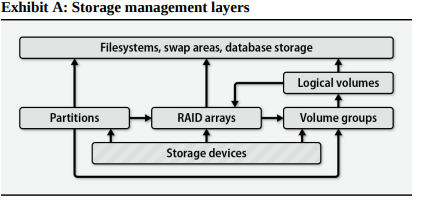

Exhibit A shows a typical set of software components that can mediate between a raw storage device and its end users.

- **Storage device** is anything that looks like a disk. This is the physical layer, consisting of the actual hardware used to store data, such as hard drives, SSDs, and other storage media.
- **Partition** is a fixed-size subsection of a storage device. Each partition has its own device file and acts much like an independent storage device.
- **Volume groups and logical volumes** These systems aggregate physical devices to form pools of storage called volume groups. An admin can then subdivide this pool into logical volumes in much the same way disk can be divided into partitions. For example, a 6TB disk and a 2TB disk could be aggregated into 8TB volume group and then split into 4TB logical volumes.


- **RAID array** (Redundant Array of Independent/Inexpensive Disks) combines multiple storage devices into one virtualized device. RAID can provide data redundancy (protection against data loss) and/or increase data throughput.

| RAID Level | Min Disks | Description | Advantages | Disadvantages |
|------------|-----------|-------------|------------|---------------|
| RAID 0 | 2 | Striping without parity | High performance, full capacity | No fault tolerance |
| RAID 1 | 2 | Mirroring | Simple, good redundancy | 50% capacity loss |
| RAID 5 | 3 | Striping with distributed parity | Good balance of performance and redundancy | Write performance hit |
| RAID 6 | 4 | Striping with double distributed parity | Can survive two disk failures | More expensive, worse write performance |
| RAID 10 | 4 | Striped set of mirrors | High performance and good redundancy | 50% capacity loss |

These RAID levels are predefined standards. Users choose the appropriate level based on their needs for performance, redundancy, and storage capacity.

- **Filesystem** mediates between the raw bag of blocks presented by a partition, RAID array, or logical volume and the standard filesystem interface expected by programs: */var/spool/mail*, UNIX file types, permissions, and so on.

### Linux device mapper

The Linux device mapper is a kernel-level framework that provides a generic way to create virtual block devices. It's used by LVM, software RAID, and encryption systems to create virtual block devices that can be used like any other block device.

### Partitioning a disk

Partitioning a disk is the process of dividing it into smaller sections called partitions. Each partition acts like an independent storage device and has its own device file.

A few years ago it was impossible to partition a logical volume or RAID, only disks can be partitioned. You could of course put individual disk partitions under the control of a RAID controller or logical volume manager. Modern systems now allow partitioning, RAID, and LVM to be applied at any level.

In fact, partitioning is less desirable than logical volume management in most respects. It’s coarse and brittle and lacks features such as snapshot management. Partitioning decisions are difficult to revise later. The only notable advantages of partitioning over logical volume management are its simplicity and the fact that Windows and PC BIOSs understand and expect it.

All systems have a root “partition” that includes / and most of the local host’s configuration data. In theory, everything needed to bring the system up to single-user mode is part of the root partition. Various subdirectories (most commonly /var, /usr, /tmp, /share, and /home) can be broken out into their own partitions or volumes. Most systems also have at least one swap area.

**Traditional data disk partitioning scheme (Linux device names):**

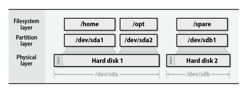

Some guide:

- Putting `/tmp` on a separate filesystem limits temporary files to a finite size and saves you from having to back them up.

- It’s useful to put users’ home directories on a separate partition or volume. Even if the root partition is corrupted or destroyed, user data has a good chance of remaining intact.
- Splitting swap space among several physical disks can potentially increase performance, although with today’s cheap RAM it’s usually better not to swap at all.
  
### Traditional partitioning

Despite the universal availability of logical volume managers, some situations still require or benefit from traditional partitioning.

- Only two partitioning scheme are used these days: MBR and GPT.
- Partitions have a defined location on the disk, so they guarantee locality of reference. Logical volumes do not (at least, not by default). This means data in a logical volume might be spread out more on the physical disk(s). By keeping data in a defined area, partitions can potentially offer slightly better performance, especially if they're placed on the faster outer tracks of the disk. This consideration is mainly relevant for systems using traditional HDDs and where disk I/O is a significant performance factor.
- RAID systems use disks or partitions of matched size. For example, if you have three disks of 1TB, 1.5TB, and 2TB, a typical RAID setup might only use 1TB from each disk. This ensures that data can be distributed evenly across all drives in the array. For the extra space, you can isolate it in a separate /spare partition for data infrequently accessed (suitable to not break the RAID performance). If the data on this extra partition is frequently accessed, it can slow down access to the RAID array (disk heads need to move back and forth between RAID portion and spare portion).

### MBR partitioning

Master Boot Record partitioning is an old Microsoft standard that dates back to the 1980s. It’s a cramped and ill-conceived format that can’t support disks larger than 2TB. Who knew disks could ever get that big?

MBR offers no advantages over GPT except that it’s the only format from which old PC hardware can boot Windows.

The MBR label occupies a single 512-byte disk block, most of which is consumed by boot code. Only enough space remains to define 4 partitions (termed `primary`). You can define one of those four to be an extended partition (it contains it's own subsidiary partition table). The windows partitioning system lets one partition be marked `active` and boot loaders look for this one to load the OS from it. Each partition also has a one-byte type attribute that is supposed to signal the partition’s contents.

The MS-DOS command for hard disks partitioning was called fdisk (now `diskpart` in modern windows), still used (at least the naming) on most MBR supported systems.

### GPT: GUID partition tables

Intel’s extensible firmware interface (EFI) project replaced the rickety conventions of PC BIOSs with a more modern and functional architecture. EFI (now UEFI) firmware is now standard for new PC hardware, and EFI’s partitioning scheme has gained universal support among operating systems.

The EFI partitioning scheme, known as a “GUID partition table” or GPT, removes the obvious weaknesses of MBR. It defines only one kind of partition (no more “logical partitions in the extended partition”), and you can create arbitrarily many of them. Each partition has a type specified by a 16-byte ID code (a globally unique ID, or GUID) that requires no central arbitration.

### Linux and FreeBSD partitioning

For Linux use `parted` or `gparted` (the GUI) and for FreeBSD you can use `gpart`.

## Logical Volume Management (LVM)

Imagine a world in which you don’t know exactly how large a partition needs to be. Six months after creating the partition, you discover that it is much too large, but that a neighboring partition doesn’t have enough space. Sound familiar? A logical volume manager lets you reallocate space dynamically from the greedy partition to the needy partition (without giving a damn on where it's neighboring or not!!!!!).

Logical volume management is essentially a supercharged and abstracted version of disk partitioning. It groups individual storage devices into `Volume Groups`. The blocks in a group can then be allocated to `logical volumes`, which are represented by block device files and act like disk partitions.

Logical volumes are more flexible and powerful than disk partitions.

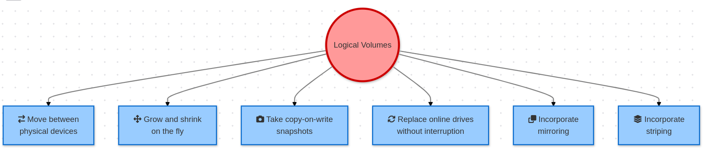

There are three types of LVM: `linear` volumes, `striped` and `mirrored` volumes.

- `Linear Volumes`: Data is written sequentially across one or more physical volumes. (No redundancy, No performance improvements but easy and simple)
- `Striped Volumes`: Data is divided into chunks and distributed across multiple physical volumes. (No redundancy, performance improved)
- `Mirrored Volumes`: Data is duplicated across two or more physical volumes. (Redundancy, performance improved, but usable capacity is divided by `N`)

### Linux logical volume management

Linux's volume manager, called LVM2, is essentially a clone of HP-UX's volume manager. Here a summary of commands:

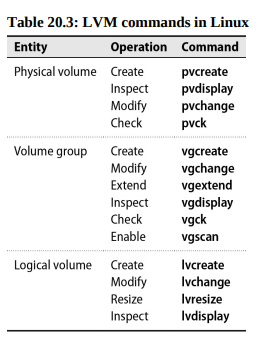

The top-level architecture of LVM is that individual disks and partitions (physical volumes) are gathered into storage pools called volume groups. Volume groups are then subdivided into logical volumes, which are the block devices that hold filesystems.

A physical volume needs to have an LVM label applied with `pvcreate`.

LVM uses "physical volumes" as a generic term for any block storage, whether it's a whole disk, partition, or RAID array, abstracting away the physical details.

It's also possible to control LVMs with simple `lvm` command (and its various subcommands).

A linux LVM configuration proceeds in a few distinct phases:

- Creating (defining, really) and initializing physical volumes
- Adding the PVs to a volume group
- Creating logical volumes on the VG

In the following example, we set up a 1TB hard disk (**/dev/sdb** and we assume it's already partitioned with all space in a single partition **/dev/sdb1**). Although using an unpartitioned disk with LVM is possible, creating a partition is recommended for better compatibility across different software and operating systems without impacting performance.

```bash
$ sudo pvcreate /dev/sdb1
Physical volume "/dev/sdb1" successfully created
$ sudo vgcreate DEMO /dev/sdb1
Volume group "DEMO" successfully created
$ sudo lvcreate -L 100G -n web1 DEMO
Logical volume "web1" created successfully
```

Here's an ouptput of the `vgdisplay` command;

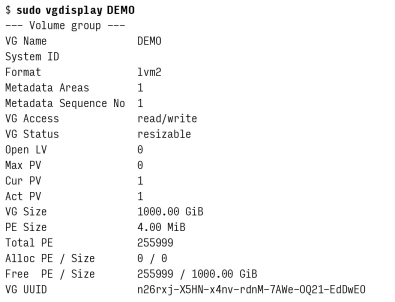

- **VG Access:** read/write - The volume group can be both read from and written to.
- **VG Status:** resizable - The size of this volume group can be changed.
- **Open LV:** 0 - There are currently no open logical volumes in this group.
- **Max PV:** 0 - There's no limit to the number of physical volumes that can be added.
- **Cur PV:** 1 - There is currently one physical volume in this group.
- **Act PV:** 1 - One physical volume is active.
- **VG Size:** 1000.00 GiB - The total size of the volume group is about 1 terabyte.
- **PE Size:** 4.00 MiB - Each Physical Extent (the smallest unit of storage allocation) is 4 megabytes.
- **Total PE:** 255990 - The total number of physical extents in the volume group.
- **Alloc PE / Size:** 0 / 0 - No physical extents have been allocated yet.
- **Free PE / Size:** 255990 / 1000.00 GiB - All physical extents are free, equaling the total size.

After the logical volume is created we can access it through **/dev/DEMO/web1**. We can for instance create a file system and mount it.

```bash
$ sudo mkfs /dev/DEMO/web1
$ sudo mkdir /mnt/web1
$ sudo mount /dev/DEMO/web1 /mnt/web1
```

*snapshots*

LVM snapshots, while useful for creating temporary backups, have limitations as a version control method due to their fixed size and potential for corruption if they run out of space, making them less versatile than similar features in ZFS or Btrfs.

To create **/dev/DEMO/web1-snap** as a snapshot of **/dev/DEMO/web1**, we would use the following command:

```bash
$ sudo lvcreade -L 100G -s -n web1-snap DEMO/web1
Logical volume "web1-snap" created
```

Note that the snapshot has its own name and that the source of the snapshot must be specified as `volume_group/volume`.

To check on the staus of your snapshots, run **lvdisplay**. If **lvdisplay** tells you that a snapshot is "inactive", that means it has run out of space and should be deleted. There's little you can do with a snapshot once it reaches this point!

*Filesystem resizing*

Filesystem overflows are more common than disk crashes, and one advantage of logical volumes is that they’re much easier to juggle and resize than are hard partitions. 

Suppose that in our example **/mnt/web1** has grown more than we predicted and needs another 100GB of space. We first check the VG to be sure additional space is available.

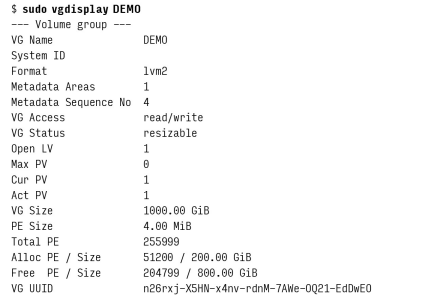

200GB already consumed (100GB for the original filesystem and 100GB for the snapshot). 800GB available!

```bash
$ sudo umount /mnt/web1 # we unmount the filesystem first
$ sudo lvchange -an DEMO/web1 # needed to deactivate the volume for resizing purpose
$ sudo lvresize -L +100G DEMO/web1 # increase web1 to 200GB
Size of logical volume DEMO/web1 changed from 100.00 GiB (25600 extents) to 200.00 GiB (51200 extents).
Logical volume DEMO/web1 resized successfully.
$ sudo lvchange -ay DEMO/web1 # activate again
```

After the volume resize operation we can now resize the filesystem with the `resize2fs` (it will automatically determine the size of new filesystem from the volume).

```bash
sudo resize2fs /dev/DEMO/web1
```

Examining the output of `df` will show changes:

```bash
$ sudo mount /dev/DEMO/web1 /mnt/web1
$ df -h /mnt/web1
Filesystem              Size        Used        Avail       Use%        Mounted on
/dev/mapper/DEMO-web1   197G        60M         187G        1%          /mnt/web1
```

It works same for other filesystems! FOr example for XFS (default for RedHat and Centos) use `xfs_growfs`, use `growfs` in FreeBSD (with UFS filesystems). It's impossible to reduce size on in XFS or UFS, you basically need to create new filesystem with smaller size and copy content!!!!

**It’s worth noting that “disks” you allocate and attach to virtual machines in the cloud are essentially logical volumes, although the volume manager itself lives elsewhere in the cloud.**. These volumes are usually resizable through the cloud provider's management console or command-line utility.

## RAID: Redundant Arrays of Inexpensive Disks

EVen with backups, the consequence of a disk failure on a server can be disastrous. RAID is a system that distributes or replicates data across multiple disks.

RAID can be implemented by dedicated hardware that presents a group of hard disks to the OS as a single composite drive. It can also be implemented simply by OS's reading or writing multiple disks according to the rules of RAID.

### Software vs Hardware RAID

Hardware RAID isn't necessarily faster than software RAID because disk speed is the primary bottleneck in RAID systems. Hardware RAID has been more prevalent due to historical lack of software alternatives and its ability to use nonvolatile memory for write buffering (it can quickly store this in its buffer and immediately signal to the system that the write is complete, which is much faster than waiting for the data to be written completely to the physical disks).

This buffering also protect against a potential corruption called "RAID 5 write hole".

### RAID levels

Replication assumes two basic forms: mirroring, in which data blocks are reproduced bit-for-bit on several different drives, and parity schemes, in which one or more drives contain an error-correcting checksum of the blocks on the remaining data drives.
Mirroring is faster but consumes more disk space. Parity schemes are more disk-space-efficient but have lower performance.

RAID is traditionally described in terms of "levels" that specify the exact details of the parallelism and redundancy implemented by an array.

---

*For the illustrations, numbers identify stripes and the letters a, b, and c identify data blocks within a stripe. Blocks marked p and q are parity blocks.*

---

Linear mode or JBOD (Just a Bunch Of Disks) is not even a real RAID level yet implemented by every RAID controller. It's just a concatenation of disks into a single big one. Nowadays you better have to use LVM for JBOD rather than a RAID system.

RAID 0 stripes data alternately among the disks in the pool. Sequential reads and writes are therefore spread among several disks, decreasing write and access times.

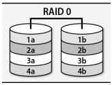

RAID 1 is mirroring! Writes are duplicated to 2 or more drives simultaneously. Slower writes but better reads (comparable to  RAID 0).

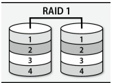

RAID levels 1+0 and 0+1 are stripes of mirrors or mirrors of stripes. The goal is to obtain the performance of RAID 0 and redundancy of RAID 1.

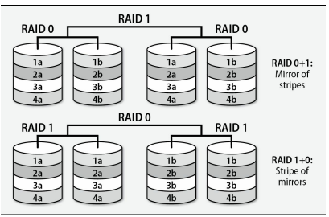

RAID 5 stripes both data and parity information, adding redundancy while simultaneously improving read performance. It's more disk-space-efficient than other levels!

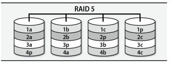

RAID 6 is similar to 5 but has two parity disks. It can then withstand the complete failure of 2 drives without losing data. RAID 6 requires at least 4 devices.

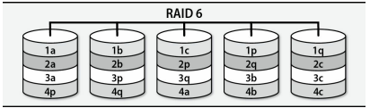

ZFS AND Btrfs are advanced file systems that combine RAID functionality, logical volume management, and file system features. They support various RAID-like configurations including striping, mirroring, and parity-based setups similar to RAID 5 and 6.

For simple striped and mirrored configurations outside the context of one of these filesystems, Linux gives you a choice between a dedicated RAID system (`md`) and the LVM.

### Disk failure recovery

Unlike JBOD and RAID 0, other RAID configurations allow continued operation in degraded mode when failures occur, though prompt disk replacement is essential to restore redundancy. Replacing a failed disk in a RAID array typically involves swapping in a new disk and initiating a time-consuming resynchronization process that can impact performance. To minimize downtime and vulnerability, many RAID implementations support "hot" spares that automatically replace failed disks and begin resynchronization immediately, a feature recommended for standard use where available.

### Drawbacks of RAID 5

RAID 5, while popular, has significant limitations including its inability to replace regular backups and its vulnerability to data loss from various threats beyond single disk failures. Its write performance is compromised due to the need for multiple read and write operations for each data update, resulting from its distributed parity system. RAID 5 is susceptible to the "write hole" problem, where data and parity blocks can become desynchronized due to unexpected interruptions, potentially leading to data corruption that only becomes apparent during disk failure and reconstruction. To mitigate these issues, solutions such as ZFS's RAID-Z implementation and regular "scrubbing" of parity data have been developed, though the latter requires consistent manual activation.

### mdadm: Linux software RAID

*Creating an array*

The following scenario configures a RAID 5 array composed of 3 identical 1TB hard disks. Although `md` can use raw disks as components, we prefer to give every disk a partition table for consistency, so we start by running `gparted`, creating GPT partition table on each disk and assigning all the disk's space to a single partition of type "Linux RAID" (just as reminder, not mandatory!).

The following command builds a RAID 5 array from three whole-disk partitions:

```bash
$ sudo mdadm --create /dev/md/extra --level=5 --raid-devices=3 /dev/sdf1 /dev/sdg1 /dev/sdh1

mdadm: Defaulting to version 1.2 metadata
mdadm: array /dev/md/extra started.
```

The virtual file /proc/mdstat always contains a summary of md’s status and the status of all the system’s RAID arrays.


## Filesystems

Even after a hard disk has been conceptually divided into partitions or logical volumes, it is still not ready to hold files. All the abstractions and goodies described in [Chapter-5](../the-filesystem/readme.md) must be implemented.

## Traditional filesystems: UFS, ext4, XFS

These filesystems exemplify the old school approach in which volume management and RAID are implemented separately from the filesystem itself.

Older filesystems were vulnerable to corruption during power interruptions, requiring fsck checks. Modern filesystems use journaling to prevent such corruption by logging changes before applying them.

In most cases, only metadata changes are journaled. 

From the Berkeley Fast File System (FFS) to the modern ext4, the basic structure of UNIX filesystems has remained remarkably consistent. The main differences between these filesystems are in their handling of large files, large directories, and journaling.

### Filesystem terminology

Most of the filesystems use the same terminology. `Inodes` (probably short for “index nodes”) are fixed-length table entries, each of which describes a file or directory. Inodes were originally preallocated at the time a filesystem was created, but modern filesystems allocate them dynamically as needed. You can see the number of inodes in a filesystem with the `df -i` command or for a specific directory with `ls -i`.

Inodes are the “things” pointed to by directory entries. When you create a hard link to an existing file, you create a new directory entry, but you do not create a new inode.

A superblock is a record that describes the characteristics of the filesystem (length of a disk block, size and location of the inode tables, the disk block map, and so on). The superblock is usually duplicated in several places on the disk to guard against corruption.

The kernel caches disk blocks to increase efficiency. Caches are normally not 'write-through', meaning that the kernel can acknowledge a write operation before the data is actually written to disk. This can lead to data loss if the system crashes before the data is written.

`sync` operation is used to flush the cache to disk. Some filesystem do this automatically after a certain amount of time or after a certain number of writes. Modern filesystems use journaling to prevent data loss in the event of a crash.

Filesystems use a disk block map to track free blocks and a block usage summary for allocated blocks, enabling efficient file storage and retrieval. 

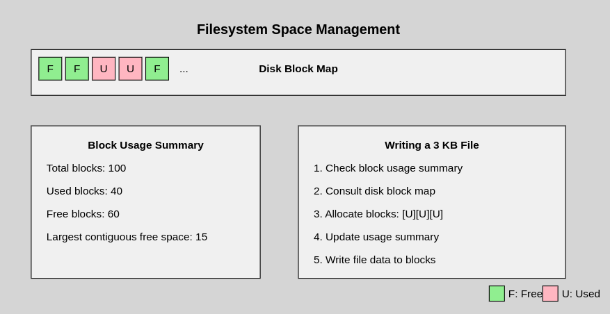

### Filesystem formatting

Filesystem formatting is the process of creating a filesystem on a disk partition. The `mkfs` command is used to format a disk partition with a specific filesystem type.

```bash
$ sudo mkfs.fstype [-L lable] [other_options] device
```

The `-L` option is used to assign a label to the filesystem such as 'root', 'extra', 'spare' etc.

### fsck: check and repair filesystems

Because of block buffering and the fact that disk drives are not really transactional devices, filesystem data structures can potentially become self-inconsistent.

`fsck` carefully inspect all data structures and walk into the allocation tree of every file. It's purely heuristic!

Disk are normally fscked automatically at boot time if they are listed in the system's **/etc/fstab** file. The fstab file has legacy "fsck sequence" fields thqt ordered and parallelized filesystems checks.

We can force fsck on linux ext-family filesystems to recheck after they have been remounted a certain number/period of time.
Nowadays on desktop we set the max mount count to infinite (-1) because the system mounts frequently the filesystem.

If things go really wrong better to dd the entire disk first to a backup file or backup disk.

Most filesystems create a `lost+found` directory at the root of each filesystem in which fsck can deposit files whose parent directory cannot be determined. THe `lost+found` directory has some extra space preallocated so that fsck can store orphaned files there without having to allocate additional 
directory entries on an unstable filesystem. (Use `mklost+found` to recreate the directory if inadvertently deleted!)

Since the name given to a file is recorded only in the file’s parent directory, names for orphan files are not available and so the files placed in `lost+found` are named with their inode numbers.
The inode table does record the UID of the file’s owner, however, so getting a file back to its original owneris relatively easy.

### Filesystem mounting

Mounting is the process of attaching a filesystem to a directory in the system's directory tree. The `mount` command is used to mount a filesystem.

```bash
$ sudo mount [-t fstype] [-o options] device mountpoint
```
For example to mount a filesystem in the partition represented by the device `/dev/sdb1` to the directory `/mnt/extra`:

```bash
$ sudo mount /dev/sdb1 /mnt/extra
```
Most of the time the filesystem is automatically mounted at boot time by the system's init scripts. The filesystems to be mounted at boot time are listed in the system's `/etc/fstab` file.

To mount all local 'ext4' filesystems:

```bash
$ sudo mount -at ext4
```

The `mount` command reads **fstab** sequentially. Therefore, if you have a filesystem that depends on another filesystem, the filesystem it depends on must be listed first in **fstab**.

Use `umount` to unmount a filesystem. Beware that the filesystem must not be in use (files open, processes running, etc.) before it can be unmounted.

### USB drive mounting

With the dynamic device management philosophy by OS, USB drives are just one more type of device that shows up or disappear without warning.

From the perspective of storage management, the issues are two fold:

- Getting the kernel to recognize a device and assign a device file to it,
- Finding out what assignment has been made (in /dev)

### Swapping recommendations

The proper amount of swap space to allocate depends on how a machine is used. There is no penalty to overprovisioning except that you lose the extra disk space. We suggest half the amount of RAM as a rule of thumb, but never less than 2GB on a physical server.

If a system will hibernate (personal machines, usually), it needs to be able to save the entire contents of memory to swap in addition to saving all the pages that would be swapped in normal operation. On these machines, increase the swap space recommended above by the amount of RAM.

## Next gen filesystems: ZFS and BTRFS

Although ZFS and Btrfs are usually referred to as filesystems, they represent vertically integrated approaches to storage management that include the functions of a logical volume manager and a RAID controller.

### Copy-on-Write (CoW)

When data needs to be updated, instead of modifying the existing data in place:

- The filesystem makes changes to a copy of the data in memory.
- It then writes this modified copy to a new, unused location on the disk.
- The parent block that points to the modified data needs to be updated.
- This continues up the chain, potentially all the way to the top of the filesystem structure.

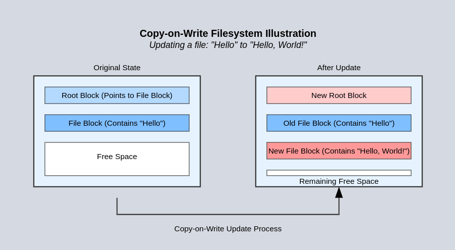

### Error detection

ZFS and Btrfs use checksums to detect errors in data and metadata. When data is read, the checksum is recalculated and compared to the stored checksum. If they don't match, the filesystem knows that the data has been corrupted.

### Performance

ZFS and Btrfs are designed to take advantage of modern hardware, including multiple cores, large amounts of RAM, and SSDs. They are optimized for performance and can take advantage of the latest hardware features.

## ZFS

ZFS is a combined filesystem, volume manager, and RAID controller. ZFS was introduced in 2005 as a component of OpenSolaris. 

### ZFS on Linux

ZFS is available on Linux as a kernel module through the OpenZFS project (because the Sun Microsystems license, CDDL, is incompatible with the GPL). 

### ZFS architecture

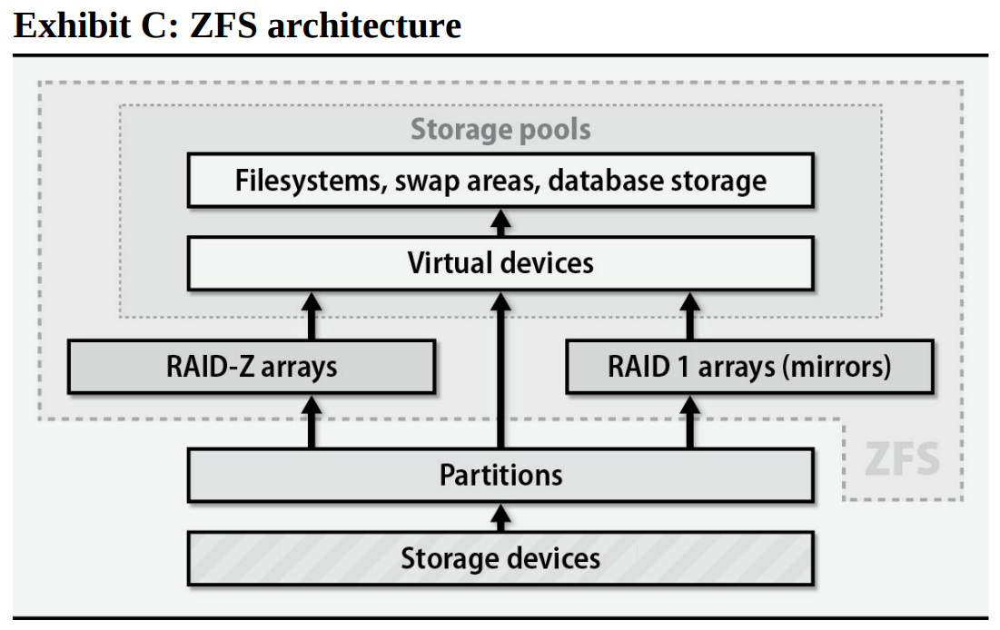

- **Pool**: A pool is a collection of vdevs. A pool can have one or more vdevs. A ZFS “storage pool” is analogous to a “volume group”.
- **vdev**: A vdev is a virtual device that can be a disk, a partition, a file, or a combination of these. A vdev can be a single disk, a mirror, a RAID-Z group, or a combination of these.
- **RAID-Z**: RAID-Z is a data protection mechanism similar to RAID 5. It uses a variable number of disks for parity, depending on the RAID-Z level. RAID-Z levels include RAID-Z1 (similar to RAID 5), RAID-Z2 (similar to RAID 6), and RAID-Z3 (similar to RAID 7).

### Example: disk addition

