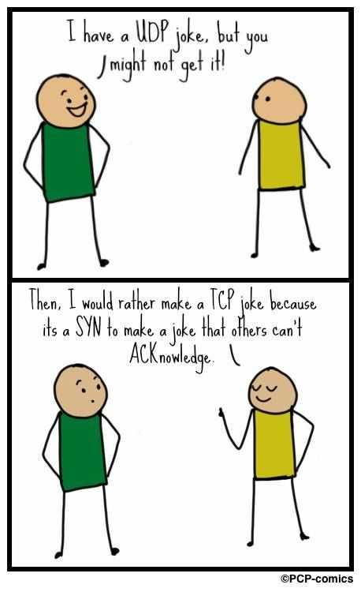

# Chapter 13: TCP/IP Networking



TCP/IP (Transmission Control Protocol/Internet Protocol) is the networking system that underlies the Internet. TCP/IP does not depend on any particular hardware or operating system, so devices that speak TCP/IP can all exchange data (“interoperate”) despite their many differences.

## TCP/IP and its relationship to the Internet

The progenitor of the modern Internet was a research network called ARPANET, which was funded by the U.S. Department of Defense’s Advanced Research Projects Agency (ARPA). Today's Internet is a collection of private networks owned by Internet Service Providers (ISPs) that interconnect at many so-called peering points.

### WHo runs the Internet?

- ICANN (Internet Corporation for Assigned Names and Numbers) is a nonprofit organization that manages the Domain Name System (DNS) and IP address allocation.
- ISOC (Internet Society) is an open-membership organization that promotes the development and use of the Internet.
- IGF (Internet Governance Forum) is a United Nations-sponsored group that discusses public policy issues related to the Internet.

### Networks standard and documentation

- RFC (Request For Comments) is a series of documents that describe the Internet and its protocols. RFCs are published by the Internet Engineering Task Force (IETF).

Not all RFCs are full of boring technical details. Here are some of interesting rfcs on the lighter side (usually written on April 1st):

- RFC1149 – Standard for Transmission of IP Datagrams on Avian Carriers
- RFC1925 – The Twelve Networking Truths
- RFC3251 – Electricity over IP
- RFC4041 – Requirements for Morality Sections in Routing Area Drafts
- RFC6921 – Design Considerations for Faster-Than-Light Communication
- RFC7511 – Scenic Routing for IPv6

In addition to being assigned its own serial number, an RFC can also be assigned an FYI (For Your Information) number, a BCP (Best Current Practice) number, or a STD (Standard) number. FYIs, STDs, and BCPs are subseries of the RFCs that include documents of special interest or importance.

FYIs are introductory or informational documents intended for a broad audience. They can be a good place to start research on an unfamiliar topic if you can find one that’s relevant.

BCPs document recommended procedures for Internet sites. They consist of administrative suggestions and for system administrators are often the most valuable of the RFC subseries.

STDs document Internet protocols that have completed the IETF’s review and testing process and have been formally adopted as standards.

## Networking Basics

- **IP**, Internet Protocol, which routes data packets from one machine to another (RFC791).
- **ICMP**, Internet Control Message Protocol, which sends error messages and other control information (RFC792).
- **ARP**, Address Resolution Protocol, which maps IP addresses to MAC addresses (RFC826).
- **UDP**, User Datagram Protocol, which sends data packets without establishing a connection (RFC768).
- **TCP**, Transmission Control Protocol, which sends data packets and ensures they arrive in the correct order (RFC793).


### IPv4 and IPv6

- **IPv4** is the original version of the Internet Protocol. It uses 32-bit addresses, which limits the number of unique addresses to 4,294,967,296.
- **IPv6** is the latest version of the Internet Protocol. It uses 128-bit addresses, which allows for 340,282,366,920,938,463,463,374,607,431,768,211,456 unique addresses.

The number of unique IPv4 addresses is not enough to accommodate all the devices that need to connect to the Internet. To solve this problem, the Internet Engineering Task Force (IETF) developed IPv6, which uses 128-bit addresses.

Your choice is not between IPv4 and IPv6; it’s between supporting IPv4 alone and supporting both IPv4 and IPv6.

Yes, it’s an elegant and well-designed protocol that improves on IPv4. And yes, it is in some ways easier to administer than IPv4 and requires fewer hacks (e.g., less need for NAT). But in the end, it’s just a cleaned-up version of IPv4 with a larger address space. The fact that you must manage it alongside IPv4 eliminates any potential efficiency gain. IPv6’s raison d’être remains the millenial fear of IPv4 address exhaustion, and to date, and to date, the effects of that exhaustion just haven't been painful enough to justify the cost of switching to IPv6.

### Packets and encapsulation

A packet is a unit of data that is sent over a network. A packet consists of a header and a payload. The header contains information about the packet, such as the source and destination IP addresses. The payload contains the data that is being sent.

When a packet is sent over a network, it is encapsulated in a series of headers. Each header contains information about the packet, such as the source and destination IP addresses. The headers are added to the packet in reverse order, so that the last header added is the first one read by the receiving device.

For example, a UDP packet is encapsulated in an IP header, which is encapsulated in an Ethernet header. When the packet reaches its destination, the receiving device reads the Ethernet header first, then the IP header, and finally the UDP header.


### Ethernet framing

One of the main chores of the link layer is to add headers to packets and to put separators between them. The headers contain each packet's link layer addressing information and checksums, and separators ensure that receivers can tell where one packet ends and the next begins.

The link layer is divided into two sublayers: the Media Access Control (MAC) sublayer and the Logical Link Control (LLC) sublayer. The MAC sublayer is responsible for addressing and error detection, while the LLC sublayer is responsible for flow control and error correction.

### MTU (Maximum Transmission Unit)

The Maximum Transmission Unit (MTU) is the largest packet size that can be sent over a network. The MTU is determined by the link layer, which adds headers to packets and puts separators between them. The headers contain each packet's link layer addressing information and checksums, and separators ensure that receivers can tell where one packet ends and the next begins.

**MTUs for various network types:**

- Ethernet: 1500 bytes
- Token Ring: Configurable (common values: 552, 1064, 2088 bytes)
- IPv6: At least 1280 bytes at the IP layer
- Point-to-point WAN links(T1, T2): Configurable, often, 1500 or 4500 bytes

IPv4 splits packets to conform to the MTU of a particular network link. If a packet is routed through several networks, one of the intermediate networks might have a smaller MTU than the network of origin. In this case, an IPv4 router that forwards the packet onto the small-MTU network further subdivides the packet in a process called fragmentation.

IPv4 senders can discover the lowest-MTU link through which a packet must pass by setting the packet’s “do not fragment” flag. If the packet reaches an intermediate router that cannot forward the packet without fragmenting it, the router returns an ICMP error message to the sender. The ICMP packet includes the MTU of the network that’s demanding smaller packets, and this MTU then becomes the governing packet size for communication with that destination.


Setting the MTU of the link to a smaller value averts fragmentation and increases the overall performance of the tunneled network. Consult the `ifconfig` or `ip-link` man page to see how to set an interface’s MTU.

## Packet addressing

Several addressing schemes are used in combination:

- MAC addresses for use by hardware
- IPv4 and IPv6 network addresses for use by software
- Hostnames for use by people

### MAC addressing

A MAC (Media Access Control) address is a unique identifier assigned to network interfaces for communications on the physical network segment. MAC addresses are used as a network address for most IEEE 802 network technologies, including Ethernet and Wi-Fi.

A MAC address is a 48-bit number that is usually represented as six pairs of hexadecimal digits, separated by colons or hyphens. For example, `00:1A:2B:3C:4D:5E`.

### IP addressing

At the next level up from the hardware, Internet addressing (more commonly known as IP addressing) is used. IP addresses are hardware independent. They are assigned to network interfaces by software, and they can be reassigned to different hardware interfaces as needed.

The mapping from IP addresses to hardware addresses is done by the Address Resolution Protocol (ARP).

### Hostname "addressing"

IP addresses are sequences of numbers, so they are hard for people to remember. Operating systems allow one or more hostnames to be associated with an IP address. This mapping can be set up in several ways, ranging from a static file (**/etc/hosts**) to the LDAP database system to DNS.

## Ports

A port is a number that is used to identify a specific process or service on a computer. Ports are used to allow multiple processes to share a single IP address. Each port is associated with a specific protocol, such as TCP or UDP. Check the **/etc/services** file for a list of well-known ports.

### Address types

- **Unicast**: A packet is sent from one host to another host.
- **Broadcast**: A packet is sent from one host to all hosts on the network.
- **Multicast**: A packet is sent from one host to a target group of hosts.
- **Anycast**: A packet is sent from one host to the nearest host in a group.

## IP Addresses: the glory details

IPv4 addresses are 4 bytes long and the boundary between network and host portions is set administratively. In IPv6, addresses are 16 bytes long and the network portion and host portion are always 8 bytes each.

### IPv4 address classes

**Historical IPv4 address classes:**

| class | 1st byte | Format  | Comments                                         |
| ----- | -------- | ------- | ------------------------------------------------ |
| A     | 1-127    | N.H.H.H | Very early networks, or reserved for DoD         |
| B     | 128-191  | N.N.H.H | Large sites, usually subnetted, were hard to get |
| C     | 192-223  | N.N.N.H | Most common class, easy to get                   |
| D     | 224-239  | N/A     | Reserved for multicast                           |
| E     | 240-255  | N/A     | Experimental                                     |

### IPv4 subnetting

To make the best use of the limited number of IPv4 addresses, network administrators divide the address space into subnets. Subnetting allows a single network to be divided into multiple smaller networks, each with its own unique address range.

For example, the four bytes of a class B address would normally be interpreted as N.N.H.H. The implicit netmask for a class B address is therefore 255.255.0.0. With a netmask of 255.255.255.0, however, the address would be interpreted as N.N.N.H, and the last byte would be used to identify individual hosts on the network. Use of the mask turns a single class B network into 256 class C networks, each with 254 usable addresses.


A /26 network has 6 bits left (32 – 26 = 6) to number hosts. This means that a /26 network can have 2^6 – 2 = 62 hosts. The –2 accounts for the network and broadcast addresses, which are not usable for hosts.

### CIDR (Classless Inter-Domain Routing)

CIDR is a method for allocating IP addresses and IP routing. It is based on variable-length subnet masking (VLSM) and supernetting. CIDR allows for more efficient use of IP addresses and reduces the size of routing tables.

CIDR notation is a way of representing IP addresses and their associated network masks. It consists of the IP address followed by a slash and the number of bits in the network mask.

### Address allocation

Regional Internet Registries (RIRs) are responsible for allocating IP addresses to ISPs. The RIRs are divided into five regions: Africa, Asia-Pacific, Europe, Latin America and the Caribbean, and North America.

The RIRs allocate IP addresses to ISPs, who in turn allocate them to end users. The ISPs are responsible for managing the IP addresses they allocate, including assigning them to customers and updating the RIRs with any changes.

### Private addresses and NAT (Network Address Translation)

Private addresses are reserved for use on private networks and are not routable on the public Internet. NAT is a method for translating private addresses to public addresses so that private networks can communicate with the public Internet.


It is possible to have a UNIX or Linux box to perform the NAT function, but most often, NAT is done by a router or firewall.

An incorrect NAT configuration can let private-addresses-space packets escape onto the public Internet. The packets might get to their destination, but the return packets will not be able to find their way back to the private network. This is called a “black hole” because the packets disappear into the Internet and are never seen again.

One issue raised by NAT is that an arbitrary host on the Internet cannot initiate connections to your site's internal machines. To get around this limitation, NAT implementations let you preconfigure externally visible "tunnels" that connect specific internal hosts and ports. Many routers also support the Universal Plug and Play (UPnP) standards promoted by Microsoft, one feature of which allows interior hosts to set their own NAT tunnels.

Another NAT-related issue is that some apps embed IP addresses in the data portion of packets; these apps are foiled or confused by NAT.

NAT hides interior structure. This secrecy feels like a security win, but sec folks say NAT doesn't really help for security and does not replace the need for a firewall.

### IPv6 addressing

IPv6 addresses are 128 bits long and are written as eight groups of four hexadecimal digits, separated by colons. For example, `2001:0db8:85a3:0000:0000:8a2e:0370:7334`.

IPv6 addresses are divided into two parts: the network prefix and the interface identifier. The network prefix is used to route packets to the correct network, while the interface identifier is used to identify the specific host on the network.

**Stateless Address Autoconfiguration (SLAAC)** is a method for automatically configuring IPv6 addresses on a network. SLAAC uses the network prefix to generate the interface identifier, which is then combined with the network prefix to form the full IPv6 address.

## Routing

Routing is the process of directing a packet through the maze of networks that stand between its source and its destination.

### Routing tables

You can examine a machine's routing table with `ip route show` or `netstat -r` on FreeBSD. Although netstat is deprecated, it is still available on many Linux systems too.

Routing tables can be configured statically, dynamically, or a combination of both.
We can use **ip**(Linux) or **route**(FreeBSD) command to add or delete routes.

```bash
# Linux
ip route add network/prefix via gateway_ip dev interface

# FreeBSD
route add -net network/prefix gw gateway_ip interface
```

For more complicated network topologies, dynamic routing is required. Dynamic routing is implemented by a daemon process that maintains and modifies the routing table.

### ICMP Redirects

ICMP Redirects are messages sent by routers to inform hosts that a better route is available for a particular destination. When a host receives an ICMP Redirect message, it updates its routing table to use the new route.

_A basic example:_

Imagine a small office network with three devices:

- Device A (192.168.1.10): A computer trying to access a printer.
- Router (192.168.1.1): The network router responsible for routing traffic.
- Printer (192.168.1.20): The network printer Device A wants to connect to.

Device A sends a packet to the printer, but the router intercepts the packet and sends an ICMP Redirect message to Device A. The ICMP Redirect message tells Device A to send packets directly to the printer instead of through the router.

## IPv4 ARP and IPv6 ND

Although IP addresses are hardware-independent, hardware addresses must still be used to actually transport data across a network’s link layer. (An exception is for point-to-point links, where the identity of the destination is sometimes implicit.) IPv4 and IPv6 use separate but eerily similar protocols to discover the hardware address associated with a particular IP address.

IPv4 uses ARP (Address Resolution Protocol), defined in RFC826. IPv6 uses ND (Neighbor Discovery), defined in RFC4861. These protocols can be used on any kind of network that support broadcast or multicast.

On Linux, the **ip neigh** command can be used to view the ARP and ND tables.

## DHCP: Dynamic Host Configuration Protocol

When you plug a device or computer into a network, it usually obtains an IP address for itself on the local network, sets up an appropriate default route, and connects itself to a local DNS server.

The Dynamic Host Configuration Protocol (DHCP) provides a framework for passing configuration information to hosts on a TCPIP network. DHCP is based on the Bootstrap Protocol (BOOTP), adding the capability of automatic allocation of reusable network addresses and additional configuration options.

ISC, the Internet Systems Consortium, maintains a nice open source reference implementation of DHCP.

### DHCP behavior

A DHCP client begins its interaction with a DHCP server by broadcasting a “Help! Who am I?” message. IPv4 clients initiate conversations with the DHCP server by using the generic all-1s broadcast address (255.255.255.255). The clients don’t yet know their subnet masks and therefore can’t use the subnet broadcast address. IPv6 uses multicast addressing instead of broadcasting.

If the DHCP server is on the local network, it supply an IP address and other net params else, servers on different subnets can receive the initial broadcast message.

### ISC's DHCP software

ISC's server daemon is called `dhcpd` and the client daemon is called `dhclient`. The server configuration file is `/etc/dhcpd.conf` and the client configuration file is `/etc/dhclient.conf` (or `/etc/dhcp/dhclient.conf`).

To set up the `dhcpd.conf` file, you need the following information:

- The subnets for which **dhcpd** should manage IP addresses, and the range of addresses to dole out.
- A list of static IP addresses to assign to specific hosts (MAC addresses).
- The initial and maximum lease times for IP addresses.
- Any other options you want to pass to clients, such as the address of the DNS server.

**Make sure _dhcpd_ is started at boot time (with `systemctl enable dhcpd`) and is running (with `systemctl status dhcpd`).**

Example of a simple `dhcpd.conf` file:

```bash
# global options

option domain-name "synack.net";
option domain-name-servers gw.synack.net;
option subnet-mask 255.255.255.0;
default-lease-time 600;
max-lease-time 7200;

# subnet definitions

subnet 192.168.1.0 netmask 255.255.255.0 {
    range 192.168.1.51 192.168.1.60
    option broadcast-address 192.168.1.255
    option routers gw.synack.net
}

subnet 209.180.251.0 netmask 255.255.255.0 {
}

# host definitions

host gandalf {
    hardware ethernet 00:00:07:12:f3:54;
    fixed-address gandalf.synack.net;
}
```

## Security issues

### IP forwarding

A UNIX or Linux system that has IP forwarding enabled can act as a router. That is, it can accept third party packets on one NI, match them to a gateway or destination host on another interface, and retransmit the packets. Unless your system has multiple NI and is actually supposed to function as a router, it's best to turn this feature off (with `sysctl -w net.ipv4.ip_forward=0`).

### ICMP redirects

ICMP Redirects can be used to trick hosts into sending packets through a malicious router. To prevent this, you can disable ICMP Redirects on your system (with `sysctl -w net.ipv4.conf.all.accept_redirects=0`).

### Source routing

Source routing is a technique that allows the sender of a packet to specify the route it should take through the network. This can be used to bypass security measures and launch attacks. To prevent source routing, you can disable it on your system (with `sysctl -w net.ipv4.conf.all.accept_source_route=0`).

### smurf attacks

A smurf attack is a type of denial-of-service attack that floods a target system with ICMP Echo Request packets. The attack is amplified by sending the packets to a broadcast address, causing all hosts on the network to respond to the target system.

To prevent smurf attacks, you can disable ICMP Echo Requests on your system (with `sysctl -w net.ipv4.icmp_echo_ignore_all=1`).

### IP spoofing

IP spoofing is a technique used to gain unauthorized access to a system by impersonating a trusted host. It happens when an attacker sends packets with a forged source IP address to a target system. To prevent IP spoofing, you can enable IP source address validation on your system (with `sysctl -w net.ipv4.conf.all.rp_filter=1`).

You should also protect yourself against inbound spoofed packets by using what is called a "unicast reverse path forwarding" filter. This filter checks the source address of incoming packets to make sure they are reachable through the interface on which they arrived. If the source address is not reachable through the interface, the packet is dropped.

### VPN

A Virtual Private Network (VPN) is a secure tunnel between two or more devices. VPNs are used to protect private web traffic from snooping, interference, and censorship.

A VPN works by encrypting your data and sending it through a secure connection to a remote server. This server then sends your data to the intended recipient, masking your IP address and location. Some VPN systems use IPsec, while others use SSL/TLS for encryption.

## Basic network configuration

Adding a new machine to a LAN involves setting up the following:

1. Assigning an IP address and a hostname
2. Configure NI and IP addresses
3. Set up default route
4. Point to a DNS name server to allow to the rest of the internet

### Hostname and P address assignment

When you are an admin, you need to maintain a list of IP addresses and hostnames. This list can be maintained in a file, such as `/etc/hosts`, or in a DNS server.

Here is an example of an `/etc/hosts` file:


Because the `/etc/hosts` contains only local mappings, and must be updated on every machine, it is not a good solution for large networks. Use DNS or LDAP to find mappings for the rest of local network and the rest of the world.

### Network interface and IP configuration

A network interface is a piece of hardware that can potentially be connected to a network. The hardware varies widely. It can be an RJ-45 jack with associated signaling hardware for wired Ethernet, a wireless radio for Wi-Fi, or even a virtual piece of hardware that connects to a virtual network.

Every system has at least two network interfaces: a virtual loopback interface (lo) and at least one real network card or port (e.g., eth0, enp0s3, or wlan0).

On most UNIX systems, you can see all the network interfaces with the `ip link show` (Linux) or `ifconfig -a` (FreeBSD) command.

You can assign multiple IP addresses to a single network interface. This is useful when you want to run multiple web sits on a single machine, each with its own IP address. However, the need for this feature has been superseded by HTTP Host headers and the SNI extension to TLS.

### Route configuration

Routing is performed at the IP layer. When a packet arrives at a router, the router looks at the destination IP address and consults its routing table to determine where to send the packet next.

Some common routing commands:

- `ip route show` or `netstat -r` to display the routing table.
- `ip route add network/prefix via gateway_ip dev interface` to add a route.
- `ip route del network/prefix` to delete a route.
- `ip route add default via gateway_ip` to set the default route.
- `ip route flush` to delete all routes.

### DNS configuration

The Domain Name System (DNS) is a hierarchical and decentralized naming system for computers, services, or other resources connected to the Internet or a private network. It translates domain names to IP addresses.

The `/etc/resolv.conf` file contains the IP addresses of the name servers that the system should use. The file is automatically generated by the DHCP client, but you can edit it manually if needed.

## Network troubleshooting

Several tools are available for troubleshooting network problems:

- `ping` is used to test the reachability of a host on an IP network.
  Example: `ping google.com` which sends ICMP echo requests to google.com. If google.com is reachable, it will respond with ICMP echo replies.

- `traceroute` is used to trace the route that packets take from one host to another.
  Example: `traceroute google.com` which sends packets to google.com with increasing TTL values. Each router along the path decrements the TTL value and sends an ICMP Time Exceeded message when the TTL reaches zero.

- `tcpdump` is used to capture and analyze network traffic.
  Example: `tcpdump -i eth0` which captures packets on the eth0 interface.

- `netstat` is used to display network connections, routing tables, and interface statistics.
  Example: `netstat -r` which displays the routing table.

- `nmap` is used to scan ports and discover hosts on a network.
  Example: `nmap -sP www.ept.sn` which scans the www.ept.sn domain for hosts.

Ask yourself questions like these as you work up or down the stack:

- _Do you have physical connectivity and a link light?_
- _Is your interface configured properly?_
- _Do your ARP tables show other hosts?_
- _Is there a firewall on your local machine?_
- _Is there a firewall anywhere between you and the destination?_
- _If firewalls are involved, do they pass ICMP ping packets and responses?_
- _Can you ping the localhost address (127.0.0.1)?_
- _Can you ping other local hosts by IP address?_
- _Is DNS working properly?_
- _Can you ping other local hosts by hostname?_
- _Can you ping hosts on another network?_
- _Do high-level services such as web and SSH servers work?_
- _Did you really check the firewalls?_

**ping: check to see if a host is up**

Most of the time `ping` is enough tp check the status of a host or segment of a network unless there's a firewall in the way (where ICMP echo requests are blocked).

Most versions of `ping` run in an infinite loop unless you supply a packet count argument. You can also set the packet size, the time between packets, and the time to wait for a response.

Example: `ping -c 4 -s 1000 -i 0.2 -W 1 google.com`

The `-c` option sets the number of packets to send, the `-s` option sets the packet size, the `-i` option sets the interval between packets, and the `-W` option sets the timeout for a response (in seconds).

**traceroute: trace IP packets**

`traceroute` is a tool that traces the route that packets take from one host to another. It sends packets with increasing TTL values and displays the IP addresses of the routers along the path.


Since traceroute sends three packets for each value of the TTL field, you may sometimes observe an interesting artifact. If an intervening gateway multiplexes traffic across several routes, the packets might be returned by differen hosts; in this case, traceroue simply prints them all.

If you see a series of asterisks, it means that the router is not responding to ICMP Time Exceeded messages. Some firewalls are configured to block these ICMP "time exceeded" messages entirely. If such a firewall is in the path, you won't get information about any gateways beyond it. However, you can still determine the total number of hops to the information because the probe packets will eventually reach the destination.

You can use **mtr**, a **top**-like interface to traceroute, to get a continuous view of the route to a host.

**tcpdump: capture and analyze packets**

`tcpdump` yet another amazing network tool by Van Jacobson, runs on most systems. It captures packets on a network interface and displays them in real time. You can use it to troubleshoot network problems, analyze network traffic, and monitor network activity.

Example: `tcpdump -i eth0 -n -c 10`

The `-i` option sets the interface to capture packets on, the `-n` option disables name resolution, and the `-c` option sets the number of packets to capture.

## Network Monitoring

### SmokePing: gather ping statistics over time

SmokePing sends several ping packets to a target host at regular intervals. It shows the history of each monitored link through a web interface and can send alerts when a link goes down (check it here: [https://oss.oetiker.ch/smokeping/](https://oss.oetiker.ch/smokeping/)).

### iPerf: track network performance

At the most basic level, iPerf opens a conection (TCP or UDP) between two hosts, passes data between them, and records how long the process took.

Once you have iPerf installed on two hosts, you can run the server on one host and the client on the other. The server listens for connections, and the client connects to the server and sends data.

Example: `iperf -s` on the server and `iperf -c server_ip` on the client.

## Firewalls and NAT

It is not recommended to rely on Linux, UNIX, or Windows systems as firewalls because of the insecurity inherent in running a full-fledged, general-purpose OS. However, all operating systems have built-in firewall capabilities that can be used to protect the system from attack.

Whe it comes to machine-specific firewalls, two main schools of thought exist:

- The first school considers them superfluous. According to this view, firewalls belong on gateway routers, where they can protect the entire network through the application of one consistent set of rules.
- The second school considers machine-specific firewalls an important component of a "defense in depth" security plan. Although gateway firewalls are theoretically sufficient to control network traffic, they can be compromised, routed around, or administratively misconfigured. Therefore, it's prudent to implement the same network traffic restrictions through multiple, redundant firewall systems.

### iptables

`iptables` is a user-space utility program that allows a system administrator to configure the IP packet filter rules of the Linux kernel firewall, implemented as different Netfilter modules. The filters are organized in different tables, which contain chains of rules for how to treat network traffic packets.

iptables applies ordered “chains” of rules to network packets. Sets of chains makes up "tables" and are used for handling specific kinds of traffic. 

For example the default table is the `filter` table, which is used to filter packets. Chains of rules in this table are used for filtering packets. It contains three built-in chains: `INPUT`, `OUTPUT`, and `FORWARD`.

In addition to the `filter` table, there are two other tables: the `nat` table, which is used for network address translation, and the `mangle` table, which is used for packet alteration.

(see [iptables](./training/iptables.md) for examples)

**iptables** *firewall* *setup*

Before you can use iptables as a firewall, you must enable a IP forwarding and make sure that various iptables modules have been loaded into the kernel.

A linux firewall is usually implemented as a series of iptables commands contained in an rc startup script. Individual iptables commands usually take one of the following forms:

- `iptables -F chain_name` 
- `iptables -P chain_name target`
- `iptables -A chain_name -i interface -j target`

The `-F` option flushes the rules from a chain, the `-P` option sets the default target for a chain, and the `-A` option appends a rule to a chain.


[A COMPLETE EXAMPLE IS WELL EXLAINED IN THE BOOK]

Say we have two interfaces, eth0 (IP: 10.1.1.1, subnet mask: 255.255.255.0) which goes to internal network and eth1 (128.138.101.4, subnet mask: 255.255.255.0) which goes to the Internet. We are using stateless packet filtering to protect the web server (IP: 10.1.1.2) on the internal network, which is the standard way to protect a web server.

Our first set of rules initializes the filter table. First, all chains are flushed, then the INPUT and FORWARD chains are set to DROP.
    
```bash
iptables -F
iptables -P INPUT DROP
iptables -P FORWARD DROP
```

Next, we allows all connections through the firewall that originate whithin the trusted net (eth0). The next three rules in the FORWARD chain allow connections through  the firewall to network services on 10.1.1.2 (SSH, HTTP, and HTTPS).

```bash
iptables -A FORWARD -i eth0 -p ANY -j ACCEPT
iptables -A FORWARD -i eth1 -d 10.1.1.2 -p tcp --dport 22 -j ACCEPT
iptables -A FORWARD -i eth1 -d 10.1.1.2 -p tcp --dport 80 -j ACCEPT
iptables -A FORWARD -i eth1 -d 10.1.1.2 -p tcp --dport 443 -j ACCEPT
```

The only TCP traffic we allow to our firewall host (10.1.1.1) is SSH, which is useful for remote administration. The second rule allow loopback traffic, which stays local to the host (so that the host can talk to itself via a ping or a web browser). So the third rule allows ICMP_ECHO_REQUEST packets from internal IP addresses.

```bash
iptables -A INPUT -i eth0 -d 10.1.1.1 -p tcp --dport 22 -j ACCEPT
iptables -A INPUT -i lo -d 127.0.0.1 -p ANY -j ACCEPT
iptables -A INPUT -i eth0 -d 10.1.1.1 -p icmp --icmp-type 8 -j ACCEPT
```

For any IP host to work properly on the Internet, certain types of ICMP packets must be allowed through the firewall. The following eight rules allow a minimal set of ICMP packets to the firewall host, as well as to the network behind it.

```bash
iptables -A INPUT -p icmp --icmp-type 0 -j ACCEPT
iptables -A INPUT -p icmp --icmp-type 3 -j ACCEPT
iptables -A INPUT -p icmp --icmp-type 5 -j ACCEPT
iptables -A INPUT -p icmp --icmp-type 11 -j ACCEPT
iptables -A FORWARD -d 10.1.1.2 -p icmp --icmp-type 0 -j ACCEPT
iptables -A FORWARD -d 10.1.1.2 -p icmp --icmp-type 3 -j ACCEPT
iptables -A FORWARD -d 10.1.1.2 -p icmp --icmp-type 5 -j ACCEPT
iptables -A FORWARD -d 10.1.1.2 -p icmp --icmp-type 11 -j ACCEPT
```

We next add rules to the PREROUTING chain in the nat table. Although the nat table is not intended for packet filtering, its PREROUTING chain is particularly useful for antispoofing filtering. If we put DROP entries in the PREROUTING chain, they need not be present in the INPUT and FORWARD chains, since the PREROUTING chain is applied to all packets that enter the firewall host. It’s cleaner to put the entries in a single place rather than to duplicate them.

```bash
iptables -t nat -A PREROUTING -i eth1 -s 10.0.0.0/8 -j DROP
iptables -t nat -A PREROUTING -i eth1 -s 172.16.0.0/12 -j DROP
iptables -t nat -A PREROUTING -i eth1 -s 192.168.0.0/16 -j DROP
iptables -t nat -A PREROUTING -i eth1 -s 127.0.0.0/8 -j DROP
iptables -t nat -A PREROUTING -i eth1 -s 224.0.0.0/4 -j DROP
```

We end noth INPUT and FORWARD chains with a rule that logs and drops any packets that have not been accepted by previous rules. This is a good practice because it allows you to see what kind of traffic is being dropped.

```bash
iptables -A INPUT -i eth1 -j LOG
iptables -A FORWARD -i eth1 -j LOG
```

### NAT

