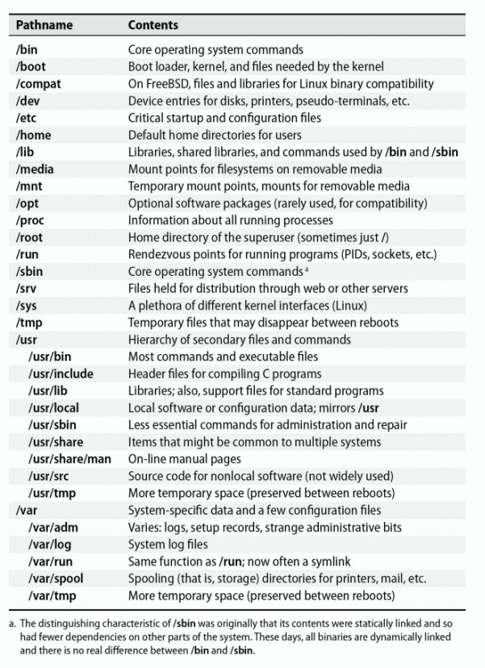
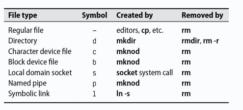
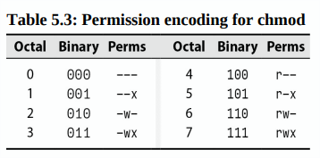

# Chapter 5: The Filesystem


The basic purpose of a filesystem is to represent and organize the system's storage resources.

The filesystem can be thought of as a a comprising four main components:

1. A namespace - a way to name things and organize them in a hierarchy
2. An API - a set of system calls for navigating and manipulating objects
3. Security models - schemes for protecting, hiding, and sharing things
4. An implementation - software to tie the logical model to the hardware

The predominant disk-based filesystem are ext4, XFS, and UFS filesystems, along with Oracle's ZFS and Btrfs. Many others are available, including, Verittas's VxFS and JFS from IBM.

Also we've some foreign filesystems like FAT and NTFS used by Windows and the ISO 9660 filesystem used by CDs and DVDs.

Most modern filesystems either try to implement the traditional filesystem functionality in a faster and more reliable manner, or they add extra features as a layer on top of the standard filesystem semantics.

## Pathnames

The word "folder" is just linguistic leakage from the world of Windows and macOS. It means the same thing as **directory**, which is more technical by the way. DOn't use it in technical contexts unless you're prepared to receive funny looks!!

The list of directories that leads to a file is called its **pathname**. The pathname is a string that describes the file's location in the filesystem hierarchy.
Pathnames can be either **absolute** (e.g. `/home/username/file.txt`) or **relative** (e.g. `./file.txt`).

## Filesystem Mounting and Unmounting

The filesystem is composed of smaller chunks--also called "filesystems"--each of which consists of one directory and its subdirectories and files. We use the term **file tree** to refer the overall layout and reserve the word **filesystem** for the branches attached to the tree.

In most situations, filesystems are attached to the tree with the `mount` command. The `mount` command maps a directory within the existing file tree, called the **mount point**, to the root of the new filesystem.

Example:

```bash
# Mount the filesystem on /dev/sda4 to /users
mount /dev/sda4 /users
```

Linux has a lazy unmount option (**umount -l**) that removes a filesystem from the naming hierarchy but does not truly unmount it until it is no longer in use.

**umount -f** is a forceful unmount, which is useful when the filesystem is busy.

Instead of reaching for **umount -f**, you can use **lsof** or **fuser** to find out which processes are using the filesystem and then shut them down.

Example:

```bash
# Find out which processes are using the filesystem

abdou@debian:~$ lsof /home/abdou

COMMAND   PID USER   FD   TYPE DEVICE SIZE/OFF   NODE NAME
bash     1000 abdou  cwd    DIR    8,1     4096  131073 /home/abdou
bash     1000 abdou  rtd    DIR    8,1     4096  131073 /home/abdou
bash     1000 abdou  txt    REG    8,1   103752  131072 /bin/bash
bash     1000 abdou  mem    REG    8,1  1848400  131074 /lib/x86_64-linux-gnu/libc-2.28.so
bash     1000 abdou  mem    REG    8,1   170864  131075 /lib/x86_64-linux-gnu/ld-2.28.so
code     1234 abdou  cwd    DIR    8,1     4096  131073 /home/abdou
msedge   5678 abdou  cwd    DIR    8,1     4096  131073 /home/abdou
```

To investigate the processes that are using the filesystem, you can use the **ps** command.

Example:

```bash
# Investigate the processes that are using the filesystem

abdou@debian:~$ ps up "1234 5678 91011"

USER       PID %CPU %MEM    VSZ   RSS TTY      STAT START   TIME COMMAND
abdou     1234  0.0  0.0  12345  1234 ?        Ssl  00:00   0:00 code
abdou     5678  0.0  0.0  12345  1234 ?        Ssl  00:00   0:00 msedge
abdou     91011  0.0  0.0  12345  1234 ?        Ssl  00:00   0:00 chrome
```

## Organization of the file tree

UNIX systems have never been well organized! Various incompatible naming conventions are used simultaneously, and different types of files are scattered randomly around the namespace. **That's why it's hard to upgrade the operating system**.

The root filesystem includes at least the root directory and a minimal set of files and subdirectories. The file that contains the OS kernel usually lives under **/boot**, but its exact name and location can vary. Under BSD and some other UNIX systems, the kernel is not really a single file so much as a set of components.

**/etc** contains critical system and configuration files. **/sbin** and **/bin** for important utilities, and sometimes **/tmp** for temporary files. The **/dev** was traditionally part of the root filesystem, but these days it's a virtual filesystem that's mounted separately.

Some systems keep shared library files and a few other oddments, such as the C preprocessor, in the **/lib** or **/lib64** directory. Others have moved these items into **/usr/lib**, sometimes leaving **/lib** as a symbolic link.

The **/usr** and **/var** are also of great importance. **/usr** is where most notable standard-but-not-system-critical programs are kept, along with various other booty such as on-line manuals and most libraries. FreeBSD stores quite q bit of locql configuration under **/usr/local**. **/var** houses spool directories, log files, accounting information, and various other items that grow or change rapidly and that vary on each host. Both **/usr** and **/var**  must be available to enable the system to come up all the way to multiuser mode.



## File types

Most filesystem implementations define seven types of files:

1. Regular files
2. Directories
3. Character devices files
4. Block devices files
5. Local domain sockets
6. Named pipes(FIFOs)
7. Symbolic links

You can determine the type of a file by using the **file** command (type **man file** for more information). 

```bash
$ file /bin/bash
bin/bash: ELF 64-bit LSB pie executable, x86-64, version 1 (SYSV), dynamically linked, interpreter /lib64/ld-linux-x86-64.so.2, BuildID[sha1]=33a5554034feb2af38e8c75872058883b2988bc5, for GNU/Linux 3.2.0, stripped
```

You can also use **ls -ld**, the **-d** flag forces **ls** to show the information for a directory rather than showing the directory's contents.



**Regular files** consist of a series of bytes; filesystems impose no structure on their contents. Text files, data files, executable programs, and shared libraries are all stored as regular files.

**Directories** are named references to other files. 

**Hard links** are a way to give a single file multiple names. The **ln** command creates a new hard link to an existing file. The **-i** option to **ls** causes it to display the number of hard links to each file.

Example

```bash
$ ln /etc/passwd /tmp/passwd
```

**Character and block device files** 

Device files let programs communicate with the system's hardware and peripherals. The kernel includes (or loads) driver software for each of the system's devices. This software takes care of messy details of managing each device so that the kernel itself can remain relatively abstract and hardware-independent.

The distinction between character and block devices is subtle and not worth reviewing in detail.

Device files are characterized by their major and minor device numbers. The major number identifies the driver that controls the device, and the minor number typically tells the driver which physical unit to address. For example, major device number 4 on a Linux system denotes the serial driver. The first serial port(**/dev/tty0**) would have major device number 4 and minor device number 0, the second serial port(**/dev/tty1**) would have major device number 4 and minor device number 1, and so on.

In the past, **/dev** was a generic directory and the devices were created with **mknod** and removed with **rm**. Unfortunately, this crude system was ill-equipped to deal with the endless sea of drivers and device types that have appeared over the last few decades. It also facilitated all sorts of potential configuration mismatches: device files that referred to no actual device, devices inaccessible because they had no device files, and so on.

These days, the **/dev** directory is normally mounted as a special filesystem type, and its contents are automatically maintained by the kernel in concert with user-level daemon.

**Local domain sockets** are a way for processes to communicate with each other. They are similar to network sockets, but they are confined to the local host.

Syslog and X Window System are examples of standard facilities that use local domain sockets.

**Named pipes** like local domain sockets allow running processes to communicate with each other within the same host.

**Symbolic links** or soft links points to a file by name. They are a way to give a file multiple names, but they are more flexible than hard links. They can point to files on different filesystems, and they can point to directories.

For example, the **/usr/bin** directory is often a symbolic link to **/bin**. This is a way to keep the root filesystem small and to make it easier to share the same software among multiple hosts.

```bash
$ ln -s /bin /usr/bin

$ ls -l /usr/bin
lrwxrwxrwx 1 root root 4 Mar  1  2020 /usr/bin -> /bin
```

## File attributes

Under Unix and Linux filesystem model, every file has a set of nine permission bits, which determine who can read, write, and execute the file. Together with three other bits that primarily affect the operation of executable programs, these bits constitute the file's mode.

These twelve mode bits are stored along with four bits of file-type information. The four file-type bits are set when the file is created and cannot be changed, but the file's owner and superuser can modify the twelve mode bits with the **chmod** command.


### Permission bits

The permission bits are divided into three groups of three bits each. The first group of three bits is for the file's owner, the second group is for the file's group, and the third group is for everyone else.

You can use the name H**ugo** to remember the order of the groups: **u** for the owner, **g** for the group, and **o** for others. 

It's also possible to use the octal notation (base 8) because each digit in the octal notation represents three bits. The topmost three bits (with octal values of 400, 200, and 100) represent the file's owner, the middle three bits (with octal values of 40, 20, and 10) represent the file's group, and the bottom three bits (with octal values of 4, 2, and 1) represent everyone else.

On a regular file, the read bit allows the file to be read, the write bit allows the file to be modified or truncated; however, the ability to delete or rename (or delete and then re-create!) the file is controlled by the permissions on its parent directory, where the name-to-dataspace mapping is maintained.

The execute bit allows the file to be executed. Two types of executable files exist: binaries, which the CPU runs directly, and scripts, which must be interpreted by a program such as the shell or Python. By convention scripts begin with a **shebang** line that tells the kernel which interpreter to use.

```bash
#!/usr/bin/perl
```

Nonbinary executable files that do not specify an interpreter are assumed to be **sh** scripts.

The kernel understands the *#!* (shebang) syntax and acts on it directly. However, if the interpreter is not specified completely and correctly, the kernel will refuse refuse the file. The shell then takes over and tries to interpret the file as a shell script.

For a directory, the execute bit (often called the search or scan bit) allows the directory to be entered or passed through as a pathname is evaluated, but not to have its contents listed. THe combination of read and execute bits allows the directory to be read and its contents listed. The combination of write and execute bits allows files to be created, deleted, and renamed within the directory.

### The setuid and setgid bits

The bits with octal values of 4000 and 2000 are the setuid and setgid bits, respectively. When the setuid bit is set on a file, the file's owner is temporarily changed to the file's owner when the file is executed. When the setgid bit is set on a file, the file's group is temporarily changed to the file's group when the file is executed.

When set on a directory, the setgid bit causes newly created files within the directory to take on the group ownership of the directory rather than the default group of the user who created the file. This makes it easier to share files among a group of users.

### The sticky bit

The bit with an octal value of 1000 is the sticky bit. When set on a directory, the sticky bit prevents users from deleting or renaming files that they do not own. This is useful for directories such as **/tmp** that are shared among many users.

### ls: list and inspect files

The **ls** command lists files and directories. It can also be used to inspect the attributes of files and directories.

The **-l** option causes **ls** to display the long format, which includes the file's mode, the number of hard links to the file, the file's owner, the file's group, the file's size in bytes, the file's modification time, and the file's name.

All directories have at least two hard links: one from the directory itself (the **.** entry) and one from its parent directory (the **..** entry).

**ls** output is slightly different for a device file. For example:

```bash
$ ls -l /dev/tty0
crw--w---- 1 root tty 4, 0 Mar  1  2020 /dev/tty0
```

The **c** at the beginning of the line indicates that the file is a character device file. The **4, 0** at the end of the line are the major and minor device numbers.

### chmod: change permissions

The **chmod** command changes the mode of a file. You can use the octal notation or the symbolic notation.



Examples of chmod's mnemonic syntax:

| Specifier  | Meaning                                                             |
| ---------- | ------------------------------------------------------------------- |
| u+w        | Add write permission for the file's owner                           |
| ug=rw,o=r  | Gives r/w permission to owner and group, and r permission to others |
| a-x        | Remove execute permission for all users                             |
| ug=srx, o= | Set the setuid, setgid, and sticky bits for owner and group (r/x)   |
| g=u        | Make the group's permissions the same as the owner's                |

**Tips**: You can also specify the modes to be assigned by  copying the mode from another file with the **--reference** option. (e.g. **chmod --reference=sourcefile targetfile**)

### chown: change ownership

The **chown** command changes the owner and group of a file. The **-R** option causes **chown** to change the ownership of the file's contents recursively.

```bash
$ chown -R abdou:users /home/abdou
```

### chgrp: change group

The **chgrp** command changes the group of a file. The **-R** option causes **chgrp** to change the group of the file's contents recursively.

```bash
$ chgrp -R users /home/abdou
```

### umask: set default permissions

The **umask** command sets the default permissions for new files and directories. The **umask** command is a bit mask that is subtracted from the default permissions to determine the actual permissions.

Exemple:

```bash
$ umask 022
```

| Octal | Binary | Perms | Octal | Binary | Perms |
| ----- | ------ | ----- | ----- | ------ | ----- |
| 0     | 000    | rwx   | 4     | 100    | -wx   |
| 1     | 001    | rw-   | 5     | 101    | -w-   |
| 2     | 010    | r-x   | 6     | 110    | --x   |
| 3     | 011    | r--   | 7     | 111    | ---   |

For example, **umask 027** allows the rwx to owner, rx to group, and no permissions to others.

## Access Control Lists

The traditional Unix permissions model is simple and effective, but it has limitations. For example, it's difficult to give a file multiple owners, and it's difficult to give a group of users different permissions on different files.

Access Control Lists (ACLs) are a way to extend the traditional Unix permissions model. ACLs allow you to give a file multiple owners and to give a group of users different permissions on different files.

Each of the rules within an ACL is called an **access control entry** (ACE). An ACE consists of a **user or group specifier**, a **permission mask**, and a **type**. The user or group specifier can be a user name, a group name, or a special keyword such as **owner** or **other**. The permission mask is a set of permissions, and the type is either **allow** or **deny**.

The **getfacl** command displays the ACL of a file, and the **setfacl** command sets the ACL of a file.

```bash
$ getfacl /etc/passwd
```

```bash
$ setfacl -m u:abdou:rw /etc/passwd
```

There are two types of ACLs: **POSIX ACLs** and **NFSv4 ACLs**. POSIX ACLs are the traditional Unix ACLs, and NFSv4 ACLs are a newer, more powerful type of ACL.

### Implementation of ACLs

In theory, responsibility for maintaining and enforcing ACLs could be assigned to several different components of the system. ACLs could be implemented by the kernel on behalf of all the system's filesystems, by individual filesystems, or perhaps by higher-level software such as NFS and SMB servers.

### POSIX ACLs

POSIX ACLs are the traditional Unix ACLs. They are supported by most Unix-like operating systems, including Linux, FreeBSD, and Solaris.

**Entries that can appear in POSIX ACLs**

| Format                | Example         | Sets permissions for      |
| --------------------- | --------------- | ------------------------- |
| user::perms           | user:rw-        | The file's owner          |
| user:username:perms   | user:abdou:rw-  | The user named username   |
| group::perms          | group:r-x       | The file's group          |
| group:groupname:perms | group:users:r-x | The group named groupname |
| mask::perms           | mask::rwx       | The maximum permissions   |
| other::perms          | other::r--      | Everyone else             |

Example:

```bash
$ setfacl -m user:abdou:rwx,group:users:rwx,other::r /home/abdou

$ getfacl --omit-header /home/abdou

user::rwx
user:abdou:rwx
group::r-x
group:users:r-x
mask::rwx
other::r--
```

### NFSv4 ACLs

NFSv4 ACLs are a newer, more powerful type of ACL. They are supported by some Unix-like operating systems, including Linux and FreeBSD.

NFSv4 ACLs are similar to POSIX ACLs, but they have some additional features. For example, NFSv4 ACLs have a **default ACL** that is used to set the ACL of new files and directories.

**NFSv4 file permissions**

