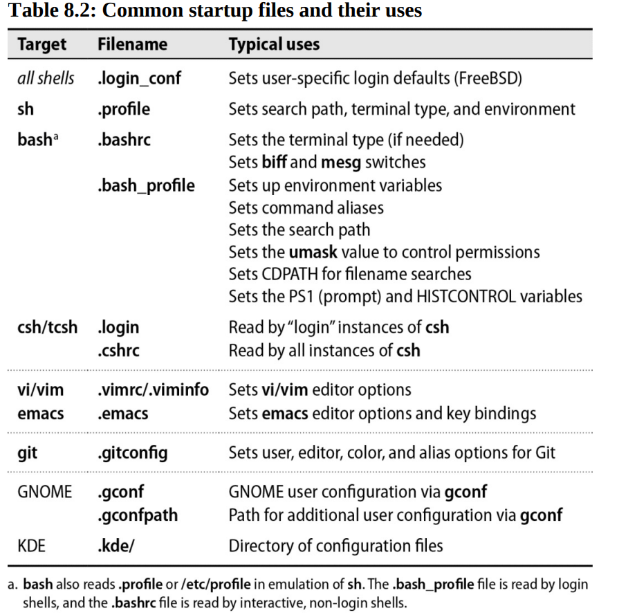
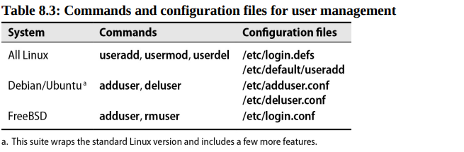

# Chapter 8: User Management


Modern computing environments span physical hardware, cloud systems, and virtual hosts. Along with the flexibility of this hybrid infrastructure comes an increasing need for centralized and structured account management.

## Account mechanics

A user is really nothing than a number. Specifically, an unsigned 32-bit integer known as the user ID or UID. Almost everything related to user account management revolves around this number.

The system defines an API that maps UID numbers back and forth into more complete sets of information about users. For examplen, **getpwuid()** is a function that takes a UID and returns a **struct passwd** containing the user's name, home directory, and other information.

To enable higher-level process to function without direct knowledge of the underlying account management method in use, we can configure the **nsswitch.conf** file. For example, when you log in as "abdou", the logging-in process (window server, **login**, **getty**, or whatever) does a **getpwnam()** on abdou and then validates the password you supply against the encrypted passwd record returned by the library, regardless of its actual origin.

## The /etc/passwd file

**/etc/passwd** is a list of users recognized by the system. Historically, each user’s encrypted password was also stored in the **/etc/passwd** file, which is world-readable. However, the onset of more powerful processors made it increasingly feasible to crack these passwords. In response, UNIX and Linux moved the passwords to a separate file, **/etc/shadow** (**/etc/master.passwd** on FreeBSD) that is not world-readable. The **/etc/passwd** file now contains an x (* on FreeBSD) in the password field to indicate that the password is stored in the shadow file.

The system consults the /etc/passwd at login time to determine a user's UID and home directory, among other things. Each line in the file represents one user and contains seven fields separated by colons:

- Login name
- Encrypted password (x means the password is stored in the **/etc/shadow** file)
- UID (user ID) number
- Default GID (group ID) number
- Optional "GECOS" information: full name, office, extension, home phone
- Home directory
- Login shell

If user accounts are stored in a network directory service such as LDAP, you might see special entries in the **passwd** file that begin with + or -.

### The login name

Login names (also known as usernames) must be unique and, depending on the operating system, may have character set restrictions. All UNIX and Linux flavors currently limit logins to 32 characters.

### The password field (encrypted password)

Historically, systems encrypted users' passwords with DES. As computer power increased, those passwords became trivial to crack. Systems then moved to hidden passwords and to MD5-based cryptography. Now that significant weaknesses have been discovered in MD5, salted SHA-512-based password hashes have become the current standard.

If you choose to bypass your system’s tools for adding users and instead modify /etc/passwd by hand to create a new account, put a * (FreeBSD) or an x (Linux) in the encrypted password field. This measure prevents unauthorized use of the account until you or the user has set a real password.

For example, to create a new user account, you can add a line to the **/etc/passwd** file:

```bash
newuser:x:1001:1001:New User:/home/newuser:/bin/bash
```

### UID (user ID) number

By definition, root has UID 0. Most systems also define pseudo-users such as bin and daemon to be the owners of commands or configuration files. It's customary to put such fake logins at the beginning of the **/etc/passwd** file and to give them low UIDs and a fake shell such as **/sbin/nologin** or **/bin/false** to prevent anyone from logging in as them.

You can use the **useradd** command to create a new user account. This command automatically assigns the next available UID to the new account. You can also use the **-u** option to specify a particular UID. UIDs for regular users typically start at 1000.

**Do not recycle UIDs**. If you delete a user account, do not reuse the UID for a new account. Doing so can lead to security problems if the old UID is still present in files or directories.

It can be hard to maintain unique UIDs when groups of machines are managed by different administrators. To help with this, some organizations use a central directory service such as **LDAP** (Lightweight Directory Access Protocol) to manage UIDs and other account information.

Another scheme is to assign each group within an org its own range of UIDs and to let each group manage its own range. This solution keeps the UID spaces separate but does not address the parallel issue of unique login names.

### Default GID

Like a UID, a GID is a 32-bit number. The GID 0 is traditionally reserved for the group called root, system, or wheel.

In ancient times, when computing power was expensive, groups were used for accounting purposes so that the right department could be charged for your seconds of CPU time, minutes of login time, and kilobytes of disk used. Today, groups are used to control access to files and directories.

### GECOS field

The GECOS field is sometimes used to record personal information about each user. The field is a relic from a much earlier time when some early UNIX systems used General Electric Comprehensive Operating Systems for various services. It has no well-defined syntax. Although you can use any formatting conventions you like, conventionally, comma-separated GECOS entries are placed in the following order:

- Full name
- Office number and building
- Office telephone extension
- Home phone number

### Home directory

The home directory is the user's initial directory when they log in. It is also the default location for the user's files. The home directory is usually owned by the user and is not world-writable.

Home directories are where login shells look for account-specific customizations such as shell aliases and environment variables, as well as SSH keys, server fingerprints, and other program state.

Be aware that if home directories are mounted over a network filesystem, they may be unavailable in the event of server or network problems. If the home directory is missing at login time, the system might print a message such as “no home directory” and put the user in **/**.

Such a message appears when you log in on the console or on a terminal, but not when you log in through a display manager such as **xdm**, **gdm**, or **kdm**. Not only will you not see the message, but you will generally be logged out immediately because of the display manager’s inability to write to the proper directory (e.g., **~/.gnome**).

### Login shell

The login shell is normally a command interpreter, but it can be any program. A Bourne-shell compatible sh is the default for FreeBSD, and bash (the GNU “Bourne again” shell) is the default for Linux.

## The /etc/shadow file

On Linux, the shadow password file is readable only by the superuser and serves to keep encrypted passwords and other security information out of the hands of regular users and password crackers. It also includes additional fields not found in the **/etc/passwd** file.

The **/etc/shadow** file is not a superset of the **/etc/passwd** file, and the **passwd** file is not generated from it. Each line in the **/etc/shadow** file represents one user and contains nine fields separated by colons:

- Login name (same as in the **/etc/passwd**, connects a user's passwd and shadow entries)
- Encrypted password
- Date of last password change
- Minimum password age
- Maximum password age
- Number of days before password expiration to warn the user
- Number of days after password expiration until the account is disabled
- Date since which the account has been disabled
- Reserved field

## The /etc/group file


The **/etc/group** file contains the names of UNIX groups and a list of each group's members. Each line in the file represents one group and contains four fields separated by colons:

- Group name
- Encrypted password (x means the password is stored in the **/etc/gshadow** file)
- GID (group ID) number
- Comma-separated list of group members(no spaces!!)

The **/etc/group** file is world-readable, but the **/etc/gshadow** file is readable only by the superuser. The **/etc/gshadow** file contains the encrypted passwords for group accounts.

The UNIX tradition was originally to add new users to a group that represented their general category such as "students" or "finance". However, this convention increases the likelihood that users will be able to read one another's files because of slipshod permission settings. 

To avoid this problem, system utilities such as **useradd** and **adduser** now default to putting each user in his or her own personal group (that is, a group named after the user and which includes only that user). This convention is much easier to maintain if personal groups’ GIDs match their corresponding users’ UIDs

Group membership can serve as a marker for access to files and directories. For example, if a file is owned by a group, all members of that group can access the file. This is a common way to share files among a group of users. Another example is the **sudoers** configuration where you can specify that all members of a certain group can run certain commands as root.

**groupadd** is the command to add a new group to the system. It automatically assigns the next available GID to the new group. You can also use the **-g** option to specify a particular GID. GIDs for regular groups typically start at 1000.

**groupmod** is the command to modify a group. You can use it to change the name of a group or its GID.

**groupdel** is the command to delete a group from the system. It does not delete the files owned by the group, but it does remove the group from the **/etc/group** file.

On FreeBSD, the **pw** command is used to manage users and groups. It has subcommands such as **useradd**, **groupadd**, **usermod**, and **groupmod**.

## Manual steps for adding users

Mechanically, the process of adding a new user consists of several steps required by the system and a few more that establish a useful environment for the new user and incorporate the user into your local administrative system.

Required:

- Edit the **passwd** and **shadow** files (or **master.passwd** on FreeBSD) to define the user's account.
- Add the user to the **/etc/group** file (not necessary but do it mf**!)
- Set an initial password.
- Create, **chown**, and **chmod** the user's home directory.
- Configures roles and permissions

For the user:

- Copy default startup files to the user's home directory.

For you (as PDG):

- Have the new user sign your policy agreement.
- Verify that the account is set up correctly.
- Document the user's contact information and account status.

For example, to add user **newuser** to the system, you might do the following:

```bash
$vipw
```

Add the following line to the **/etc/passwd** file:

```bash
newuser:':1001:1001:New User:/home/newuser:/bin/bash
```

Note the star in the encrypted password field. This prevents use of the account until a real password is set with the passwd command.
    
```bash
$ passwd newuser
```

Next, add the user to the **/etc/group** file using the **vigr** command:

```bash
$ vigr
```

Add the following line to the **/etc/group** file:

```bash
newuser:x:1001:
```

### Create the home directory and install startup files.

**useradd** and **adduser** create new user's home directories for you, but you'll likely want to double-check the permissions and startup files for new accounts.

There’s nothing magical about home directories. If you neglected to include a home directory when setting up a new user, you can create it with a simple **mkdir**. You need to set ownerships and permissions on the new directory as well, but this is most efficiently done after you’ve installed any local startup files.

Startup files traditionally begin with a dot and end with the letters **rc**, short for “run command,” a relic of the CTSS (Compatible Time-Sharing System) operating system. The initial dot causes ls to hide these “uninteresting” files from directory listings unless the -a option is used.

Make sure that the default shell files you give to new users set a reasonable default value for umask; we suggest 077, 027, or 022, depending on the friendliness and size of your site. If you do not assign new users to individual groups, we recommend umask 077, which gives the owner full access but the group and the rest of the world no access.

### Setting home directory permissions and ownerships

Once you’ve created a user’s home directory and copied in a reasonable default environment, turn the directory over to the user and make sure that the permissions on it are appropriate. The command

```bash
$ sudo chown -R newuser:newuser ~newuser
```
sets ownerships properly. Note that you cannot use

```
$ sudo chown newuser:newuser ~newuser/.*
```
to chown the dot files because **newuser** would then own not only his or her own files but also the parent directory “..” as well. This is a common and dangerous mistake.



## Scrips for adding users: useradd, adduser and newusers



**useradd**

Most Linux distributions include a basic **useradd** suite that draws its configuration parameters from both **/etc/login.defs** and **/etc/default/useradd**.

The **login.defs** file addresses issues such as password aging, choice of encryption algorithms, location of mail spool files, and the preferred ranges of UIDs and GIDs. You maintain the **login.defs** file by hand. The comments do a good job of explaining the various parameters.

Parameters stored in the **/etc/default/useradd** file include the location of home directories and the default shell for new users. You set these defaults through the useradd command itself. **useradd -D** prints the current values, and **-D** in combination with various other flags sets the values of specific options. For example,

```bash
$ sudo useradd -D -s /bin/bash
```
This will set the default shell to **bash** for this user.

The basic form of the useradd command:

```bash
$ sudo useradd mamadou
```

This will create an entry to the **/etc/passwd** file along with the corresponding entry in the **/etc/shadow**.

`mamadou:x:1006:20::/home/mamadou:/bin/bash`

**useradd** disable the new account by default you must set a real password to enable it.

A more realistic example is shown below. We specify that hilbert’s primary group should be *mamadou* and that he should also be added to the “faculty” group. We override the default home directory location and shell and ask **useradd** to create the home directory if it does not already exist:

```bash
$ sudo useradd -c "Mamadou Sow" -d /home/math/mamadou -g mamadou -G faculty -m -s /bin/tcsh mamadou
```

`mamadou:x:1006:20:Mamadou Sow:/home/math/mamadou:/bin/tcsh`


### newusers on Linux: adding in bulk

Linux’s newusers command creates multiple accounts at one time from the contents of a text file. It’s pretty gimpy, but it can be handy when you need to add a lot of users at once, such as when creating class-specific accounts.

## Safe removal of user's account and files

When you leave an organization, the user's login account and files must be removed from the system. You can use `userdel` or `rmuser` to handle it.
These tools ensure the removal of all references to the login name that were added by hand or with useradd.
To verify user's old UID no longer owns files on the system, you can use the `find` command.

```bash
$ sudo find filesysem -xdev -nouser
```

## User login lockout

To prevent unauthorized access to a user account, you can lock the account. This is useful when you suspect that an account has been compromised or when an employee leaves the organization. You can lock an account by setting the password field in the **/etc/shadow** file to an asterisk (*). This prevents the user from logging in with a password.

On all Linux distributions, the **usermod -L** *user* command locks the account. To unlock the account, use the **usermod -U** *user* command. **-L** puts an ! in front of the encrypted password

Unfortunately, modifying a user’s password simply makes logins fail. It does not notify the user of the account suspension or explain why the account no longer works. In addition, commands such as ssh that do not necessarily check the system password may continue to function.

An alternative way is to replace the user’s shell with a program that prints a message and exits. This is a more user-friendly way to lock an account. For example, you can replace the user’s shell with **/sbin/nologin** or **/bin/false**.

## Risk reduction with PAM

See chapter on [Single Sign-On](../single-sign-on/readme.md)

## Centralized account management

Some form of centralized account management is essential for medium-to-large enterprises of all types, be they corporate, academic, or governmental. Users need the convenience and security of a single login name, UID, and password across the site.

Such centralization can be achieved in a variety of ways, most of which (including Microsoft’s Active Directory system) involve LDAP, the Lightweight Directory Access Protocol, in some capacity.

### LDAP and Active Directory

LDAP is a generalized, database-like repository that can store user management data as well as other types of data. It uses a hierarchical client/server model that supports multiple servers as well as multiple simultaneous clients.

One of LDAP’s big advantages as a site-wide repository for login data is that it can enforce unique UIDs and GIDs across systems.

Microsoft’s Active Directory uses LDAP and Kerberos and can manage many kinds of data, including user information. It’s a bit egotistical and wants to be the boss if it is interacting with UNIX or Linux LDAP repositories. 

If you need a single authentication system for a site that includes Windows desktops as well as UNIX and Linux systems, it is probably easiest to let Active Directory be in control and to use your UNIX LDAP databases as secondary servers.

### Identity management systems

“Identity management” (sometimes referred to as IAM, for “identity and access management”) is a common buzzword in user management. In plain language, it means identifying the users of your systems, authenticating their identities, and granting privileges according to those authenticated identities. The standardization efforts in this realm are led by the **World Wide Web Consortium** and by **The Open Group**.

In evaluating identity management systems, look for capabilities in the following areas:

Oversight:

- Implement a secure web interface for management that’s accessible both inside and outside the enterprise.
- Support an interface through which hiring managers can request that accounts be provisioned according to role.
- Coordinate with a personnel database to automatically remove access for employees who are terminated or laid off.

Account management:

- Generate globally unique user IDs.
- Create, change, and delete user accounts across the enterprise, on all types of hardware and operating systems.
- Support a workflow engine; for example, tiered approvals before a user is given certain privileges.
- Make it easy to display all users who have a certain set of privileges. Ditto for the privileges granted to a particular user.
- Support role-based access control, including user account provisioning by role. Allow exceptions to role-based provisioning, including a workflow for the approval of exceptions
- Configure logging of all changes and administrative actions. Similarly, configure reports generated from logging data (by user, by day, etc.).

Ease of use:

- Let users change (and reset) their own passwords, with enforcement of rules for picking strong passwords.
- Enable users to change their passwords globally in one operation.

---

[REMINDER]: **POSIX** or “Portable Operating System Interface for uniX” is a collection of standards that define some of the functionality that a (UNIX) operating system should support.