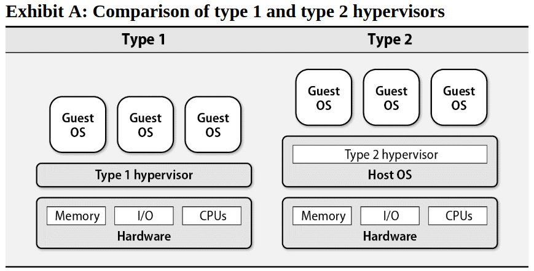
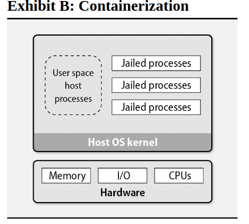
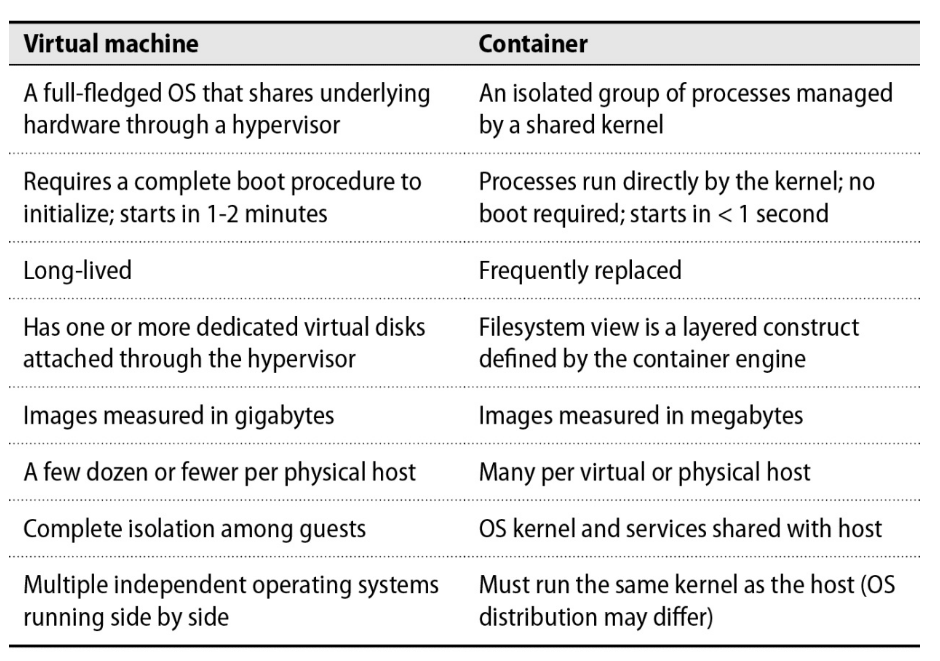
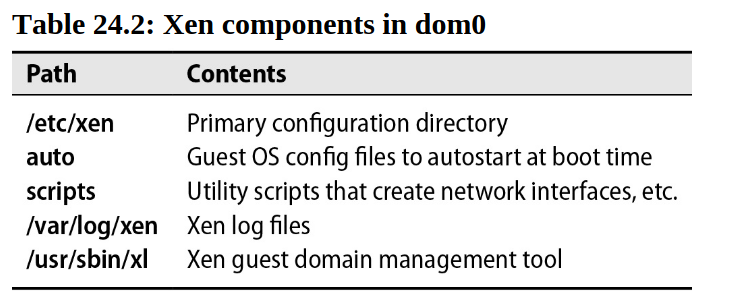

# Chapter 24: Virtualization


Server virtualization makes it possible to run multiple operating system instances concurrently on the same physical hardware. Virtualization software parcels out CPU, memory, and I/O resources, dynamically allocating their use among several “guest” operating systems and resolving resource conflicts. From the user’s point of view, a virtual server walks and talks like a full-fledged physical server.

The ever-growing size of server farms rekindled interest in virtualization for modern systems. VMware and other providers conquered the challenges of x86 and made it easy to automatically provision operating systems. These facilities eventually led to the rise of on-demand, Internet- connected virtual servers: the infrastructure we now know as cloud computing. More recently, advances in OS-level virtualization have ushered in a new era of OS abstraction in the form of containers.

## Virtual Vernacular

### Hypervisor

A hypervisor (also known as a virtual machine monitor) is a software layer that  mediates between virtual machines (VMs) and the underlying hardware on which they run.

Hypervisors are responsible for sharing resources among the guest operating systems, which are isolated from one another and which access the hardware exclusively through the hyoervisor.

Guest operating systems are independent, so they needn't be the same. CentOS, Ubuntu, and Windows can all run on the same hypervisor. VMware ESX, XenServer, and FreeBSD's bhyve are examples of hypervisors. The Linux kernel-based virtual machine (KVM) converts the Linux kernel into a hypervisor.

**Full virtualization**

The first hypervisors fully emulated the underlying hardware, defining virtual replacements for all the basic computing resources: hard disks, network devices, interrupts, motherboard hardware, BIOSs, and so on. This mode incurs a performance penalty because the hypervisor must translate every instruction from the guest operating system into a form that the host hardware can understand.

Most hypervisors that offer full virtualization separate the task of maintaining multiple environments (virtualization) from the task of simulating the hardware within each environment (emulation). 

The most common emulation package used in these systems is an open source project called QEMU (Quick Emulator).

**Paravirtualization**

Paravirtualization is a technique that allows the guest operating system to communicate directly with the hypervisor to access hardware, rather than relying on the hypervisor to simulate hardware. This approach can be more efficient than full virtualization because it eliminates the need to translate instructions. However, it requires modifications to the guest operating system, which depends on the hypervisor's API.

**Hardware-assisted virtualization**

Intel and AMD introduced CPU features (Intel VT and AMD-V, respectively)  that facilitate virtualization on the x86 platform. The hardware-assisted also known as "accelerated virtualization" virtualizes the CPU and memory controller, albeit under the control of the hypervisor. 

**Paravirtualized drivers**

Paravirtualized drivers make hardware-assisted virtualization more efficient by bridging the gap between the hypervisor and guest OS without requiring major changes to the guest. They handle disk, network, and display tasks, while full virtualization is reserved for more obscure parts of the architecture (such as the BIOS or interrupt controller).

**type 1 vs type 2 hypervisors**

A type 1 hypervisor runs directly on the hardware without a supporting OS, and for that reasons is sometimes called a bare-metal or native hypervisor. Type 2 hypervisors are user-space applications that run on top of another general-purpose OS.



VMware ESXi and XenServer are considered type 1 hypervisors, and FreeBSD's bhyve is a type 2. VirtualBox and VMware Workstation are also type 2 hypervisors.

### Live migration

Live migration is the process of moving a running virtual machine from one hypervisor to another without interrupting the VM's operation. This is useful for load balancing, hardware maintenance, and disaster recovery. The magic lies in a memory dance between the source and target hosts.

In VMware ESXi, live migration is implemented using vMotion. 

### Virtual machine images

Virtual servers are created from images, which are templates of configured operating systems that hypervisors can load and execute. The format of these images varies by hypervisor.

### Containerization

OS-level virtualization, also known as containerization, is a different approach that does not use a hypervisor. Instead, it relies on kernel features that isolate processes from the rest of the system.



Because it does not require virtualization of the hardware, the resource overhead of OS-level virtualization is low. Most implementations offer near-native performance. Linux LXC, Docker, and FreeBSD jails are examples of containerization technologies.

It’s easy to confuse containers with virtual machines. Both define portable, isolated execution environments, and both look and act like full operating systems with root filesystems and running processes. Yet their implementations are entirely different.

A true virtual machine has an OS kernel, an init process, drivers to interact with hardware, and the full trappings of a UNIX operating system. A container, on the other hand, is merely the facade of an OS (basically based on namespaces and cgroups).



## Virtualization with Linux

Xen and KVM are the leading open source virtualization projects for Linux. Xen is a type 1 hypervisor that runs on bare metal. It actually powers some Amazon's EC2 cloud or IBM's SoftLayer. 

### Xen

Initially developed at the University of Cambridge (by Ian Pratt), Xen is a bare-metal hypervisor that runs directly on the physical hardware. A running virtual machine is called a domain. There is always at least one domain, referred  to as domain zero or `dom0`. Dom0 has full hardware access, manages the other domains, and runs all the hypervisor's own device drivers. Unprivileged domains are called `domU`.

`Dom0` typically runs a Linux distribution. It looks just like any other Linux system but includes the daemons, tools, and libraries that complete the Xen architecture and enable communication among `domU`, `dom0`, and the hypervisor.

The hypervisor is responsible for CPU scheduling and memory management for the system as a whole. It controls all domains, including `dom0`. However, the hypervisor itself is in turn controlled by `dom0`. 


Each Xen guest-domain config file in `/etc/xen` specifies the virtual resources available to a `domU`, including disk devices, CPU, memory, and network interfaces. Each `domU` has a separate config file.



### Xen guest installation

It takes several steps to get a guest server up and running under Xen. It's better to use a tool such as `virt-manager` through the `virt-install` command to create a new VM. `virt-install` is a command-line tool that accepts installation media from variety of sources, including SMB or NFS mounts, physical CDs or DVDs, and HTTP urls.

Guest operating systems need a place to store their data (operating system files, user files, etc.), just like a physical computer needs a hard drive These disks are normally stored in virtual block devices (VBDs) in `dom0`. 

There are two main ways to implement VBDs:

- Dedicated Resource: The VBD is directly linked to a physical disk or a logical volume (a partitioned section of a physical disk). This offers better performance because the guest has more direct access to the storage hardware.
- Loopback File (File-Backed VBD): The VBD is stored as a regular file within dom0's filesystem. This file is a "sparse file," meaning it only uses disk space as the guest OS actually writes data, making it efficient in terms of storage usage. This approach is more flexible because you can manage the virtual disk using standard Linux commands (like `cp` or `mv`).

Example of installation:

```bash
virt-install -n chef -r 1024 -f /vm/chef.img -l http://example.com/myos --nographics
```

This command creates a new VM named `chef` with 1GB of RAM, a disk VBD at `/vm/chef.img`, and an installation source at `http://example.com/myos`. The `--nographics` flag tells `virt-install` to use a text-based installer.

`virt-install`  saves the domain's config in `/etc/xen/chef`:

```bash
name = "chef"
uuid = "f4e2e3b4-7f3d-4b1b-8b3b-3b4b1b7f3d4b"
maxmem = 1024
memory = 1024
vcpus = 1
bootloader = "/usr/bin/pygrub"
on_poweroff = "destroy"
on_reboot = "restart"
on_crash = "restart"
vfb = [ ]
disk = [ "file:/vm/chef.dsk,xvda,w" ]
vif = [ "mac=00:16:3e:2b:2b:2b,bridge=xenbr0" ]
```

The NIC is connected to `xenbr0`, a bridge device that connects the VM to the physical network. The writable disk image file is presented to the guest as `/dev/xvda`.

To change the configuration of a guest domain (e.g., to attach another disk or to change the network to NAT mode instead of bridged mode), you can edit the config file directly and then reboot the guest.

### KVM

KVM is not a clear case as it could be categorized as either type 1 or type 2. The KVM kernel module turns Linux kernel into a type 1 bare-metal hypervisor, while the overall system could be categorized to type 2 because the host OS is still fully functional and the other VM's are standard Linux processes from its perspective ([https://serverfault.com/a/855096](https://serverfault.com/a/855096)). 

 Like Xen’s HVM mode, KVM takes advantage of the Intel VT and AMD-V CPU extensions and relies on QEMU to implement a fully virtualized hardware system.

Under KVM, the Linux kernel itself serves as the hypervisor. Memory mamagement and scheduling are handled by the host kernel, and the guest OS runs as a normal process. 

### KVM guest installation

Although the technologies behind Xen and KVM are fundamentally different, the tools that install and manage guest operating systems are similar. As with Xen, you can use `virt-install` to create a new VM under KVM and then manage it with `virsh`.

```bash
virt-install --connect qemu:///system -n UbuntuYakkety -r 512 -f ~/ubuntu-y.img -s 12 -c /dev/dvd --os-type linux --accelerate --hvm --vnc
```

This command creates a new VM named `UbuntuYakkety` with 512MB of RAM, a disk VBD at `~/ubuntu-y.img` (which can grow up to 12GB), a CD-ROM drive at `/dev/dvd`, and a VNC server for remote access.

The `virsh` command-line tool can be used to manage KVM guests. It can be used to start, stop, pause, and resume VMs, as well as to query the status of a VM. It spawns its own shell, so you can run `virsh` commands interactively.

```bash
sudo virsh --connect qemu:///system

virsh # list --all
      Id    Name                           State
----------------------------------------------------
       1     UbuntuYakkety                  running
```

## FreeBSD's bhyve

`bhyve` is a hypervisor that runs on FreeBSD. It is a type 2 hypervisor that relies on the host OS to manage memory and CPU scheduling. `bhyve` is a relatively new project, but it is gaining popularity because of its simplicity and performance.

## VMware

VMware is the biggest player in the virtualization industry and was the first vendor to develop techniques to virtualize the fractious x86 platform.

The primary product of interest to UNIX and Linux administrators is ESXi, which is a bare-metal hypervisor for the intel x86 architecture. The name ESXi stands for "Elastic Sky X Integrated."


VMware have the most mature live migration technology, called `vMotion`. 

## VirtualBox

VirtualBox is a type 2 hypervisor that runs on Windows, macOS, and Linux. It is a popular choice for developers and hobbyists because it is free and easy to use. VirtualBox supports a wide range of guest operating systems, including Windows, Linux, and macOS.

## Packer

Packer (packer.io), from the esteemed open source company HashiCorp, is a tool for building virtual machine images from a specification file. It can build images for a variety of virtualization and cloud platforms. Integrating Packer into your workflow lets you be more or less virtualization-platform-agnostic. You can easily build your customized image for whatever platform you’re using on a given day.

This process is particularly helpful for supporting an “infrastructure as code” way of managing servers. Instead of manually applying changes to images, you modify a template that describes the image in abstract terms. Packer then builds the image for you.

## Vagrant

Vagrant is a tool for managing virtual machines in a development environment. It is built on top of VirtualBox, VMware, and other virtualization technologies. Vagrant uses a simple text file called a Vagrantfile to describe the type of VM you want to create and how to configure it. You can use Vagrant to create a VM, provision it with software, and then destroy it when you’re done.

