# Chapter 19: Web Hosting


UNIX and Linux are the predominant platforms for serving web applications. According to data from w3techs.com, 67% of the top one million web sites are served by either Linux or FreeBSD. Above the OS level, open source web server software commands more than 80% of the market.


## HTTP

HTTP is the core network protocol for communication on the web. Lurking beneath a deceptively simple facade of stateless requests and responses lie layers of refinements that bring both flexibility and complexity. 

### URL(Uniform Resource Locator)

A URL is a string of characters that provides a way to access a resource on the internet. It is a reference to a web resource that specifies its location on a computer network and a mechanism for retrieving it. A URL is a specific type of Uniform Resource Identifier (URI), although many people use the two terms interchangeably.

The general pattern for URLs is `scheme:address`, where `scheme` identifies the protocol to be used to access the resource and `address` specifies the location of the resource. 

For the web, the relevant schemes are http and https. In the wild, you might also see the schemes ws (WebSockets), wss (WebSockets over TLS), ftp, ldap, and many others.

Here’s the overall pattern:

```
scheme:[//[user:password@]hostname[:port]][/path][?query][#anchor]
```

The use of a username and password in the URL enables “HTTP basic authentication,” which is supported by most user agents and servers. In general, it’s a bad idea to embed passwords into URLs because URLs are apt to be logged, shared, bookmarked, visible in ps output, etc. 

### Structure of an http transaction

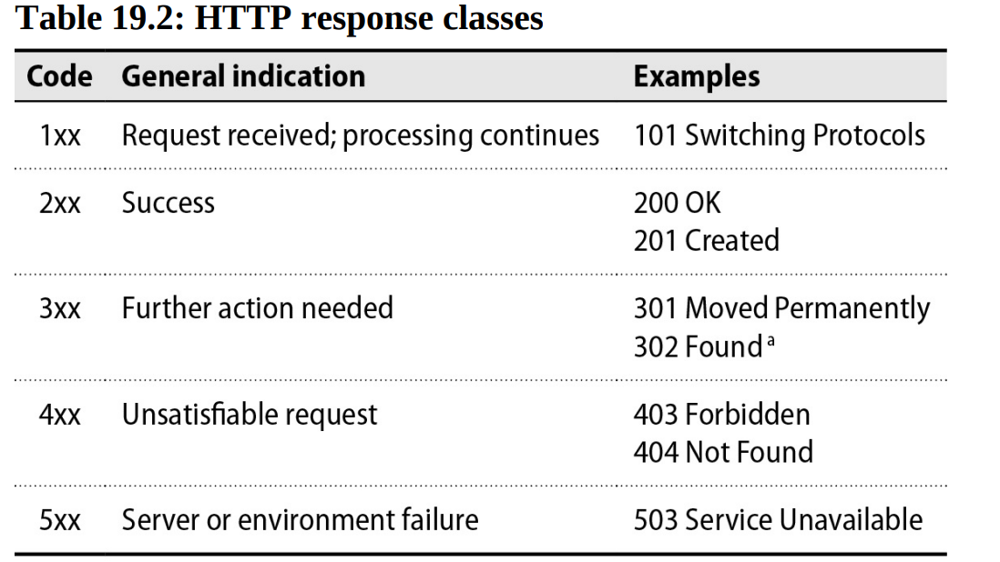

**Headers and body :**

Headers specify metadata about a request or response, such as whether to allow compression; what types of content are accepted, expected, or provided; and how intermediate caches should handle the data. For requests, the only required header is Host, which is used by web server software to determine which site is being contacted.

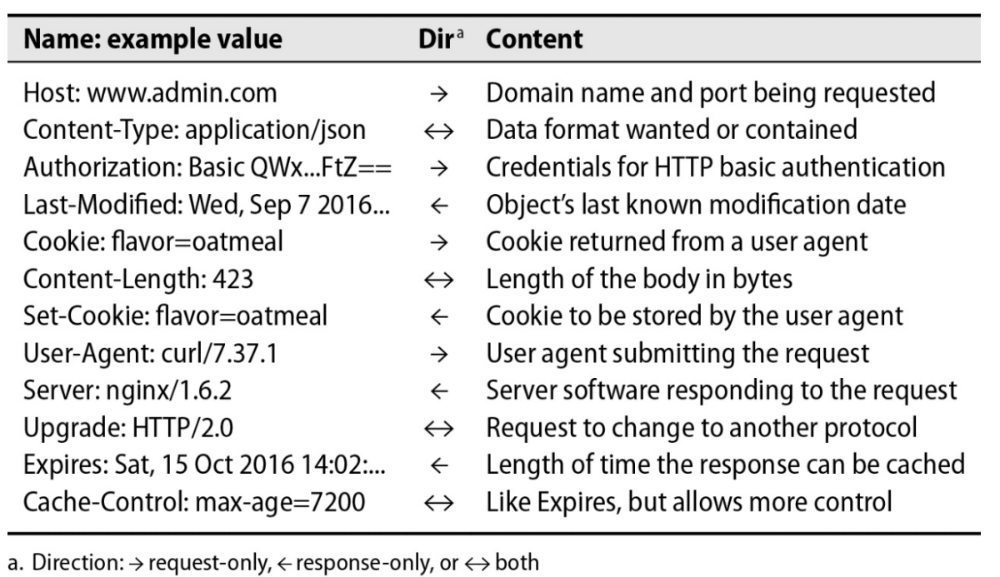

### Curl

curl (cURL) is a handy command-line HTTP client that’s available for most platforms. Lines starting with > and < denote the request and response, respectively

### TCP connection reuse

TCP connections are expensive. In addition to the memory needed to maintain them, the three-way handshake used to establish each new connection adds latency equivalent to a full round trip before an HTTP request can even begin.

The original HTTP/1.0 specification did not include any provisions for connection reuse, but some adventurous developers added experimental support as an extension. The Connection: Keep-Alive header was added informally to clients and servers, then improved and made the default in HTTP/1.1. With keep-alive (also known as persistent) connections, HTTP clients and servers send multiple requests over a single connection, thus saving some of the cost and latency of initiating and tearing down multiple connections.

TCP overhead turns out to be nontrivial even when HTTP/1.1 persistent connections are enabled. Most browsers open as many as six parallel connections to the server to improve performance. Busy servers in turn must maintain many thousands of TCP connections in various states, resulting in network congestion and wasted resources.

HTTP/2 introduces multiplexing as a solution, allowing several transactions to be interleaved on a single connection. HTTP/2 servers can therefore support more clients per system, since each client imposes lower overhead.

### HTTP over TLS

TLS (Transport Layer Security) is the successor to SSL (Secure Sockets Layer). It provides secure communication over a computer network, most notably the internet. TLS is used to secure connections between web browsers and servers, as well as email clients and servers, VPNs, and other network services.

The user agent (browser) and server negotiate a secure connection by exchanging certificates and cryptographic keys. The server’s certificate is signed by a certificate authority (CA), which the browser trusts. The browser uses the server’s public key to encrypt a symmetric key, which is then used to encrypt the data exchanged between the browser and server.

### Virtual hosts

In the early days of the web, a server typically hosted only a single web site. When `admin.com` is requested, for example, clients performed a DNS lookup to find the IP address associated with that name and then sent an HTTP request to port 80 at that address. 

As web use increased, administrators realized that they could achieve economies of scale if a single server could host more than one site at once. But how do you distinguish requests bound for `admin.com` from those bound for `example.com` if both kinds of traffic end up at the same network port?

One possibility is to define virtual network interfaces, effectively permitting several different IP addresses to be bound to a single physical connection. 

A better solution, virtual hosts, was provided by HTTP 1.1. This scheme defines a Host HTTP header that user agent set explicitly to indicate what site they're attempting to contact. Servers examine and behave accordingly.

HTTP 1.1 requires user agents to provide a Host header, so virtual hosts are now the standard way that web servers and administrators handle server consolidation.

SNI (Server Name Indication) is a solution to a technical problem where TLS certificates are tied to specific hostnames, but a server needs to know the hostname before it can establish a TLS connection. SNI solves this by having the client send the requested hostname as part of the initial TLS connection message, allowing the server to select the correct certificate and virtual host. This process is handled automatically by modern servers and clients.

## Web software basics

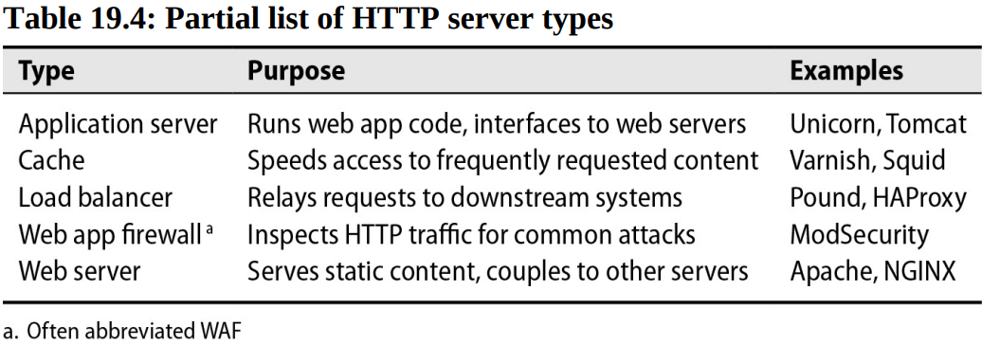

A web proxy is an intermediary that receives HTTP requests from clients, optionally performs some processing, and relays the requests to their ultimate destination. Load balancers, WAFs, and cache servers are all specialized types of proxy servers. A web server also acts as a sort of proxy if it relays requests to application servers.

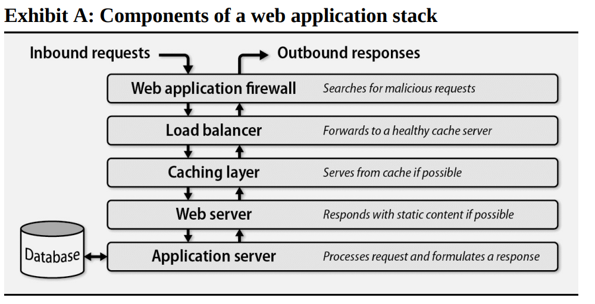

To maximize availability, each layer should run on more than one node simultaneously. Ideally, redundancy should span geographical regions so that the overall design is not dependent on any single physical data center.

NGINX is best known as a web server, for example, but it’s also a highly capable cache and load balancer. An NGINX web server with caching features enabled is more efficient than a stack of separate servers running on individual virtual machines.

### Web servers and HTTP proxy software

Most sites use web servers either to proxy HTTP connections to application servers or to serve static content directly. A few of the features provided by web servers include:

- Virtual hosts, allowing many sites to coexist peacefully within a single server
- Handling of TLS connections
- Configurable logging that tracks requests and responses
- HTTP basic authentication
- Routing to different dowstreams systems according to requested URLs
- Execution of dynamic content through application servers

The leading open source web servers are the Apache HTTP Server, known colloquially as `httpd`, and NGINX, which is pronounced “engine X.”

Apache is a venerable project that has been around since 1995. It’s a general-purpose web server that can be extended with modules to support a wide variety of features. Apache is known for its flexibility and power, but it can be complex to configure and manage.

NGINX is a newer project that was first released in 2004. It’s designed to be lightweight and fast, with a focus on serving static content and proxying connections to application servers. NGINX is known for its performance and scalability, and it’s often used as a reverse proxy in front of application servers. Like httpd, NGINX supports service of static web content, load balancing, monitoring of downstream servers, proxying, caching, and other related functions.

Some development systems, notably Node.js and the Go programming language, implement web servers internally and can handle many HTTP workflows without the need for a separate web server. These systems incorporate sophisticated connection management features and are robust enough for production workloads.

The H2O server (h2o.examp1e.net; note the numeral one in “examp1e”) is a newer web server project that takes full advantage of HTTP/2 features and achieves even better performance than NGINX.

### Load balancers

You can’t run a highly available web site on a single server. Not only does this configuration expose your users to every potential hiccup experienced by the server, but it also gives you no way to update the software, operating system, or configuration without downtime.

To avoid these problems, you can use a load balancer, which is a type of proxy server that distributes incoming requests among a set of downstream web servers. Load balancers also monitor the status of those servers to ensure that they are providing timely and correct responses.

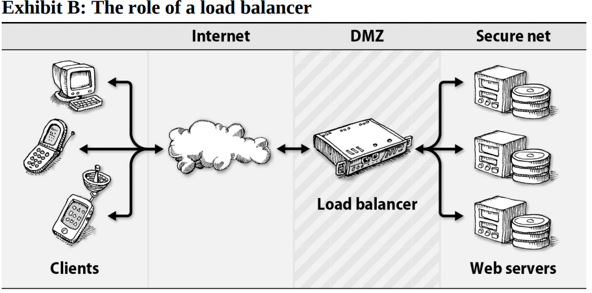

Load balancers solve many of the problems inherent in a single-system design:

- They do not process requests themselves, so they can handle many more concurrent connections than a typical web server.
- When a web server needs a software update, the load balancer can be configured to remove that server from the pool of available servers, update it, and then return it to service.
- Load balancers can be configured to monitor the health of the servers they are balancing and to remove servers that are not responding correctly.

To avoid becoming single points of failure themselves, load balancers usually run in pairs. Depending on the configuration, one balancer might act as a passive backup while the other serves live traffic, or both balancers might serve requests simultaneously.

The way that requests are distributed is usually configurable. Here are a few common algorithms:

- Round robin, in which requests are distributed among the active servers in a fixed rotation order
- Load equalization, in which new requests go to the downstream server that's currently handling the smallest number of connections or requests
- Partitioning, in whinch the load balancer selects a server according to a hash of the client's IP address. This method ensures that requests from the same client always reach the same web server.

Load balancers normally operate at layer four of the OSI model, in which they route requests based just on the IP address and port of the request. However, they can also operate at layer seven by inspecting requests and routing them according to their target URL, cookie values, or other HTTP headers.

As an added bonus, load balancers can improve security. They usually reside in the DMZ portion of a network and proxy requests to web servers behind an internal firewall.

If HTTPS is in use, they also perform TLS termination: the connection from the client to the load balancer uses TLS, but the connection from the load balancer to the web server can be vanilla HTTP. This arrangement offloads some processing overhead from the web servers.

Commercial load balancers such as those from F5 and Citrix are available both as hardware devices to be installed in a data center and as software solutions. They typically offer a graphical configuration interface, more features than open source tools, extra functions in addition to straightforward load balancing, and hefty price tags.

Amazon offers a dedicated load-balancing service, the Elastic Load Balancer (ELB), for use with EC2 virtual machines. ELB is a completely managed service; no virtual machine is required for the load balancer itself.

In ELB terminology, a “listener” accepts connections from clients and proxies them to back-end EC2. Listeners can proxy TCP, HTTP, or HTTPS traffic.

### Caches

Web caches were born from the observation that clients often repeatedly access the same content within a short time. Caches live between clients and web servers and store the results of the most frequent requests, sometimes in memory.

In caching jargon, an origin is the original content provider, the source of truth about the content. Caches get their content directly from the origin or from another upstream cache.

Several factors determine caching behavior:

- The values of HTTP headers, including Cache-Control, ETag, and Expires
- Whether the request is served by HTTPS, for which caching is more nuanced
- The response status code; some are not cacheable (see RFC2616)
- The contents of HTML <meta> tags (not respected by all caches)

Static blobs such as images, videos, CSS stylesheets, and JavaScript files are well suited to caching because they rarely change. Dynamic content loaded from a database or generated by an application server is less amenable to caching.

Because HTTPS payloads are encrypted, responses cannot be cached unless the cache server terminates the TLS connection, decrypting the payload.

The connection from the cache server to the origin may then require a separately encrypted TLS connection (or not, depending on whether the connection between the two is trusted).

For highly variable pages that should never be cached, developers set the following HTTP header:

```
Cache-Control: no-cache, no-store
```

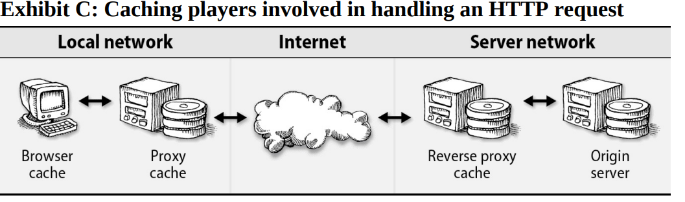

**Browser caches :** All modern web browsers save recently used resources (images, CSS, JavaScript, etc.) locally to speed up backtracking and return visits. 

In theory, browser caches should follow exactly the same caching rules as does any other HTTP cache.This is why your browser’s Back button usually evinces a slight lag instead of zipping you instantly to the previous page. Even though most of the resources needed to render the page are cached locally, the page’s top-level HTML wrapper is typically dynamic and uncacheable, so a round trip to the server is still required. The browser could simply rerender the materials on hand from the previous visit—and one or two used to do that—but this shortcut breaks the correctness of caching and leads to a variety of subtle problems.

**Proxy cache :** You can install a proxy cache at the edge of an organization’s network to speed up access for all users. When a user loads a web site, the requests are first received by the proxy cache. If a requested resource is cached, that resource is immediately returned to the user without the remote site being consulted.
You can configure a proxy cache in two ways: actively, by changing users’ browser settings to point to the proxy; or passively, by having a network router send all web traffic through the cache server. The latter configuration is known as an intercepting proxy. 

**Reverse proxy cache :** Web site operators configure a “reverse proxy” cache to offload traffic from their web and application servers. Incoming requests are first routed to the reverse proxy cache, from which they may be served immediately if the requested resources are available. The reverse proxy passes requests for uncached resources along to the appropriate web server.

**Cache problems :** Web caches are tremendously important to the performance of the web, but they also introduce complexity. A problem at any caching layer can introduce stale content that is out of date with respect to the origin server.

**Cache software :** 

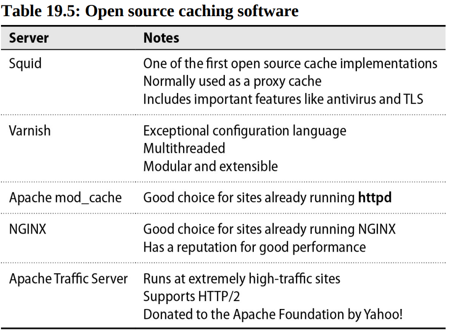

### Content Delivery Networks

A content delivery network (CDN) is a globally distributed system that improves web performance by moving content closer to users. Nodes in a CDN are dispersed geographically to hundreds or thousands of locations. When clients request content from a site that uses a CDN, they are routed to the closest node (called an edge server), thereby decreasing latency and reducing congestion for the origin.

Edge servers are similar to proxy caches. They store copies of content locally. If they don’t have a local copy of a requested resource or if their version of the content has expired, they retrieve the resource from the origin, respond to the client, and update their cache.

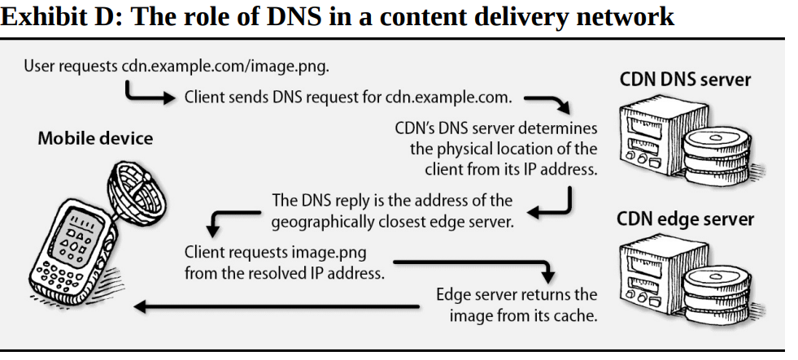

As examples, Akamai, Cloudflare, and Fastly are all commercial CDN providers. Amazon CloudFront is a CDN service that integrates with other AWS services.

## Web hosting in the cloud

### Platform as a service

The PaaS concept simplifies web hosting for developers by eliminating infrastructure as a concern. Developers package their code in a specific format and upload it to the PaaS provider, which provisions appropriate systems and runs it automatically. The provider issues a DNS endpoint connected to the client’s running application, which the client can then customize by using a DNS CNAME record.

Google App Engine pioneered the PaaS concept and remains one of the most prominent products. App Engine supports Python, Java, PHP, and Go, and has many supporting features such as cron-like scheduled job execution, programmatic access to logs, real-time messaging, and access to various databases.

Heroku is another popular PaaS provider. It supports Ruby, Node.js, Python, PHP, and Java, and has a rich ecosystem of add-ons for databases, caching, and other services.

## Apache HTTPD

The httpd web server is ubiquitous among the many flavors of UNIX and Linux. A modular architecture has been fundamental to Apache’s adoption. Dynamic modules can be turned on through configuration, offering alternative authentication options, improved security, support for running code written in most languages, URL-rewriting superpowers, and many other features.

For largely historical reasons, Apache has a pluggable connection handling system called multi-processing modules (MPMs) that determines how HTTP connections are managed at the network I/O layer. The event MPM is the modern choice and is recommended over the worker and prefork alternatives. (Some legacy software that is not considered thread-safe, such as mod_php, should use the prefork MPM. It uses processes rather than threads for each connection.)

### httpd in use

`httpd` is both the name given to the daemon’s binary and to the project. Admins can either run `httpd` directly or use the `apachectl` script, which provides a convenient way to start, stop, and restart the server. Use `apachectl`'s `-f` option to specify a configuration file other than the default `/etc/httpd/httpd.conf`.

### Configuration logistics

The main configuration file for `httpd` is `httpd.conf`. This file is usually located in `/etc/httpd` or `/etc/apache2`. Although an entire httpd config can be contained in a single file, it’s common to break it up into multiple files for easier management. The `Include` directive is used to pull in additional configuration files.

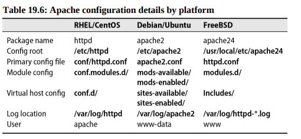

When httpd starts, it consults a primary configuration file, usually httpd.conf, and incorporates any additional files as referenced by Include directives. Options in this file can be grouped into three categories:

- Global settings such as path to `httpd`'s root configuration, modules to activate, user settings, network settings
- Virtual host settings, which define how httpd should handle requests for different domains
- Instructions for answering requests that don’t match any virtual host

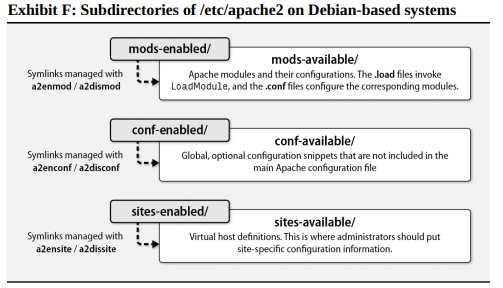

### Virtual host configuration

The lion’s share of httpd configuration lies in virtual host definitions. It’s generally a good idea to create a file for each site.

When an HTTP request arrives, httpd identifies which virtual host to select by consulting the HTTP Host header and network port. It then matches the path portion of the requested URL to a Files, Directory, or Location directive to determine how to serve the requested content. This mapping process is known as request routing.

HTTP and HTTPS configuration for `admin.com`:

```
<VirtualHost *:80>
    ServerName  admin.com
    ServerAlias www.admin.com
    ServerAlias ulsah.admin.com
    Redirect /  https://admin.com/
</VirtualHost>

<VirtualHost *:443>
    ServerName  admin.com
    ServerAlias www.admin.com
    ServerAlias ulsah.admin.com
    DocumentRoot /var/www/admin.com
    CustomLog /var/log/apache2/admin_com_access combined
    ErrorLog /var/log/apache2/admin_com_error
    SSLEngine on
    SSLProtocol all -SSLv2 -SSLv3
    SSLCertificateFile /etc/ssl/certs/admin_com.crt
    SSLCertificateKeyFile /etc/ssl/private/admin_com.key
    <Directory "/var/www/admin.com">
        Require all granted
    </Directory>
    <Directory "/var/www/admin.com/photos">
        Options +Indexes
    </Directory>
    <IfModule mod_rewrite.c>
        RewriteEngine on
        RewriteRule ^/(usah|lsah)$ /ulsah
    </IfModule>
    ExtendedStatus On
    <Location /server-status>
        SetHandler server-status
        Require ip 10.0.10.10/32
    </Location>
</VirtualHost>
```

The server-status location block is a special feature of httpd that provides a real-time view of the server’s performance. It’s a good idea to restrict access to this page to a specific IP address or range.

**HTTP basic authentication :** 

Basic auth is safe only when used with HTTPS. The password is sent in the clear with every request, so it’s trivial to intercept. The password is base64-encoded, not encrypted, so it’s easy to decode.

In apache, basic auth is configured in a Directory or Location block:

```
<Location /server-status>
    SetHandler server-status
    AuthType Basic
    AuthName "Restricted Access"
    AuthUserFile /etc/httpd/.htpasswd
    Require valid-user
    Require ip 10.0.10.0/24
</Location>

```

The `AuthUserFile` directive specifies the location of the password file. The `htpasswd` command is used to create and manage this file. The `Require valid-user` directive specifies that any user listed in the password file is allowed access.

For example, to add a user named `admin` to the password file:

```
htpasswd -c /var/www/.htpasswd admin

chown www-data:www-data /var/www/.htpasswd
chmod 600 /var/www/.htpasswd
```

**Running web applications :**

httpd can be extended to run web applications written in a variety of languages from within the module system (mod_perl, mod_php, mod_wsgi, mod_proxy_fcgi, etc.). The most common way to run web applications is to use a separate application server and proxy requests to it.

For example, to run a Python application with mod_wsgi:

```
LoadModule wsgi_module mod_wsgi.so

<VirtualHost *:80>
    ServerName  api.admin.com
    CustomLog /var/log/apache2/api_admin_com_access combined
    ErrorLog /var/log/apache2/api_admin_com_error

    SSLEngine on
    SSLProtocol all -SSLv2 -SSLv3
    SSLCertificateFile /etc/ssl/certs/api_admin_com.crt
    SSLCertificateKeyFile /etc/ssl/private/api_admin_com.key

    WSGIDaemonProcess admin_api user=user1 group=group1 threads=5
    WSGIScriptAlias / /var/www/api.admin.com/app.wsgi

    <Directory "/var/www/api.admin.com">
        WSGIProcessGroup admin_api
        WSGIApplicationGroup %{GLOBAL}
        Require all granted
    </Directory>
</VirtualHost>
```

The `WSGIScriptAlias` file in the configuration above, `admin_api.wsgi`, contains Python code that is needed by the WSGI module.

### Logging

httpd logs are invaluable for troubleshooting and performance tuning. The main log file is usually located in `/var/log/httpd` or `/var/log/apache2`. The `CustomLog` directive specifies the log file and format. The `ErrorLog` directive specifies the error log file. On most Linux distro, the default package installation includes a logrotate conf.

## Nginx

To handle the workload efficiently, NGINX uses an event-driven, asynchronous architecture, in which just a few worker processes can handle many thousands of connections simultaneously. When a request (an event) is ready for servicing, a worker process quickly completes processing and moves on to the next event.

The event `MPM` included in newer releases of Apache uses a similar architecture, but for high-volule and performance-sensitive sites, NGINX is generally considered superior.

When running NGINX, you can expect to see a master process and one or more worker processes. The master process is responsible for reading the configuration file, binding to network ports, and starting worker processes. Workers do the actual work of handling connections and requests. Some config use additional processes for caching, logging, and other tasks. As in Apache, the master process runs as root so it can bind to privileged ports (below 1024).

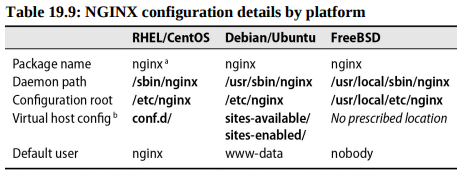

Within the nginx.conf file, blocks of configuration directives surrounded by curly braces are called contexts. A context contains directives specific to that block of configuration. For example, here’s a minimal (but complete) NGINX configuration that shows three contexts:

```
events { }

http {
    server {
        server_name www.admin.com;
        root /var/www/admin.com;    
    }
}
```

The outermost