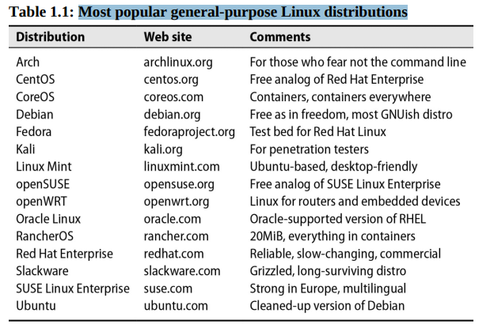

# Chapter 1: Where to start

## Table of most popular linux distributions

The most viable distributions are not necessarily the most corporate. For example, we expect Debian GNU/Linux to remain viable for a long time despite the fact that Debian is not a company, doesn’t sell anything, and offers no enterprise-level support. Debian benefits from a committed group of contributors and from the enormous popularity of the Ubuntu distribution, which is based on it.

## Example of a Linux distribution

> Debian (pronounced *deb-ian*, named after Debra and Ian Murdock) is one of the oldest and most well-regarded distributions. It is a noncommercial project with more than a thousand contributors worldwide. Debian maintains an ideological commitment to community development and open access, so there’s never any question about which parts of the distribution are free or redistributable.

Debian defines three release that are maintained simultaneously:

- stable: targeting the production servers,
- unstable: with current packages that may have bugs and security vulnerabilities,
- testing: a mix of stable and unstable.

> Ubuntu: is based on Debian and maintains Debian's commitment to free and open-source software. Ubuntu is a commercial distribution, and it is backed by a company called Canonical.

Ubuntu version numbers derive from the year and month of release, so 18.04 was released in April 2018. Each release also has a code name, such as Bionic Beaver for 18.04 or Focal Fossa for 20.04.

Two versions of Ubuntu are released every year, one in April and one in October. The April release is a long-term support (LTS) release, which is supported for five years. The October release is supported for nine months.

> Red Hat has been a dominant force in the Linux world for more than two decades, and its distributions are widely used in North America and beyond. By the numbers, Red Hat, Inc., is the most successful open source software company in the world.

Red Hat Enterprise Linux, often shortened to RHEL, targets production environments at large enterprises that require support and consulting services to keep their systems running smoothly. Somewhat paradoxically, RHEL is open source but requires a license. If you’re not willing to pay for the license, you’re not going to be running Red Hat.

Red Hat also sponsors Fedora, a community-driven distribution that is a proving ground for new technologies that may eventually be included in RHEL. Fedora is a good choice for developers and enthusiasts who want to stay on the cutting edge of Linux.
s
> CentOS is a free, open source, community-driven distribution that is functionally compatible with RHEL. The CentOS distribution lacks the RHEL branding and logos, but it is otherwise identical to RHEL. CentOS is a good choice for organizations that want the benefits of RHEL without the cost.

> SUSE Linux Enterprise Server (SLES) is a commercial distribution that is popular in Europe. SLES is developed and maintained by the German company SUSE. SUSE also sponsors openSUSE, a community-driven distribution that is a proving ground for new technologies that may eventually be included in SLES.

> FreeBSD, first release in late 1993, is the most widely used of the BSD derivatives. Unlike Linux, FreeBSD is a complete operating system, not just a kernel. Both the kernel and userland software are licensed under the permissive BSD License, a fact that encourages development by and additions from the business community.

## The man pages

